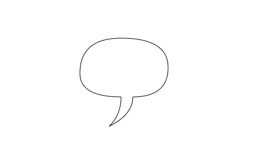
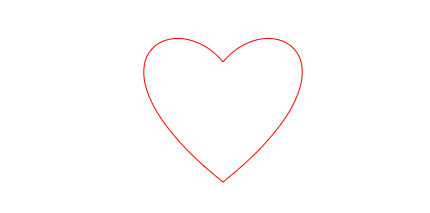
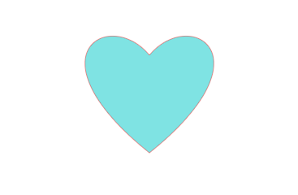

::: tip 介绍
canvas基本学习，了解常用绘图，动画逻辑
:::

<!-- more -->

# canvas学习

[mdn官方文档](https://developer.mozilla.org/zh-CN/docs/Web/API/CanvasRenderingContext2D/lineCap)

## 1.基本结构

```html
<!DOCTYPE html>
<html lang="en">
  <head>
    <meta charset="UTF-8" />
    <link rel="icon" type="image/svg+xml" href="/vite.svg" />
    <meta name="viewport" content="width=device-width, initial-scale=1.0" />
    <title>Vite + TS</title>
  </head>
  <body>
    <canvas id="canvas" width="500" height="500"></canvas>
    <script type="module" src="/src/01-矩形绘制.ts"></script>
  </body>
</html>

```

```typescript
import './style.css'
export const canvas = document.getElementById("canvas") as HTMLCanvasElement;
//动态设置宽高
canvas.width = window.innerWidth - 10;
canvas.height = window.innerHeight - 10;
const ctx=canvas.getContext('2d') as CanvasRenderingContext2D

window.onresize = () => {
  canvas.width = window.innerWidth - 10;
  canvas.height = window.innerHeight - 10;
  const clearFn=()=>ctx.clearRect(0,0,window.innerWidth,window.innerHeight)
  renderList.forEach(f=>f(ctx,clearFn))
};


const renderList:Render[]=[]
type Render=(ctx: CanvasRenderingContext2D,clear: () => void)=>void
export const setRender=(render:Render)=>{
    renderList.push(render)
    const clearFn=()=>ctx.clearRect(0,0,window.innerWidth,window.innerHeight)
    return renderList.forEach(f=>f(ctx,clearFn))
}


```

## 2.绘制矩形

```typescript
import { setRender } from "./main";

setRender((ctx,clear)=>{
  //填充模式
  ctx.fillStyle='#aa22cc'
  ctx.fillRect(100,100,100,100)
  //空心模式
  ctx.strokeStyle='#33aabb'
  ctx.strokeRect(100,205,100,100)

  //绘制路径
  ctx.beginPath()
  ctx.rect(100,400,200,100)
  ctx.strokeStyle='#36d4a1'
  ctx.stroke()
  ctx.closePath()

  let height=0
  const render=()=>{
    requestAnimationFrame(render)
    height++
    if(height<window.innerHeight){
      ctx.clearRect(0,0,window.innerWidth,height)
      ctx.beginPath()
      ctx.moveTo(0,height)
      ctx.lineTo(window.innerWidth,height)
      ctx.strokeStyle='red'
      ctx.stroke()
      ctx.closePath()
    }
  }

  window.ondblclick=()=>{
    alert('开始清除')
    render()
  }
})
```


## 3.绘制圆弧


```typescript
import { setRender } from "./main";
setRender((ctx) => {
  ctx.font = "30px none";
  ctx.strokeStyle = "#3256aa";
  ctx.strokeText("开始绘画", 30, 30);

  ctx.beginPath();
  /* ctx.moveTo(250,200) */
  ctx.arc(200, 200, 50, 0, Math.PI / 2, true);
  //闭合路径
  /* ctx.closePath() */
  ctx.stroke();
});

//绘制笑脸
setRender((ctx) => {

  ctx.beginPath();
  ctx.arc(400, 300, 150, 0, Math.PI*2);
  ctx.strokeStyle = "#bb33cc";
  /* ctx.stroke(); */

  /* ctx.beginPath(); */
  
  //抬笔
  ctx.moveTo(320,250)
  ctx.arc(300, 250, 20, 0, Math.PI*2);
  /* ctx.stroke();

  ctx.beginPath(); */
  ctx.moveTo(470,250)
  ctx.arc(450, 250, 20, 0, Math.PI*2);
  /* ctx.stroke();

  ctx.beginPath(); */
  ctx.moveTo(440,350)
  ctx.arc(380, 350, 60, 0, Math.PI / 1.5);
  ctx.stroke();

});

```

## 4.arcTo绘制圆弧

```typescript
import { setRender } from "./main";


setRender((ctx)=>{
    ctx.beginPath()
    ctx.setLineDash([5,2])
    ctx.moveTo(300,200)
    ctx.lineTo(300,250)
    ctx.lineTo(350,250)
    //画圆弧
    ctx.stroke()
    ctx.beginPath()
    ctx.setLineDash([])
    ctx.moveTo(300,200)
    ctx.arcTo(300,250,350,250,50)
    ctx.stroke()
})
```

## 5.贝塞尔曲线

[二次贝塞尔曲线](https://developer.mozilla.org/zh-CN/docs/Web/API/CanvasRenderingContext2D/quadraticCurveTo)



```typescript
import { setRender } from "./main";

setRender((ctx)=>{
    ctx.beginPath()
    //起点
    ctx.moveTo(320,300)
    //控制点/终点
    ctx.quadraticCurveTo(250,300,250,260)
    ctx.quadraticCurveTo(250,200,320,200)
    ctx.quadraticCurveTo(400,200,400,250)
    ctx.quadraticCurveTo(400,300,340,300)
    ctx.quadraticCurveTo(340,330,300,350)
    ctx.quadraticCurveTo(320,330,320,300)
    ctx.stroke()
})
```

[三次贝塞尔曲线](https://developer.mozilla.org/zh-CN/docs/Web/API/CanvasRenderingContext2D/bezierCurveTo)


```typescript
setRender((ctx)=>{
    ctx.beginPath()
    ctx.strokeStyle='#aa23dd'
    ctx.moveTo(500,280)
    ctx.bezierCurveTo(550,220,650,280,500,400)
    ctx.moveTo(500,280)
    ctx.bezierCurveTo(450,220,350,280,500,400)
    ctx.stroke()
})
```


## 6.path2D

[path2D](https://developer.mozilla.org/zh-CN/docs/Web/API/Path2D)封装路径



```typescript
import { setRender } from "./main";

setRender((ctx)=>{
    //创建path2d 对象
    const heartPath=new Path2D()
    //保存路径
    heartPath.moveTo(500,280)
    heartPath.bezierCurveTo(550,220,650,280,500,400)
    heartPath.moveTo(500,280)
    heartPath.bezierCurveTo(450,220,350,280,500,400)

    //调用方法传递路径
    ctx.strokeStyle='red'
    ctx.stroke(heartPath)
})
```

## 7.全局透明



```typescript
import { setRender } from "./main";

setRender((ctx)=>{
    //创建path2d 对象
    const heartPath=new Path2D()
    //保存路径
    heartPath.moveTo(500,280)
    heartPath.bezierCurveTo(550,220,650,280,500,400)
    heartPath.moveTo(500,280)
    heartPath.bezierCurveTo(450,220,350,280,500,400)

    //调用方法传递路径
    //设置透明
    ctx.globalAlpha=0.5
    ctx.strokeStyle='red'
    ctx.stroke(heartPath)
    ctx.fillStyle='rgba(0,200,200,1)'
    ctx.fill(heartPath)
})
```


## 8.渐变

[线性渐变](https://developer.mozilla.org/zh-CN/docs/Web/API/CanvasRenderingContext2D/createLinearGradient)


```typescript
import { setRender } from "./main";

setRender((ctx)=>{
    //创建线性渐变
    let linearGradient=ctx.createLinearGradient(200,200,500,500)
    linearGradient.addColorStop(0,'red')
    linearGradient.addColorStop(0.5,'#56d39d')
    linearGradient.addColorStop(1,'blue')
    ctx.fillStyle=linearGradient
    ctx.fillRect(200,200,300,300)
})
```

[镜像渐变](https://developer.mozilla.org/zh-CN/docs/Web/API/CanvasRenderingContext2D/createRadialGradient)


```typescript
setRender((ctx)=>{
    const gradient=ctx.createRadialGradient(400,400,0,400,400,100)
    gradient.addColorStop(0,'red')
    gradient.addColorStop(1,'blue')
    ctx.fillStyle=gradient
    ctx.fillRect(300,300,200,200)
})
```

**模拟3d小球**


```typescript
setRender((ctx)=>{
    const path=new Path2D()
    path.arc(200,200,100,0,Math.PI*2)
    //设置径向渐变
    const radialGradient=ctx.createRadialGradient(150,150,10,150,150,100)
    radialGradient.addColorStop(0,'white')
    radialGradient.addColorStop(1,'black')
    ctx.fillStyle=radialGradient
    ctx.fill(path)
})
```

## 9.图案填充

[CanvasRenderingContext2D.createPattern() - Web API 接口参考 | MDN (mozilla.org)](https://developer.mozilla.org/zh-CN/docs/Web/API/CanvasRenderingContext2D/createPattern)

```typescript
import { setRender } from './main';
setRender(ctx=>{
    const img=new Image()
    img.src='../public/2038896.jpg'
    img.onload=(ev)=>{
        const pattern=ctx.createPattern(img,null)
        ctx.fillStyle=pattern!
        ctx.fillRect(0,0,600,600)
    }
    
})
```


## 10.线条样式

1. [lineCap](https://developer.mozilla.org/zh-CN/docs/Web/API/CanvasRenderingContext2D/lineCap)
2. [lineWith](https://developer.mozilla.org/zh-CN/docs/Web/API/CanvasRenderingContext2D/lineWidth)
3. [lineJoin](https://developer.mozilla.org/zh-CN/docs/Web/API/CanvasRenderingContext2D/lineJoin)


```typescript
import { setRender } from "./main";
setRender((ctx, clear) => {
  const m = new Path2D();
  m.moveTo(200, 200);
  m.lineTo(250, 150);
  m.lineTo(300, 195);
  m.lineTo(350, 150);
  m.lineTo(400, 200);
  m.closePath();

  let offset = 0;
  function render() {
    offset++;
    requestAnimationFrame(render);
    clear();
    //设置线段与空白长度
    ctx.setLineDash([15, 15]);
    //设置虚线偏移量
    ctx.lineDashOffset = offset;
    //设置线条宽度
    ctx.lineWidth = 2;
    //设置线条（一次绘画路径）两端样式
    ctx.lineCap = "round";
    //设置线条连接点（拐角样式）
    ctx.lineJoin = "miter";
    //超过限制就折平
    ctx.miterLimit = 1;

    ctx.stroke(m);
  }

  render();
});

```

## 11.设置阴影


```typescript
import { setRender } from './main';
setRender((ctx)=>{
    const path=new Path2D()
    path.moveTo(300,300)
    path.bezierCurveTo(450,200,350,450,300,450)
    path.bezierCurveTo(250,450,150,200,300,300)

    const linearGradient=ctx.createLinearGradient(200,300,400,400)
    linearGradient.addColorStop(0,'red')
    linearGradient.addColorStop(1,'purple')
    ctx.fillStyle=linearGradient

    //设置阴影
    ctx.shadowOffsetX=5
    ctx.shadowOffsetY=5
    ctx.shadowBlur=25
    ctx.shadowColor='#33aacc'
    ctx.fill(path)
})
```

## 12.图片绘制

[drawImage()](https://developer.mozilla.org/zh-CN/docs/Web/API/CanvasRenderingContext2D/drawImage)


```typescript
import { setRender } from './main';
setRender((ctx)=>{
    const image=new Image()
    image.src='../public/2038896.jpg'
    image.onload=()=>{
        //绘制图片，简单粗暴方式
        /* ctx.drawImage(image,-500,-100) */
        //第二种,缩放图片
        /* ctx.drawImage(image,0,0,800,450) */
        //第三种,裁切图片
        ctx.drawImage(image,600,0,800,600,0,0,800,450)
        /**
         * 第2，3个参数表示裁切图片的起点，根据图片像素
         * 4，5参数表示裁切矩形的宽高
         * 6~9跟第二种后4个参数一样
         */
    }
})
```


## 13.视频绘制


```typescript
import { setRender } from './main';
setRender(ctx=>{
    const video=document.createElement('video')
    video.src='/sky.MOV'

    const btn=document.getElementById('btn') as HTMLButtonElement
    btn.onclick=()=>{
        //判断暂停状态
        if(video.paused){
            video.play()
            render()
        }else{
            //暂停
            video.pause()
        }
        
    }

    const image=new Image()
    image.src='/vite.svg'
    function render(){
        requestAnimationFrame(render)
        //h视频
        ctx.drawImage(video,0,0,600,400)
        ctx.drawImage(image,550,350,50,50)
    }
})
```

## 14.绘制文字

1. [fillText](https://developer.mozilla.org/zh-CN/docs/Web/API/CanvasRenderingContext2D/fillText)
2. [strokeText](https://developer.mozilla.org/zh-CN/docs/Web/API/CanvasRenderingContext2D/strokeText)
3. [textAlign](https://developer.mozilla.org/zh-CN/docs/Web/API/CanvasRenderingContext2D/textAlign)
4. [textBaseline](https://developer.mozilla.org/zh-CN/docs/Web/API/CanvasRenderingContext2D/textBaseline)


```typescript
import { setRender } from './main';
setRender(ctx=>{
    ctx.font='100px none'
    //超过最大值挤压
    /* ctx.fillText('我是666',200,200,100) */
    ctx.textAlign='center'//文本对齐
    ctx.textBaseline='middle'//基线对齐
    ctx.direction='rtl'
    //测量文字
    console.log(ctx.measureText('Hello world!'))
    ctx.strokeText('Hello world!',400,400)


    ctx.beginPath()
    ctx.arc(400,400,5,0,Math.PI*2)
    ctx.fill()
})
```

## 15.变换


```typescript
import { setRender } from './main';
/* setRender(ctx=>{
    //移动的是坐标系,每次变换都是针对当前坐标系
    ctx.translate(100,300)
    ctx.rotate(-Math.PI/2)
    ctx.scale(1,2)
    
    ctx.fillRect(0,0,200,200)
    ctx.strokeStyle='red'
    ctx.strokeRect(100,100,50,50)
}) */


setRender(ctx=>{
    ctx.translate(400,300)
    ctx.rotate(Math.PI/4)
    ctx.fillRect(-50,-50,100,100)
})
```

## 16.矩阵变换

[transform](https://developer.mozilla.org/zh-CN/docs/Web/API/CanvasRenderingContext2D/transform)


```typescript
import { setRender } from "./main";

setRender(ctx=>{
    ctx.transform(Math.cos(Math.PI/4),-Math.sin(Math.PI/4),Math.sin(Math.PI/4),Math.cos(Math.PI/4),200,200)

    ctx.fillRect(0,0,200,200)
})
```

## 17.图像合成

[**globalCompositeOperation**](https://developer.mozilla.org/zh-CN/docs/Web/API/CanvasRenderingContext2D/globalCompositeOperation)


```typescript
import { setRender } from './main';
setRender(ctx=>{

    

    ctx.fillStyle='blue'
    ctx.fillRect(300,200,200,200)
    //改变合成方式
    ctx.globalCompositeOperation='source-over'
    ctx.fillStyle='red'
    ctx.fillRect(250,300,200,200)
})
```


```typescript
import { setRender } from './main';
setRender(ctx=>{

    

    ctx.fillStyle='blue'
    ctx.fillRect(300,200,200,200)
    //改变合成方式
    ctx.globalCompositeOperation='source-in'
    ctx.fillStyle='red'
    ctx.fillRect(250,300,200,200)
})
```

### 刮刮卡


**利用图像合成模式画笔新画的图像之外才显示，画笔画的地方变空白**

```typescript
import { setRender } from './main';
setRender(ctx=>{

    const image=new Image()
    image.src='/1.jpg'

    image.onload=()=>{
        ctx.drawImage(image,0,-350,window.innerWidth,window.innerHeight+350)
    }

    let isDraw=false

    window.onmousedown=()=>{
        isDraw=true
    }
    window.onmouseup=()=>{
        isDraw=false
    }

    window.onmousemove=(ev)=>{
        if(isDraw){
            let x=ev.pageX
            let y=ev.pageY

            ctx.globalCompositeOperation='destination-out'
            ctx.beginPath()

            ctx.arc(x,y,20,0,Math.PI*2)
            ctx.fill()
        }
    }

    const ggk=document.querySelector('#ggk')
    if(Math.random()<0.5){
        ggk!.innerHTML='iphone 11'
    }
})
```

```html
<!DOCTYPE html>
<html lang="en">
  <head>
    <meta charset="UTF-8" />
    <link rel="icon" type="image/svg+xml" href="/vite.svg" />
    <meta name="viewport" content="width=device-width, initial-scale=1.0" />
    <title>Vite + TS</title>
    <style>
      #ggk{
        width: 100vw;
        height: 100vh;
        position:absolute;
        text-align: center;
        line-height: 100vh;
        font-size: 30px;
        color: rgb(31, 129, 209);
        overflow: hidden;
        top: 0;
        left: 0;
        user-select: none;
        z-index: -1;
      }
    </style>
  </head>
  <body>
    <!-- <button id="btn">播放/暂停</button> -->
    <div id="ggk">谢谢惠顾</div>
    <canvas id="canvas" width="500" height="500"></canvas>
    <script type="module" src="./src/16-刮刮卡.ts"></script>
  </body>
</html>

```

## 18.裁剪


```typescript
import { setRender } from './main';
setRender((ctx)=>{
    //创建path2d 对象
    const heartPath=new Path2D()
    //保存路径
    heartPath.moveTo(500,280)
    heartPath.bezierCurveTo(550,220,650,280,500,400)
    heartPath.moveTo(500,280)
    heartPath.bezierCurveTo(450,220,350,280,500,400)

    const image=new Image()
    image.src='/2038896.jpg'
    image.onload=()=>{
        //裁剪路径
        ctx.clip(heartPath)
        //后面的图片只能绘制裁剪框里面的内容
        ctx.drawImage(image,0,0,800,450)
    }
})
```


## 19.状态的保存和恢复

[CanvasRenderingContext2D.save() - Web API 接口参考 | MDN (mozilla.org)](https://developer.mozilla.org/zh-CN/docs/Web/API/CanvasRenderingContext2D/save)


```typescript
import { setRender } from './main';
setRender(ctx=>{
    ctx.fillStyle='red'
    ctx.fillRect(0,0,100,100)
    ctx.save()

    ctx.fillStyle='blue'
    ctx.fillRect(100,100,100,100)
    ctx.save()

    ctx.fillStyle='yellow'
    ctx.fillRect(200,200,100,100)
    ctx.save()

    ctx.fillStyle='green'
    ctx.fillRect(300,300,100,100)

    ctx.restore()
    ctx.fillRect(400,400,100,100)

    ctx.restore()
    ctx.fillRect(500,400,100,100)

    ctx.restore()
    ctx.fillRect(600,400,100,100)
})
```

## 20.像素操作

**变灰度图**


```typescript
import { setRender } from './main';
setRender(ctx=>{
    const image=new Image()
    image.src='/2038896.jpg'
    image.onload=()=>{
        ctx.drawImage(image,0,0,800,450)
        //获取像素数据
        let imageData=ctx.getImageData(0,0,800,450)
        console.log(imageData)
        //循环修改数据
        for(let i=0;i<imageData.data.length;i+=4){
            //一个像素的rgb平均值就是灰度值
            const avg=(imageData.data[i]+imageData.data[i+1]+imageData.data[i+2])/3
            //让rgb等于灰度值
            imageData.data[i]=avg
            imageData.data[i+1]=avg
            imageData.data[i+2]=avg
        }
        //后面4个参数是截取
        ctx.putImageData(imageData,0,0,200,150,400,400)
    }
})
```


## 21.封装绘制的物体


```typescript
import { setRender } from "./main";

setRender((ctx,clear) => {
  class Heart {
    public heartPath: Path2D;
    public color:string='red'
    constructor(public x: number, public y: number) {
        this.heartPath=new Path2D()
        this.heartPath.moveTo(this.x,this.y)
        this.heartPath.bezierCurveTo(this.x+50,this.y-50,this.x+150,this.y,this.x,this.y+150)
        this.heartPath.moveTo(this.x,this.y)
        this.heartPath.bezierCurveTo(this.x-50,this.y-50,this.x-150,this.y,this.x,this.y+150)
        
        window.onmousemove=(ev)=>{
            //判断点是否在物体里面
            if(this.isPointInPath(ev.offsetX,ev.offsetY)){
                this.color='purple'
            }else{
                this.color='red'
            }
        }
    
    }
    draw(){
        ctx.save()
        ctx.fillStyle=this.color
        ctx.fill(this.heartPath)
        ctx.restore()
    }

    isPointInPath(x:number,y:number){
        return ctx.isPointInPath(this.heartPath,x,y)
    }
  }

  const heart1=new Heart(300,200)
  //渲染函数
  function render(){
    //请求动画帧
    requestAnimationFrame(render)
    clear()
    heart1.draw()
  }
  render()
});

```

