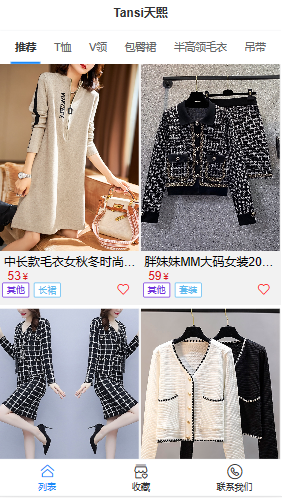

::: tip 介绍
使用vue3+vant+nest.js独立完成的简易版系统，功能简单，不包含支付功能
:::

<!-- more -->

# vue3+nest.js全栈服装展示系统

## 项目名：Tansi天熙

## 项目简介

**为了很好的帮家里销售女装，方便推广，所以开发一个衣服批发管理系统**



预览：[Tansi天熙](http://43.138.16.164:3000/#/)

github:https://github.com/yexiyue/TansiShop

淘宝同名店铺

## 主要模块

**展示衣服**

**添加衣服**


## 技术栈

考虑到react熟练度不够，而且为了浏览方便和推广，决定采用移动端网页的形式。

**前端**

1. **vue3**
2. **vant4**
3. **pinia**

**后端**

1. **nest.js**
2. **mysql**


## 问题

**开发过程中遇到的问题：**

1. **下拉刷新**
2. **文件上传**


**下拉刷新跟传统的分页类型，就是当触碰到底部触发发起请求，当数量到一定的时候设置一个完成状态，不再发起请求。**


**下面展示代码片段**

```vue
<template>
    <div>
        <van-tabs v-model:active="active" @change="onChange" sticky>
            <van-pull-refresh v-model="refreshing" @refresh="onRefresh">
                <van-tab title="未上架">
                    <van-list v-model:loading="loading" :finished="finished" finished-text="没有更多了" @load="onLoad">
                        <GoodsItem :onLoad="() => active = 1" :clothes="clothes"></GoodsItem>
                    </van-list>
                </van-tab>
                <van-tab title="已上架">
                    <van-pull-refresh v-model="refreshing" @refresh="onRefresh">
                        <van-list v-model:loading="loading" :finished="finished" finished-text="没有更多了" @load="onLoad">
                            <GoodsItem :onLoad="() => active = 0" :clothes="clothes"></GoodsItem>
                        </van-list>
                    </van-pull-refresh>
                </van-tab>
            </van-pull-refresh>
        </van-tabs>
        <van-back-top right="12vw" bottom="18vw" />
    </div>
</template>

<script setup lang="ts">
import { onMounted, ref, watch } from 'vue';
import GoodsItem from './GoodsItem.vue';
import { Clothe, getClothes, getCount } from '../../../api/clothe'

const active = ref(0);
const publish = ref(false);
let index = 0
const clothes = ref<Clothe[]>([])
let count = 0;
const loading = ref(false);
const finished = ref(false);
const refreshing = ref(false);
const onRefresh = () => {
    // 清空列表数据
    finished.value = false;

    // 重新加载数据
    // 将 loading 设置为 true，表示处于加载状态
    loading.value = true;
    onLoad();
};

onMounted(async () => {
    count = (await getCount(publish.value)).data
})

watch(active, async (newValue) => {

    await onChange(newValue)
})

const onChange = async (value: number) => {

    //清空数组
    clothes.value = []
    //重置索引
    index = 0
    //设置重新刷新为true
    refreshing.value = true
    if (value === 1) {
        publish.value = true
    } else {
        publish.value = false
    }
    count = (await getCount(publish.value)).data
    //设置没有加载完
    finished.value = false
}

const onLoad = async () => {

    //下拉刷新
    if (refreshing.value) {
        clothes.value = []
        index = 0
        refreshing.value = false
    }
    //触底加载
    const res = await getClothes(5, index, publish.value)
    clothes.value.push(...res.data)
    index += 5
    loading.value = false
    //最大后显示没有了
    if (clothes.value.length >= count) {
        finished.value = true
    }
};


</script>

<style scoped>

</style>
```


文件上传，主要是图片上传，这些没什么难度，刚开始犯了下粗心，没有用Formdata，上传时要记得设置请求头。

```typescript
import { axios } from "./index";

export const uploadImage = async (file: File) => {
  const formData = new FormData();
  formData.append("file", file);

  return (
    await axios.post("/clothe/upload", formData, {
      headers: {
        "Content-Type": "multipart/form-data",
      },
    })
  ).data;
};

export interface Clothe {
  id: number;
  name: string;
  articleNo: string;
  frontImg: string;
  backImg: string;
  publish: boolean;
  banners: any[];
  price: number;
  category: string;
  fabric: string;
  colorCount: { color: string; count: number }[];
  createTime: string;
}

export const createClothe = async (data: Partial<Clothe>) => {
  return (await axios.post("/clothe", data)).data;
};

export const getClothes = async (
  take: number,
  skip: number,
  publish: boolean = false
) => {
  const order = localStorage.getItem("order") ?? "false";
  return (
    await axios.get(
      `/clothe?take=${take}&skip=${skip}&publish=${publish}&order=${order}`
    )
  ).data;
};

export const getCount = async (publish: boolean = false) => {
  return (await axios.get(`/clothe/count?publish=${publish}`)).data;
};

export const getClotheDetail = async (id: string) => {
  return (await axios.get("/clothe/" + id)).data;
};

export const updateClothe = async (id: string, data: Partial<Clothe>) => {
  return (await axios.patch("/clothe/" + id, data)).data;
};

export const updatePublish = async (id: string, publish: boolean) => {
  return (
    await axios.patch("/clothe/publish/" + id, {
      publish,
    })
  ).data;
};

export const deleteClothe = async (id: string) => {
  return (await axios.delete("/clothe/" + id)).data;
};

export const getClothesByCategory = async (
  take: number,
  skip: number,
  publish: boolean = false,
  category: string = ""
) => {
  const order = localStorage.getItem("order") ?? "false";
  return (
    await axios.get(
      `/clothe/list?take=${take}&skip=${skip}&publish=${publish}&order=${order}&category=${category}`
    )
  ).data;
};

export const getCountByCategory = async (
  category: string,
  publish: boolean = true
) => {
  return (
    await axios.get(
      `/clothe/list/count?publish=${publish}&category=${category}`
    )
  ).data;
};

export const getFavoriteList = async (data: number[]) => {
  return (
    await axios.post(`/clothe/favorite`, {
      list: data,
    })
  ).data;
};


```

**AddPage.vue**

```vue
<template>
    <van-form class="container" @submit="onSubmit">
        <van-field v-model="values.name" name="name" label="名称" placeholder="名称"
            :rules="[{ required: true, message: '请填写名称' }]" />
        <van-field v-model="values.articleNo" name="articleNo" label="货号" placeholder="#001" />

        <!-- 上传图片 -->
        <van-field name="uploader" label="主轮播图(最多5张)">
            <template #input>
                <van-uploader @delete="(_,{index})=>deleteImg(index,values.banners)" v-model="fileList" :max-count="5" :after-read="(value) => {
                    afterRead(value, values.banners)
                }" multiple />
            </template>
        </van-field>

        <van-field v-model="values.fabric" name="fabric" label="面料" placeholder="丝光棉" />

        <van-field v-model="values.price" type="number" name="price" label="价格" placeholder="价格" />

        <van-field v-model="values.category" @click="showPicker = true" readonly is-link
            :rules="[{ required: true, message: '请选择分类' }]" name="category" label="分类" placeholder="连衣裙" />
        <van-popup v-model:show="showPicker" position="bottom">
            <van-picker :columns="columns" @confirm="onConfirm" @cancel="showPicker = false" />
        </van-popup>


        <van-field name="uploader2" label="货款前图">
            <template #input>
                <van-uploader @delete="(_,{index})=>deleteImg(index,values.frontImg)" v-model="fileList1" :max-count="1" :after-read="(value) => {
                    afterRead(value, values.frontImg)
                }" multiple />
            </template>
        </van-field>

        <van-field name="uploader2" label="货款后图">
            <template #input>
                <van-uploader @delete="(_,{index})=>deleteImg(index,values.backImg)" v-model="fileList2" :max-count="1" :after-read="(value) => {
                    afterRead(value, values.backImg)
                }" multiple />
            </template>
        </van-field>
        <van-button @click="onAddColorCount" square type="primary" size="small">添加颜色数量</van-button>
        <template v-for="item in values.colorCount">
            <van-field v-model="item.color" name="color" label="颜色" placeholder="砖红色" />
            <van-field v-model="item.count" type="number" name="count" label="数量" placeholder="100" />
        </template>
        
        <van-button class="my-button" round type="primary" block native-type="submit">
            添加新商品
        </van-button>
    </van-form>

</template>

<script setup lang="ts">
import { UploaderAfterRead, UploaderFileListItem } from 'vant/lib/uploader/types';
import { onMounted, reactive, ref } from 'vue';
import { uploadImage } from '../../../api/clothe'
import { getCategories } from '../../../api/category'
import { createClothe } from '../../../api/clothe'
import {  showNotify, } from 'vant';
const values = reactive({
    name: '',
    articleNo: '',
    banners: <string[]>[],
    fabric: '',
    price: 0,
    category: '',
    frontImg: <string[]>[],
    backImg: <string[]>[],
    colorCount:<{color:string,count:number}[]>[
       
    ]
})


const fileList = ref([])

const fileList1 = ref([])
const fileList2 = ref([])

//上传图片
const afterRead = async (file: UploaderFileListItem | UploaderFileListItem[], arr: string[]) => {

    if (file instanceof Array) {
        for (let i of file) {
            i.status = 'uploading'
            const res = await uploadImage(i.file!)
            if (res.status === 201) {
                i.status = 'done'
                arr.push(res.data)
            }
        }
    } else {
        file.status = 'uploading'
        const res = await uploadImage(file.file!)
        if (res.status === 201) {
            file.status = 'done'
            arr.push(res.data)
        }
    }
}

//删除图片
const deleteImg=(index:number,arr:string[])=>{
    arr.splice(index,1)
}
//提交表单
const onSubmit = async (value: any) => {
    const data = { ...values, backImg: values.backImg[0], frontImg: values.frontImg[0], price: +values.price }
    const res = (await createClothe(data))
    console.log(res)
    if (res.status !== 201) {
        showNotify({ type: 'danger', message: '添加失败',lockScroll:true });
    } else {
        // 成功通知
        showNotify({ type: 'success', message: '添加成功',lockScroll:true });
        //重置数据
        values.name = ''
        values.articleNo = ''
        values.banners = <string[]>[]
        values.fabric = ''
        values.price = 0
        values.category = ''
        values.frontImg = <string[]>[]
        values.backImg = <string[]>[]
        values.colorCount=[]

        fileList.value=[]
        fileList1.value=[]
        fileList2.value=[]
    }

}

//展示选择器
const showPicker = ref(false);
const columns = ref<{ text: string, value: string }[]>([])

onMounted(async () => {
    const res = await getCategories()
    columns.value.push(...(res.data as { id: number, value: string }[]).map(item => ({
        text: item.value,
        value: item.value
    })))
})

//@ts-ignore
const onConfirm = ({ selectedOptions }) => {
    values.category = selectedOptions[0]?.text;
    showPicker.value = false;
};

const onAddColorCount=()=>{
    values.colorCount.push({
        color:'黑色',
        count:100
    })
}

</script>

<style scoped>
.my-button {
    width: 60%;
    margin: 2rem auto;
}
</style>
```


## 总结

**通过该项目，我能熟练使用vue和vant这两个框架，提高了逻辑处理能力，和独立思考解决问题的能力。这里后端代码就不赘述了。**

[红尘散仙](http://43.138.16.164/)

这是我博客，欢迎小伙伴们一起学习讨论。