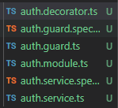
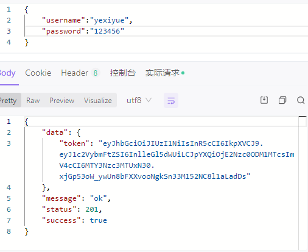
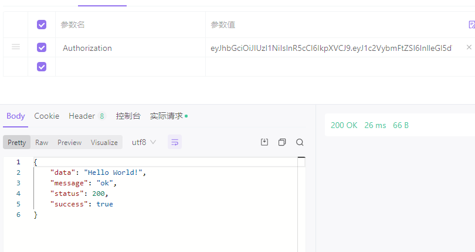

::: tip 介绍
企业门户网站管理系统后端，使用nest.js+ts+prisma开发
:::

<!-- more -->

# 企业门户管理系统后端

项目地址：[yexiyue/Portal-management-system-server: 门户网站管理系统后端 (github.com)](https://github.com/yexiyue/Portal-management-system-server)

## 项目模块

- 用户模块
- 新闻模块
- 产品模块
- 性能数据模块

## 技术栈

- nest.js
- prisma
- mysql


## 功能实现

### 1.transform

**利用拦截器对数据进行处理，转换成特定的接口**

```typescript
import { CallHandler, ExecutionContext, Injectable, NestInterceptor } from '@nestjs/common';
import { Request, Response } from 'express';
import { map, Observable } from 'rxjs';

@Injectable()
export class TransformInterceptor implements NestInterceptor {
  intercept(context: ExecutionContext, next: CallHandler): Observable<any> {
    const ctx=context.switchToHttp()
    const res=ctx.getResponse<Response>()
    return next.handle().pipe(map(data=>({
      data,
      message:'ok',
      status:res.statusCode,
      success:true
    })));
  }
}

```

### 2.httpFilter

**利用过滤器，对错误请求进行处理，并日志输出到控制台**

```typescript
import { ArgumentsHost, Catch, ExceptionFilter, HttpException, Logger } from '@nestjs/common';
import { Response,Request } from 'express';

@Catch()
export class HttpFilter<T> implements ExceptionFilter {
  constructor(private logger:Logger){}
  catch(exception: HttpException, host: ArgumentsHost) {
    const res=host.switchToHttp().getResponse<Response>()
    const req=host.switchToHttp().getRequest<Request>()
    const status=exception.getStatus()
    this.logger.error(`\n<<<<<<<<<<<<<<<<<<<<<<<<<<<<<
      path:${req.path}
      params:${JSON.stringify(req.params)}
      body:${JSON.stringify(req.body)}
      message:${exception.message}\n>>>>>>>>>>>>>>>>>>>>>>>>>>>>>
    `,'异常请求')
    
    res.status(status).send({
      message:exception.message,
      success:false,
      status,
      data:exception.getResponse()
    })
  }
}

```

### 3.prismaServer

使用prisma ORM连接数据库进行交互，为了方便使用，注册成服务类

```typescript
import { INestApplication, OnModuleInit } from '@nestjs/common';
import { PrismaClient } from './../../node_modules/.prisma/client/index.d';
export class PrismaServer extends PrismaClient implements OnModuleInit{
    async onModuleInit() {
        await this.$connect()
    }

    async enableShutdownHooks(app: INestApplication) {
        this.$on('beforeExit', async () => {
          await app.close();
        });
    }
}

```


## jwt登录权限校验

**看了下官网的登录权限校验，感觉比较繁琐，而且不容易理解，还容易出错，所以仅使用@nestjs/jwt官方提供的jwt模块实现登录权限校验。**



```
nest g mo auth
nest g d auth
nest g gu auth
nest g s auth
```

**使用nest cli生成上面文件**

### 1.IsPublic装饰器

```typescript
import { SetMetadata } from '@nestjs/common';

export const IS_PUBLIC=Symbol()
export const IsPublic = () => SetMetadata(IS_PUBLIC,true);
```

### 2.AuthGuard

全局守卫，进行处理前的拦截，最重要的一部分，也是验证token的核心逻辑

```typescript
import { JwtService } from '@nestjs/jwt';
import { IS_PUBLIC } from './auth.decorator';
import {
  CanActivate,
  ExecutionContext,
  HttpStatus,
  Injectable,
  HttpException,
  UnauthorizedException,
} from '@nestjs/common';
import { Reflector } from '@nestjs/core';
import { Observable } from 'rxjs';
import { Request, Response } from 'express';
import { UserManageService } from 'src/user-manage/user-manage.service';

@Injectable()
export class AuthGuard implements CanActivate {
  constructor(
    private reflect: Reflector,
    private jwt: JwtService,
    private userServer: UserManageService,
  ) {}
  canActivate(
    context: ExecutionContext,
  ): boolean | Promise<boolean> | Observable<boolean> {
    const isPublic = this.reflect.get(IS_PUBLIC, context.getHandler());
    if (isPublic) {
      return true;
    } else {
      const req = context.switchToHttp().getRequest<Request>();
      const token = req.headers.authorization;
      try {
        //解析后拿到值去数据库验证
        const payload=this.jwt.verify(token, {
          secret: '123456',
        });
        //从数据库读取数据并验证
        return this.userServer.findByUsername(payload.username).then(user=>{
          return user.username==payload.username
        })
      } catch (error) {
        throw new UnauthorizedException()
      }
    }
  }
}

```


### 3.用户登录生成token

**根据客户端传过来的账号密码进行校验，然后生成token返回客户端**

```typescript
import { JwtService } from '@nestjs/jwt';
import { Controller, Get, Post, Body, Patch, Param, Delete, ForbiddenException } from '@nestjs/common';
import { UserManageService } from './user-manage.service';
import { CreateUserManageDto } from './dto/create-user-manage.dto';
import { UpdateUserManageDto } from './dto/update-user-manage.dto';
import { IsPublic } from 'src/auth/auth.decorator';

@Controller('user-manage')
export class UserManageController {
  constructor(private readonly userManageService: UserManageService,private jwt:JwtService) {}

  //......

  //当使用res时需要自己手动返回响应
  @IsPublic()
  @Post('/login')
  async login(@Res() res:Response,@Body('username') username:string,@Body('password') password:string,@Body('code') code:string,@Session() session){
    
    if((session?.code?.toLocaleLowerCase()!==code?.toLocaleLowerCase()) || code==undefined){
      throw new HttpException('验证码错误，请重试',HttpStatus.BAD_REQUEST)
    }

    const user=await this.userManageService.findByUsername(username)
    if(password===user.password){
      user.password=undefined
      //生成token
      const token=this.jwt.sign({username,id:user.id},{
        secret:'123456',
        expiresIn:'60s'
      })
      //token设置成响应头
      res.setHeader('Authorization',token)
      //手动响应
      res.status(201).send({
        data:user,
        success:true,
        message:'ok',
        status:201
      })
    }else{
      throw new ForbiddenException('账号密码错误，禁止访问')
    }
  }
}

```






## session,cookie验证码

### 1.安装依赖

我们使用的是nestjs 默认框架express 他也支持express 的插件 所以我们就可以安装express的session

```text
npm i express-session --save
```

需要智能提示可以装一个声明依赖

```text
npm i @types/express-session -D
```

然后在main.ts 引入 通过app.use 注册session


安装验证码依赖

```text
pnpm add svg-captcha
```

### 2.生成验证码接口

**发送的是图片格式type为image/svg+xml**

```typescript
import { JwtService } from '@nestjs/jwt';
import { Controller, Get, Post, Body, Patch, Param, Delete, ForbiddenException, Req, Res, Session, HttpException, HttpStatus } from '@nestjs/common';
import { UserManageService } from './user-manage.service';
import { CreateUserManageDto } from './dto/create-user-manage.dto';
import { UpdateUserManageDto } from './dto/update-user-manage.dto';
import { IsPublic } from 'src/auth/auth.decorator';
import * as svgCapture from 'svg-captcha'
import { Request, Response } from 'express';


@Controller('user-manage')
export class UserManageController {
  constructor(private readonly userManageService: UserManageService,private jwt:JwtService) {}

  //......

  @IsPublic()
  @Get('/code')
  getCode(@Req() req,@Res() res:Response){
    const capture=svgCapture.create({
      size:4,
      fontSize:50,
      width:100,
      height:34,
    })
	//服务器端保存session
    req.session.code=capture.text
    res.type('image/svg+xml')
    res.send(capture.data)
  }
}

```


### 3.验证码验证

**验证码进行验证时，记得携带cookie，不然服务器端session获取不到**

```typescript
import { JwtService } from '@nestjs/jwt';
import { Controller, Get, Post, Body, Patch, Param, Delete, ForbiddenException, Req, Res, Session, HttpException, HttpStatus } from '@nestjs/common';
import { UserManageService } from './user-manage.service';
import { CreateUserManageDto } from './dto/create-user-manage.dto';
import { UpdateUserManageDto } from './dto/update-user-manage.dto';
import { IsPublic } from 'src/auth/auth.decorator';
import * as svgCapture from 'svg-captcha'
import { Request, Response } from 'express';


@Controller('user-manage')
export class UserManageController {
  constructor(private readonly userManageService: UserManageService,private jwt:JwtService) {}

  //......

  @IsPublic()
  @Post('/login')
  async login(@Body('username') username:string,@Body('password') password:string,@Body('code') code:string,@Session() session){
    //根据session进行验证
    if((session?.code?.toLocaleLowerCase()!==code?.toLocaleLowerCase()) || code==undefined){
      throw new HttpException('验证码错误，请重试',HttpStatus.BAD_REQUEST)
    }

    const user=await this.userManageService.findByUsername(username)
    if(password===user.password){
      return {
        token:this.jwt.sign({username},{
          secret:'123456',
          expiresIn:'80h'
        })
      }
    }else{
      throw new ForbiddenException('账号密码错误，禁止访问')
    }
  }

  
}

```


## 配置静态文件目录

```typescript
import { TransformInterceptor } from './transform/transform.interceptor';
import { HttpFilter } from './http/http.filter';
import { NestFactory } from '@nestjs/core';
import { NestExpressApplication } from '@nestjs/platform-express';
import { AppModule } from './app.module';
import { AuthGuard } from './auth/auth.guard';
import * as session from 'express-session';
import { resolve } from 'path';

async function bootstrap() {
  const app = await NestFactory.create<NestExpressApplication>(AppModule);
  app.enableCors()

  app.useGlobalFilters(app.get(HttpFilter))
  app.useGlobalInterceptors(app.get(TransformInterceptor))
  app.useGlobalGuards(app.get(AuthGuard))

  //配置静态文件目录
  app.useStaticAssets(resolve(__dirname,'../public'))

  //配置session
  app.use(session({
    secret:'123456',
    name:'server.sid',
    cookie:{
      maxAge:3600*24,
    }
  }))
  
  await app.listen(3000);
}
bootstrap();

```

### 1.设置上传

需要安装依赖

```
pnpm add multer
```

```typescript
import { extname, resolve } from 'path';
import { HttpFilter } from './http/http.filter';
import { Module, Logger, Global } from '@nestjs/common';
import { AppController } from './app.controller';
import { AppService } from './app.service';
import { TransformInterceptor } from './transform/transform.interceptor';
import { PrismaServer } from './prisma/prisma';
import { JwtModule, JwtService } from '@nestjs/jwt';
import { AuthModule } from './auth/auth.module';
import { UserManageModule } from './user-manage/user-manage.module';
import { MulterModule } from '@nestjs/platform-express';
import { diskStorage } from 'multer';
@Global()
@Module({
  imports: [
    JwtModule,
    AuthModule,
    UserManageModule,
    //设置上传模块
    MulterModule.register({
      storage: diskStorage({
        destination: resolve(__dirname, '../public/images'),
        filename: (_, file, cb) => {
          return cb(null, `${Date.now() + extname(file.originalname)}`);
        },
      }),
    }),
  ],
  controllers: [AppController],
  providers: [
    AppService,
    Logger,
    HttpFilter,
    TransformInterceptor,
    PrismaServer,
    JwtService,
  ],
  exports: [Logger, HttpFilter, TransformInterceptor, PrismaServer, JwtService],
})
export class AppModule {}

```

### 2.接收上传的文件

**使用拦截器对文件进行处理，然后返回文件名给前端**

```typescript
import { Controller, Get, Post, UploadedFile, UseInterceptors } from '@nestjs/common';
import { FileInterceptor } from '@nestjs/platform-express';
import { AppService } from './app.service';
import { IsPublic } from './auth/auth.decorator';

@Controller()
export class AppController {
  constructor(private readonly appService: AppService) {}

  //公共上传图片模块
  @Post('/adminapi/upload')
  @UseInterceptors(FileInterceptor('file'))//这里是上传文件的字段名
  uploadImgFile(@UploadedFile() file){
    return file.filename
  }
}

```


## 使用prisma中间件

```typescript
import { INestApplication, OnModuleInit, Logger } from '@nestjs/common';
import { PrismaClient } from '@prisma/client';
import { Prisma } from '@prisma/client';
export class PrismaServer extends PrismaClient implements OnModuleInit{
    async onModuleInit() {
        await this.$connect()
        this.$use(this.updateTime)
    }

    //中间件
    updateTime:Prisma.Middleware=async (params,next)=>{
        if(params.model==='News' && params.action==='update'){
            params.args.data['updateTime']=new Date()
        }
        return await next(params)
    }

    async enableShutdownHooks(app: INestApplication) {
        this.$on('beforeExit', async () => {
          await app.close();
        });
    }
}

```

**当进行更新操作时，使用中间件设置更新时间**


## sdk数据收集

### sdk.controller

```typescript
import { Body, Controller, Get, Post, Query, ParseIntPipe } from '@nestjs/common';
import { IsPublic } from 'src/auth/auth.decorator';
import { SdkService } from './sdk.service';

@Controller('/adminapi/sdk')
export class SdkController {
  constructor(private readonly sdkService: SdkService) {}

  @IsPublic()
  @Post()
  getSdkData(@Body() body:any){
    this.sdkService.createSdkData(JSON.parse(Object.keys(body)[0]))
    return 'ok'
  }

  @Get('/page-view')
  getPageView(@Query('day',ParseIntPipe) day:number=7){
    return this.sdkService.getPageView(day)
  }

  @Get('/news/category')
  getNewsCount(){
    return this.sdkService.getNewsCount()
  }

  @Get('/every-page-view')
  getEveryPageView(@Query('day',ParseIntPipe) day:number=7){
    return this.sdkService.getEveryDayPage(day)
  }

  @Get('/user-page-view')
  getUserPageView(@Query('day',ParseIntPipe) day:number=7){
    return this.sdkService.getAllUserView(day)
  }

  @Get('/performance-target')
  getPerformanceTarget(){
    return this.sdkService.getPerformanceTarget()
  }
}
```

### sdk.server

```typescript
import { PrismaServer } from 'src/prisma/prisma';
import { Injectable, HttpException, HttpStatus } from '@nestjs/common';
import { SdkData } from '@prisma/client';

@Injectable()
export class SdkService {
    constructor(private prisma:PrismaServer){}
    async createSdkData(data:SdkData){
        try {
            await this.prisma.sdkData.create({
                data:{
                    targetKey:data.targetKey,
                    event:data.event,
                    sdkVersion:data.sdkVersion,
                    uuid:data.uuid,
                    requestUrl:data.requestUrl,
                    value:data.value,
                    rating:data.rating,
                    time:data.time,
                    pageName:data.pageName
                }
            })
        } catch (error) {
            console.log(error)
            throw new HttpException(error.message,HttpStatus.INTERNAL_SERVER_ERROR);
        }
    }

    //获取页面浏览量
    async getPageView(day:number){
        try {
            const res=await this.prisma.sdkData.groupBy({
                where:{
                    targetKey:'history-pv'
                },
                by:['pageName'],
            })
            
            const arr=[]
            for(let i of res){
                arr.push(this.prisma.sdkData.findMany({
                    where:{
                        pageName:i.pageName,
                        targetKey:'history-pv',
                        time:{
                            gte:new Date(Date.now()-(3600*24*day*1000))
                        }
                    }
                }))
            }

            const res1=await this.prisma.$transaction(arr)
            return [res.map(item=>item.pageName),res1.map(item=>item.length)]
        } catch (error) {
            console.log(error)
            throw new HttpException(error.message,HttpStatus.INTERNAL_SERVER_ERROR);
        }
    }

    //获取分类数量
    async getNewsCount(){
        try {
            const rowArr=[]
            const temp=[1,2,3].forEach((item)=>{
                rowArr.push(this.prisma.news.findMany({
                    where:{
                        category:item
                    }
                }))
            })
            const res=await this.prisma.$transaction(rowArr)
            const names=['最新动态','典型案例','通知公告']
            return res.map((item,index)=>({
                name:names[index],
                value:item.length
            }))

        } catch (error) {
            console.log(error)
            throw new HttpException(error.message,HttpStatus.INTERNAL_SERVER_ERROR);
        }
    }

    //获取每天页面的数据情况
    async getEveryDayPage(day:number){
        const arr=[]
        for(let i=0;i<day;i++){
            arr.push(
                this.prisma.sdkData.findMany({
                    where:{
                        targetKey:'history-pv',
                        time:{
                            gte:this.getDate(i+1),
                            lt:this.getDate(i)
                        }
                    }
                })
            )
        }
        const res=await this.prisma.$transaction(arr)
        return res.map(item=>item.length).reverse()
    }

    getDate(day:number){
        return new Date(Date.now()-(3600*24*day*1000))
    }

    //近7天访客量
    async getAllUserView(day:number){
        const arr=[]
        for(let i=0;i<day;i++){
            arr.push(
                this.prisma.sdkData.groupBy({
                    by:['uuid'],
                    where:{
                        time:{
                            gte:this.getDate(i+1),
                            lt:this.getDate(i)
                        }
                    }
                })
            )
        }
        const res=await this.prisma.$transaction(arr)
        return res.map(item=>item.length).reverse()
    }

    //页面性能指标
    async getPerformanceTarget(){
        const arr=[]
        const events=['INP','CLS','FCP','TTFB','LCP','FID']
        const min=[]
        const max=[]
        events.forEach(item=>{
            arr.push(this.prisma.sdkData.aggregate({
                where:{
                    event:item
                },
                _avg:{
                    value:true
                },
                _count:true
            }))
        })
        const res=await this.prisma.$transaction(arr)
        return res.map((item,index)=>[events[index],item._count,item._avg.value])
    }
}
```

**该模块主要是数据的分析和组装成特定的数据结构返回给前端，方便使用echarts进行数据可视化**