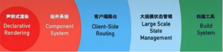

# vue面试题

## 1.说一下对vue的理解

**官方: Vue是一套用于构建用户界面的渐进式框架，Vue 的核心库只关注视图层**



**vue包含**

- 声明式渲染
- 组件系统
- 客户端路由
- 大规模状态管理
- 构建工具


**vue是声明式框架，**

**mvvm模式**，目的是职责划分，分层管理。以前有mvc模式，现在的nest.js后端框架也是mvc模式，不过不是返回view层了，而是返回接口，view由前端单独来做。随着前端系统的越来越庞大，所有逻辑放在controller层中会变得难以维护，所以出现了mvvm模式，用来简化controller层，现在的viewModel替代了以前的controller层。

vue不完全遵循mvvm，比如vue中可以通过ref操控数据。

**采用虚拟dom**

性能好，相当于中间的缓存层，不直接操作dom，节省重排和重绘的性能消耗，采用diff比对算法比较更新

**区分编译时和运行时**

- vue的核心就是render渲染函数，将虚拟dom生成真实dom
- 编译时就是模板编译把模板编译成render函数
- 运行时就是运行render函数将虚拟dom生成真实dom

**组件化**

- 实现高内聚，低耦合，单向数据流
- 组件化开发能大幅度提高应用开发效率，测试性，复用性等
- 降低更新范围，只重新渲染变化的组件


### 总结：

vue是渐进式构建用户页面的框架，主要核心是声明式渲染，特定是简单方便，其中数据绑定采用的是mvvm模式，vue并不完全遵循mvvm模式只是借鉴了其思想。vue采用模板式语法，最后编译成虚拟dom，虚拟dom主要两个点，第一实现跨平台，第二减少操作真实dom的频率，采用diff算法比较差异来进行更新。vue区分编译时和运行时，vue也支持组件化。

待完善...


## 2.spa的理解

> 如何分清在哪渲染: HTML 是在前端动态生成的“客户端渲染”，在服务端处理好并返回的是"服务端渲染。

- **spa单页应用==>csr**
- **mpa多页面应用==>ssr**


### spa优缺点

- 用户体验好，快，内容的改变不需要重新加载整个页面，服务端压力小
- spa应用不利于搜索引擎的抓取
- 首次渲染速度相对较慢（第一次返回空的html，需要再次请求首屏数据）白屏时间长


### 解决方案

- 静态页面预渲染（static site generation）SSG，在构建时生成完整的html页面。（就是打包的时候先把页面放到浏览器跑一下，将html保存起来），仅适用于静态页面网站。变化率不高的网站。
- ssr+csr的方式，首屏采用服务端使用ssr，后续使用客户端的方式。（Nuxt.js）


## 3.vue为什么要使用虚拟dom

### 1.基本概念

- **virtual dom虚拟dom就是用js对象描述真实dom，是对真实dom的抽象，由于直接操作dom性能低，但是js层的操作效率高，就是操作虚拟dom效率高，可以将dom操作转化成对象操作，最终通过diff算法比对差异进行更新dom，减少了对真实dom的操作。**
- **虚拟dom不依赖真实平台环境从而可以实现跨平台**


### 2.virtual dom如何生成

- 在vue中我们常常会为组件编写模板——template
- 这个模板会被编译器编译为渲染函数——render
- 在接下来的挂载过程中会调用**render函数**，返回的对象就是虚拟dom
- 然后在后续的**patch**过程中进一步转化为 真实dom.

### 3.virtual dom 如何做diff的

- 挂载过程结束后，会记录第一次生成的VDOM —— oldVnode
- 当响应式数据发生变化时，将会引起组件重新render,此时就会生成新的VDOM ——newVnode
- 使用oldVnode与newVnode做diff操作，将更改的部分应到真实DOM上，从而转换为最小量的dom操作，高效更新视图。


### 总结：

虚拟dom就是用js对象描述真实dom，是对真实dom的抽象，虚拟dom有两个优点，第一是减少了对真实dom的操作节省性能，第二是不依赖特定的平台可以做跨平台开发。vue采用template模板语法，在编译时将模板转化成render函数，在接下来挂载的过程中会调用render函数生成虚拟dom，并记录第一次生成的老虚拟节点，然后再后续patch过程中一步步转化为真实dom。当响应式数据发生变化时，会引起组件重新渲染，生成新的虚拟节点，然后把之前记录的老的虚拟节点和新的虚拟节点进行diff操作，将更改的部分应用到真实dom上，从而转化为最小量的dom操作，高效更新视图。


## 4.vue组件化的理解（概念）

> WebComponent组件化的核心组成:模板、属性、事件、插槽、生命周期。


组件化好处:高内聚。可重用、可组合

- 组件化开发能大幅提高应用开发效率、测试性、复用性等
- 降低更新范围，只重新渲染变化的组件（vue中组件级更新）

补充:

- Vue中的每个组件都有一个渲染函数watcher（vue2）、effect（vue3）
- 数据是响应式的，数据变化后会执行watcher或者effect
- 组件要合理的划分，如果不拆分组件，那更新的时候整个页面都要重新更新
- 如果过分的拆分组件会导致watcher、 effect产生过多也会造成性能浪费


### 总结：

vue组件的核心组成包含模板，属性，事件，插槽，生命周期，组件化的好处是高内聚，低耦合，可复用，可组合，组件化开发能提高应用开发效率，测试性和复用性，vue中有组件级更新，降低更新范围，只重新渲染变化的组件。

vue中每个组件都有一个渲染函数effect，由于数据是响应式的，当数据发生变化时会执行重新effect，所以组件要进行合理的划分，不划分会导致整个页面重新刷新，划分过多会导致effect产生过多，也会造成性能浪费。


## 5.既然Vue通过数据劫持可以精准探测数据变化，为什么还需要虚拟DOM进行diff 检测差异?

Vue内部设计原因导致，vue 设计的是每个组件一个effect(渲染effect) 。 没有采用一个属性对应一个effect。这样会导致大量effect的产生而且浪费内存，如果粒度过低也无法精准检测变化。所以采用diff算法+组件级effect。

### 总结：

**vue采用响应式数据+虚拟dom+组件effect**


## 6.响应式数据的理解

### 1.如何实现

数组和对象类型当值变化时如何劫持到。对象内部通过defineReactive方法，使用**object.defineProperty**将属性进行劫持(只会劫持已经存在的属性)，数组则是通过重写数组方法来实现。多层对象是通过**递归**来实现劫持。**Vue3则采用proxy**

**代码模拟**

```typescript
let obj:any={name:"张三",age:18,n:{name:'老王'}}

function defineReactive(target:Record<any,any>,key:PropertyKey,value:any){
    //如果值是对象进行递归代理
    observer(value)
    Object.defineProperty(target,key,{
        get() {
            return value
        },
        set(newValue) {
            if(newValue!==value){
                value=newValue;
                //设置的新值是对象进行代理
                observer(value)
            }
        },
        
    })
}

function observer(data:Record<any,any>){
    //如果不是对象则返回原值
    if(typeof data!=='object' || data==null)return data

    for(let key in data){
        //对属性进行代理
        defineReactive(data,key,data[key])
    }
}
observer(obj)
obj.c=1200
console.log(obj)
```

### 2.vue2的处理缺陷

- 在Vue2的时候使用defineProperty来进行数据的劫持需要对属性进行重写添加getter及setter性能差。
- 当新增属性和删除属性时无法监控变化。需要通过$set. $delete实现
- 数组不采用defineProperty 来进行劫持(浪费性能，对所有索引进行劫持会造成性能浪费)需要对数组单独进行处理。
- 对于ES6中新产生的Map. Set这些数据结构不支持。

### 3.vue3中实现

```typescript
let obj1:any={name:"张三",age:18,n:{name:'老王',d:{name:'33333'}},c:[1,2,3,4]}

const handle={
    get(target, p, receiver) {
        //收集effect
        let res=Reflect.get(target,p,receiver)
        if(typeof res=='object' && res!=null ){
            res=reactive(res)
        }
        return res
    },
    set(target, p, newValue, receiver) {
        //触发effect更新
        console.log(newValue)
        return Reflect.set(target,p,newValue,receiver)
    },
}

function reactive(observer:Record<any,any>){
    return new Proxy(observer,handle)
}
```


## 7.vue中如何检测数组变化

### 1.实现数组劫持

- 数组考虑性能原因没有用defineProperty对数组的每一项进行拦截， 而是选择重写数组(push, shift, pop，splice ,unshift, sort,reverse)方法。
- 数组中如果是对象数据类型也会进行递归劫持

### 2.数组的缺点

- 数组的索引和长度变化是无法监控到的

```typescript
let obj:any={name:"张三",age:18,n:{name:'老王'},d:[1,2,3]}

let newPrototype=Object.create(Array.prototype);
let oldPrototype=Array.prototype;
['push','pop','unshift','shift','reverse','splice','sort'].forEach(item=>{
    //函数劫持
    newPrototype[item]=function(...args){
        
        console.log('用户调用了')
        oldPrototype[item].apply(this,args)
    }
})


function defineReactive(target:Record<any,any>,key:PropertyKey,value:any){
    //如果值是对象进行递归代理
    observer(value)
    Object.defineProperty(target,key,{
        get() {
            return value
        },
        set(newValue) {
            if(newValue!==value){
                value=newValue;
                //设置的新值是对象进行代理
                observer(value)
            }
        },
        
    })
}

function observer(data:Record<any,any>){
    //如果不是对象则返回原值
    if(typeof data!=='object' || data==null)return data
    if(Array.isArray(data)){
        Object.setPrototypeOf(data,newPrototype)
    }else{
        for(let key in data){
            //对属性进行代理
            defineReactive(data,key,data[key])
        }
    }
    
}
observer(obj)
obj.d.push('aaaa')
console.log(obj)
```


## 8.vue中如何进行依赖收集

1. **Vue3中会通过Map结构将属性和effect映射起来，**
2. **默认在初始化时会调用render函数，此时会触发属性依赖收集track,**
3. **当属性发生修改时会找到对应的effect列表依次执行trigger**


## 9.v-show和v-if