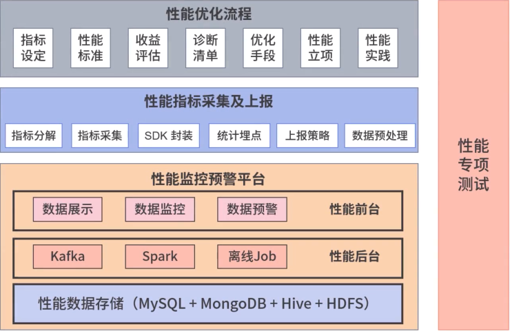
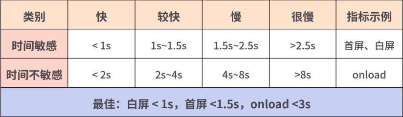
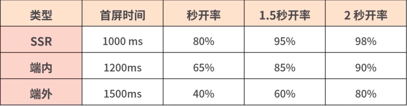

# 前端性能优化体系学习

刻意练习是关键，不用就会退化，一定要结合实际能用就用，不用就会退步

1. **前端性能优化方法论**
2. **指标采集上报及优化手段**
3. **Hybrid 下的进阶优化**
4. **性能优化数据评估及预警**
5. **一线大厂性能优化体系演进**

## 性能优化体系及关键指标设定

**性能指标采集与上报**

主要内容是把前面提到的性能指标以代码的形式分解落地确保可以采集，然后在SDK封装后集合统计埋点最后根据实际情况，制定上报策略

**性能监控预警平台**

当指标超过某一监控阈值时性能监控预警平台会通过邮件或者短信给我们发送预警信息

**性能数据处理后台**

主要是在性能采集数据上报到性能平台后，对数据进行预处理、数据清洗和数据计算，然后生成前台可视化所需数据

**性能可视化展现前台**

主要是对核心数据指标进行可视化展现对性能数据波动进行监控，对超出阈值的数据给出短信或邮件报警

**在上线前一定要做性能专项测试检查一下你采取的措施和性能优化预期是否一致**

## 什么指标值得关注？

1. **加载**
2. **交互性**
3. **视觉稳定性**

### 1.加载

**加载就是进入页面时，页面内容的载入过程**

当你打开一些网站时，你会发现，有的网站首页上的文字、图片出现很缓慢，而有的则很快，这个内容出现的过程就是加载

**交互就是用户点击网站或App的某个功能页面给出的回应**

比如我们点击了一个“点赞”按钮立刻给出了点赞数加一的展示，这就是交互体验好

**视觉稳定性指标CLS ( Cumulative Layout Shift)**

也就是布局偏移量，它是指页面从一帧切换到另外一帧时，视线中不稳定元素的偏移情况

**在性能优化关键指标方面目前业界主要集中在加载方面，特别是白屏时间和首屏时间，除了手动采集之外，还可以自动化采集而交互性和视觉稳定性关键指标，业界还在探索没有统一的衡量标准,且必须手动采集**

**交互方面**

**有的公司用FID指标(First Input Delay,首次输入延迟)指标必须尽量小于100ms**

**有的公司使用PSI(Perceptual Speed Index,视觉变化率)衡量标准是小于20%**

### 白屏时间

**什么叫白屏时间呢?**

指的是从输入内容回车(包括刷新、跳转等方式)后到页面开始出现第一个字符的时间

**它的标准时间是300ms**

**哪些因素会导致白屏时间过长?**

有可能是DNS查询时间长，建立TCP请求链接太慢，或者是服务器处理请求速度太慢,

客户端下载、解析、渲染时长过长,没有做Gzip压缩,缺乏本地离线化处理，等等

### 首屏时间

**首屏时间=白屏时间+渲染时间**

从浏览器输入地址并回车后，到首屏内容渲染完毕的时间

这期间不需要滚动鼠标或者下拉页面，否则无效

从重要性角度看,打开页面后,第一眼看到的内容一般都非常关键，比如电商的头图、商品价格、购买按钮等。这些内容即便在最恶劣的网络环境下，我们也要确保用户能看得到

### 秒开率

当到了2G/3G弱网环境，或者网络不稳定的环境用户联网加载的时间会特别长，严重影响整体指标

前端工程师在使用过程中越来越觉得用**平均值来表示加载时间并不准确可靠**

人们又开始**采用中位数，做正态分布，看分位值统计**

P50 (50分位值)、P90 (90分位值)、P99 (99分位值)

以P99为例,我们是把所有首屏时间排序得出排在第99位的首屏时间就是P99

**后面觉得这个比较麻烦，阿里采用了秒开率指标**

**引入了秒开率的指标，即1s内打开用户的占比**

### 粒度细分

首屏时间毕竟粒度太粗了

如果首屏时间长，白屏时间短，到底是哪里的问题?

**首屏时间可以拆分为白屏时间、数据接口响应时间、图片加载资源等**

**数据接口响应时间可以直接从后端服务中获取不需要前端再重复计算**

### 总结

学习性能优化并不仅仅是掌握一些优化技巧就可以了

进行性能优化，指标就是我们的一个抓手

首先你就要确定它的指标，然后才能根据指标去采取措施

否则就会像无头苍蝇一样乱撞，没有执行目标

## 页面加载全过程

页面加载大致过程是怎样的呢?

1. 客户端发起请求阶段
2. 服务端数据处理请求阶段
3. 客户端页面渲染阶段

**客户端发起请求阶段是指用户在浏览器输入URL经过本地缓存确认是否已经存在这个网站**

- 如果没有，接着会由DNS查询从域名服务器获取这个IP地址
- 接下来就是客户端通过TCP的三次握手
- 和TLS协商向服务器发起HTTP请求建立连接的过程

### 本地缓存

**为什么说本地缓存会成为前端性能的瓶颈点之一呢?**

**本地缓存可以让静态资源加载更快，当客户端发起一个请求时，静态资源可以直接从客户端中获取,不需要再向服务器请求**

**怎么实现本地缓存呢?**

- 强缓存
- 协商缓存

**强缓存是指浏览器在加载资源时，根据请求头的expires和cache-control判断是否命中客户端缓存**

**协商缓存是指浏览器会先发送一个请求到服务器，通过last-modified和etag验证资源是否命中客户端缓存**