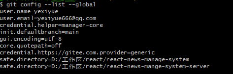
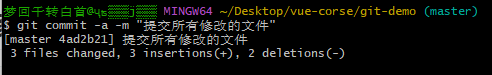
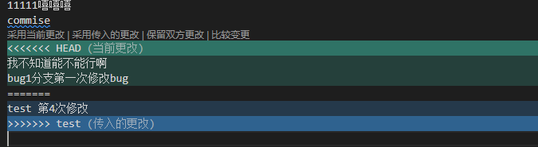

::: tip 介绍
git 复习
:::

<!-- more -->

# git复习

刚下载好要配置用户名和邮箱

```bash
git config --global user.name "yexiyue"
git config --global user.email "yexiyue666@qq.com"
```

使用`git config --list --global`查看命令




## 基本操作


### 1.初始化仓库

```bash
git init
```

### 2.查看状态

git中的文件有两种状态：**未跟踪和已跟踪**。未跟踪指文件没有被git所管理，已跟踪指文件已被git管理。**已跟踪的文件又有三种状态：未修改、修改和暂存**。

暂存，表示文件修改已经保存，但是尚未提交到git仓库。

未修改，表示磁盘中的文件和git仓库中文件相同，没有修改。

已修改，表示磁盘中文件已被修改，和git仓库中文件不同。

可以通过`git status`来查看文件的状态

```bash
git status
```


### 3.将文件暂存

状态改变

**未跟踪==>暂存**

**修改==>暂存**

```bash
git add <filename>
git add *
```


### 4.存储到仓库

将暂存的文件存储到仓库中，也就是执行了git add命令后执行commit命令

状态改变

**暂存==>未修改**

```bash
git commit -m "提交信息"
```


### 5.查看提交记录

```bash
git log
```


### 6.提交所有已修改的文件

**省去git add加入到暂存状态**

```bash
git commit -a -m "提交信息"
```




**注意：未跟踪的文件不会提交**


### 7.重置文件

**恢复已修改状态到修改之前的样子**

```bash
git restore <filename>
```


### 8.暂存状态取消

**把文件从暂存状态取消**

```bash
git restore --staged <filename>
```


### 9.删除文件

**从磁盘和仓库里都删除掉**

```bash
git rm <filename>
git rm -f <filename> //强制删除
```

相当于手动删除文件然后使用`git add`命令加入暂存区

**注意：当文件是已修改状态普通删除，删除不了，得使用强制删除**


### 10.删除文件的恢复

**如果加入暂存区了**

```bash
git restore --staged *
```

**取消暂存状态**

```bash
git resotre *
```

**重置文件**


## 分支

**git在存储文件时，每次代码的提交都会创建个与之对应的节点。 git就通过一个个的节点来记录代码的状态的。 节点会构成一个树状结构，树状结构就意味着这个树会存在分支，默认情况下合库只有一个分支。 命名为master在使用g时。可以创建多个分支，分支与分支之间相互独立，在个分支上修改代码不会影响其他的分支。**


### 1.查看分支

```bash
git branch
```

### 2.创建分支

```bash
git branch <branch name>
```

### 3.删除分支

```bash
git branch -d <branch name>
```

### 4.切换分支

```bash
git switch <branch name>
```

### 5.创建并切换分支

```bash
git switch -c <branch name>
```

### 6.合并分支

**要先切换到主分支再合并**

```bash
git merge <branch name>
```


**当两个分支都修改同一个文件时会产生合并冲突**




### 7.变基(rebase)

在开发中除了通过merge来合并分支外。还可以通过变基来完成分支的合并。

我们通过merge合并分支时，在提交记录中会将所有的分支创建和分支合并的过程全部都显示出来，这样当项目比较复杂，开发过程比较波折时，我必须要反复的创建、合并、删除分支。这样一来将会使得我们代码的提交记录变得极为混乱。

原理(变基时发生了什么) :

1. 当我们发起变基时，git会首先找到两条分支的最近的共同祖先

2. 对比当前分支相对于祖先的历史提交，并且将它们提取出来存储到 个临时文件中
3. 将当前部分指向目标的基底
4. 以当前基底开始，重新执行历史操作

**变基和merge对于合并分支来说最终的结果是样的! 但是变基会使得代码的提交记录更整洁更清晰!**

**注意：大部分情况下合并和变基是可以互换的，但是如果分支已经提交给了远程仓库，那么这时尽量不要变基。**


**切换到issu分支**

```bash
git rebase master
```


**切换到master分支进行合并**

```bash
git merge issu
```


### 8.修改主分支的名字

```bash
git branch -m main
```


## 远程仓库(remote)

```bash
git remote # 列出当前的关联的远程库
git remote add <远程库名> <url> # 关联远程仓库
git remote remove <远程库名>  # 删除远程库
git push -u <远程库名> <分支名> # 向远程库推送代码，并和当前分支关联
git push <远程库> <本地分支>:<远程分支>
git clone <url> # 从远程库下载代码

git push # 如果本地的版本低于远程库，push默认是推不上去
git fetch # 要想推送成功，必须先确保本地库和远程库的版本一致，fetch它会从远程仓库下载所有代码，但是它不会将代码和当前分支自动合并
# 使用fetch拉取代码后，必须要手动对代码进行合并
git pull  # 从服务器上拉取代码并自动合并
```


## 存储

```bash
#存储修改
git stash
#标识储藏记录
git stash save [stashMessage]
# 查看储藏记录列表
git stash list
# 将指定index的储藏从储藏记录列表中删除
git stash drop stash@{index}
#取出之前储藏的修改
git stash pop [stash@{index}] #可以指定对应的序号进行弹出存储
```


