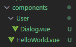
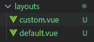

::: tip 介绍
nuxt基础入门学习，个人觉得服务器端编写还得用nest.js
:::

<!-- more -->
# nuxt学习

**1.什么是模板渲染?**

动态网站=不同数据+模板=>不同的html网页

**2.在哪里进行渲染?**

服务端渲染

客户端渲染

同构渲染


## 1.安装

[nuxt/starter at v3 (github.com)](https://github.com/nuxt/starter/tree/v3)

克隆上面仓库到本地就可以了


## 2.路由

Nuxt的一个核心特性是文件系统路由器。`pages/` 目录中的每个Vue文件都会创建一个相应的URL(或路由)来显示文件的内容。通过对每个页面使用动态导入，Nuxt利用代码拆分为请求的路由提供最少数量的JavaScript。

Nuxt路由基于[vue-router](https://router.vuejs.org/)，根据文件名从[`pages/`](https://nuxt.com.cn/docs/guide/directory-structure/pages)目录中创建的每个组件生成路由。

这个文件系统路由使用命名约定来创建动态的嵌套路由:

**创建一个pages文件夹，里面的vue文件都会被当做一个路由页面**


1. **默认路由组件：index.vue**
2. **params传参：[id].vue**
3. **嵌套路由只需要vue文件名为父级组件，目录里的vue文件为子组件**


**roles父级组件**

```vue
<template>
    <div>
        角色父级组件
        <NuxtPage></NuxtPage>
    </div>
</template>

<script setup lang="ts">

</script>

<style scoped>

</style>
```

**子组件**

```vue
<template>
    <div>
        子组件
    </div>
</template>

<script setup>

</script>

<style lang="scss" scoped>

</style>
```


### NuxtLink

```vue
<template>
  <div>
      <h1>根组件</h1>
      <NuxtLink to="/">首页</NuxtLink>
      <NuxtLink to="/about">关于</NuxtLink>
      <nuxt-link to="/roles">角色</nuxt-link>
      <nuxt-link to="/users/addUser">用户</nuxt-link>
      <!-- 相当于router-view -->
      <NuxtPage></NuxtPage>
  </div>
</template>
```

**nuxtLink跳转不刷新页面，走的是客户端渲染，而普通的a标签会刷新页面，走的是浏览器端渲染**


### 自定义路由

**在项目根目录下新建一个文件夹app，然后编写文件router.options.ts**

```typescript
import {RouterConfig} from '@nuxt/schema'

export default <RouterConfig>{
    routes:(_routes)=> [
        ..._routes,
        {
            path:'/error',
            component:()=>import('../pages/users/addUser.vue')
        }
    ],
}
```


### 路由中间件

[middleware/ · Nuxt Directory Structure](https://nuxt.com.cn/docs/guide/directory-structure/middleware)


## 3.组件

[components/ · Nuxt Directory Structure](https://nuxt.com.cn/docs/guide/directory-structure/components)

**在根目录下的components组件会自动注册，不需要导入**




**注意：User目录下的要带上目录名**，在global下的才是全局组件


## 4.布局layouts

[layouts/ · Nuxt Directory Structure](https://nuxt.com.cn/docs/guide/directory-structure/layouts#动态更改布局)

**如果只有一种布局使用app.vue结合NuxtPage就够用了**


在根目录下新建文件夹layouts

然后在其下新建default.vue为默认布局



### **使用另一种布局**

```vue
<template>
    <NuxtLayout name="custom">
        <div>
            about
            <HelloWorld></HelloWorld>
            <UserDialog></UserDialog>
        </div>
    </NuxtLayout>
</template>

<script setup lang="ts">
definePageMeta({
    layout:false
})
</script>

<style scoped></style>
```


### **动态更改布局**

```vue
<template>
        <div>
            about
            <HelloWorld></HelloWorld>
            <UserDialog></UserDialog>
            <button @click="changeLayout">改变布局</button>
        </div>
</template>

<script setup lang="ts">
function changeLayout(){
    setPageLayout('custom')
}
definePageMeta({
    layout:'default'
})
</script>

<style scoped></style>
```


## 5.SEO配置

### 定义全局meta信息

```typescript
// https://nuxt.com/docs/api/configuration/nuxt-config
export default defineNuxtConfig({
    app:{
        head:{
            title:'红尘散仙',
            meta:[
                {
                    name:'keywords',
                    content:'nuxt 学习，前端'
                },
                {
                    name:'description',
                    content:'一个框架学习'
                }
            ]
        },
    }
})

```


### 使用响应式数据定义元信息

**使用useHead或者definePageMeta**

```vue
<template>
  <NuxtLayout>
    <div>
      <h1>根组件</h1>
      <NuxtLink to="/">首页</NuxtLink>
      <NuxtLink to="/about">关于</NuxtLink>
      <nuxt-link to="/roles">角色</nuxt-link>
      <nuxt-link to="/users/addUser">用户</nuxt-link>
      <!-- 相当于router-view -->
      <NuxtPage></NuxtPage>
    </div>
  </NuxtLayout>
</template>

<script setup lang="ts">
useHead({
  title:'最爱熙熙',
  meta:[
    {
      name:'author',
      content:'yexiyue'
    }
  ]
})
</script>

<style scoped>
a {
  margin: 10px;
}
</style>
```


### 组件式定义

```vue
<template>
    <Head>
        <Title>6666</Title>
        <Meta name="description" content="title"/>
    </Head>
    <div>
        默认路由组件
    </div>
</template>
```


### 动态标题

**每个页面设置的标题会当作titlt传入**

```vue
<script setup lang="ts">
useHead({
  title:'最爱熙熙',
  meta:[
    {
      name:'author',
      content:'yexiyue'
    }
  ],
  titleTemplate(title) {
      return `666 ${title}`
  },
})
</script>
```

### 注意：

**实际工作中，nuxt.config.ts和app.vue中只有一处设置head信息**

```typescript
//可以通过process.client判断是否在客户端
console.log(process.client)
```


## 6.获取数据

[数据获取 · 开始使用Nuxt3 Nuxt中文站](https://nuxt.com.cn/docs/getting-started/data-fetching)

```vue
<template>
    <div>
        角色父级组件
        <NuxtPage></NuxtPage>
    </div>
</template>

<script setup lang="ts">
useFetch('https://api.uixsj.cn/hitokoto/get?type=social',{
    method:'GET'
}).then(res=>console.log(res.data.value))
</script>

<style scoped>

</style>
```


## 7.服务器端接口

[server/ · Nuxt Directory Structure](https://nuxt.com.cn/docs/guide/directory-structure/server)

**跟路由一样，进行约定式编写即可生成接口**


```typescript
export default defineEventHandler(event=>{
    console.log(event.context.params)
    return 'ok'
})
```

**很多功能比如文件上传不知道怎么实现，建议使用传统后端框架，nuxt的后端服务做胶水层**


## 8.状态管理

[状态管理 · 开始使用Nuxt3 Nuxt中文站](https://nuxt.com.cn/docs/getting-started/state-management)

官方使用useState自己封装hooks来管理状态

使用pinia做为状态管理

**安装依赖**

```
pnpm add pinia @pinia/nuxt
```

**新建stores文件夹**

**定义store**

```typescript
import {defineStore} from 'pinia'

export const useUserStore=defineStore('user',()=>{
    const userInfo=reactive({
        username:'张三',
        age:18
    })

    return {
        userInfo
    }
})
```

**配置自动导入和pinia**

```typescript
export default defineNuxtConfig({
    /* ssr: false, */
    modules:[
      '@pinia/nuxt'
    ],
    imports:{
      dirs:[
        'stores',
      ]
    }
  })
```


**使用**

```typescript
<template>
    <div>
        角色父级组件
        <NuxtPage></NuxtPage>
        {{ store.userInfo.username }}
    </div>
</template>

<script setup lang="ts">

useFetch('https://api.uixsj.cn/hitokoto/get?type=social',{
    method:'GET'
}).then(res=>console.log(res.data.value))
const store=useUserStore()
</script>

<style scoped>

</style>
```


## 9.使用ui库

[Vant Module · Nuxt](https://nuxt.com.cn/modules/vant)

[Element-plus Module · Nuxt](https://nuxt.com.cn/modules/element-plus)

查看module文档即可