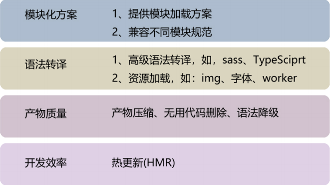

::: tip 介绍
vite的基础学习，了解了常用配置，插件的编写等
:::

<!-- more -->

# vite学习

## 1.vite是什么? 

**一句话说明: Vite是一 种新型的前端构建工具，它能显著改善前端开发体验。**

[为什么选 Vite | Vite 官方中文文档 (vitejs.dev)](https://cn.vitejs.dev/guide/why.html)

官网详细说明为什么选vite


vite采用esm方式进行构建

ES modules (ESM)是JavaScript官方的标准化模块系统。

ESM标准规范了如何把文件解析为模块记录，如何实例化和如何运行模块。

ESM则使用称为实时绑定(Live Binding)的方式。导出和导入的模块都指向相同的内存地址(即值引用)。

所以，当导出模块内导出的值改变后，导入模块中的值也实时改变了。


**什么叫 编译时输出接口? 什么叫 运行时加载?**

ESM 之所以被称为 编译时输出接口，是因为它的模块解析是发生在 编译阶段。

也就是说，import 和 export 这些关键字是在编译阶段就做了模块解析，

这些关键字的使用如果不符合语法规范，在编译阶段就会抛出语法错误。

ESM 的运行机制是，JS 引擎在对脚本静态分析的时候，遇到模块加载命令import，

会生成一个只读引用。等到脚本真正执行时，再根据这个只读引用，到被加载的那个模块里面去取值。

因此，ESM 是动态引用，并且不会缓存值，模块里面的变量绑定其所在的模块。

编译时加载: ESM 不是对象，而是通过 export 命令显式指定输出的代码，import时采用静态命令的形式。

即在import时可以指定加载某个输出值，而不是加载整个模块，这种加载即所谓的“编译时加载”。


**为什么说，Vite是一种新型的前端构建工具，而不称它为打包工具呢?**

**构建工具和打包工具的区别?**

1. 构建过程应该包括:预编译、语法检查、词法检查、依赖处理、文件合并、文件压缩、单元测试、版本管理等。
2. 打包工具更注重打包这一过程,主要包括依赖管理和版本管理等。


## 2.什么是构建工具




**构建工具，主要做以下的工作**

1. 代码转换：将TypeScript编译成JavaScript、将SCSS编译成CSS等。
2. 文件优化：压缩JavaScript、CSS、HTML代码，压缩合并图片等。
3. 代码分割：提取多个页面的公共代码，提取首屏不需要执行部分的代码让其异步加载。
4. 模块合并：在采用模块化的项目里会有很多个模块和文件，需要通过构建功能将模块分类合并成一个文件。
5. 自动刷新：监听本地源代码的变化，自动重新构建、刷新浏览器。
6. 代码校验：在代码被提交到仓库前需要校验代码是否符合规范，以及单元测试是否通过。
7. 自动发布：更新代码后，自动构建出线上发布代码并传输给发布系统。


比如我们执行一些例如CoffeeScript/ES6去代替Javascript. JS或CSS压缩、用Less去写CSS、用Jade去写HTML、用Browserify去模块化、 为非覆盖式部署的资源加MD5戳等,这些操作如果我们一遍遍手动执行，非常耗费时间和精力，所以前端构建工具，或者较前端自动化构建工具,**就是用来让我们不再做机械重复的事情，解放我们的双手的**

**总结：构建工具就是避免机械重复的事情，让其自动化完成**


## 3.依赖预构建

首次执行vite时，服务启动后会对node. modules模块和配置optimizeDeps的目标进行预构建

```typescript
import { defineConfig } from 'vite'
import vue from '@vitejs/plugin-vue'
// https://vitejs.dev/config/
export default defineConfig({
  plugins: [vue()],
  optimizeDeps:{
    //在预构建中强制排除某依赖项
    // exclude:['lodash-es']
  },
})

```


就是把那些第三方包自动加载到缓存里，引用的时候是使用esm方式引用

[依赖预构建 | Vite 官方中文文档 (vitejs.dev)](https://cn.vitejs.dev/guide/dep-pre-bundling.html)


## 4.开发服务器配置

```typescript
import { defineConfig } from 'vite'
import vue from '@vitejs/plugin-vue'
import basicSsl from '@vitejs/plugin-basic-ssl'
// https://vitejs.dev/config/
export default defineConfig({
  plugins: [
    vue(),
    //使用tsl插件
    basicSsl()
  ],
  optimizeDeps:{
    //在预构建中强制排除某依赖项
    // exclude:['lodash-es']
  },
  //开发服务器配置
  server:{
    //自动打开浏览器
    open:true,
    //开启https
    https:true,
    port:1234,
    //设置代理
    proxy:{
      '/api':{
        target:'https://www.bilibili.com/',
        //允许跨域
        changeOrigin:true,
        rewrite:(path)=>path.replace(/^\/api/,'')
      }
    }
  }
})

```

## 5.环境变量

[环境变量和模式 | Vite 官方中文文档 (vitejs.dev)](https://cn.vitejs.dev/guide/env-and-mode.html)

**.env是全局环境文件**

**.env.development**开发环境文件

```bash
NODE_ENV=development
VITE_NAME='开发环境'
VITE_TITLE='vite dev'
VITE_BASE_URL='http://xxxxxx/api'
```


**.env.production生产环境文件**

```bash
VITE_NAME='生产环境'
VITE_TITLE='vite production'
VITE_BASE_URL='http://yyyyyyy/api'
```


```typescript
import { defineConfig,loadEnv } from 'vite'
import vue from '@vitejs/plugin-vue'
import basicSsl from '@vitejs/plugin-basic-ssl'
//自定义配置
export default defineConfig(({mode,command,ssrBuild})=>{
  console.log(mode,command,ssrBuild)
  const config=loadEnv(mode,'./')
  console.log(config)
  return {
    plugins: [
      vue(),
      //使用tsl插件
      basicSsl()
    ],
    optimizeDeps:{
      //在预构建中强制排除某依赖项
      // exclude:['lodash-es']
    },
    //开发服务器配置
    server:{
      //自动打开浏览器
      open:true,
      //开启https
      https:true,
      port:1234,
      //设置代理
      proxy:{
        '/api':{
          target:'https://www.bilibili.com/',
          //允许跨域
          changeOrigin:true,
          rewrite:(path)=>path.replace(/^\/api/,'')
        }
      }
    }
  }
})
```


[JavaScript API | Vite 官方中文文档 (vitejs.dev)](https://cn.vitejs.dev/guide/api-javascript.html#loadenv)

**使用函数式写法，使用loadEnv加载环境变量对不同的环境进行配置**

```typescript
import { defineConfig,loadEnv } from 'vite'
import vue from '@vitejs/plugin-vue'
import basicSsl from '@vitejs/plugin-basic-ssl'

//自定义配置
//defineConfig接受一个函数，参数是一个对象包含mode，command,ssrBuild
export default defineConfig(({mode,command,ssrBuild})=>{
  /* console.log(mode,command,ssrBuild) */

  //获取当前环境变量
  const config=loadEnv(mode,'./')
  /* console.log(config) */
  return {
    plugins: [
      vue(),
      //使用tsl插件
      basicSsl()
    ],
    optimizeDeps:{
      //在预构建中强制排除某依赖项
      // exclude:['lodash-es']
    },
    //开发服务器配置
    server:{
      //自动打开浏览器
      open:true,
      //开启https
      https:true,
      port:1234,
      //设置代理
      proxy:{
        '/api':{
          target:config.VITE_TARGET,
          //允许跨域
          changeOrigin:true,
          rewrite:(path)=>path.replace(/^\/api/,'')
        }
      }
    }
  }
})
```


### 编写环境变量类型文件

**src/env.d.ts**

```typescript
/// <reference types="vite/client" />
interface ImportMetaEnv{
    readonly VITE_NAME:string
    readonly VITE_TITLE:string
    readonly VITE_BASE_URL:string
    readonly VITE_TARGET:string
}

interface ImportMeta{
    readonly env:ImportMetaEnv
}

```


## 6.postCss配置

### 1.安装依赖

```
 pnpm add postcss-nested
```

```typescript
export default defineConfig({
  plugins:[vue()],
  css:{
    postcss:{
      plugins:[
        //css嵌套书写插件
        postcssNested()
      ]
    }
  },
})
```

**配置一般postcss插件**

**如果需要使用less直接安装依赖即可，不用配置**


## 7.vite路径别名

[共享配置 | Vite 官方中文文档 (vitejs.dev)](https://cn.vitejs.dev/config/shared-options.html#resolve-alias)

当使用文件系统路径的别名时，请始终使用绝对路径。相对路径的别名值会原封不动地被使用，因此无法被正常解析。

```typescript
export default defineConfig({
  plugins:[vue()],
  resolve:{
    alias:{
      '@':'/src'
    }
  }
})
```


## 8.批量导入

[功能 | Vite 官方中文文档 (vitejs.dev)](https://cn.vitejs.dev/guide/features.html#glob-import)

```typescript
///<reference types="vite/client"/>
import type {RouteRecordRaw} from 'vue-router'

export interface ImportMeta{
    routes:RouteRecordRaw[]
}

const modules=import.meta.glob(['./src/views/**/*.vue','!./src/views/user-manage/*.vue'],{
    eager:false,
})

export function formatPath(url:string){
    url='/'+url
    return url.replace('./src/views/','').replace('.vue','').replace(/((?<=\/)[A-Z])/gm,(sub)=>{
        return sub.toLocaleLowerCase()
    })
}

export function returnRoutes():RouteRecordRaw[]{
    const res:RouteRecordRaw[]=[]

    for(let i of Object.keys(modules)){
        let route:RouteRecordRaw={
            path:formatPath(i),
            component:modules[i]
        }
        res.push(route)
    }

    return res
}

console.log(returnRoutes())
```


**使用glob批量导入然后配置成路由格式**


## 9.插件

[插件 API | Vite 官方中文文档 (vitejs.dev)](https://cn.vitejs.dev/guide/api-plugin.html)

**vite插件钩子加载顺序**


**插件示例**

```typescript
export default function () {
  return {
    // 显示在 warning 和 error 中，用于警告和错误展示
    name: "hooks-order",
    // 初始化hooks，只走一次。服务器启动时被调用
    options(opts) {
      console.log("options");
    },
    // 启动时调用一次
    // vite （本地）服务启动时调用，在这个函数中可以访问 rollup 的配置
    buildStart() {
      console.log("buildStart");
    },
    // vite特有钩子，在解析 Vite 配置前调用。
    // 接收原始用户配置（命令行选项指定的会与配置文件合并）
    // 和一个描述配置环境的变量
    config(userConfig, env) {
      console.log("userConfig");
      return {};
    },
    // Vite配置确认，在解析 Vite 配置后调用
    configResolved(resolvedCofnig) {
      console.log("configResolved");
    },
    // 用于配置dev server，可以进行中间件操作
    configureServer(server) {
      console.log("configureServer");
      // server.app.use((req, res, next) => {
      // // custom handle request...
      // })
    },
    // 用于转换宿主页，接收当前的 HTML 字符串和转换上下文
    transformIndexHtml(html) {
      console.log("transformIndexHtml");
      return html;
      // return html.replace(
      // /<title>(.*?)</title>/,
      // `<title>Title replaced!</title>`
      // )
    },
    // 通用钩子，创建自定义确认函数
    resolveId(source) {
      // console.log(resolveId)
      if (source === "virtual-module") {
        console.log("resolvedId");
        return source;
      }
      return null;
    },
    // 创建自定义加载函数，可用于返回自定义的内容
    load(id) {
      console.log("load");
      if (id === "virtual-module") {
        return 'export default "This is virtual!"';
      }
      return null;
    },
    // 可用于转换已加载的模块内容（转变源码为需要的代码）
    transform(code, id) {
      console.log("transform");
      if (id === "virtual-module") {
      }
      return code;
    },
  };
}
```


### 虚拟模块

虚拟模块是 Vite 沿用 Rollup 的虚拟模块，虚拟模块类似 alias 别名，

但是模块的内容并非直接从磁盘中读取，而是编译时生成。

虚拟模块是一种很实用的模式，使你可以对使用 ESM 语法的源文件传入一些编译时信息。

```typescript

export default function myPlugin() {
    //项目中使用的虚拟模块名称
    const virtualModuleId = 'virtual:my-module'
    //加上\0内部模块使用的名称
    const resolvedVirtualModuleId = '\0' + virtualModuleId
  
    return {
      // 必须的，将会在 warning 和 error 中显示
      name: 'my-plugin', 
      //在每个传入【模块请求】时被调用
      // 以下钩子会在每个传入模块请求时被调用
 	  // 换言之，不请求虚拟模块，就不会触发 resolvedId()
 
 	  // 可用于定义自定义的 id 路径解析器，
      // 比如可以拿到import foo from './foo.js'中的./foo.js，
      // 一般用来定位第三方依赖，找到对应的文件
      // 真实虚拟模块 ID 转换为内部虚拟模块 ID。
      //id为模块名，解析时调用，传递给下一个钩子的入参
      resolveId(id) {
        if (id === virtualModuleId) {
            console.log('resolveId',id)
            //返回id
          return resolvedVirtualModuleId
        }
      },
      //模块加载时调用
 	  // 在加载文件内容的钩子中返回这个虚拟模块的内容
      load(id) {
        if (id === resolvedVirtualModuleId) {
            console.log('load',id)
          return `export * as test from './test'`
        }
      }
    }
  }
  
```

**使用**

```typescript
//@ts-ignore
import {test} from 'virtual:my-module'
```


### transform钩子

```typescript
import { Plugin } from "vite";
export default function (ops: Record<any, any> = {}): Plugin {
  return {
    name: "vite-plugin-demo",
    transform(code, id, options) {
      //转换图片
      if (id.match(/(.jpg|.png|.jpeg|.webp)$/)) {
        console.log(id);
        console.log(code);
        return `export default "/src/assets/2054179.jpg"`;
      }
      //处理css
      /* if(id.match(/(.css)$/gim)){
                console.log(id)
                //这里是css代码
                console.log(code)
                return code
            } */

      //处理vue
      if (id.match(/(Item.vue)$/gim)) {
        return `
                import {h, defineComponent} from "vue";
                const _sfcComp= defineComponent({
                name: "ItemVue22",
                });
                console.log( defineComponent )
                // 对setup函数进行封装，返回options的对象；
                // 最重要的是：在TypeScript下，给予了组件 
                // 正确的参数类型推断 。
                const _sfc_render =() => {
                return h("div", {
                innerHTML: '<h1>我是一个组件22222222</h1>', 
                })
                };
                _sfcComp.render = _sfc_render
                export default _sfcComp
                `;
      }
    },
  };
}

```

### load钩子

浏览器发起请求以后，dev server 端会通过 middlewares 对请求做拦截，

然后对源文件做 resolve、load、transform 等操作，

然后再将转换以后的内容发送给浏览器。

resolveId 就是去找到对应的文件，输出本地的实际的路径，

load 输出是文件模块的代码字符串

 加载本地文件到内存中

 

当然了你也可以在load里修改一下源码，

 然后再传入到 transform

transform 就是将源码转变成目标代码

 在这里进一步对源码进行操作

 转换完成的内容直接返回给浏览器

 它处理的是模块


【load 与 transform】：

 **共同点：**

-  是它们都能修改内容；

 **区别是：**

-  load，它处理的是文件
-  transform，它转换的是模块
- 所以在load中，可以直接写，<template>之类的代码
- 但在 transform 中，就要通过h渲染函数


load(id)：

在每个传入模块请求时被调用，可以自定义加载器，可用来返回自定义的内容

输出是文件模块的代码字符串，默认就是直接读取文件内容并返回

在解析模块时调用，也可以修改返回代码，来指定某个 import 语句加载特定的模块

```typescript
import { Plugin } from "vite";
export default function (ops: Record<any, any> = {}): Plugin {
  return {
    name: "vite-plugin-demo",
    
    load(id, options) {
        if(id.match(/(Item.vue)$/gim)){
            console.log(id,options)
            return `
            <template>
                <div>
                    我修改了组件
                </div>
                <AA/>
            </template>
            
            <script setup lang="ts">
            import AA from './aa.vue'
            </script>
            
            <style scoped>
            
            </style>
            `
            
        }
    },
  };
}

```


## 9.插件实战

### 1.md转vue插件

目前多数博客提供的解决方案：

1.  利用markdown的解析库将md解析成html内容
2.  在业务中编写一个组件，将前一步解析出的html文本作为v-html属性的值

**需求：将md文件直接导入成可使用的vue组件**


#### 1.安装依赖

```
pnpm add marked
```

#### 2.实现

```typescript
import { Plugin } from 'vite';
import {marked} from 'marked'
export default function ():Plugin{
    return {
        name:'vite-plugin-mdToVue',
        load(id, options) {
            
        },
        transform(code, id, options) {
            if(id.match(/(.md)$/)){
                console.log(id)
                console.log(marked(code))
                return `
                    import {h,defineComponent} from "vue"
                    let _mdObj=defineComponent({
                        name:"mdItem"
                    })

                    let md_render=()=>{
                        return h("div",{
                            innerHTML:${JSON.stringify(marked(code))}
                        })
                    }

                    _mdObj.render=md_render;
                    export default _mdObj
                `
            }
        },
    }
}
```


### 2.自动生成vue-router路由

```typescript
import type {Plugin} from 'vite'
import fs from 'fs'
import path from 'path'

function readFiles(src:string){
    let fileNames=fs.readdirSync(src)
    let res:{name:string,path:string}[]=[]
    fileNames.forEach(item=>{
        const fileDir=path.join(src,item)
        const state=fs.statSync(fileDir)
        //判断为是文件夹
        if(state.isDirectory()){
            res.push(...readFiles(fileDir))
        }

        if(state.isFile()){
            const file=path.parse(fileDir)
            if(file.ext=='.vue'){
                res.push({
                    name:file.name,
                    path:fileDir.replace(/\\/gim,'/')
                })
            }

        }
    })
    return res
}

function returnRoutes(files:ReturnType<typeof readFiles>,src:string){
    return files.map(item=>{
        const path=item.path.replace(src.substring(2),'')
        const root=src.replace('./src','@')
        const temp=path.replace(/(.vue)/gim,'').split('/');
        temp[temp.length-1]=temp[temp.length-1].toLocaleLowerCase()
        return {
            name:item.name,
            path:temp.join('/'),
            component:`()=>import('${root+path}')`
        }
    })
    
}
function stringify(obj:ReturnType<typeof returnRoutes>){
    try {
        return JSON.stringify(obj,(key,value)=>{
            if(key=='component'){
                return `${value}`
            }else{
                return value
            }
        })
    } catch (error) {
        console.error(error)
    }
}

/* console.log(formatPath(readFiles('./src/views'),'./src/views')[0].component()) */
/* console.log(formatPath(readFiles('./src/views'),'./src/views')) */

export default function():Plugin{
    const virtualModuleId = 'virtual:automated-routes'
    const resolvedVirtualModuleId = '\0' + virtualModuleId

    return {
        name:'vite-plugin-vue-router',
        resolveId(source, importer, options) {
            if (source === virtualModuleId) {
                return resolvedVirtualModuleId
            }
        },
        load(id, options) {
            if(id===resolvedVirtualModuleId){
                return `export const routes=${stringify(returnRoutes(readFiles('./src/views'),'./src/views'))}
                    export const parse=(str)=>{
                        try {
                            return JSON.parse(str,(key,value)=>{
                                if(key=='component'){
                                    return new Function(value)
                                }else{
                                    return value
                                }
                            })
                        } catch (error) {
                            console.error(error)
                        }
                    }
                `
            }
        },
    }
}
```

**主要逻辑就是通过虚拟模块导出，但是返回的时候需要拼接好字符串**

```typescript
///<reference types="vite/client"/>
import type {RouteRecordRaw} from 'vue-router'

export interface ImportMeta{
    routes:RouteRecordRaw[]
}

const modules=import.meta.glob(['./src/views/**/*.vue','!./src/views/user-manage/*.vue'],{
    eager:false,
})

export function formatPath(url:string){
    url='/'+url
    return url.replace('./src/views/','').replace('.vue','').replace(/((?<=\/)[A-Z])/gm,(sub)=>{
        return sub.toLocaleLowerCase()
    })
}

export function returnRoutes():RouteRecordRaw[]{
    const res:RouteRecordRaw[]=[]

    for(let i of Object.keys(modules)){
        let route:RouteRecordRaw={
            path:formatPath(i),
            component:modules[i]
        }
        res.push(route)
    }

    return res
}
```

**使用vite的global批量导入，然后拼接组装成路由格式**


### 3.控制台输出预览二维码

做移动端网页的时候，需要在手机上预览页面

一般的做法就是将dev服务的地址复制到手机上，再打开看

步骤比较繁琐。

**我们在控制台输出网址的二维码，手机扫码打开网页，提高效率**

[qrcode-terminal - npm (npmjs.com)](https://www.npmjs.com/package/qrcode-terminal)

#### 1.安装依赖

```bash
pnpm add qrcode-termina
```

#### 2.编写插件

```typescript
import { Plugin, ResolvedServerOptions, ServerOptions } from 'vite';
import qrCode from 'qrcode-terminal'
export default function():Plugin{
    let serverConfig:ServerOptions & ResolvedServerOptions
    return {
        name:'vite-plugin-qrCode',
        configResolved(config) {
            serverConfig=config.server
        },
        configureServer(server){
            return ()=>{
                server.middlewares.use((req,res,next)=>{
                    let {host,port}=serverConfig
                    let url=`http://${host}:${port}`
                    if(typeof host!=='string'){
                        url='http://10.44.18.71:5173/'
                    }
                    qrCode.generate(url,{small:true})
                    next()
                })
            }
        }
    }
}
```


### 4.vite-plugin-mooc

[中文文档](https://github.com/vbenjs/vite-plugin-mock/blob/main/README.zh_CN.md)

[Mock.js (mockjs.com)](http://mockjs.com/examples.html#Random\.email\(\))

**实现其实就是本地启动了一个服务，然后进行一些数据和模拟请求的各个配置**

#### 1.安装依赖

```bash
pnpm add vite-plugin-mock mockjs -D
```


#### 2.配置插件

```typescript
import { defineConfig } from 'vite'
import vue from '@vitejs/plugin-vue'
import {viteMockServe} from 'vite-plugin-mock'
// https://vitejs.dev/config/
export default defineConfig({
  plugins: [
    vue(),
    viteMockServe({
      //mock文件夹的地址
      mockPath:'./src/mock',
      supportTs:true,
      //开发环境使用
      localEnabled:true,
      //生产环境禁用
      prodEnabled:false
    })
],
})

```


#### 3.编写mock文件

```typescript
import { MockMethod } from "vite-plugin-mock";
import { mock } from "mockjs";

let _data = mock({
  "mockData|10": [
    {
      // 生成指定数据，随机生成1-4个指定字符串
      "string|1-4": "学习",
      // 随机生成不定长度文本 word
      string: "@cword(3,10)",
      // 随机生成标题 title 和句子 sentence
      title: "@ctitle(3,10)",
      sentence: "@csentence(20,30)",
      // 生成段落文本 paragraph.句子和段落的区别：一个是逗号，一个是句号。
      paragraph: "@cparagraph",
      // @name，生成中文，没有c则生成英文
      cnname: "@name",
      // 随机生成1-100范围内的数字
      "number|1-100": 1,
      // 生成增量id标识
      id: "@increment()",
      // 随机生成身份证号码、人名、地址信息
      idCard: "@id()",
      name: "@cname()",
      address: "@city(true)", //加true显示省级和市级，没有则显示市级
      // 随机生成一张指定图片
      img_url: "@image('25,25','#fff','#e35ef1','png','我是老尚')",
      //参数解释：图片宽高、背景颜色、文本颜色、图片类型、文本信息
      // 随机生成时间日期
      tile_date: "@date(yyyy-MM-dd hh:mm:ss)",
      // 随机生成指定范围的数组信息，随机生成10-25份信息。
      "list|10-25": [
        {
          idCard: "@id()",
          name: "@cname()",
          address: "@city(true)",
        },
      ],
    },
  ],
});

export default <MockMethod[]>[
  {
    url: "/mock/api",
    method: "get",
    timeout: 500,
    statusCode: 200,
    response: {
      code: 200,
      message: "请求数据成功",
      data: _data,
    },
  },
  {
    url: "/mock/api/user",
    method: "post",
    timeout: 500,
    response: (opt: any) => {
      return {
        ...opt,
      };
    },
  },
];
```


#### mock优点

1. 前后端分离，
2. 可随机生成大量的数据
3. 用法简单
4. 数据类型丰富
5. 可扩展数据类型
6. 在已有接口文档的情况下，我们可以直接按照接口文档来开发，将相应的字段写好，在接口完成 之后，只需要改变url地址即可。


#### 4.原理

```typescript
import { Connect, Plugin } from 'vite';
import mock from '../../mock'

export default function():Plugin{
    
    console.log(mock)

    function getMockUrlFn(req:Connect.IncomingMessage){
        const data=mock.find(item=>(item.url===req.url && req.method?.toLocaleLowerCase()===item.method))
        return data
    }

    return {
        name:'vite-plugin-mock',
        configureServer(server){
            server.middlewares.use((req,res,next)=>{
                const data=getMockUrlFn(req)
                if(data){  
                    res.setHeader("content-type","application/json")
                    res.end(JSON.stringify(typeof data.response=='function'?data.response():data.response))
                }else{
                    next()
                }
            })
        }
    }
}
```

**请求数据**

```typescript
fetch('/mock/api/user',{
    method:'post',
    headers:{
      'content-type':'application/json'
    },
  }).then(res=>{
    return res.json()
  }).then(res=>{
    console.log(res)
  })
```


### 5.拷贝文件

**对博客项目进行自动化**

```typescript
import fs from 'fs'
import path from 'path'

//源目录
const src=path.resolve(process.cwd(),'./blogs')
//目标目录
const dist=path.resolve(process.cwd(),'./dist')

//获取要复制的文件目录
function recordDirs(src:string,sign:string){
    let res:string[]=[]
    const dirs=fs.readdirSync(src)
    dirs.forEach(item=>{
        const fileDir=path.join(src,item)
        const state=fs.statSync(fileDir)
        if(state.isDirectory()){
            if(fileDir.includes(sign)){
                res.push(fileDir)
            }else{
                res.push(...recordDirs(fileDir,sign))
            }
        }
    })
    return res
}

//复制当前文件夹到指定目录
function copyDir(src:string,dist:string){
    const dir=dist+'\\blogs'+src.split('blogs')[1]
    const sourceFile=fs.readdirSync(src)
    if(!fs.existsSync(dir)){
        fs.mkdirSync(dir,{recursive:true})
    }

    sourceFile.forEach(file=>{
        const fileDir=path.join(src,file)
        const state=fs.statSync(fileDir)
        if(state.isFile()){
            //复制文件到指定目录
            fs.copyFileSync(fileDir,dir+'\\'+file)
        }
    })
}

interface Options{
    src:string,
    dist:string,
    sign:string
}

//执行复制
function copy({src,sign,dist}:Options){
    const dirs=recordDirs(src,sign)
    dirs.forEach(dir=>{
        console.log(`========开始拷贝文件夹：${dir}========`)
        copyDir(dir,dist)
    })
    console.log(`----------执行完成----------`)
}

copy({
    sign:'.assets',
    src,
    dist
})

```

