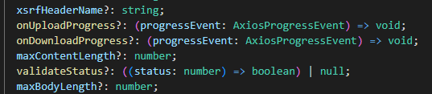
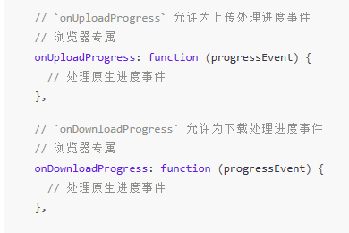

::: tip 介绍
对文件上传的学习
:::

<!-- more -->

# 大文件上传

**文件上传业务涉及到很多细节，比如样式相关的，对文件名的生成，大小格式校验，图片的预览，文件列表的显示，文件的移除，上传过程中的防抖，进度管控，多文件上传，大文件上传等。**

后端主要负责对文件的接收处理，涉及到文件的读写，文件夹下文件列表的读取等。

通过multer模块，对上传的文件进行接收，通过spark-md5对接收的文件buffer生成唯一的hash，这样当客户端上传同一份文件时，最终在服务器端只会保留一份，节省了资源空间。

下文代码都在本仓库

[yexiyue/large-file-upload ](https://github.com/yexiyue/large-file-upload)

**下文详细介绍了文件上传**

## 1.axios基本配置

[请求配置 | Axios 中文文档 | Axios 中文网 (axios-http.cn)](https://www.axios-http.cn/docs/req_config)


```typescript
import axios,{AxiosError} from 'axios'
import qs from 'qs'

//创建实例
const api=axios.create()
api.defaults.baseURL='http://localhost:8888'
//设置请求头 数据格式为multipart/form-data
api.defaults.headers["Content-Type"]="multipart/form-data"
//设置请求主体格式化
api.defaults.transformRequest=(data,headers)=>{
    const ContentType=headers['Content-Type']
    //只有这种格式才进行转换
    if(ContentType==='application/x-www-form-urlencoded'){
        return qs.stringify(data)
    }
    return data
}
//设置超时时间
api.defaults.timeout=1500
//响应拦截器
api.interceptors.response.use((res)=>{
    return res.data
},(error:AxiosError)=>{
    //统一做失败提示处理
    console.log(error.message)
    return Promise.reject(error)
})

export {api}
```

**基本项目结构**


### 样式文件

```css
.upload_box {
    position: relative;
    box-sizing: border-box;
    padding: 10px;
    width: 400px;
    min-height: 150px;
    border: 1px dashed #DDD;
}

.upload_box .upload_inp {
    display: none;
}

.upload_box .upload_button {
    position: relative;
    box-sizing: border-box;
    margin-right: 10px;
    padding: 0 10px;
    min-width: 80px;
    height: 30px;
    line-height: 30px;
    text-align: center;
    border: none;
    cursor: pointer;
    background-color: #DDD;
    /* 设置溢出隐藏，让伪类隐藏起来 */
    overflow: hidden;
}

/* 让after 伪类位置偏下，这样就隐藏起来了 */
.upload_box .upload_button:after {
    position: absolute;
    top: 30px;
    left: 0;
    z-index: 999;
    transition: top .1s;
    box-sizing: border-box;
    padding-left: 25px;
    width: 100%;
    height: 100%;
    content: 'loading...';
    text-align: left;
    background: url('./loading.gif') no-repeat 5px center #EEE;
    background-size: 15px 15px;
    color: #999;
}

.upload_box .upload_button.loading {
    cursor: inherit;
}

/* 添加loading 类之后让after 伪类位置为0显示出来 */
.upload_box .upload_button.loading:after {
    top: 0;
}

.upload_box .upload_button.select {
    background: #409eff;
    color: #FFF;
}

.upload_box .upload_button.upload {
    background: #67c23a;
    color: #FFF;
}

.upload_box .upload_button.disable {
    background: #EEE;
    color: #999;
    cursor: inherit;
}

/* 选择框下面的提示文字样式 */
.upload_box .upload_tip {
    margin-top: 10px;
    line-height: 25px;
    color: #999;
    font-size: 12px;
}

.upload_box .upload_list,
.upload_box .upload_abbre,
.upload_box .upload_progress,
.upload_box .upload_mark {
    display: none;
}

.upload_box .upload_list {
    margin-top: 10px;
}

.upload_box .upload_list li {
    line-height: 25px;
    font-size: 0;
}

.upload_box .upload_list li span {
    display: inline-block;
    margin-right: 10px;
    max-width: 70%;
    color: #999;
    font-size: 12px;
    text-overflow: ellipsis;
    white-space: nowrap;
    overflow: hidden;
}

.upload_box .upload_list li span em {
    padding: 0 5px;
    color: lightcoral;
    cursor: pointer;
    font-style: normal;
}

.upload_box .upload_abbre,
.upload_box .upload_progress {
    margin-top: 10px;
}

.upload_box .upload_abbre img {
    display: block;
    width: 100%;
}

.upload_box .upload_progress {
    position: relative;
    height: 5px;
    background: #EEE;
}

.upload_box .upload_progress .value {
    position: absolute;
    top: 0;
    left: 0;
    z-index: 999;
    height: 100%;
    width: 0%;
    background: #67c23a;
    transition: width .3s;
}

.upload_box .upload_drag {
    height: 130px;
    position: relative;
}

.upload_box .upload_drag .icon,
.upload_box .upload_drag .text {
    position: absolute;
    left: 50%;
    transform: translate(-50%, -50%);
}

.upload_box .upload_drag .icon {
    top: 40%;
    width: 80px;
    height: 62px;
    background: url("upload.png") no-repeat;
    background-size: 100% 100%;
}

.upload_box .upload_drag .text {
    top: 80%;
    line-height: 25px;
    color: #999;
    font-size: 12px;
}

.upload_box .upload_drag .text a {
    color: #409eff;
}

.upload_box .upload_mark {
    position: absolute;
    top: 0;
    left: 0;
    z-index: 999;
    width: 100%;
    height: 100%;
    background: rgba(0, 0, 0, .8);
    font-size: 12px;
    color: #FFF;
    text-align: center;
    line-height: 150px;
}

.container {
    padding: 20px 100px;
    display: flex;
    justify-content: space-between;
    align-items: flex-start;
}

.container .item h3 {
    line-height: 40px;
}
```


### html文件

```html
<!DOCTYPE html>
<html>

<head>
    <meta charset="UTF-8">
    <meta name="viewport" content="width=device-width, initial-scale=1.0">
    <title>大文件上传</title>

    <!-- IMPORT CSS -->
    <link rel="stylesheet" href="css/reset.min.css">
    <link rel="stylesheet" href="css/upload.css">
</head>

<body>
    <div class="container">
        <div class="item">
            <h3>单一文件上传「FORM-DATA」</h3>
            <section class="upload_box" id="upload1">
                <!-- accept=".png" 限定上传文件的格式 -->
                <input type="file" class="upload_inp" accept=".jpg,.png,.jpeg">
                <div class="upload_button_box">
                    <button class="upload_button select">选择文件</button>
                    <button class="upload_button upload">上传到服务器</button>
                </div>
                <div class="upload_tip">只能上传 PNG/JPG/JPEG 格式图片，且大小不能超过2MB</div>
                <ul class="upload_list">
                    <!-- <li>
                        <span>文件：...</span>
                        <span><em>移除</em></span>
                    </li> -->
                </ul>
            </section>
        </div>

        <div class="item">
            <h3>单一文件上传「BASE64」，只适合图片</h3>
            <section class="upload_box" id="upload2">
                <input type="file" class="upload_inp" accept=".jpg,.jpeg,.png">
                <div class="upload_button_box">
                    <button class="upload_button select">上传图片</button>
                </div>
                <div class="upload_tip">只能上传jpg/png格式图片，且大小不能超过2mb</div>
            </section>
        </div>

        <div class="item">
            <h3>单一文件上传「缩略图处理」</h3>
            <section class="upload_box" id="upload3">
                <input type="file" class="upload_inp" accept=".jpg,.jpeg,.png">
                <div class="upload_button_box">
                    <button class="upload_button select">选择文件</button>
                    <button class="upload_button upload">上传到服务器</button>
                </div>
                <div class="upload_abbre">
                    
                </div>
            </section>
        </div>
    </div>

    <div class="container">
        <div class="item">
            <h3>单一文件上传「进度管控」</h3>
            <section class="upload_box" id="upload4">
                <input type="file" class="upload_inp">
                <div class="upload_button_box">
                    <button class="upload_button select">上传文件</button>
                </div>
                <div class="upload_progress">
                    <div class="value"></div>
                </div>
            </section>
        </div>

        <div class="item">
            <h3>多文件上传</h3>
            <section class="upload_box" id="upload5">
                <input type="file" class="upload_inp" multiple>
                <div class="upload_button_box">
                    <button class="upload_button select">选择文件</button>
                    <button class="upload_button upload">上传到服务器</button>
                </div>
                <ul class="upload_list">
                    <!-- <li key='xx'>
                        <span>文件：xxxxx</span>
                        <span><em>移除</em></span>
                    </li> -->
                </ul>
            </section>
        </div>

        <div class="item">
            <h3>拖拽上传</h3>
            <section class="upload_box" id="upload6">
                <input type="file" class="upload_inp">
                <div class="upload_drag">
                    <i class="icon"></i>
                    <span class="text">将文件拖到此处，或<a href="javascript:;" class="upload_submit">点击上传</a></span>
                </div>
                <div class="upload_mark">正在上传中，请稍等...</div>
            </section>
        </div>
    </div>

    <div class="container">
        <div class="item">
            <h3>大文件上传</h3>
            <section class="upload_box" id="upload7">
                <input type="file" class="upload_inp">
                <div class="upload_button_box">
                    <button class="upload_button select">上传图片</button>
                </div>
                <div class="upload_progress">
                    <div class="value"></div>
                </div>
            </section>
        </div>
    </div>
    <script src="./src/main.ts" type="module"></script>
</body>

</html>
```


**该学习项目采用vite构建打包**

**运行结果**


## 2.单文件上传

### 1.获取要操作的dom

**src/utils/index.ts**

```typescript
interface Options {
  inputSelector: string;
  selectSelector: string;
  uploadSelector: string;
  tipSelector: string;
  listSelector: string;
}

//获取要操作的dom元素
export function getUploadDom(
  id: string,
  {
    inputSelector,
    selectSelector,
    uploadSelector,
    tipSelector,
    listSelector,
  }: Options = {
    inputSelector: ".upload_inp",
    selectSelector: ".upload_button.select",
    uploadSelector: ".upload_button.upload",
    tipSelector: ".upload_tip",
    listSelector: ".upload_list",
  }
) {
  const section = document.getElementById(id);
  return {
    input: section?.querySelector(inputSelector),
    select: section?.querySelector(selectSelector),
    uploadSelector: section?.querySelector(uploadSelector),
    tipSelector: section?.querySelector(tipSelector),
    listSelector: section?.querySelector(listSelector),
  };
}

```


### 2.格式校验

```typescript
import { getUploadDom } from "../utils";

const {select,input}=getUploadDom('upload1')
//......

//监听用户选择的文件
input.addEventListener('change',()=>{
    const file=input.files![0]
    //如果没文件就返回，下面代码不执行
    if(!file)return;

    //限制上传格式 可以配合input accept属性
    if(!/(jpg|png|jpeg)/i.test(file.type)){
        alert('上传的图片只能是png,jpg,jpeg等格式')
        return;
    }
    
})
```

### 3.限制文件大小

```typescript
import { getUploadDom } from "../utils";

const {select,input}=getUploadDom('upload1')

//监听用户选择的文件
input.addEventListener('change',()=>{
    const file=input.files![0]
    //如果没文件就返回，下面代码不执行
    if(!file)return;

    //......

    //限制文件上传大小
    if(file.size>2*1024*1024){
        alert('上传的图片不能大于2MB')
        return
    }

})
```

### 4.显示文件列表

```typescript
import { getUploadDom } from "../utils";

const {select,input,tip,list}=getUploadDom('upload1')


//监听用户选择的文件
input.addEventListener('change',()=>{
    const file=input.files![0]
    //如果没文件就返回，下面代码不执行
    if(!file)return;
	
    //......
    
    //显示上传的文件在列表中
    tip.style.display='none'
    list.style.display='block'

    //1.使用fragment方式添加子节点
    /* const item=document.createDocumentFragment()
    const span1=document.createElement('span')
    span1.innerText=file.name
    const span2=document.createElement('span')
    span2.innerHTML=`<em>移除</em>`
    const li=document.createElement('li')
    li.appendChild(span1)
    li.appendChild(span2)
    item.appendChild(li)
    list.appendChild(item) */

    //2.使用innerHtml
    list.innerHTML=`
    <li>
        <span>文件：${file.name}</span>
        <span><em>移除</em></span>
    </li>
    `
})
```

**使用闭包柯里化函数，避免重复创建节点**

```typescript
import { getUploadDom } from "../utils";

const {select,input,tip,list}=getUploadDom('upload1')


//3.节省性能版本
const show=showList(list)//新增

//监听用户选择的文件
input.addEventListener('change',()=>{
    const file=input.files![0]
    //如果没文件就返回，下面代码不执行
    if(!file)return;

    //.....

    //显示上传的文件在列表中
    tip.style.display='none'
    list.style.display='block'

    //3.使用闭包，避免重复创建节点
    show(file.name)//新增
})

//新增
function showList(list:HTMLUListElement){
    let span1!:HTMLSpanElement
    return (filename:string)=>{
        //第一次时创建
        if(list.childElementCount===0){
            console.log('11111111')
            const item=document.createDocumentFragment()
    
            const li=document.createElement('li')
            item.appendChild(li)
    
            span1=document.createElement('span')
            span1.innerText=filename
    
            const span2=document.createElement('span')
            span2.innerHTML=`<em>移除</em>`
            
            li.appendChild(span1)
            li.appendChild(span2)
            
            list.appendChild(item)
        }else{
            //第二次直接修改显示内容，避免重复创建节点
            span1.innerText=filename
        }
    }
}
```

### 5.移除文件列表

**把showList抽离到了utils文件中**

```typescript
import { getUploadDom, showList } from "../utils";

const {select,input,tip,list}=getUploadDom('upload1')

//1.点击选择按钮触发input的文件选择行为
select?.addEventListener('click',()=>{
    input.click()
})

const show=showList(list)//节省性能版本

//2.监听用户选择的文件
input.addEventListener('change',()=>{
    const file=input.files![0]
    //如果没文件就返回，下面代码不执行
    if(!file)return;

    //3.限制上传格式 可以配合input accept属性
    if(!/(jpg|png|jpeg)/i.test(file.type)){
        alert('上传的图片只能是png,jpg,jpeg等格式')
        return;
    }

    //4.限制文件上传大小
    if(file.size>2*1024*1024){
        alert('上传的图片不能大于2MB')
        return
    }

    //5.显示上传的文件在列表中
    tip.style.display='none'
    list.style.display='block'
    show(file.name)//使用闭包，避免重复创建节点
})

//6.移除按钮的点击处理
list.addEventListener('click',(ev)=>{//使用事件委托机制,对动态绑定的事件处理比较容易
    let target=ev.target as HTMLElement

    if(target.tagName==='EM'){//如果事件源是em就进行移除
        tip.style.display='block'
        list.style.display='none'
        list.innerHTML=''
    }

})
```

### 6.调用接口上传文件

**upload/single.ts**

```typescript
import { getUploadDom, showList } from "../utils";
import {api} from '../api/instance'

const {select,input,tip,list,upload}=getUploadDom('upload1')

let _file:File|null=null

input.addEventListener('change',()=>{
    //......
    //保存文件
    _file=file
})

//6.移除按钮的点击处理
list.addEventListener('click',(ev)=>{//使用事件委托机制,对动态绑定的事件处理比较容易
    let target=ev.target as HTMLElement

    if(target.tagName==='EM'){//如果事件源是em就进行移除
        tip.style.display='block'
        list.style.display='none'
        list.innerHTML=''
        //移除文件
        _file=null
    }

})

//7.上传按钮上传文件
upload?.addEventListener('click',async()=>{
    if(!_file){
        alert('请选择要上传的文件')
        return;
    }

    //把文件上传到服务器
    const formData=new FormData()
    formData.append('file',_file)
    formData.append('filename',_file.name)

    try {
        const res=await api.post('/upload_single',formData)
        if(res.data.code===0){
            alert(`文件上传成功，地址：${res.data.servicePath}`)
        }else{
            console.log(res.data)
            alert('文件上传失败，请您稍后再试')
        }
    } catch (error) {
        console.log(error)
        //可以把错误返回给服务器，做一个错误跟踪
    }
    
})
```


**把请求单独封装成一个函数**

```typescript
import { getUploadDom, showList } from "../utils";
import {api} from '../api/instance'
import { uploadSingleFormData } from "../api";
//.....

//7.上传按钮上传文件
upload?.addEventListener('click',async()=>{
    if(!_file){
        alert('请选择要上传的文件')
        return;
    }
    const res=await uploadSingleFormData(_file)
    if(res.data.code===0){
        alert(`文件上传成功，地址：${res.data.servicePath}`)
    }else{
        console.log(res.data)
        alert('文件上传失败，请您稍后再试')
    }
})
```

**api/single-formData.ts**

```typescript
import { api } from "./instance";

export const uploadSingleFormData=async (file:File)=>{
    //把文件上传到服务器
    const formData=new FormData()
    formData.append('file',file)
    formData.append('filename',file.name)
    //用拦截器做了统一的错误处理
    const res=await api.post('/upload_single',formData)
    return res
}
```

### 7.细节处理（防抖等）

```typescript
import { getUploadDom, showList } from "../utils";
import { uploadSingleFormData } from "../api";

const { select, input, tip, list, upload } = getUploadDom("upload1");

let _file: File | null = null;

//1.点击选择按钮触发input的文件选择行为
select?.addEventListener("click", () => {

    //当图片在上传时，阻止选择图片
  if (select.classList.contains("disable")||select?.classList.contains("loading")) {
    return;
  }
  input.click();
});

//7.上传按钮上传文件
upload?.addEventListener("click", async () => {
    //当图片在上传时，阻止上传图片
  if (upload?.classList.contains("loading")||upload?.classList.contains("disable")) {
    return;
  }

  if (!_file) {
    alert("请选择要上传的文件");
    return;
  }

  try {
    //8.设置按钮样式
    disableHandle(true);
    const res = await uploadSingleFormData(_file);
    if (res.data.code === 0) {
      alert(`文件上传成功，地址：${res.data.servicePath}`);
    } else {
      console.log(res.data);
      alert("文件上传失败，请您稍后再试");
    }
  } catch (error) {
    console.log(error);
  } finally {
    disableHandle(false);
    //最后重置状态
    clear();
  }
});

function disableHandle(flag: boolean) {
  if (!flag) {
    select.classList.remove("disable");
    upload?.classList.remove("loading");
  } else {
    select.classList.add("disable");
    upload?.classList.add("loading");
  }
}
```


### 8.客户端完整代码

```typescript
/* upload/single.ts */
import { getUploadDom, showList } from "../utils";
import { uploadSingleFormData } from "../api";

const { select, input, tip, list, upload } = getUploadDom("upload1");

let _file: File | null = null;

//1.点击选择按钮触发input的文件选择行为
select?.addEventListener("click", () => {

    //当图片在上传时，阻止选择图片
  if (select.classList.contains("disable")||select?.classList.contains("loading")) {
    return;
  }
  input.click();
});

const show = showList(list); //节省性能版本

//2.监听用户选择的文件
input.addEventListener("change", () => {
  const file = input.files![0];
  //如果没文件就返回，下面代码不执行
  if (!file) return;

  //3.限制上传格式 可以配合input accept属性
  if (!/(jpg|png|jpeg)/i.test(file.type)) {
    alert("上传的图片只能是png,jpg,jpeg等格式");
    return;
  }

  //4.限制文件上传大小
  if (file.size > 2 * 1024 * 1024) {
    alert("上传的图片不能大于2MB");
    return;
  }

  //5.显示上传的文件在列表中
  tip.style.display = "none";
  list.style.display = "block";
  show(file.name); //使用闭包，避免重复创建节点

  //保存文件
  _file = file;
});

function clear() {
  tip.style.display = "block";
  list.style.display = "none";
  list.innerHTML = "";
  //移除文件
  _file = null;
}

//6.移除按钮的点击处理
list.addEventListener("click", (ev) => {
  //使用事件委托机制,对动态绑定的事件处理比较容易
  let target = ev.target as HTMLElement;

  if (target.tagName === "EM") {
    //如果事件源是em就进行移除
    clear();
  }
});

//7.上传按钮上传文件
upload?.addEventListener("click", async () => {
    //当图片在上传时，阻止上传图片
  if (upload?.classList.contains("loading")||upload?.classList.contains("disable")) {
    return;
  }

  if (!_file) {
    alert("请选择要上传的文件");
    return;
  }

  try {
    //8.设置按钮样式
    disableHandle(true);
    const res = await uploadSingleFormData(_file);
    if (res.data.code === 0) {
      alert(`文件上传成功，地址：${res.data.servicePath}`);
    } else {
      console.log(res.data);
      alert("文件上传失败，请您稍后再试");
    }
  } catch (error) {
    console.log(error);
  } finally {
    disableHandle(false);
    //最后重置状态
    clear();
  }
});

function disableHandle(flag: boolean) {
  if (!flag) {
    select.classList.remove("disable");
    upload?.classList.remove("loading");
  } else {
    select.classList.add("disable");
    upload?.classList.add("loading");
  }
}

/* utils/index.ts */
interface Options {
  inputSelector: string;
  selectSelector: string;
  uploadSelector: string;
  tipSelector: string;
  listSelector: string;
}

//获取要操作的dom元素
export function getUploadDom(
  id: string,
  {
    inputSelector,
    selectSelector,
    uploadSelector,
    tipSelector,
    listSelector,
  }: Options = {
    inputSelector: ".upload_inp",
    selectSelector: ".upload_button.select",
    uploadSelector: ".upload_button.upload",
    tipSelector: ".upload_tip",
    listSelector: ".upload_list",
  }
) {
  const section = document.getElementById(id);
  return {
    input: section?.querySelector(inputSelector) as HTMLInputElement,
    select: section?.querySelector(selectSelector) as HTMLButtonElement,
    upload: section?.querySelector(uploadSelector),
    tip: section?.querySelector(tipSelector) as HTMLDivElement,
    list: section?.querySelector(listSelector) as HTMLUListElement,
  };
}

export function showList(list:HTMLUListElement){
  let span1!:HTMLSpanElement
  return (filename:string)=>{
      //第一次时创建
      if(list.childElementCount===0){

          /**
           * 格式如下
           * <li>
           *  <span>文件：...</span>
           *  <span><em>移除</em></span>
           * </li> 
           */
          const item=document.createDocumentFragment()
  
          const li=document.createElement('li')
          item.appendChild(li)
  
          span1=document.createElement('span')
          span1.innerText='文件：'+filename
  
          const span2=document.createElement('span')
          span2.innerHTML=`<em>移除</em>`
          
          li.appendChild(span1)
          li.appendChild(span2)
          
          list.appendChild(item)
      }else{
          //第二次直接修改显示内容，避免重复创建节点
          span1.innerText='文件：'+filename
      }
  }
}

/* api/single-formData.ts */
import { api } from "./instance";

export const uploadSingleFormData=async (file:File)=>{
    //把文件上传到服务器
    const formData=new FormData()
    formData.append('file',file)
    formData.append('filename',file.name)
    //用拦截器做了统一的错误处理
    const res=await api.post('/upload_single',formData)
    return res
}
```


### 9.nest.js后端处理

```typescript
@Controller()
export class AppController {
  constructor(private readonly appService: AppService) {}
    
  @Post('/upload_single')
  @UseInterceptors(FileInterceptor('file'))
  async single(@UploadedFile() file: Express.Multer.File, @Body() body: any) {
    await this.appService.delay(1000);
    console.log(body);
    return {
      code: 0,
      message: 'ok',
      servicePath: `http://localhost:3000/${file.filename}`,
      file,
    };
  }
}

```

### 总结：

**客户端使用application/form-data格式，用formData把文件和其他信息传给后端，**

**后端通过multer插件进行处理，不需要手动写入文件**


## 3.base64上传图片

### 1.服务器配置请求体大小限制

**安装依赖**

```
pnpm add express
```

```typescript
import { NestFactory } from '@nestjs/core';
import { NestExpressApplication } from '@nestjs/platform-express';
import { resolve } from 'path';
import { AppModule } from './app.module';
import { json, urlencoded } from 'express';
async function bootstrap() {
  const app = await NestFactory.create<NestExpressApplication>(AppModule);
  app.useStaticAssets(resolve(__dirname, '../public'));
  app.enableCors();
  /* 配置请求体大小限制 */
  app.use(
    json({
      limit: '50mb',
    }),
  );
  app.use(
    urlencoded({
      extended: true,
      limit: '50mb',
    }),
  );
  await app.listen(3000);
}
bootstrap();
```


### 2.服务器端流程

```typescript
import {
  Body,
  Controller,
  Get,
  Post,
  UploadedFile,
  UseInterceptors,
} from '@nestjs/common';
import { FileInterceptor } from '@nestjs/platform-express';
import { extname } from 'path';
import { AppService } from './app.service';

@Controller()
export class AppController {
  constructor(private readonly appService: AppService) {}
  //......

  /* 使用base64和application/x-www-form-urlencoded方式上传图片 */
  @Post('/upload_single_base64')
  async singleBase64(@Body() body: { filename: string; file: string }) {
    await this.appService.delay(2000);

    /* 1.将base64进行url转义，然后截取，最后转buffer */
    const buffer = this.appService.base64ToFile(body.file);
    /* 2.使用spark-MD5模块，对文件进行加密返回唯一的hash值 */
    const hashName = this.appService.getHashName(buffer);
    /* 3.获取源文件的扩展名 */
    const extension = extname(body.filename);
    /* 4.拼接路径，返回将要保存文件的地址 */
    const path = this.appService.getFileSavePath(hashName, extension);
    /* 5.判断文件是否已经存在 */
    if (await this.appService.exists(path)) {
      return {
        code: 1,
        message: '文件已经存在',
        originFilename: body.filename,
        servicePath: `http://localhost:3000/${hashName}${extension}`,
      };
    }

    /* 6.将buffer写入文件中 */
    try {
      const res = await this.appService.writeFileByBuffer(buffer, path);
      if (res === true) {
        return {
          code: 0,
          message: 'ok',
          originFilename: body.filename,
          servicePath: `http://localhost:3000/${hashName}${extension}`,
        };
      }
    } catch (error) {
      console.log(error);
      return {
        code: 1,
        message: JSON.stringify(error),
      };
    }
  }
}
```


**app.server.ts**

```typescript
import { Injectable } from '@nestjs/common';
import { createWriteStream, access, constants } from 'fs';
import { resolve } from 'path';
import { ArrayBuffer } from 'spark-md5';
@Injectable()
export class AppService {
  getHello(): string {
    return 'Hello World!';
  }
  async delay(time: number): Promise<boolean> {
    return new Promise((resolve, reject) => {
      setTimeout(() => {
        resolve(true);
      }, time);
    });
  }

  /* 检查文件是否存在，即访问文件读写权限 */
  exists(path: string): Promise<boolean> {
    return new Promise((resolve) => {
      access(path, constants.F_OK, (err) => {
        if (err) {
          resolve(false);
        }
        resolve(true);
      });
    });
  }

  /* 将base64解码转为buffer */
  base64ToFile(file: string) {
    let res = decodeURIComponent(file);
    res = res.replace(/data:image\/\w+;base64,/, '');
    return Buffer.from(res, 'base64');
  }

  /* 获取唯一的hash name */
  getHashName(buffer: Buffer) {
    const spark = new ArrayBuffer();
    spark.append(buffer);
    return spark.end();
  }

  /* 文件保存路径 */
  getFileSavePath(hashName: string, extension: string) {
    return resolve(__dirname, '../public', `${hashName}${extension}`);
  }

  /* 写入文件到指定路径 */
  writeFileByBuffer(file: Buffer, path: string): Promise<boolean> {
    return new Promise((resolve, reject) => {
      const writeStream = createWriteStream(path);
      writeStream.write(file, (err) => {
        if (err) {
          reject(err);
        }
        resolve(true);
      });
    });
  }
}
```


### 3.客户端主要逻辑

```typescript
/* upload/base64.ts */
import { uploadSingleBase64 } from './../api/base64';
import { getUploadDom, checkIsDisable } from "../utils";
import { uploadSingleFormData } from "../api";

const { select, input, } = getUploadDom("upload2");


//1.点击选择按钮触发input的文件选择行为
select?.addEventListener("click", () => {

  //当图片在上传时，阻止选择图片
  if(checkIsDisable(select))return;

  input.click();
});


//2.监听用户选择的文件
input.addEventListener("change", async() => {
  const file = input.files![0];
  //如果没文件就返回，下面代码不执行
  if (!file) return;

  //3.限制上传格式 可以配合input accept属性
  if (!/(jpg|png|jpeg)/i.test(file.type)) {
    alert("上传的图片只能是png,jpg,jpeg等格式");
    return;
  }

  //4.限制文件上传大小
  if (file.size > 2 * 1024 * 1024) {
    alert("上传的图片不能大于2MB");
    return;
  }

  //5.转base64
  const base64=await fileToBase64(file)
  disableHandle(true)
  try {
    const res=await uploadSingleBase64(encodeURIComponent(base64 as string) ,file.name)
    if(res.code===0){
        return alert(`文件上传成功，预览地址：${res.servicePath}`)
    }
    //抛出异常继续走catch
    throw res
  } catch (error) {
    alert(JSON.stringify(error))
  }finally{
    disableHandle(false)
  }
  
});

//把文件读取成base64
function fileToBase64(file:File):Promise<FileReader['result']>{
    return new Promise((resolve,reject)=>{
        const fileReader=new FileReader()
        fileReader.readAsDataURL(file)
        fileReader.onload=(ev)=>{
            resolve(ev.target?.result!)
        }
        fileReader.onerror=(ev)=>{
            reject(ev.target?.error)
        }
    })
}


function disableHandle(flag: boolean) {
  if (!flag) {
    select.classList.remove("loading");
  } else {
    select.classList.add("loading");
  }
}

/* api/base64.ts */
import { api } from "./instance";

export const uploadSingleBase64=async (file:string,filename:string)=>{
    return (await api.post('/upload_single_base64',{
        file,
        filename
    },{
        headers:{
            'Content-Type':'application/x-www-form-urlencoded'
        }
    })).data
}
```

### 总结：

**前端通过FileReader将文件读取为base64，通过application/x-www-form-urlencoded格式发给后端，后端通过body读取到base64，先进行转义，然后截取声明信息，然后将剩下的转换为buffer格式，然后通过spark-md5模块生成唯一的名字，最后写入固定路径**


## 4.文件缩略图和前端生成hash名

### 1.客户端

```typescript
/* upload/abbre.ts */
import { uploadSingleName } from "./../api";
import SparkMD5 from "spark-md5";
import {
  getUploadDom,
  checkIsDisable,
  disableHandle,
  fileToArrayBuffer,
  arrayBufferToHash,
  getExtension
} from "../utils";

const { select, input, abbreviation, upload } = getUploadDom("upload3");
const img = abbreviation.getElementsByTagName("img")[0];
let _file: File | null = null;
//1.点击选择按钮触发input的文件选择行为
select?.addEventListener("click", () => {
  //当图片在上传时，阻止选择图片
  if (checkIsDisable(select)) return;

  input.click();
});

//2.监听用户选择的文件
input.addEventListener("change", async () => {
  const file = input.files![0];
  //如果没文件就返回，下面代码不执行
  if (!file) return;

  //3.限制上传格式 可以配合input accept属性
  if (!/(jpg|png|jpeg)/i.test(file.type)) {
    alert("上传的图片只能是png,jpg,jpeg等格式");
    return;
  }

  //4.限制文件上传大小
  if (file.size > 2 * 1024 * 1024) {
    alert("上传的图片不能大于2MB");
    return;
  }

  _file = file; //保存文件

  //5.文件预览
  const preview = URL.createObjectURL(file);
  abbreviation.style.display = "block";
  img.src = preview;
  //(也可以使用base64)
  /* const base64 = await fileToBase64(file);
  img.src = base64 as string; */
});

//6.上传按钮上传文件
upload?.addEventListener("click", async () => {
  //当图片在上传时，阻止上传图片
  if (checkIsDisable(upload)) {
    return;
  }

  if (!_file) {
    alert("请选择要上传的文件");
    return;
  }

  disableHandle(true, select, upload);
  try {
    //把文件转换成arraybuffer
    const arrayBuffer=await fileToArrayBuffer(_file) as ArrayBuffer
    //根据文件生成唯一的hash
    const hash=arrayBufferToHash(arrayBuffer)
    //获取文件后缀
    const extension=getExtension(_file.name)
    //组合成唯一的文件名
    const filename=hash+extension
    //7.调用接口上传到服务器
    const res=await uploadSingleName(_file,filename)
    if (res.code === 0) {
       return alert(`文件上传成功，地址：${res.servicePath}`);
    }
    throw res
  } catch (error) {
    alert(JSON.stringify(error))
  }finally{
    //恢复初始状态
    disableHandle(false, select, upload);
    abbreviation.style.display='none'
    img.src=''
    _file=null
    input.files=null
  }
});
/* utils/index.ts */

//把文件读成buffer格式
export function fileToArrayBuffer(file: File): Promise<FileReader["result"]> {
  return new Promise((resolve, reject) => {
    const fileReader = new FileReader();
    fileReader.readAsArrayBuffer(file);

    fileReader.onload = (ev) => {
      resolve(ev.target?.result!);
    };

    fileReader.onerror = (ev) => {
      reject(ev.target?.error);
    };
  });
}

//文件经过md5生成唯一的hash
export function arrayBufferToHash(arrayBuffer: ArrayBuffer) {
  const spark = new SparkMD5.ArrayBuffer();
  spark.append(arrayBuffer);
  return spark.end();
}

//获取文件后缀
export function getExtension(str:string){
  return /\.([A-z0-9]+)$/.exec(str)![0]
}

/* api/single-formData.ts */
export const uploadSingleName=async (file:File,filename:string)=>{
    //把文件上传到服务器
    const formData=new FormData()
    formData.append('file',file)
    formData.append('filename',filename)
    //用拦截器做了统一的错误处理
    return (await api.post('/upload_single_name',formData)).data
}
```

### 2.后端

```typescript
import {
  Body,
  Controller,
  Get,
  Post,
  UploadedFile,
  UseInterceptors,
} from '@nestjs/common';
import { FileInterceptor } from '@nestjs/platform-express';
import { extname, resolve } from 'path';
import { AppService } from './app.service';

@Controller()
export class AppController {
  constructor(private readonly appService: AppService) {}

  //......
  /* 使用formData上传单文件 */
  @Post('/upload_single_name')
  @UseInterceptors(
    FileInterceptor('file', {
      /* 可以配置storage选项为false就不会自动保存了 */
      storage: false,
    }),
  )
  async singleName(
    @UploadedFile() file: Express.Multer.File,
    @Body('filename') filename: string,
  ) {
    await this.appService.delay(1000);
    const path = resolve(__dirname, '../public', filename);
    /* 判断文件是否已经存在 */
    if (await this.appService.exists(path)) {
      return {
        code: 1,
        message: '文件已经存在',
        originFilename: filename,
        servicePath: `http://localhost:3000/${filename}`,
      };
    }
    try {
      await this.appService.writeFileByBuffer(file.buffer, path);
      return {
        code: 0,
        message: 'ok',
        originFilename: filename,
        servicePath: `http://localhost:3000/${filename}`,
        file,
      };
    } catch (error) {
      throw error;
    }
  }
}


/* app.server.ts */
import { Injectable } from '@nestjs/common';
import { createWriteStream, access, constants } from 'fs';
import { resolve } from 'path';
import { ArrayBuffer } from 'spark-md5';
@Injectable()
export class AppService {
  /* 写入文件到指定路径 */
  writeFileByBuffer(file: Buffer, path: string): Promise<boolean> {
    return new Promise((resolve, reject) => {
      const writeStream = createWriteStream(path);
      writeStream.write(file, (err) => {
        if (err) {
          reject(err);
        }
        resolve(true);
      });
    });
  }
}

```


### 总结

**前端通过fileReader将文件读取成arrayBuffer格式，然后通过spark-md5生成唯一的hash当作文件名，一起上传到后端，后端通过FileInterceptor文件拦截器，并配置storage选项为false这样文件就不会自动保存了，对上传的文件先判断是否存在，如果不存在,通过File.buffer将文件写入到静态目录下**


## 5.进度显示

### 1.请求



```typescript
import { AxiosProgressEvent } from "axios";
import { api } from "./instance";

export const uploadSingleProgress = async (
  file: File,
  cb?: (progressEvent: AxiosProgressEvent) => void
) => {
  //把文件上传到服务器
  const formData = new FormData();
  formData.append("file", file);
  formData.append("filename", file.name);
  //用拦截器做了统一的错误处理
  const res = await api.post("/upload_single", formData, {
    onUploadProgress(progressEvent) {
       cb && cb(progressEvent)
    },
  });
  return res;
};

```

### 2.样式处理

```typescript
import { uploadSingleProgress } from "./../api";
import { getUploadDom, checkIsDisable } from "../utils";

const { select, input, progress } = getUploadDom("upload4");
const value = progress.children[0] as HTMLDivElement;

//1.点击选择按钮触发input的文件选择行为
select?.addEventListener("click", () => {
  //当图片在上传时，阻止选择图片
  if (checkIsDisable(select)) return;

  input.click();
});

//2.监听用户选择的文件
input.addEventListener("change", async () => {
  const file = input.files![0];
  //如果没文件就返回，下面代码不执行
  if (!file) return;

  disableHandle(true, select);
  try {
    const res = await uploadSingleProgress(file, ({ loaded, total }) => {
      progress.style.display = "block";
      value.style.width = Math.ceil(loaded / total!) * 100 + "%";
    });
    if (res.data.code === 0) {
      value.style.width = "100%";
      await new Promise((resolve) => {
        setTimeout(() => {
          resolve(true);
        }, 1000);
      });
      return alert(`文件上传成功，地址：${res.data.servicePath}`);
    }
    throw res.data;
  } catch (error) {
    alert(JSON.stringify(error));
  } finally {
    disableHandle(false, select);
    progress.style.display = "none";
    value.style.width = "0%";
    input.files = null;
  }
});

function disableHandle(flag: boolean, select: HTMLButtonElement) {
  if (!flag) {
    select.classList.remove("loading");
  } else {
    select.classList.add("loading");
  }
}

```


### 总结



**进度展示利用了axios的onUploadProgress来处理xhr对象的进度事件**

**基于此进行进度的监听**


## 6.多文件上传

### 1.服务器端统一接受

```typescript
import {
  Body,
  Controller,
  Get,
  Post,
  UploadedFile,
  UploadedFiles,
  UseInterceptors,
} from '@nestjs/common';
import { FileInterceptor, FilesInterceptor } from '@nestjs/platform-express';
import { extname, resolve } from 'path';
import { AppService } from './app.service';

@Controller()
export class AppController {
  constructor(private readonly appService: AppService) {}
  //......

  /* 多文件上传 */
  @Post('upload_multipart')
  @UseInterceptors(
    FilesInterceptor('file', 10, {
      storage: false,
    }),
  )
  async multiple(@UploadedFiles() files: Express.Multer.File[]) {
    const saveFiles = files.map((item) => {
      return {
        buffer: item.buffer,
        path: this.appService.getFileSavePath(
          this.appService.getHashName(item.buffer),
          extname(item.originalname),
        ),
      };
    });
    const res = await Promise.all(
      saveFiles.map(
        async (item) =>
          (await this.appService.exists(item.path)) ||
          this.appService.writeFileByBuffer(item.buffer, item.path),
      ),
    );
    return {
      code: 0,
      message: 'ok',
      originFilename: files.map((item) => item.originalname),
      servicePath: res,
    };
  }
}

```


### 2.一个请求上传全部文件

```typescript
import { api } from "./instance";

export const uploadMultiple=async (file:File[])=>{
    //把文件上传到服务器
    const formData=new FormData()
    file.forEach(item=>{
        formData.append('file',item)
    })
    //用拦截器做了统一的错误处理
    const res=await api.post('/upload_multipart',formData,{
        onUploadProgress(progressEvent) {
            console.log(progressEvent)
        },
    })
    return res
}
```

```typescript
import { checkIsDisable, getUploadDom } from "../utils";
import { uploadMultiple } from "../api";

const { select, input,  list, upload } = getUploadDom("upload5");

let _file: File[] = [];

//1.点击选择按钮触发input的文件选择行为
select?.addEventListener("click", () => {

    //当图片在上传时，阻止选择图片
  if (checkIsDisable(select)) {
    return;
  }
  input.click();
});


//2.监听用户选择的文件
input.addEventListener("change", () => {
  const file = input.files;
  //如果没文件就返回，下面代码不执行
  if (file?.length===0) return;

  //保存文件
  _file = Array.from(file!);

  //3.显示上传的文件在列表中
  let str=``
  _file.forEach((item,index)=>{
    str+=`<li key='${item.name}'>
    <span>文件${index+1}：${item.name}</span>
    <span><em>移除</em></span>
</li>`
  })
  list.innerHTML=str
  list.style.display = "block";
});


//4.移除按钮的点击处理
list.addEventListener("click", (ev) => {
  //使用事件委托机制,对动态绑定的事件处理比较容易
  let target = ev.target as HTMLElement;

  if (target.tagName === "EM") {
    //如果事件源是em就进行移除
    const li=target.parentNode?.parentNode as HTMLElement
    const key=li.getAttribute('key')
    li.parentNode?.removeChild(li)
    _file.splice(_file.findIndex(item=>item.name===key),1)

    if(_file.length===0){
        list.style.display = "none";
    }
  }
});

//5.上传按钮上传文件
upload?.addEventListener("click", async () => {
    //当图片在上传时，阻止上传图片
  if (checkIsDisable(upload)) {
    return;
  }

  if (_file.length===0) {
    alert("请选择要上传的文件");
    return;
  }

  try {
    //6.设置按钮样式
    disableHandle(true);
    
    /* 放一个请求里进行上传 */
    const res = await uploadMultiple(_file);
    if (res.data.code === 0) {
      return alert(`文件上传成功，地址：${res.data.servicePath}`);
    }
    throw res.data
  } catch (error) {
    alert(JSON.stringify(error));
  } finally {
    disableHandle(false);
    list.style.display = "none";
    list.innerHTML=''
  }
});

function disableHandle(flag: boolean) {
  if (!flag) {
    select.classList.remove("disable");
    upload?.classList.remove("loading");
  } else {
    select.classList.add("disable");
    upload?.classList.add("loading");
  }
}

```


### 总结

**上面这种是把所有文件放一个formData里的同一个字段里，用一个请求进行发送**

**服务器端通过files数组拿到buffer然后写入到指定目录**


### 3.每个请求上传一个文件

```typescript
import { checkIsDisable, getUploadDom } from "../utils";
import { uploadSingleProgress } from "../api";

const { select, input, list, upload } = getUploadDom("upload5");

let _file: File[] = [];

//1.点击选择按钮触发input的文件选择行为
select?.addEventListener("click", () => {
  //当图片在上传时，阻止选择图片
  if (checkIsDisable(select)) {
    return;
  }
  input.click();
});

//2.监听用户选择的文件
input.addEventListener("change", () => {
  const file = input.files;
  //如果没文件就返回，下面代码不执行
  if (file?.length === 0) return;

  //保存文件
  _file = Array.from(file!);

  //3.显示上传的文件在列表中
  let str = ``;
  _file.forEach((item, index) => {
    str += `<li key='${item.name}'>
    <span>文件${index + 1}：${item.name}</span>
    <span><em>移除</em></span>
</li>`;
  });
  list.innerHTML = str;
  list.style.display = "block";
});

//4.移除按钮的点击处理
list.addEventListener("click", (ev) => {
  //使用事件委托机制,对动态绑定的事件处理比较容易
  let target = ev.target as HTMLElement;

  if (target.tagName === "EM") {
    //如果事件源是em就进行移除
    const li = target.parentNode?.parentNode as HTMLElement;
    const key = li.getAttribute("key");
    li.parentNode?.removeChild(li);
    _file.splice(
      _file.findIndex((item) => item.name === key),
      1
    );

    if (_file.length === 0) {
      list.style.display = "none";
    }
  }
});

//5.上传按钮上传文件
upload?.addEventListener("click", async () => {
  //当图片在上传时，阻止上传图片
  if (checkIsDisable(upload)) {
    return;
  }

  if (_file.length === 0) {
    alert("请选择要上传的文件");
    return;
  }

  //6.设置按钮样式
  disableHandle(true);

  //获取li
  let liArr = Array.from(list.querySelectorAll("li"));

  //循环发送请求
  let requests = _file.map((item) => {
    const li = liArr.find((l) => l.getAttribute("key") === item.name);
    const span = li?.children[1];
    return uploadSingleProgress(item, ({ loaded, total }) => {
      span!.innerHTML = `${((loaded / total!) * 100).toFixed(2)}%`;
    }).then((res) => {
      if (res.data.code === 0) {
        span!.innerHTML = "100%";
        return;
      }
      return Promise.reject(res.data);
    });
  });

  //等待所有处理结果
  Promise.all(requests)
    .then(() => {
      alert("所有文件上传成功");
    })
    .catch((err) => {
      alert(JSON.stringify(err));
    })
    .finally(() => {
      disableHandle(false);
      _file=[]
      list.style.display = "none";
      list.innerHTML = "";
      input.files=null
    });
});

function disableHandle(flag: boolean) {
  if (!flag) {
    select.classList.remove("disable");
    upload?.classList.remove("loading");
  } else {
    select.classList.add("disable");
    upload?.classList.add("loading");
  }
}

```


### 总结

**该方法是每个文件单独一个请求，然后单独进行进度显示，区别就是通过promsie.all进行处理，让所有请求并行发送**


## 7.拖拽上传

### tips

**发现一个新api，结构化克隆算法，`structuredClone()`可以进行深拷贝**

[structuredClone() - Web API 接口参考 | MDN (mozilla.org)](https://developer.mozilla.org/zh-CN/docs/web/api/structuredClone)


### 1.客户端

```typescript
import { uploadSingleBase64, uploadSingleFormData } from './../api';
import { getUploadDom, checkIsDisable,fileToBase64 } from "../utils";

/* 拖拽上传 */

const {input,uploadDrag,uploadMask,uploadSubmit,section}=getUploadDom('upload6')
let _file:File|null=null

/* 点击手动选择文件 */
uploadSubmit.addEventListener('click',(e)=>{
    e.preventDefault()
    input.click()
})

input.addEventListener('change',(ev)=>{
    _file=input.files![0]
    if(!_file)return
    uploadFile(_file)
})

/* 拖拽选择文件 */
/* section?.addEventListener('dragenter',(ev)=>{
    console.log('enter',ev)
})
section?.addEventListener('dragleave',(ev)=>{
    console.log('leave',ev)
}) */

/* 要想文件真正拖拽到容器中，需要阻止dragover 和 drop的默认行为 */
section?.addEventListener('drop',(ev)=>{
    ev.preventDefault()
    _file=ev.dataTransfer?.files[0]!

    uploadFile(_file)
})

section?.addEventListener('dragover',(ev)=>{
    ev.preventDefault()
})

/* 上传文件 */
let isRun=false
async function uploadFile(file:File){
    if(isRun)return;
    isRun=true
    uploadMask.style.display='block'
    try {
        const res=await uploadSingleFormData(file)
        if(res.data.code===0){
            return alert(`文件上传成功，地址：${res.data.servicePath}`);
        }
        throw res.data
    } catch (error) {
        alert(JSON.stringify(error))
    }finally{
        uploadMask.style.display='none'
        isRun=false
    }
}
```


### 总结

拖拽上传的新知识点就是利用拖拽事件里的**DragEvent.dataTransfer**来获取要上传的文件，上传文件跟前面几乎没有区别，要注意阻止dragover和drop的默认行为。


## 8.切片上传和断点续传（重点）

主要思想是先访问服务器是否存在部分切片，如果存在就不需要上传已经存在的切片，然后进行切片的上传，待到上传完成后，发送切片合并请求，最后大文件分片上传完成。

### 1.前端

```typescript
import { getAlready, uploadChunk, uploadMerge } from './../api/slice';
import { getUploadDom, checkIsDisable ,fileToArrayBuffer,arrayBufferToHash, getExtension} from "../utils";

/* 大文件切片上传 */
const { select, input, progress } = getUploadDom("upload7");
const value = progress.children[0] as HTMLDivElement;

//1.点击选择按钮触发input的文件选择行为
select?.addEventListener("click", () => {
  //当图片在上传时，阻止选择图片
  if (checkIsDisable(select)) return;

  input.click();
});

//2.监听用户选择的文件
input.addEventListener("change", async () => {
  const file = input.files![0];
  //如果没文件就返回，下面代码不执行
  if (!file) return;

  disableHandle(true, select);
  progress.style.display='block';

  const arrayBuffer=await fileToArrayBuffer(file)
  //获取文件hash
  const hash=arrayBufferToHash(arrayBuffer as ArrayBuffer)
  //获取文件后缀
  const extension=getExtension(file.name)

  /* 获取已经上传的切片信息 */
  let alreadyFileList:string[]=[]
  try {
    const res=await getAlready(hash)
    if(res.code===0){
      alreadyFileList=res.fileList
    }else{
      throw res
    }
  } catch (error) {
    alert(JSON.stringify(error))
  }

  /* 实现文件切片处理（重点）[固定数量 & 固定大小(设置最大切片限制)] */
  let max=1024*100;//每个切片100kb
  let count=Math.ceil(file.size/max);//切片数量
  let index=0;//索引
  const chunks:{
    file:Blob,
    filename:string
  }[]=[];//保存切片的集合

  if(count>100){//如果切片数量大于100了采用固定数量
    max=file.size/100;
    count=100
  }

  /* 根据大小和数量进行切片 */
  while(index<count){
    chunks.push({
      file:file.slice(index*max,(index+1)*max),
      filename:`${hash}_${index}${extension}`
    })
    index++;
  }
  let flag=0
  /* 把每一片上传到服务器 */
  chunks.forEach(item=>{
    //已经上传的无需再上传了
    if(alreadyFileList.length>0 && alreadyFileList.includes(item.filename)){
      complete()
      return;
    }
    uploadChunk(item).then(res=>{
      if(res.code===0){
        complete()
        return
      }
      return Promise.reject(res)
    }).catch((err)=>{
      alert('当前切片上传失败')
      clear()
    })
  })

  /* 上传成功的处理 */
  async function complete(){
    //管控进度
    flag++;
    value.style.width=`${flag/count*100}%`;
    // 当所有切片上传成功，发送合并切片的请求
    if(flag<count)return
    
    value.style.width=`100%`;
    /* 进行合并请求 */
    try {
      const res=await uploadMerge(hash,count)
      console.log(res)
      if(res.code===0){
       return alert(`文件上传成功，地址：${res.path}`);
      }
      throw res
    } catch (error) {
      alert(JSON.stringify(error))
    }finally{
      clear()
    }
  }
});

function disableHandle(flag: boolean, select: HTMLButtonElement) {
  if (!flag) {
    select.classList.remove("loading");
  } else {
    select.classList.add("loading");
  }
}
//恢复默认状态
function clear(){
  disableHandle(false, select);
  progress.style.display='none';
  value.style.width='0'
  input.files=null
}

```

### 2.前端请求接口

```typescript
import { api } from "./instance";

/* 获取已经上传成功的切片 */
export const getAlready=async(hash:string)=>{
    return (await api.get(`/upload_already?hash=${hash}`)).data
}

/* 上传切片 */
export const uploadChunk=async(obj:{file:Blob,filename:string})=>{
    const formData=new FormData()
    formData.append('file',obj.file)
    formData.append('filename',obj.filename)
    return (await api.post('/upload_chunk',formData)).data
}

/* 合并切片 */
export const uploadMerge=async (hash:string,count:number)=>{
    //get请求通过params也能传递URLSearchParams参数
    return (await api.get('/upload_merge',{
        params:{
            hash,
            count
        }
    })).data
}
```


### 3.后端控制层

```typescript
import {
  Body,
  Controller,
  Get,
  HttpException,
  HttpStatus,
  ParseIntPipe,
  Post,
  Query,
  UploadedFile,
  UploadedFiles,
  UseInterceptors,
} from '@nestjs/common';
import { FileInterceptor, FilesInterceptor } from '@nestjs/platform-express';
import { extname, resolve } from 'path';
import { AppService } from './app.service';

@Controller()
export class AppController {
  constructor(private readonly appService: AppService) {}

  /* 获取切片上传中已经上传的切片 */
  @Get('/upload_already')
  async getAlready(@Query('hash') hash: string) {
    try {
      const res = await this.appService
        .getAlreadyFiles(hash)
        .then((res) => this.appService.softFile(res));
      return {
        code: 0,
        fileList: res,
        codeText: 'ok',
      };
    } catch (error) {
      return {
        code: 0,
        fileList: [],
        codeText: 'ok',
      };
    }
  }

  /* 对前端上传的切片进行接收 */
  @Post('/upload_chunk')
  @UseInterceptors(FileInterceptor('file', { storage: false }))
  async chunk(
    @UploadedFile() file: Express.Multer.File,
    @Body('filename') filename: string,
  ) {
    try {
      const res = await this.appService.writeChunkFile(filename, file.buffer);
      return {
        code: 0,
        filename: res,
        codeText: 'ok',
      };
    } catch (error) {
      throw new HttpException(
        'write_chunk_failed',
        HttpStatus.INTERNAL_SERVER_ERROR,
      );
    }
  }

  /* 对上传文件进行合并 */
  @Get('/upload_merge')
  async merge(
    @Query('hash') hash: string,
    @Query('count', ParseIntPipe) count: number,
  ) {
    await this.appService.delay(2000);
    const path = await this.appService.mergeChunks(hash, count);
    return {
      hash,
      code: 0,
      path,
    };
  }
}

```


### 4.后端服务层

```typescript
import { Injectable } from '@nestjs/common';
import {
  createWriteStream,
  access,
  constants,
  readdir,
  statSync,
  mkdirSync,
  readdirSync,
  unlinkSync,
  appendFileSync,
  readFileSync,
  rmSync,
} from 'fs';
import { readFile, appendFile, rm, unlink } from 'fs/promises';
import path, { resolve, extname, join } from 'path';
import { nextTick } from 'process';
import { ArrayBuffer } from 'spark-md5';
@Injectable()
export class AppService {
  getHello(): string {
    return 'Hello World!';
  }

  /* 文件保存路径 */
  getFileSavePath(hashName: string, extension?: string) {
    return resolve(
      __dirname,
      '../public',
      `${hashName}${extension ? extension : ''}`,
    );
  }

  /* 写入文件到指定路径 */
  writeFileByBuffer(file: Buffer, path: string): Promise<string> {
    return new Promise((res, reject) => {
      const writeStream = createWriteStream(path);
      writeStream.write(file, (err) => {
        if (err) {
          reject(err);
        }
        res(
          path.replace(
            resolve(__dirname, '../public') + '\\',
            'http://localhost:3000/',
          ),
        );
      });
    });
  }

  /* 读取目录获得已经上传的切片 */
  getAlreadyFiles(hash: string): Promise<string[]> {
    /* 通过文件hash值获取目录 */
    const path = this.getFileSavePath(hash);
    return new Promise((resolve) => {
      readdir(path, (err, files) => {
        if (err) {
          resolve([]);
        } else {
          resolve(files);
        }
      });
    });
  }

  /* 对文件进行排序 */
  softFile(files: string[]) {
    const regExp = /_(\d+)/;
    return files.sort((a, b) => {
      return +regExp.exec(a)[1] - +regExp.exec(b)[1];
    });
  }

  /* 根据切片文件名保存文件 */
  async writeChunkFile(hashName: string, file: Buffer) {
    const hash = hashName.split('_')[0];
    const dir = this.getFileSavePath(hash);
    /* 判断文件夹是否存在，不存在就创建 */
    try {
      statSync(dir);
    } catch (error) {
      mkdirSync(dir);
    }
    return await this.writeFileByBuffer(file, resolve(dir, hashName));
  }

  /* 进行合并操作 */
  async mergeChunks(hash: string, count: number) {
    //1.根据hash获取到存放的路径
    const dirPath = resolve(__dirname, '../public', hash);
    //2.验证文件夹是否存在
    const state = statSync(dirPath, {
      throwIfNoEntry: false,
    });
    if (!state) return 'hash is not exist';

    //3.读取文件夹下所有文件
    const files = readdirSync(dirPath);
    if (files.length < count) {
      return 'Incomplete slice';
    }

    //4.获取文件后缀
    const extension = extname(files[0]);

    //5.读取文件
    const executionQueue = this.softFile(files).map((file) => {
      return (): Promise<string> => {
        const path = resolve(dirPath, file);
        return new Promise((r) => {
          readFile(path).then((res) => {
            appendFile(this.getFileSavePath(hash, extension), res);
            r(path);
          });
        });
      };
    });

    executionQueue[Symbol.asyncIterator] = this.generateAsync;

    //6.写入文件(异步迭代生成器)
    try {
      for await (const fileBuffer of executionQueue) {
        console.log(`${fileBuffer}=====文件写入成功`);
      }
    } catch (error) {
      console.log(error);
    }
    //为啥不能删除文件，因为我读取文件时，程序占用了

    //7.返回最后的预览路径
    return `http://localhost:3000/${hash}${extension}`;
  }

  /* 批量按顺序读取文件 */
  async *generateAsync(this: (() => Promise<any>)[] | any) {
    for (const i of this) {
      yield i();
    }
  }

  /* 删除文件夹 */
  async removeDir(hash: string) {
    const files = await this.getAlreadyFiles(hash);
    const path = this.getFileSavePath(hash);

    files.forEach((item) => {
      console.log(join(path, item));
      unlinkSync(join(path, item));
    });
  }
}

```


### 5.遇到的问题

**服务器端进行缓存文件夹删除的时候，删除不了，推测问题原因是，程序占用了文件，进行手动删除也删除不了，权限问题导致的。**


### 6.总结

**后端在前端发起已经上传的切片请求时，需要把缓存文件中的文件名读取出来返回给前端，前端根据该返回结果判断那些切片需要上传，再进行上传，上传完成后，即flag的值大于切片数量时，发起合并切片请求，后端收到请求进行文件合并，读取缓存目录下的文件，排序后挨个写入到最终文件中，这里可以使用异步迭代生成器，控制批量处理异步任务的执行顺序。最后再删除缓存文件夹，返回最终文件夹预览地址**