::: tip 介绍
react naive学习笔记
:::

<!-- more -->
# react naive学习

## 1.初始化项目

```
pnpm dlx react-native init AwesomeTSProject --template react-native-template-typescript
```


**注意：java jdk版本不能大于17**

[Unsupported class file major version 63 · Issue #1719 · react-native-community/cli (github.com)](https://github.com/react-native-community/cli/issues/1719)

然后项目名称不能用短杠命名，只能使用驼峰命名，而且项目的文件路径不能出现中文


### 1.index.js(入口文件)

```js
/**
 * @format
 */

import {AppRegistry} from 'react-native';
//App是根目录下App.tsx组件
import App from './App';
//app的配置文件
import {name as appName} from './app.json';

/* 注册app */
AppRegistry.registerComponent(appName, () => App);
```

```bash
pnpm android #启动项目
```

初始时需要安装一些依赖，安装需要花费约一个小时左右。


## 2.原生相关的了解

### 1.常用abd命令

```bash
adb devices #查看当前连接设备
```

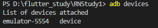

```bash
adb connect 10.10.40.8:5555 #通过局域网连接设备
```

```bash
adb disconnect 10.10.40.8:5555 #断开连接的设备
```

默认情况下adb是启用的

```bash
adb start-server # 启动服务
adb kill-server # 关闭服务
adb devices #查看当前连接设备
adb reverse tcp:8081 tcp:8081 #端口映射
adb shell #进入设备沙盒
```


可以通过这个往手机发文件

```bash
adb push 电脑文件路径 手机目的路径 #往手机传文件
```


```bash
adb pull 手机文件路径 电脑目的路径 #从手机拉取文件
```


### 2.移动端UI

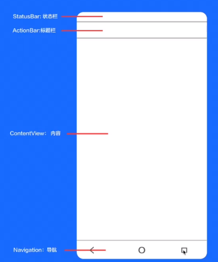


### 3.RN中原生文件

**开发中常用的原生文件**

1. 配置: manifest、gradle
2. 应用: Application、 String、 mipmap
3. 桥接: ReactPackage、ReactModule、ViewManager

#### 1.manifest


**路径：.android/app/src/main/AndroidManifest.xml**

**配置权限或者引入包的时候需要在该文件进行一些配置**

#### 2.gradle


**路径：.android/app/build.gradle**

**进行一些打包签名等需要修改该文件**


#### 3.Application


```
路径：.android/app/main/**/MainApplication.java
```

**Application很重要的一个类**

**进行原生桥接的时候需要修改这个文件**


#### 4.String


```xml
<resources>
    <string name="app_name">RNStudy1</string>
</resources>
```

**手机app安装后显示的名字**


#### 5.mipmap

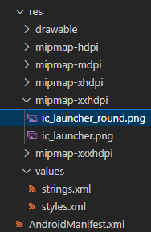

**mipmap-分辨率，这些文件夹下放置的是手机图标**


### 4.兼容

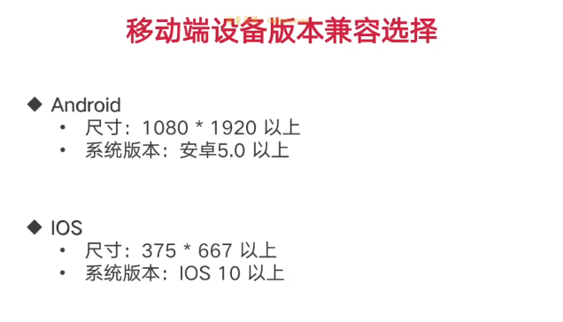

## 3.构建通用源码目录

- 职责清晰:每个目录划分都规定具体的职责
- 功能全面:包含ui、数据、网络、常量、工具、环境等
- 独立解偶: 一级目录之间没有职责交叉和耦合

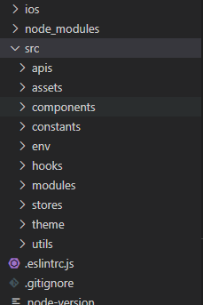


## 4.rn样式

[StyleSheet · React Native 中文网](https://www.reactnative.cn/docs/next/stylesheet)

react native中使用styleSheet api进行样式编写

**1.与css的区别**

- 没有继承性（Text组件除外）
- 样式名采用小驼峰命名
- 所有尺寸都是没有单位
- 有些特殊的样式名（例如：marginHorizontal）


**2.样式声明**

**通过style属性直接声明**

- **属性值为对象: <组件style={ {样式} }/>**
- **属性值为数组: <组件 style={ [ {样式1}, ... {样式N}]}/>**

**在style属性中调用StyleSheet声明的样式**

1. **引入: `import { StyleSheet, View } from 'react- native'`**
2. **声明: `const styles = StyleSheet.create({ foo:{样式1}, bar: {样式2} })`** 
3. **使用: `<View style={ [ styles.foo, styles.bar ] } >内容</View>`**


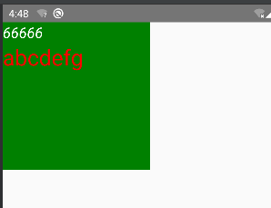

```tsx
// test.tsx
import React from "react";
import { StyleSheet, Text, View } from "react-native";

export function Test(
  props: React.PropsWithChildren
): JSX.Element {
  return (
    <View style={{ backgroundColor: "green", width: 200, height: 200 }}>
      <Text style={style.text} >66666</Text>
      {props.children}
    </View>
  );
}

const style=StyleSheet.create({
    text:{
        color:'white',
        fontSize:20,
        fontStyle:'italic'
    }
})

```

**简单尝试了一下styleSheet的写法和内嵌的写法**

```tsx
//app.tsx
import { StyleSheet, Text } from "react-native";
import { Test } from "./Test";
export default function App(): JSX.Element {
  return <Test>
    <Text style={styles.red}>abcdefg</Text>
  </Test>;
}

const styles = StyleSheet.create({
  red: {
    color: "red",
    fontSize:30
  },
});

```


### 注意

**如果是数组声明的样式化，会跟css一样会发生样式覆盖**


## 5.布局


**在react native中默认主轴方向是垂直方向**

```tsx
import React from "react";
import { StyleSheet, Text, View } from "react-native";

export function Test(props: React.PropsWithChildren): JSX.Element {
  return (
    <View
      style={{
        backgroundColor: "green",
        width: 200,
        height: 200,
        //设置主轴对齐方式
        justifyContent: "center",
      }}
    >
      <Text style={style.text}>66666</Text>
      {props.children}
    </View>
  );
}

const style = StyleSheet.create({
  text: {
    color: "white",
    fontSize: 20,
    fontStyle: "italic",
  },
});
```


### 响应式布局

[Dimensions · React Native 中文网](https://www.reactnative.cn/docs/next/dimensions)

[useWindowDimensions · React Native 中文网](https://www.reactnative.cn/docs/next/usewindowdimensions)

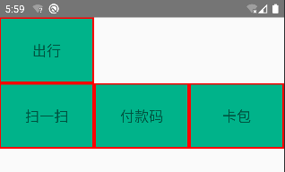

```tsx
import { Dimensions, StyleSheet, Text, View } from "react-native";


export function Reactive():JSX.Element {
  return <View style={styles.container}>
    <View style={styles.itemBase}>
      <Text style={styles.h3}>扫一扫</Text>
    </View>
    <View style={styles.itemBase}>
      <Text style={styles.h3}>付款码</Text>
    </View>
    <View style={styles.itemBase}>
      <Text style={styles.h3}>卡包</Text>
    </View>
    <View style={styles.itemBase}>
      <Text style={styles.h3}>出行</Text>
    </View>
  </View>
}

const width=Dimensions.get('window').width

const styles=StyleSheet.create({
  container:{
    flexDirection:'row',
    flexWrap:'wrap-reverse'
  },
  itemBase:{
    justifyContent:'center',
    backgroundColor:'#00b38a',
    width:width/3,
    /* margin:10,
    padding:10 */
    height:90,
    borderWidth:2,
    borderColor:'red',
    alignItems:'center'
  },
  h3:{
    fontSize:20
  }
})
```


## 6.核心组件

1. 原生组件：Android或ioS内的组件
2. 核心组件：RN中最常用的，来在react native的组件

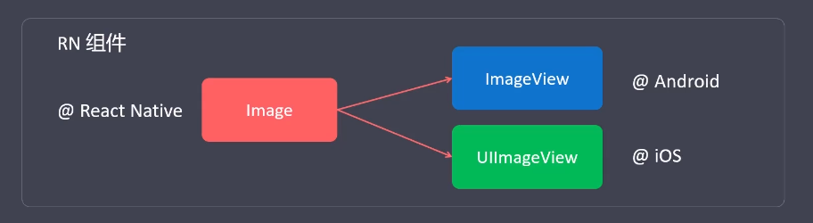


**最常用的核心组件**


### 1.alert和button

[Alert · React Native 中文网](https://www.reactnative.cn/docs/next/alert)

[Button · React Native 中文网](https://www.reactnative.cn/docs/next/button)

```tsx
import React from "react";
import { Alert, Button, StyleSheet } from "react-native";

export function Study2(): JSX.Element {
  const alertHandle = () =>
    Alert.alert("是否确认删除", "删除后将不可恢复，确定吗？",[
        {
            text:'确定',
            onPress:()=>{
                console.log(true)
            }
        },
        {
            text:'取消',
            onPress:()=>{
                console.log(false)
            }
        }
    ],{
        /* 设置为true点空白页面可已取消 */
        cancelable:true,
        onDismiss() {
            console.log('取消了')
        },
    });
  return (
    <>
      <Button title="点击弹出提示框"  color="#86ad43" onPress={alertHandle}></Button>
    </>
  );
}
```


#### 注意

**button组件不能设置style属性**

[TouchableOpacity · React Native 中文网](https://www.reactnative.cn/docs/next/touchableopacity)

**想自定义组件使用TouchableOpacity**

**console.log()使用%c占位符可以在浏览器控制台输出颜色**


**console.table(数组对象)可以打印表格信息**


**console.group() console.groupEnd()打印分组日志**


### 2.statusBar和switch

```tsx
import { useState } from "react";
import { StatusBar, Switch } from "react-native";

export function Study3(): JSX.Element {
  const [state, setState] = useState(false);
  const props: StatusBar["props"] = {
    hidden: state,
    animated: true,
    backgroundColor: "#65dddd",
    barStyle: "dark-content",
  };
  return (
    <>
      <StatusBar {...props}></StatusBar>
      <Switch
        value={state}
        onValueChange={(value) => setState(value)}
        onChange={(event) => console.log(event)}
        trackColor={{false:'red',true:'green'}}
        thumbColor="#cd22ea"
      ></Switch>
    </>
  );
}

```


### 3.activityIndicator

```tsx
import { ActivityIndicator,Platform } from "react-native";

export function Study4():JSX.Element{
    let props:ActivityIndicator['props']={
        color:'red',
        size:'large'
    }
    //获取当前环境系统
    console.log(Platform.OS)
    if(Platform.OS==='android'){
        props={
            color:'green',
            size:100
        }
    }
    return <>
        <ActivityIndicator {...props}></ActivityIndicator>
    </>
}
```


[Platform · React Native 中文网](https://www.reactnative.cn/docs/next/platform)

**Platform Api可以获取当前平台信息，从而做定制化处理**


### 4.计数器demo

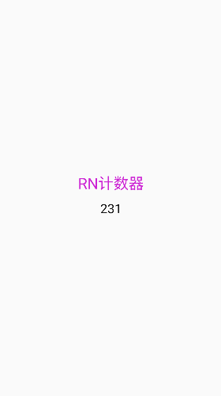

```tsx
import { useEffect, useState } from "react";
import { StyleSheet, Text, View } from "react-native";

export const InfoCard = (props: { name: string }): JSX.Element => {
    const [number,setNumber]=useState(0)

    useEffect(()=>{
        const timer=setInterval(()=>{
            setNumber(pre=>pre+1)
        },1000)
        return ()=>{
            clearInterval(timer)
        }
    },[])
  return (
    <View style={{ width: "100%",height:'100%', flexDirection: "column",justifyContent:'center',alignItems:'center' }}>
        <Text style={styles.title}>RN计数器</Text>
        <Text style={styles.count}>{number}</Text>
    </View>
  );
};

const styles=StyleSheet.create({
    title:{
        fontSize:24,
        color:'#cc23d4',
        marginBottom:10
    },
    count:{
        fontSize:20,
        color:'#111'
    }
})
```


### 5.Text组件

[Text · React Native 中文网](https://www.reactnative.cn/docs/next/text#onlongpress)

**Text组件可以嵌套**

#### 1.使用自定义字体

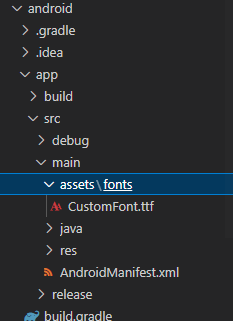

**把字体文件放入安卓工程下**

```tsx
import { useEffect, useState } from "react";
import { StyleSheet, Text, View } from "react-native";

export const InfoCard = (props: { name: string }): JSX.Element => {
    const [number,setNumber]=useState(0)

    useEffect(()=>{
        const timer=setInterval(()=>{
            setNumber(pre=>pre+1)
        },1000)
        return ()=>{
            clearInterval(timer)
        }
    },[])
  return (
    <View style={{ width: "100%",height:'100%', flexDirection: "column",justifyContent:'center',alignItems:'center' }}>
        <Text style={styles.title}>RN计数器</Text>
        <Text style={styles.count}>{number}</Text>
    </View>
  );
};

const styles=StyleSheet.create({
    title:{
        fontSize:24,
        color:'#cc23d4',
        marginBottom:10,
        /* 使用字体 */
        fontFamily:'CustomFont'
    },
    count:{
        fontSize:20,
        color:'#111'
    }
})
```

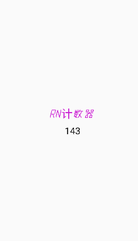


#### 2.单行文本省略

通过Text 组件的**numberOfLines**属性和**ellipsizeMode**来设置

```tsx
<Text style={styles.title} numberOfLines={2} ellipsizeMode="tail">
        RN计数器RN计数器RN计数器RN计数器RN计数器RN计数器RN计数器RN计数器RN计数器RN计数器RN计数器RN计数器
</Text>
```


#### 3.是否可选中


```tsx
<Text
        style={styles.title}
        selectable
        selectionColor="#00dd12"
        numberOfLines={2}
        ellipsizeMode="tail"
      >
        RN计数器RN计数器RN计数器RN计数器RN计数器RN计数器RN计数器RN计数器RN计数器RN计数器RN计数器RN计数器
      </Text>
```

通过**selectable**属性和**selectionColor**设置

**注意：设置可选中会影响文本省略效果**


#### 4.设置阴影

```tsx
import { useEffect, useState } from "react";
import { StyleSheet, Text, View } from "react-native";

export const InfoCard = (props: { name: string }): JSX.Element => {
  //...
  return (
    <View>
      <Text
        style={styles.title}
        selectable
        selectionColor="#00dd12"
        numberOfLines={2}
        ellipsizeMode="tail"
      >
        RN计数器RN计数器RN计数器RN计数器RN计数器RN计数器RN计数器RN计数器RN计数器RN计数器RN计数器RN计数器
      </Text>
    </View>
  );
};

const styles = StyleSheet.create({
  title: {
    fontSize: 24,
    color: "#cc23d4",
    marginBottom: 10,
    /* 使用字体 */
    fontFamily: "CustomFont",
    /* 设置阴影，三个都设置才生效 */
    textShadowColor:'#808080',
    textShadowOffset:{width:2,height:4},
    textShadowRadius:2
  },
    //...
});

```


### 6.Image组件

[Image · React Native 中文网](https://www.reactnative.cn/docs/next/image)

**1.导入图片时tsx会报错，通过声明文件可以解决问题。**

```typescript
//index.d.ts
/* 图片声明导入文件 */
declare module '*.jpg'
declare module '*.png'
declare module '*.svg'
declare module '*.jpeg'
declare module '*.gif'
```

**2.使用图片**

```tsx
import { Image, StyleSheet, View } from "react-native";
import img1 from "../assets/2030898.jpg";

export const ImageStudy = (): JSX.Element => {
  return (
    <View>
      <Image
        /* 远程图片 */
       /*  source={{ uri: "https://yexiyue.github.io/avatar-top.png" }} */
        /* 本地图片 */
        source={img1}
       style={styles.img}
      ></Image>
    </View>
  );
};

const styles = StyleSheet.create({
  img: {
    width: "100%",
    height: 300,
  },
});
```

**3.设置缩放比**

通过图片style属性**resizeMode**

```tsx
import { Image, StyleSheet, View } from "react-native";
import img1 from "../assets/2030898.jpg";
export const ImageStudy = (): JSX.Element => {
  return (
    <View>
      <Image
       /*  source={{ uri: "https://yexiyue.github.io/avatar-top.png" }} */
        source={img1}
       style={styles.img}
      ></Image>
    </View>
  );
};

const styles = StyleSheet.create({
  img: {
    width: "100%",
    height: 300,
    //设置图片缩放模式
    resizeMode:'contain'
  },
});

```


**4.镜像模糊**

```tsx
import { Image, StyleSheet, View } from "react-native";
import img1 from "../assets/2030898.jpg";
export const ImageStudy = (): JSX.Element => {
  return (
    <View>
      <Image
        /* source={{ uri: "https://yexiyue.github.io/avatar-top.png" }} */
        source={img1}
        style={styles.img}
        //镜像模糊
        blurRadius={20}
        //展位图
        defaultSource={img1}
        //渐入持续时间
        fadeDuration={3000}
        //加载成功
        onLoad={(ev)=>{
            console.log('加载成功')
        }}
        onError={(ev)=>{
            console.log('加载失败')
        }}
      ></Image>
    </View>
  );
};

const styles = StyleSheet.create({
  img: {
    width: "100%",
    height: 300,
    resizeMode: "contain",
  },
});

```


可以通过**defaultSource**指定占位图


**5.style属性，tintColor**

```tsx
const styles = StyleSheet.create({
  img: {
    width: "100%",
    height: 300,
    resizeMode: "contain",
    //着手，可用于图标改变颜色
    tintColor:'red'
  },
});

```

**可以改变图片颜色，把所有非透明通道改变颜色**


**6.图片与预加载**

```tsx
import { Image, StyleSheet, View } from "react-native";
import img1 from "../assets/2030898.jpg";
import { useEffect, useRef } from "react";
export const ImageStudy = (): JSX.Element => {
  const imgRef: React.LegacyRef<Image> = useRef(null);
  useEffect(() => {
    //获取图片宽高
    Image.getSize(
      "https://yexiyue.github.io/homeImage/13.jpg",
      (width, height) => {
        console.log(width, height);
      },
      (err) => {
        console.log(err);
      }
    );
    //图片预加载
    Image.prefetch("https://yexiyue.github.io/homeImage/13.jpg").then((res) => {
      console.log(res);
    });
  }, []);
 }

	//.....
}

```


### 7.ImageBackground

```tsx
import {
  Dimensions,
  Image,
  ImageBackground,
  StyleSheet,
  Text,
  View,
} from "react-native";
import img from "../assets/2050589.jpg";
export const ImageBackgroundStudy = (): JSX.Element => {
  return (
    <ImageBackground
      source={img}
      style={styles.root}
      imageStyle={styles.imgStyle}
    >
      <Image
        style={styles.avatar}
        source={{ uri: "https://yexiyue.github.io/homeImage/11.jpg" }}
      ></Image>
      <View style={styles.box}>
        <Text style={[styles.text1]}>曦月银行</Text>
        <Text style={[styles.text2]}>储蓄卡</Text>
        <Text style={[styles.text3]}>●●●●   ●●●●   ●●●●   6666</Text>
      </View>
    </ImageBackground>
  );
};
const width = Dimensions.get("window").width;
const styles = StyleSheet.create({
  root: {
    width: width - 20,
    height: 150,
    margin: 10,
    marginTop: 20,
    flexDirection: "row",
  },
  imgStyle: {
    resizeMode: "cover",
    borderRadius: 15,
  },
  text: {
    textAlign: "center",
    /* fontFamily:'CustomFont', */
    color: "#556acd",
    fontSize: 50,
    textAlignVertical: "center",
    height: "100%",
  },
  avatar: {
    width: 50,
    height: 50,
    borderRadius: 25,
    marginTop: 20,
    marginLeft: 20,
  },
  text1: {
    color: "white",
    fontSize: 24,
    fontWeight:'bold'
  },
  text2: {
    fontSize: 20,
    color: "#FFFFFFA0",
  },
  text3: {
    fontSize: 22,
    color: "white",
    marginTop:15
  },
  box: {
    marginTop: 22,
    marginLeft: 8,
  },
});

```


### 8.TextInput

[TextInput · React Native 中文网](https://www.reactnative.cn/docs/next/textinput)


**keyboardType**

决定弹出何种软键盘类型，譬如`numeric`（纯数字键盘）。

See screenshots of all the types [here](http://lefkowitz.me/2018/04/30/visual-guide-to-react-native-textinput-keyboardtype-options/).

这些值在所有平台都可用：

- `default`
- `number-pad`
- `decimal-pad`
- `numeric`
- `email-address`
- `phone-pad`


**returnKeyType**

决定“确定”按钮显示的内容。在 Android 上你还可以使用`returnKeyLabel`。

下列这些选项是跨平台可用的：

- `done`
- `go`
- `next`
- `search`
- `send`


```tsx
import { useEffect, useRef, useState } from "react";
import { StyleSheet, TextInput, View } from "react-native";

export const TextInputStudy = () => {
  const inputRef:React.LegacyRef<TextInput>=useRef(null)
  const [text,onChangeText]=useState('你好呀')
  useEffect(()=>{
    
    setTimeout(()=>{
      /* inputRef.current?.focus() */
      /* inputRef.current?.blur() */
    },2000)
  },[])

  return (
    <View style={styles.root}>
      <TextInput
        style={styles.textInput}
        placeholder="请输入内容"
        placeholderTextColor="#22dd11"
        //自动聚焦
        /* autoFocus={true} */
        ref={inputRef}
        blurOnSubmit={true}
        /* multiline */
        caretHidden
        keyboardType="default"
        returnKeyType="search"
        value={text}
        onChangeText={text=>onChangeText(text)}
        selectTextOnFocus
        selectionColor="#cc5d23"
        secureTextEntry
      ></TextInput>
    </View>
  );
};

const styles = StyleSheet.create({
  root: {
    flex: 1,
  },
  textInput: {
    backgroundColor: "#ccc110",
    color: "red",
  },
});

```

**注意：secureTextEntry不能和multiLine一起用，会导致secureTextEntry不生效果**


### 9.TouchableOpacity

```tsx
import { StyleSheet, Text, TouchableOpacity, View } from "react-native"

export const TouchableStudy=()=>{
    return (
        <View style={styles.root}>
            <TouchableOpacity 
            style={styles.box}
            // x~1之间的不透明度变化范围
            activeOpacity={0.6}
            onPress={()=>{
                console.log('onPress...')
            }}
            onLongPress={()=>{
                console.log('onLongPress...')
            }}
            onPressIn={()=>{
                console.log('onLongIn...')
            }}
            onPressOut={()=>{
                console.log('onLongOut...')
            }}
            //长按多长时间才会触发onLongPress
            delayLongPress={1000}
            >
                <Text style={styles.h3}>你好呀</Text>
            </TouchableOpacity>
        </View>
    )
}

const styles=StyleSheet.create({
    root:{
        justifyContent:'center',
        alignItems:'center',
        flex:1
    },
    box:{
        backgroundColor:'#ff23cd',
        width:150,
        height:100,
        borderRadius:25,
    },
    h3:{
        textAlign:'center',
        textAlignVertical:'center',
        height:'100%',
        color:'white',
        fontSize:24
    }
})
```

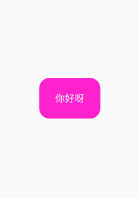


### 10.TouchableHighlight

[TouchableHighlight · React Native 中文网](https://www.reactnative.cn/docs/next/touchablehighlight)

1. **必须有且只能有一个子组件**
2. **响应的点击，长按，只有绑定了事件才起效**
3. **可通过underlayColor设置高亮颜色**

```tsx
import { StyleSheet, Text, TouchableHighlight, TouchableOpacity, View } from "react-native"

export const TouchableStudy=()=>{
    return (
        <View style={styles.root}>
            <TouchableHighlight
            style={styles.box}
            underlayColor="#00ffcd"
            activeOpacity={0.7}
            delayLongPress={2000}
            /* 只有绑定了点击事件才起效 */
            onPress={()=>{
                console.log('onPress...')
            }}
            onLongPress={()=>{
                console.log("onLongPress...")
            }}
            >
                <Text style={styles.h3}>你好呀</Text>
            </TouchableHighlight>
        </View>
    )
}

const styles=StyleSheet.create({
    root:{
        justifyContent:'center',
        alignItems:'center',
        flex:1
    },
    box:{
        backgroundColor:'#ff23cd',
        width:150,
        height:100,
        borderRadius:25,
    },
    h3:{
        textAlign:'center',
        textAlignVertical:'center',
        height:'100%',
        color:'#eee',
        fontSize:24
    }
})
```

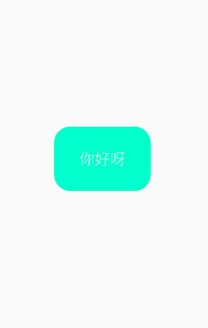


### 11.ScrollView

[ScrollView · React Native 中文网](https://www.reactnative.cn/docs/next/scrollview)

```tsx
import React, { useRef } from "react";
import {
  Button,
  ScrollView,
  StyleSheet,
  Text,
  TextInput,
  View,
  useWindowDimensions,
} from "react-native";

export const ScrollViewStudy = (): JSX.Element => {
  const { width, height } = useWindowDimensions();
  const ref:React.LegacyRef<ScrollView>=useRef(null)
  return (
    <>
      {<ScrollView
      ref={ref}
      style={styles.root}
      contentContainerStyle={styles.contentContainerStyle}
      //滑动收起键盘
      keyboardDismissMode="on-drag"
      //点击没有点击事件的区域收起键盘
      keyboardShouldPersistTaps="handled"
      onScroll={(ev)=>{
        console.log(ev.nativeEvent.contentOffset.y)
      }}
      //必须写，不然ios不能触发onScroll事件
      scrollEventThrottle={64}
      overScrollMode="always"
      //设置初始滚动距离
      contentOffset={{x:0,y:500}}
      //是否显示滚动条
      showsVerticalScrollIndicator={false}
      //吸顶的元素
      stickyHeaderIndices={[1]}
    >
        <TextInput></TextInput>
        <Button title="回到底部" onPress={()=>{
          ref.current?.scrollToEnd({animated:true})
        }}></Button>
      {new Array(100).fill(0).map((item, index) => (
        <Text key={index} style={styles.text}>
          {index}
        </Text>
      ))}
    </ScrollView>}
    </>
  );
};

const styles = StyleSheet.create({
  root: {
    flex: 1,
  },
  text: {
    fontSize: 24,
    height: 54,
    textAlignVertical: "center",
  },
  contentContainerStyle: {
    backgroundColor: "#00ff11",
    paddingHorizontal: 16,
    paddingTop: 20,
  },
});


```

**类轮播图**

```tsx
import {
  ScrollView,
  StyleSheet,
  Text,
  TextInput,
  View,
  useWindowDimensions,
} from "react-native";

export const ScrollViewStudy = (): JSX.Element => {
  const { width, height } = useWindowDimensions();
  return (
    <>
      <ScrollView
        style={{ width: "100%", height: 200 }}
        //设置水平滚动
        horizontal
        //设置分页
        pagingEnabled
      >
        <View
          style={{ width: width, height: 200, backgroundColor: "red" }}
        ></View>
        <View
          style={{ width: width, height: 200, backgroundColor: "blue" }}
        ></View>
        <View
          style={{ width: width, height: 200, backgroundColor: "green" }}
        ></View>
      </ScrollView>
    </>
  );
};
```


### 12.FlatList

[FlatList · React Native 中文网](https://www.reactnative.cn/docs/next/flatlist)

[FlatList · React Native api](https://www.reactnative.cn/docs/next/flatlist#scrolltoend)

高性能的简单列表组件，支持下面这些常用的功能：

- 完全跨平台。
- 支持水平布局模式。
- 行组件显示或隐藏时可配置回调事件。
- 支持单独的头部组件。
- 支持单独的尾部组件。
- 支持自定义行间分隔线。
- 支持下拉刷新。
- 支持上拉加载。
- 支持跳转到指定行（ScrollToIndex）。
- 支持多列布局。

```tsx
import { useEffect } from "react";
import { useRef } from "react";
import { FlatList, StyleSheet, Text, View } from "react-native";

export const FlatListStudy = (): JSX.Element => {
  const data = Array.from(Array(100).fill(0), (v, i) => {
    return { name: `name-${i}`, age: i + 1 };
  });

  const ListHeader = (
    <View>
      <Text style={styles.text}>我是header</Text>
    </View>
  );
  const ListFooter = (
    <View>
      <Text>我是footer</Text>
    </View>
  );

  const ref:React.LegacyRef<FlatList>=useRef(null)

  useEffect(()=>{
    setTimeout(()=>{
        ref.current?.scrollToIndex({
            index:20,
            animated:true,
            viewPosition:1//0~1,表示滚动到屏幕的距离顶部的百分比
        })
    },2000)
  },[])
  return (
    <FlatList
      data={data}
      ref={ref}
      style={styles.flatList}
      renderItem={({ item }) => {
        return (
          <Text style={styles.text}>
            {item.name}-{item.age}
          </Text>
        );
      }}
      //生成key的函数
      keyExtractor={(item, index) => `${item.name}-${index}`}
      contentContainerStyle={styles.content}
      //显示垂直滚动条
      showsVerticalScrollIndicator={false}
      onScroll={(ev) => {
        console.log(ev.nativeEvent.contentOffset.y);
      }}
      keyboardDismissMode="on-drag"
      keyboardShouldPersistTaps="handled"
      ListHeaderComponent={ListHeader}
      ListFooterComponent={ListFooter}
      ListHeaderComponentStyle={styles.header}
      ListFooterComponentStyle={styles.footer}
      ItemSeparatorComponent={() => <View style={styles.separator}></View>}
    //   initialNumToRender={15}
    //反向渲染
    // inverted={true}
    numColumns={1}
    onViewableItemsChanged={(info)=>{
        console.log(info.changed)
    }}
    ></FlatList>
  );
};

const styles = StyleSheet.create({
  flatList: {
    backgroundColor: "#eee",
  },
  text: {
    fontSize: 24,
    lineHeight: 50,
    width:'50%',
    borderWidth:1,
  },
  content: {
    paddingHorizontal: 25,
    paddingTop: 30,
  },
  header: {
    backgroundColor: "green",
    height: 100,
  },
  footer: {
    backgroundColor: "yellow",
    height: 100,
  },
  separator: {
    height: 1,
    backgroundColor: "#d0d0d0",
    width: "100%",
  },
});

```

### 13.SectionList

[SectionList · React Native 中文网](https://www.reactnative.cn/docs/next/sectionlist)

```tsx
import { SectionBase, SectionList, SectionListData, StyleSheet, Text } from "react-native";

export const SectionListStudy = (): JSX.Element => {

    const data:SectionListData<string,{type:'A'|'B'|'C'|'D'|'E',data:string[]}>[]=[
        {
            type:'A',
            data:['张三','李四','王五','1','2','3']
        },
        {
            type:'B',
            data:['孙悟空','猪八戒','唐僧','1','2','3']
        },
        {
            type:'C',
            data:['二郎神','哪吒','王老板','1','2','3']
        },
        {
            type:'D',
            data:['二郎神','哪吒','王老板','1','2','3']
        },
        {
            type:'E',
            data:['二郎神','哪吒','王老板','1','2','3']
        }
    ]

  return (
    <>
      <SectionList 
      sections={data}
      style={styles.sectionStyle}
      renderItem={({item,index,section})=><Text style={styles.text}>{item}{section.type}</Text>}
      keyExtractor={(item,index)=>`${item}-${index}`}
      renderSectionHeader={({section})=><Text style={styles.header}>{section.type}</Text>}
      /* 分组头部吸顶 */
      stickySectionHeadersEnabled
      >

      </SectionList>
    </>
  );
};

const styles = StyleSheet.create({
  sectionStyle: {
    width: "100%",
    height: "100%",
    marginTop:40
  },
  text:{
    fontSize:24,
    lineHeight:50,
    color:'red'
  },
  header:{
    color:'green',
    fontSize:26,
    backgroundColor:'#ccc'
  }
});

```

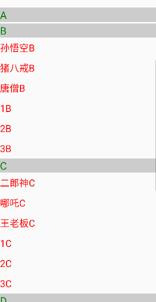


### 14.RefreshControl

[RefreshControl · React Native 中文网](https://www.reactnative.cn/docs/next/refreshcontrol)

**控制列表组件的，下拉刷新**

```tsx
//....
export const SectionListStudy = (): JSX.Element => {
  //......
  const [refresh, setRefresh] = useState(false);
  return (
    <>
      <SectionList
        sections={data}
        style={styles.sectionStyle}
        renderItem={({ item, index, section }) => (
          <Text style={styles.text}>
            {item}
            {section.type}
          </Text>
        )}
        keyExtractor={(item, index) => `${item}-${index}`}
        renderSectionHeader={({ section }) => (
          <Text style={styles.header}>{section.type}</Text>
        )}
        /* 分组头部吸顶 */
        stickySectionHeadersEnabled
        //下拉刷新
        refreshControl={
          <RefreshControl
            refreshing={refresh}
            onRefresh={() => {
              setRefresh(true);
              console.log("refresh...");
              setTimeout(() => {
                setRefresh(false);
              }, 2000);
            }}
          ></RefreshControl>
        }
        //控制触底事件的阈值
        onEndReachedThreshold={0.3}
        //触底事件
        onEndReached={({distanceFromEnd})=>{
            console.log('onEndReached')
        }}
      ></SectionList>
    </>
  );
};
//....
```


### 15.Modal

[Modal · React Native 中文网](https://www.reactnative.cn/docs/next/modal)

```tsx
import { useState } from "react";
import { Button, Modal, Text, TouchableOpacity, View } from "react-native";

export const ModalStudy = (): JSX.Element => {
  const [visible, setVisible] = useState(false);
  return (
    <>
      <View style={{ flex: 1, alignItems: "center", justifyContent: "center" }}>
        <Text style={{ fontSize: 24 }}>你好呀</Text>
        <TouchableOpacity
          style={{ backgroundColor: "#ff12dd" }}
          onPress={() => {
            setVisible(true);
          }}
        >
          <Text style={{ color: "white" }}>点我弹窗</Text>
        </TouchableOpacity>
      </View>
      <Modal
        visible={visible}
        transparent
        animationType="slide"
        onRequestClose={() => setVisible(false)}
        statusBarTranslucent={false}
        onShow={()=>{
            console.log('onShow...')
        }}
        onDismiss={()=>{
            console.log('onDismiss...')
        }}
      >
        <View style={{ backgroundColor: "#0000002f", flex: 1 }}>
          <Text style={{ fontSize: 24, fontFamily: "CustomFont" }}>
            react native study
          </Text>
          <TouchableOpacity onPress={() => setVisible(false)}>
            <Text>关闭弹窗</Text>
          </TouchableOpacity>
        </View>
      </Modal>
    </>
  );
};

```


## 7.核心api

### 1.Platform

[Platform · React Native 中文网](https://www.reactnative.cn/docs/next/platform#select)

```tsx
import { Platform, StyleSheet } from 'react-native';

const styles = StyleSheet.create({
  container: {
    flex: 1,
    ...Platform.select({
      android: {
        backgroundColor: 'green'
      },
      ios: {
        backgroundColor: 'red'
      },
      default: {
        // other platforms, web for example
        backgroundColor: 'blue'
      }
    })
  }
});
```

### 2.Linking

[Linking · React Native 中文网](https://www.reactnative.cn/docs/next/linking)

**打开链接: openURL()、canOpenURL()**

- 网页链接
- 地图定位
- 拨打电话
- 发送短信
- 发送邮件
- 应用跳转

```tsx
import { Linking, StyleSheet, Text, TouchableOpacity, View } from "react-native";

export const LinkingStudy = () => {
  const linkHandle = async() => {
    //1.打开网页链接
    if(await Linking.canOpenURL('https://www.bilibili.com/')){
        Linking.openURL('https://www.bilibili.com/')
    }

    //2.经纬度
    /* Linking.openURL('geo:37.211, 12.22') */

    //3.拨打电话
    /* Linking.openURL('tel:18980866898') */

    //4.发送短信
    /* Linking.openURL('smsto:10086') */

    //5.发送邮件
    /* Linking.openURL('mailto:yexiyue666@qq.com') */

    //6.跳转应用
    /* Linking.openURL('schema://host') */

    //7.跳转到设置
    /* Linking.openSettings() */
  };

  return (
    <View style={styles.root}>
      <TouchableOpacity
        style={styles.button}
        activeOpacity={0.5}
        onPress={linkHandle}
      >
        <Text style={styles.text}>跳转</Text>
      </TouchableOpacity>
    </View>
  );
};

const styles = StyleSheet.create({
  root: {
    ...StyleSheet.absoluteFillObject,
    backgroundColor: "#f0f0f050",
    alignItems: "center",
  },
  button: {
    backgroundColor: "#00ffff",
    width: 100,
    height: 50,
    borderRadius: 25,
    justifyContent: "center",
    alignItems: "center",
    marginTop: 20,
  },
  text: {
    color: "white",
    fontSize: 20,
  },
});
```

**跳转应用涉及到原生工程。主要的逻辑就是通过目标应用暴露的shema和host进行应用跳转。还可以携带urlSearch参数**


### 3.PixelRatio

[PixelRatio · React Native 中文网](https://www.reactnative.cn/docs/next/pixelratio#get)

**布局时用了小数可以用PixelRatio.roundToNearestPixel()进行处理**

```tsx
import { Dimensions, Linking, PixelRatio, StyleSheet, Text, TouchableOpacity, View } from "react-native";

export const PixelRatioStudy = () => {
  const linkHandle = async() => {
    //逻辑像素/物理像素
    console.log(PixelRatio.get())//2.75
    console.log(Dimensions.get('screen').scale)//2.75

    //安卓支持，获取字体像素比
    console.log(PixelRatio.getFontScale())//1

    //获取逻辑像素对应的物理像素
    console.log(PixelRatio.getPixelSizeForLayoutSize(200))//550
    //特殊场景下的救命稻草，比如分割线消失，突然空了一行等
    console.log(PixelRatio.roundToNearestPixel(32.1))
  };

  return (
    <View style={styles.root}>
      <TouchableOpacity
        style={styles.button}
        activeOpacity={0.5}
        onPress={linkHandle}
      >
        <Text style={styles.text}>点击</Text>
      </TouchableOpacity>
    </View>
  );
};

const styles = StyleSheet.create({
  root: {
    ...StyleSheet.absoluteFillObject,
    backgroundColor: "#f0f0f050",
    alignItems: "center",
  },
  button: {
    backgroundColor: "#00ffff",
    width: 100,
    height: 50,
    borderRadius: 25,
    justifyContent: "center",
    alignItems: "center",
    marginTop: 20,
  },
  text: {
    color: "white",
    fontSize: 20,
  },
});

```


### 4.BackHandler

[BackHandler · React Native 中文网](https://www.reactnative.cn/docs/next/backhandler)

此 API 仅能在 Android 上使用

返回键适配

```tsx
import { useEffect } from "react";
import {
  BackHandler,
  Dimensions,
  Linking,
  PixelRatio,
  StyleSheet,
  Text,
  TouchableOpacity,
  View,
} from "react-native";

export const PixelRatioStudy = () => {
  const linkHandle = async () => {
    //直接退出app
    BackHandler.exitApp()
  };

  useEffect(() => {
    //在rn中有注册一定要有注销
    BackHandler.addEventListener("hardwareBackPress", backHandler);

    return () => {
      BackHandler.removeEventListener("hardwareBackPress", backHandler);
    };
  }, []);

  //可以进行返回键拦截
  const backHandler = () => {
    console.log("退出");
    //返回true进行拦截处理
    return true;
  };
  return (
    <View style={styles.root}>
      <TouchableOpacity
        style={styles.button}
        activeOpacity={0.5}
        onPress={linkHandle}
      >
        <Text style={styles.text}>点击</Text>
      </TouchableOpacity>
    </View>
  );
};

const styles = StyleSheet.create({
  root: {
    ...StyleSheet.absoluteFillObject,
    backgroundColor: "#f0f0f050",
    alignItems: "center",
  },
  button: {
    backgroundColor: "#00ffff",
    width: 100,
    height: 50,
    borderRadius: 25,
    justifyContent: "center",
    alignItems: "center",
    marginTop: 20,
  },
  text: {
    color: "white",
    fontSize: 20,
  },
});

```


#### 社区hooks

**@react-native-community/hooks**

[react-native-community/hooks](https://github.com/react-native-community/hooks)

```tsx
import { useEffect } from "react";
import {
  BackHandler,
  Dimensions,
  Linking,
  PixelRatio,
  StyleSheet,
  Text,
  TouchableOpacity,
  View,
} from "react-native";
import { useBackHandler } from "@react-native-community/hooks";

export const PixelRatioStudy = () => {
  const linkHandle = async () => {
    //直接退出app
    BackHandler.exitApp()
  };
  //使用hook简便了许多
  useBackHandler(()=>{
    console.log('back handler interceptor')
    return true
  })
  return (
    <View style={styles.root}>
      <TouchableOpacity
        style={styles.button}
        activeOpacity={0.5}
        onPress={linkHandle}
      >
        <Text style={styles.text}>点击</Text>
      </TouchableOpacity>
    </View>
  );
};

const styles = StyleSheet.create({
  root: {
    ...StyleSheet.absoluteFillObject,
    backgroundColor: "#f0f0f050",
    alignItems: "center",
  },
  button: {
    backgroundColor: "#00ffff",
    width: 100,
    height: 50,
    borderRadius: 25,
    justifyContent: "center",
    alignItems: "center",
    marginTop: 20,
  },
  text: {
    color: "white",
    fontSize: 20,
  },
});

```


### 解决不支持pnpm软链接方式

#### 1.安装依赖

```bash
pnpm add @rnx-kit/metro-config @rnx-kit/metro-resolver-symlinks -D
```

#### 2.修改metro.config.js文件

```js
/**
 * Metro configuration for React Native
 * https://github.com/facebook/react-native
 *
 * @format
 */
const {makeMetroConfig}=require('@rnx-kit/metro-config')
const MetroSymlinksResolve=require('@rnx-kit/metro-resolver-symlinks')
module.exports = makeMetroConfig({
  transformer: {
    getTransformOptions: async () => ({
      transform: {
        experimentalImportSupport: false,
        inlineRequires: true,
      },
    }),
  },
  resolver:{
    resolveRequest:MetroSymlinksResolve()
  }
})

```


### 5.PermissionsAndroid

[PermissionsAndroid · React Native 中文网](https://www.reactnative.cn/docs/next/permissionsandroid)

**在申请权限的时候，需要先在AndroidManifest.xml配置要获取的权限信息**

**不要使用vscode进行编辑，代码提示很不友好**

```xml
<manifest xmlns:android="http://schemas.android.com/apk/res/android">
	
    <!-- 配置权限信息 -->
    <uses-permission android:name="android.permission.INTERNET" />
    <uses-permission android:name="android.permission.WRITE_EXTERNAL_STORAGE" />
    <uses-permission android:name="android.permission.CAMERA" />
    <application
      android:name=".MainApplication"
      android:label="@string/app_name"
      android:icon="@mipmap/ic_launcher"
      android:roundIcon="@mipmap/ic_launcher_round"
      android:allowBackup="false"
      android:theme="@style/AppTheme">
      <activity
        android:name=".MainActivity"
        android:label="@string/app_name"
        android:configChanges="keyboard|keyboardHidden|orientation|screenLayout|screenSize|smallestScreenSize|uiMode"
        android:launchMode="singleTask"
        android:windowSoftInputMode="adjustResize"
        android:exported="true">
        <intent-filter>
            <action android:name="android.intent.action.MAIN" />
            <category android:name="android.intent.category.LAUNCHER" />
        </intent-filter>
      </activity>
    </application>
</manifest>

```

#### 注意：一定要在AndroidManifest.xml中声明权限

```tsx
//.....

export const PixelRatioStudy = () => {

  const getPermission=async ()=>{
    //如果没有权限进行申请
    if(!await PermissionsAndroid.check("android.permission.WRITE_EXTERNAL_STORAGE")){
      const res=await PermissionsAndroid.request("android.permission.WRITE_EXTERNAL_STORAGE")
      if(res==='granted'){
        console.log('获取权限成功')
      }
    }
    console.log(await PermissionsAndroid.check('android.permission.WRITE_EXTERNAL_STORAGE'))
  }

  return (
    <View style={styles.root}>
      <TouchableOpacity
        style={styles.button}
        activeOpacity={0.5}
        onPress={getPermission}
      >
        <Text style={styles.text}>点击</Text>
      </TouchableOpacity>
    </View>
  );
};

const styles = StyleSheet.create({
  root: {
    ...StyleSheet.absoluteFillObject,
    backgroundColor: "#f0f0f050",
    alignItems: "center",
  },
  button: {
    backgroundColor: "#00ffff",
    width: 100,
    height: 50,
    borderRadius: 25,
    justifyContent: "center",
    alignItems: "center",
    marginTop: 20,
  },
  text: {
    color: "white",
    fontSize: 20,
  },
});

```


### 6.Vibration

[Vibration · React Native 中文网](https://www.reactnative.cn/docs/next/vibration)

震动交互api

使用需要先申明静态权限VIBRATE

```tsx
//...
export const PixelRatioStudy = () => {

  const clickHandle=()=>{
    //android中支持传入时间，ios中单次只有400ms
    /* Vibration.vibrate(5000) */
    //时间模式两两成对，第一次是等待，第二次是震动
    Vibration.vibrate([100,500,200,500],true)//安卓
    //指定的是停顿的时间，每次震动固定400ms
    Vibration.vibrate([100,200,300,400])//ios
    setTimeout(()=>{
      //取消震动
      Vibration.cancel()
    },5000)
  }
  return (
    <View style={styles.root}>
      <TouchableOpacity
        style={styles.button}
        activeOpacity={0.5}
        onPress={clickHandle}
      >
        <Text style={styles.text}>点击</Text>
      </TouchableOpacity>
    </View>
  );
};

```


### 7.keyboard

[Keyboard · React Native 中文网](https://www.reactnative.cn/docs/next/keyboard)

```tsx
//...

export const PixelRatioStudy = () => {

  const clickHandle=()=>{
    //api调用让键盘消失
    Keyboard.dismiss()
  }

  useEffect(()=>{
    const showSubscription=Keyboard.addListener('keyboardDidShow',()=>{
      console.log('键盘显示了');
    })
    const hideSubscription=Keyboard.addListener('keyboardDidHide',()=>{
      console.log('隐藏了')
    })
    return ()=>{
      showSubscription.remove()
      hideSubscription.remove()
    }
  },[])
  return (
    <View style={styles.root}>
      <TouchableOpacity
        style={styles.button}
        activeOpacity={0.5}
        onPress={clickHandle}
      >
        <Text style={styles.text}>点击</Text>
      </TouchableOpacity>
      <TextInput placeholder="请输入手机号" 
        keyboardType="number-pad"
        maxLength={11}
        returnKeyType="send"
        blurOnSubmit
        selectTextOnFocus
      ></TextInput>
    </View>
  );
};

```


## 8.动画

[Animated · React Native 中文网](https://www.reactnative.cn/docs/animated)

[Animated.Value · React Native 中文网](https://www.reactnative.cn/docs/animatedvalue)

**官方直接支持动画的组件**

- `Animated.Image`
- `Animated.ScrollView`
- `Animated.Text`
- `Animated.View`
- `Animated.FlatList`
- `Animated.SectionList`

### 1.初识动画

1. 先替换组件
2. 替换值(用useRef包裹起来，防止更新后对象不是原来的了)
3. 用timing创建动画对象
4. 开启动画

```tsx
import { useRef } from "react";
import {
  View,
  SafeAreaView,
  StyleSheet,
  TouchableHighlight,
  Text,
  StatusBar,
  Animated,
  Easing,
} from "react-native";

export const AnimateStudent1 = (): JSX.Element => {

  //2.创建值
  const xValue=useRef(new Animated.Value(0)).current

  const clickHandle = () => {
    //3.创建动画对象
    Animated.timing(xValue,{
      toValue:300,
      duration:2000,
      useNativeDriver:false,
      easing:Easing.linear
    }).start()//4.开启动画
  };

  return (
    <SafeAreaView style={styles.root}>
      <StatusBar hidden></StatusBar>
      <TouchableHighlight
        style={styles.button}
        activeOpacity={0.8}
        onPress={clickHandle}
        underlayColor="#68fd13"
      >
        <Text style={styles.text}>点我执行动画</Text>
      </TouchableHighlight>
      {/* 1.替换view组件 */}
      <Animated.View style={[styles.view,{
        transform:[{
          translateX:xValue
        }]
      }]}></Animated.View>
    </SafeAreaView>
  );
};

const styles = StyleSheet.create({
  root: {
    flex: 1,
    backgroundColor: "#00562350",
    paddingTop: 50,
  },
  button: {
    backgroundColor: "#05f",
    width: 200,
    height: 60,
    borderRadius: 30,
    alignItems: "center",
    justifyContent: "center",
  },
  text: {
    color: "white",
    fontSize: 24,
  },
  view:{
    width:20,
    height:20,
    backgroundColor:'#3050ff',
    margin:20,
  }
});

```

### 2.roatate

```tsx
import { useRef } from "react";
import {
  View,
  SafeAreaView,
  StyleSheet,
  TouchableHighlight,
  Text,
  StatusBar,
  Animated,
  Easing,
} from "react-native";

export const AnimateStudy2 = (): JSX.Element => {

  //2.创建值
  const rotate=useRef(new Animated.Value(0)).current

  //得进行转换，不能直接用模板字符串在样式表中，会报错
  const rotateValue=rotate.interpolate({
    inputRange:[0,90],
    outputRange:['0deg','90deg']
  })
  const clickHandle = () => {
    Animated.timing(rotate,{
        toValue:90,
        duration:1000,
        useNativeDriver:false
    }).start()
    
  };

  return (
    <SafeAreaView style={styles.root}>
      <StatusBar hidden></StatusBar>
      <TouchableHighlight
        style={styles.button}
        activeOpacity={0.8}
        onPress={clickHandle}
        underlayColor="#68fd13"
      >
        <Text style={styles.text}>点我执行动画</Text>
      </TouchableHighlight>
      {/* 1.替换view组件 */}
      <Animated.View style={[
        styles.view,
        {
            transform:[{
                rotate:rotateValue
            }]
        }
      ]}></Animated.View>
    </SafeAreaView>
  );
};

const styles = StyleSheet.create({
  root: {
    flex: 1,
    backgroundColor: "#00562350",
    paddingTop: 50,
  },
  button: {
    backgroundColor: "#05f",
    width: 200,
    height: 60,
    borderRadius: 30,
    alignItems: "center",
    justifyContent: "center",
  },
  text: {
    color: "white",
    fontSize: 24,
  },
  view:{
    width:200,
    height:200,
    backgroundColor:'#3050ff',
    margin:20,
  }
});

```


### 3.时间动画函数

#### Easing

`Easing`模块实现了常见的动画缓动函数。

#### 预置动画

`Easing`模块通过以下几个方法提供了几种预置的动画：

- [`back`](https://www.reactnative.cn/docs/easing#back) 回拉一段幅度
- [`bounce`](https://www.reactnative.cn/docs/easing#bounce)  弹跳（与elastic的区别是不会超过最终目的地）
- [`ease`](https://www.reactnative.cn/docs/easing#ease)  平缓
- [`elastic`](https://www.reactnative.cn/docs/easing#elastic) 弹性

#### 标准函数

目前提供了三种标准缓动函数：

- [`linear`](https://www.reactnative.cn/docs/easing#linear)
- [`quad`](https://www.reactnative.cn/docs/easing#quad)
- [`cubic`](https://www.reactnative.cn/docs/easing#cubic)

#### 补充函数

- [`bezier`](https://www.reactnative.cn/docs/easing#bezier) provides a cubic bezier curve
- [`circle`](https://www.reactnative.cn/docs/easing#circle) provides a circular function
- [`sin`](https://www.reactnative.cn/docs/easing#sin) provides a sinusoidal function
- [`exp`](https://www.reactnative.cn/docs/easing#exp) provides an exponential function

#### 组合函数

- [`in`](https://www.reactnative.cn/docs/easing#in) runs an easing function forwards
- [`inOut`](https://www.reactnative.cn/docs/easing#inout) makes any easing function symmetrical
- [`out`](https://www.reactnative.cn/docs/easing#out) runs an easing function backwards


[缓动函数速查表 (easings.net)](https://easings.net/zh-cn#)

**查看组合效果的网站**


### 4.ValueXY

```tsx
import { useRef } from "react";
import {
  View,
  SafeAreaView,
  StyleSheet,
  TouchableHighlight,
  Text,
  StatusBar,
  Animated,
  Easing,
} from "react-native";

export const AnimateStudy3 = (): JSX.Element => {
  //1.使用ValueXY创建二维变量
  const vector = useRef(new Animated.ValueXY({ x: 0, y: 0 })).current;

  const clickHandle = () => {
    //2.创建动画对象
    Animated.timing(vector, {
        //改变时候也要传对象
      toValue: {
        x: 200,
        y: 300,
      },
      duration: 2000,
      useNativeDriver: false,
      easing: Easing.out(Easing.circle),
    }).start();
  };

  return (
    <SafeAreaView style={styles.root}>
      <StatusBar hidden></StatusBar>
      <TouchableHighlight
        style={styles.button}
        activeOpacity={0.8}
        onPress={clickHandle}
        underlayColor="#68fd13"
      >
        <Text style={styles.text}>点我执行动画</Text>
      </TouchableHighlight>
      {/* 3.使用值 */}
      <Animated.View
        style={[
          styles.view,
          {
            transform: [
              {
                translateX: vector.x,
              },
              {
                translateY: vector.y,
              },
            ],
          },
        ]}
      ></Animated.View>
    </SafeAreaView>
  );
};

const styles = StyleSheet.create({
  root: {
    flex: 1,
    backgroundColor: "#00562350",
    paddingTop: 50,
  },
  button: {
    backgroundColor: "#05f",
    width: 200,
    height: 60,
    borderRadius: 30,
    alignItems: "center",
    justifyContent: "center",
  },
  text: {
    color: "white",
    fontSize: 24,
  },
  view: {
    width: 20,
    height: 20,
    backgroundColor: "#3050ff",
    margin: 20,
  },
});

```


### 5.组合动画

动画还可以使用组合函数以复杂的方式进行组合：

- [`Animated.delay()`](https://www.reactnative.cn/docs/animated#delay)在给定延迟后开始动画。
- [`Animated.parallel()`](https://www.reactnative.cn/docs/animated#parallel)同时启动多个动画。
- [`Animated.sequence()`](https://www.reactnative.cn/docs/animated#sequence)按顺序启动动画，等待每一个动画完成后再开始下一个动画。
- [`Animated.stagger()`](https://www.reactnative.cn/docs/animated#stagger)按照给定的延时间隔，顺序并行的启动动画。

动画也可以通过将`toValue`设置为另一个动画的`Animated.Value`来简单的链接在一起。请参阅动画指南中的[跟踪动态值](https://www.reactnative.cn/docs/animations#跟踪动态值)值。

默认情况下，如果一个动画停止或中断，则组合中的所有其他动画也会停止。

```tsx
import { useRef } from "react";
import {
  View,
  SafeAreaView,
  StyleSheet,
  TouchableHighlight,
  Text,
  StatusBar,
  Animated,
  Easing,
} from "react-native";

export const AnimateStudy3 = (): JSX.Element => {
  //1.使用ValueXY创建二维变量
  const vectorX = useRef(new Animated.Value(0)).current;
  const vectorY = useRef(new Animated.Value(0)).current;
  const scale = useRef(new Animated.Value(1)).current;
  const clickHandle = () => {
    //2.创建动画对象
    const toRight=Animated.timing(vectorX, {
      //改变时候也要传对象
      toValue: 200,
      duration: 2000,
      useNativeDriver: false,
      easing: Easing.out(Easing.circle),
    });
    const toBottom=Animated.timing(vectorY, {
      toValue: 300,
      duration: 2000,
      useNativeDriver: false,
      easing: Easing.out(Easing.circle),
    });
    const toBigger=Animated.timing(scale, {
      useNativeDriver: false,
      toValue: 3,
      duration: 1000,
    });

    //顺序触发
    Animated.sequence([
        toRight,
        Animated.delay(500),
        toBottom,
        Animated.delay(500),
        toBigger,
    ]).start()
    /* Animated.stagger(3000,[
        toRight,
        toBottom,
        toBigger,
    ]).start() */
  };

  return (
    <SafeAreaView style={styles.root}>
      <StatusBar hidden></StatusBar>
      <TouchableHighlight
        style={styles.button}
        activeOpacity={0.8}
        onPress={clickHandle}
        underlayColor="#68fd13"
      >
        <Text style={styles.text}>点我执行动画</Text>
      </TouchableHighlight>
      {/* 3.使用值 */}
      <Animated.View
        style={[
          styles.view,
          {
            transform: [
              
              {
                translateX: vectorX,
              },
              {
                translateY: vectorY,
              },
              {
                scale: scale,
              },
            ],
          },
        ]}
      ></Animated.View>
    </SafeAreaView>
  );
};

const styles = StyleSheet.create({
  root: {
    flex: 1,
    backgroundColor: "#00562350",
    paddingTop: 50,
  },
  button: {
    backgroundColor: "#05f",
    width: 200,
    height: 60,
    borderRadius: 30,
    alignItems: "center",
    justifyContent: "center",
  },
  text: {
    color: "white",
    fontSize: 24,
  },
  view: {
    width: 20,
    height: 20,
    backgroundColor: "#3050ff",
    margin: 20,
  },
});

```


### 6.跟随动画零延迟思路

**主动滚动的那一边改造成Animated组件，通过Animate.event与一个动画值即Animate.Value创建的值进行绑定，然后通过Animate对值进行处理的方法进行处理，然后给到被动滚动的一方**


**注意要开启原生渲染**

#### 处理手势和其他事件

手势，如平移或滚动，以及其他事件可以使用`Animated.event()`直接映射到动画值。这是通过结构化映射语法完成的，以便可以从复杂的事件对象中提取值。第一层参数是一个数组，你可以在其中指定多个参数映射，这种映射可以是嵌套的对象。

- [`Animated.event()`](https://www.reactnative.cn/docs/animated#event)

例如，在使用水平滚动手势时，为了将`event.nativeEvent.contentOffset.x`映射到`scrollX`（`Animated.Value`），您需要执行以下操作：

```jsx
 onScroll={Animated.event(
   // scrollX = e.nativeEvent.contentOffset.x
   [{ nativeEvent: {
        contentOffset: {
          x: scrollX
        }
      }
    }]
 )}
```

#### event()

```jsx
static event(argMapping, config?)
```

接受一个映射的数组，对应的解开每个值，然后调用所有对应的输出的`setValue`方法。例如：

```jsx
 onScroll={Animated.event(
   [{nativeEvent: {contentOffset: {x: this._scrollX}}}],
   {listener: (event) => console.log(event)}, // 可选的异步监听函数
 )}
 ...
 onPanResponderMove: Animated.event([
   null,                // 忽略原始事件
   {dx: this._panX}],    // 手势状态参数
{listener: (event, gestureState) => console.log(event, gestureState)}, // 可选的异步监听函数
 ),
```


### 7.布局动画

[LayoutAnimation · React Native 中文网](https://www.reactnative.cn/docs/layoutanimation)

#### 1.在入口文件开启布局动画

```js
/**
 * @format
 */

import {AppRegistry, Platform, UIManager} from 'react-native';
import App from './App';
import {name as appName} from './app.json';

//在入口文件下开启布局动画
if(Platform.OS==='android'){
    if(UIManager.setLayoutAnimationEnabledExperimental){
        console.log('enable ...')
        UIManager.setLayoutAnimationEnabledExperimental(true)
    }
}

AppRegistry.registerComponent(appName, () => App);
```

#### 2.使用

```tsx
//...
export const AnimateStudy2 = () => {
  const [expanded, setExpanded] = useState(false);

  return (
    <View style={style.container}>
      <TouchableOpacity
        onPress={() => {
          //使用布局动画
          LayoutAnimation.configureNext(
            LayoutAnimation.Presets.linear,
            () => {
              console.log("动画结束...");
            },
            () => {
              console.log("动画异常...");
            }
          );
          setExpanded(!expanded);
        }}
      >
        <Text>Press me to {expanded ? "collapse" : "expand"}!</Text>
      </TouchableOpacity>
      {expanded && (
        <View style={style.tile}>
          <Text>I disappear sometimes!</Text>
        </View>
      )}
    </View>
  );
};

const style = StyleSheet.create({
  tile: {
    background: "lightGrey",
    borderWidth: 0.5,
    borderColor: "#d6d7da",
  },
  container: {
    flex: 1,
    justifyContent: "center",
    alignItems: "center",
    overflow: "hidden",
  },
});

```


## 9.账号密码本demo

### 1.初始化项目

**根据官网进行初始化，然后把.android目录放入androidStudio进行初始化，安装对应的java依赖**

**解决下载慢问题到下面官网找到对应的镜像**

[Maven Repository: Search/Browse/Explore (mvnrepository.com)](https://mvnrepository.com/)

```java
// Top-level build file where you can add configuration options common to all sub-projects/modules.

buildscript {
    ext {
        buildToolsVersion = "33.0.0"
        minSdkVersion = 21
        compileSdkVersion = 33
        targetSdkVersion = 33

        // We use NDK 23 which has both M1 support and is the side-by-side NDK version from AGP.
        ndkVersion = "23.1.7779620"
    }
    repositories {
        //在这里使用镜像
        maven { url 'https://repo1.maven.org/maven2/' }
        google()
        mavenCentral()
    }
    dependencies {
        classpath('com.android.tools.build:gradle:7.4.0')
        classpath("com.facebook.react:react-native-gradle-plugin")
    }
}

```


### 2.配置名称和图标


在android工程main下res文件夹包含dpi的就是图标文件夹

**注意：应用名称不要用中文，不然启动不了**


### 3.使用svg图片

**安装依赖**

```bash
pnpm add react-native-svg
pnpm add babel-plugin-inline-import -D
```

[说明文档](https://github.com/software-mansion/react-native-svg/blob/main/USAGE.md)

使用pnpm配置

```js
/**
 * Metro configuration for React Native
 * https://github.com/facebook/react-native
 *
 * @format
 */

const MetroSymlinkResolve = require("@rnx-kit/metro-resolver-symlinks");
module.exports = {
  transformer: {
    getTransformOptions: async () => ({
      transform: {
        experimentalImportSupport: false,
        inlineRequires: true,
      },
    }),
  },
  resolver: {
    resolveRequest: MetroSymlinkResolve(),
  },
};

```

**配置babel转换svg**

```js
module.exports = {
  presets: ['module:metro-react-native-babel-preset'],
  plugins:[
    [
      "babel-plugin-inline-import",
      {
        "extensions": [".svg"]
      }
    ]
  ]
};

```

**使用svg图片**

```tsx
import { StyleSheet, Text, TouchableOpacity, View } from "react-native"
//1.导入svg图片的xml信息
import addSvg from '../asserts/add.svg'
import { SvgXml } from "react-native-svg"
export const Home=()=>{
    const renderButton=()=>{
        return <TouchableOpacity>
            {/* 2.传入参数进行使用 */}
            <SvgXml width={20} height={20} xml={addSvg}></SvgXml>
        </TouchableOpacity>
    }
}

```


### 4.组件ref转发

[forwardRef – React (docschina.org)](https://react.docschina.org/reference/react/forwardRef#forwardref)

**`forwardRef(render)`** 

使用forwardRef包裹组件函数，能使其接受ref参数

[useImperativeHandle – React (docschina.org)](https://react.docschina.org/reference/react/useImperativeHandle)

**useImperativeHandle**

`useImperativeHandle` 是 React 中的一个 Hook，它能让你自定义由 [ref](https://react.docschina.org/learn/manipulating-the-dom-with-refs) 暴露出来的句柄。

```js
useImperativeHandle(ref, createHandle, dependencies?)
```

**AddModal.tsx**

```tsx
import { forwardRef, useImperativeHandle, useState } from "react"
import { Modal, StatusBar, StyleSheet, View } from "react-native"

//1.使用forwardRef包裹一下
export type AddRef={
    show:()=>void,
    hide:()=>void,
}
export const AddModal=forwardRef<AddRef>((props,ref)=>{
    const [visible,setVisible]=useState(true)
    const onShow=()=>{
        setVisible(true)
    }
    const onHide=()=>{
        setVisible(false)
    }

    
    //2.暴露返回值给ref
    useImperativeHandle(ref,()=>({
        show:onShow,
        hide:onHide
    }))
    return <Modal  visible={visible} onRequestClose={()=>setVisible(false)} transparent statusBarTranslucent animationType="fade">
        {/* Modal不能直接写样式和内容，所以得嵌套一个view */}
        <View style={styles.box}>

        </View>
    </Modal>
})

const styles=StyleSheet.create({
    box:{
        flex:1,
        backgroundColor:'#00000060'
    }
})
```


### 5.KeyboardAvoidingView

防止键盘挡住视图

```tsx
<Modal
      visible={visible}
      onRequestClose={() => setVisible(false)}
      transparent
      statusBarTranslucent
      animationType="fade"
    >
      {/* Modal不能直接写样式和内容，所以得嵌套一个view */}
      <KeyboardAvoidingView 
       {/* 防止键盘挡住视图 */}
      behavior={Platform.OS==='android'?"height":"padding"}
      style={styles.box}>
        <View style={styles.content}>
          <View style={styles.title}>
            <Text style={styles.text}>添加账号</Text>
            <TouchableOpacity
              style={styles.closeBtn}
              activeOpacity={0.5}
              onPress={onHide}
            >
              <SvgXml xml={CloseSvg} width={24} height={24}></SvgXml>
            </TouchableOpacity>
            <Text style={[styles.marginTop]}>账号类型</Text>
            {renderType()}
            <Text style={[styles.marginTop]}>账号名称</Text>
            {renderName()}
            <Text style={[styles.marginTop]}>账号</Text>
            {renderAccount()}
            <Text style={[styles.marginTop]}>密码</Text>
            {renderPassword()}
            {renderButton()}
          </View>
        </View>
      </KeyboardAvoidingView>
    </Modal>
```


### 6.保存数据

生成id

[react-native-get-random-values - npm (npmjs.com)](https://www.npmjs.com/package/react-native-get-random-values)

[uuid - npm (npmjs.com)](https://www.npmjs.com/package/uuid)

```typescript
import 'react-native-get-random-values'
import {v4} from 'uuid'

export const getUUID=()=>{
    return v4()
}
```

本地数据存储

[@react-native-async-storage/async-storage](https://github.com/react-native-async-storage/async-storage)

**用法跟localstorage差不多**

```typescript
import AsyncStorage from '@react-native-async-storage/async-storage'

export async function saveData(key:string,value:any){
    try {
        if(typeof value!='string'){
            value=JSON.stringify(value)
        }
        return await AsyncStorage.setItem(key,value)
    } catch (error) {
        console.log(error)
    }
}

export async function getData(key:string) {
    try {
        return await AsyncStorage.getItem(key)
    } catch (error) {
        console.log(error)
    }
}

export async function deleteData(key:string) {
    try {
        return await AsyncStorage.removeItem(key)
    } catch (error) {
        console.log(error)
    }
}
```


### 7.打包发布

[打包发布 · React Native 中文网](https://reactnative.cn/docs/signed-apk-android)

1. 创建应用签名（使用android studio）
2. 编写打包脚本（使用android studio）
3. 打release包并安装发布（使用终端命令 ./gradlew assembleRelease）


在build选项里选择生成签名

然后在android工程下按F4


**新增加release**


然后回到vscode


在安卓工程下执行该命令，即可打包好

```bash
./gradlew assembleRelease
```


然后使用rn进行测试

```bash
pnpm android --mode=release
```


最后打包生成的apk在安卓工程下output文件夹里


## 10.HOC高阶组件

### 1.什么是高阶组件

**如果一个组件的参数是组件，返回值是一个新组件，则该组件就是高阶组件。**


### 2.高阶组件应用场景

**使用HOC高阶组件解决横切关注点问题，使得组件功能更加单一,组件逻辑服务组件ui,从而降低耦合性，增强组件的复用性。**


### 3.例子


#### 1.先定义一个高阶组件

```tsx
import React, { useEffect } from "react"
import { StyleSheet, Text, TouchableOpacity, View } from "react-native"

type IReactComponent=React.FunctionComponent
|React.ClassicComponentClass
|React.ComponentClass
|React.ForwardRefExoticComponent<any>
export const withFloatButton=<T extends IReactComponent>(OriginValue:T):T=>{

    const HOCValue=(props:any)=>{
        useEffect(()=>{
            reportDeviceInfo()
        },[])

        const reportDeviceInfo=()=>{
            //TODO 上报信息
            console.log('一些关于设备的信息')
        }
        return <>
            <OriginValue {...props}></OriginValue>
            <TouchableOpacity onPress={()=>{
                console.log('onPress ...')
            }}>
                <View style={styles.button}>
                    <Text style={styles.txt}>点我</Text>
                </View>
            </TouchableOpacity>
        </>
    }

    return HOCValue as T
}

const styles=StyleSheet.create({
    button:{
        position:'absolute',
        width:50,
        height:50,
        borderRadius:25,
        backgroundColor:'#12b356',
        bottom:100,
        right:20,
        alignItems:'center',
        justifyContent:'center'
    },
    txt:{
        color:'white'
    }
})
```

#### 2.使用

```tsx
import { Image, StyleSheet, Text, View } from "react-native"
import avatar from '../../assets/2021812.jpg'
import { withFloatButton } from "./withFloatButton"

//使用高阶组件包裹一层
export const HOCStudy=withFloatButton(()=>{

    return <View style={styles.layout}>
        <Image source={avatar} style={styles.avatar} resizeMode="cover"></Image>
        <Text style={styles.content}>
            我是女生，漂亮的女生
        </Text>
    </View>
})

const styles=StyleSheet.create({
    layout:{
        backgroundColor:'#ccc',
        flex:1,
        alignItems:'center',
        justifyContent:'center'
    },
    avatar:{
        width:100,
        height:100,
        borderRadius:50
    },
    content:{
        marginTop:20,
        color:"#333",
        fontSize:18
    }
})
```


#### 3.总结

**把不相关的ui和逻辑抽离出来，达到复用的目的，假如要在页面加一个悬浮按钮，但实际上与该页面内容没有很强的逻辑关联，就可以单独抽离到高级组件里，使用的时候再包裹一下，还能在高级组件的返回组件里使用生命周期钩子**