::: tip 介绍
面试题学习资料
:::

<!-- more -->


#### 一. HTML5面试题

##### 1. 如何理解HTML5结构语义化？

简单来说，我们可以理解为：**用正确的标签做正确的事情。**

段落用 p 标签，标题用 h 系列标签，边栏用 aside 标签，主要内容用 main 标签。

对开发者：

- 便于团队的开发和维护。

- 在没有加载 CSS 的情况下也能呈现较好的内容结构与代码结构，易于阅读。

对浏览器：

- 有利于 SEO ，搜索引擎的爬⾍依赖于标签来确定上下⽂和各个关键字的权重。

- 方便其他设备的解析（如屏幕阅读器、盲人阅读器等），利于无障碍阅读，提⾼可访问性。


##### 2. html5的新特性？

- HTML5 现在已经不是 SGML 的子集，主要是关于图像，位置，存储，多任务等功能的增加
  - 用于媒介回放的 video 和 audio 元素
  - 本地离线存储 localStorage 长期存储数据，浏览器关闭后数据不丢失
  - sessionStorage 的数据在浏览器关闭后自动删除
  - 语意化更好的内容元素，比如 article、footer、header、nav、section
  - 表单控件，calendar、date、time、email、url、search
  - 新的技术webworker, websocket, Geolocation

- 移除的元素：
  - 纯表现的元素：basefont，big，center，font, s，strike，tt，u
  - 对可用性产生负面影响的元素：frame，frameset，noframes

- 支持HTML5新标签：
  - IE8/IE7/IE6支持通过document.createElement方法产生的标签
  - 可以利用这一特性让这些浏览器支持HTML5新标签
  - 浏览器支持新标签后，还需要添加标签默认的样式

- 当然也可以直接使用成熟的框架、比如html5shim

```
<!--[if lt IE 9]>
<script> src="http://html5shim.googlecode.com
/svn/trunk/html5.js"</script><![endif]-->
```

- 如何区分HTML5： DOCTYPE声明\新增的结构元素\功能元素


##### 3. 请描述一下 cookies，sessionStorage 和 localStorage 的区别？

- cookie是网站为了标示用户身份而储存在用户本地终端（Client Side）上的数据（通常经过加密）
- cookie数据始终在同源的http请求中携带（即使不需要），记会在浏览器和服务器间来回传递
- `sessionStorage`和`localStorage`不会自动把数据发给服务器，仅在本地保存
- 存储大小：
  - `cookie`数据大小不能超过4k
  - `sessionStorage`和`localStorage`虽然也有存储大小的限制，但比cookie大得多，可以达到5M或更大

- 有期时间：
  - `localStorage` 存储持久数据，浏览器关闭后数据不丢失除非主动删除数据
  - `sessionStorage`  数据在当前浏览器窗口关闭后自动删除
  - `cookie`  设置的`cookie`过期时间之前一直有效，即使窗口或浏览器关闭

##### 4. 浏览器的渲染机制一般分为几个步骤?

- 处理 `HTML` 并构建 `DOM` 树。

- 处理 `CSS` 构建 `CSSOM` 树。

- 将 `DOM` 与 `CSSOM` 合并成一个渲染树。

- 根据渲染树来布局，计算每个节点的位置。

- 调用 `GPU` 绘制，合成图层，显示在屏幕上。

  **注意：**

- 在构建 CSSOM 树时，会阻塞渲染，直至 CSSOM 树构建完成。并且构建 CSSOM 树是一个十分消耗性能的过程，所以应该尽量保证层级扁平，减少过度层叠，越是具体的 CSS 选择器，执行速度越慢

- 当 HTML 解析到 script 标签时，会暂停构建 DOM，完成后才会从暂停的地方重新开始。也就是说，如果你想首屏渲染的越快，就越不应该在首屏就加载 JS 文件。

##### 5. 重绘（Repaint）和回流（Reflow）

- 重绘是当节点需要更改外观而不会影响布局的，比如改变 color 就叫称为重绘
- 回流是布局或者几何属性需要改变就称为回流（需要计算它们在设备视口(viewport)内的确切位置和大小）

> 回流必定会发生重绘，重绘不一定会引发回流。回流所需的成本比重绘高的多，改变深层次的节点很可能导致父节点的一系列回流

*所以以下几个动作可能会导致性能问题：*

- 添加或删除可见的DOM元素
- 元素的位置发生变化
- 元素的尺寸发生变化（包括外边距、内边框、边框大小、高度和宽度等）
- 内容发生变化，比如文本变化或图片被另一个不同尺寸的图片所替代。
- 定位或者浮动
- 浏览器的窗口尺寸变化（因为回流是根据视口的大小来计算元素的位置和大小的）

*减少重绘和回流*

- 批量修改DOM

- 对于复杂动画效果,使用绝对定位让其脱离文档流

- css3硬件加速（GPU加速）transform、opacity、filters这些动画不会引起回流重绘


##### 6.  简述data:属性的用法（如何设置，如何获取），有何优势？

data-* 的值的获取和设置，2种方法：

1）传统方法 getAttribute() 获取data-属性值； setAttribute() 设置data-属性值

getAttribute() 获取data-属性值；

setAttribute() 设置data-属性值

2)HTML5新⽅法 

例如 data-kerwin

dataset.kerwin 获取data-kerwin属性值

dataset.kerwin = “赵钱孙李” 设置data-kerwin属性值

注意：

- 传统⽅法⽆兼容性问题，但是不够优雅、⽅便

- HTML5新⽅法很优雅、⽅便，但是有兼容性问题。

优势：⾃定义的数据可以让⻚⾯拥有更好的交互体验（不需要使⽤ Ajax 或去服务端查询数据）

#### 二. CSS面试题

##### 1. display: none; 与 visibility: hidden; 的区别

- 联系：它们都能让元素不可见
- 区别：
  - `display:none`;会让元素完全从渲染树中消失，渲染的时候不占据任何空间；`visibility: hidden`;不会让元素从渲染树消失，渲染师元素继续占据空间，只是内容不可见
  - 修改常规流中元素的`display`通常会造成文档重排。修改`visibility`属性只会造成本元素的重绘


##### 2. 外边距折叠(collapsing margins)

- 毗邻的两个或多个 `margin` 会合并成一个`margin`，叫做外边距折叠。规则如下：
  - 两个或多个毗邻的普通流中的块元素垂直方向上的`margin`会折叠
  - 浮动元素或`inline-block`元素或绝对定位元素的`margin`不会和垂直方向上的其他元素的margin折叠
  - 创建了块级格式化上下文（BFC）的元素，不会和它的子元素发生margin折叠


##### 3. z-index是什么？在position的值什么时候可以触发?

z-index 属性设置元素的堆叠顺序。拥有更⾼堆叠顺序的元素总是会处于堆叠顺序较低的元素的前⾯，当 脱离⽂档流内容较多，并且相互重叠的时候，就有可能发⽣本想完全显示的内容被其他内容遮挡的结 果，这时我们就需要⼈为指定哪个层在上⾯，哪个在下⾯，z-index属性就是⼲这个⽤的。

注意：Z-index 仅能在定位元素上奏效.

在position的值是relative、absolute、fixed、sticky时候可以触发


##### 4. 简述box-sizing的有效值以及所对应的盒模型规则

box-sizing 属性允许您以特定的⽅式定义匹配某个区域的特定元素。

语法：box-sizing: content-box|border-box|inherit;


1）box-sizing:content-box；这是由 CSS2.1 规定的宽度⾼度⾏为。宽度和⾼度分别应⽤到元素的内容框。 在宽度和⾼度之外绘制元素的内边距和边框。是默认值。如果你设置⼀个元素的宽为100px，那么这个元 素的内容区会有100px 宽，并且任何边框和内边距的宽度都会被增加到最后绘制出来的元素宽度中


2）box-sizing:border-box；为元素指定的任何内边距和边框都将在已设定的宽度和⾼度内进⾏绘制。告诉 浏览器去理解你设置的边框和内边距的值是包含在width内的。也就是说，如果你将⼀个元素的width设 为100px,那么这100px会包含其它的border和padding，内容区的实际宽度会是width减去border + padding 的计算值。⼤多数情况下这使得我们更容易的去设定⼀个元素的宽⾼


3）box-sizing:inherit;；规定应从⽗元素继承 box-sizing 属性的值


##### 5. 移动端适配怎么做？

1） meta viewport（视⼝）

移动端初始视⼝的⼤⼩为什么默认是980px？

因为世界上绝⼤多数PC⽹⻚的版⼼宽度为 980px ，如果⽹⻚没有专⻔做移动端适配，此时⽤⼿机访问⽹ ⻚旁边刚好没有留⽩，不过⻚⾯缩放后⽂字会变得⾮常⼩。

为了解决⻚⾯缩放的体验问题，在⽹⻚代码的头部，加⼊⼀⾏viewport元标签。

这⾥的device-width告诉浏览器，将视⼝的宽度设置为设备宽度（这个宽度是⼈为预设的，不设的话就是 980px）。 属性含义

```
initial-scale：第⼀次进⼊⻚⾯的初始⽐例
 minimum-scale：允许缩⼩最⼩⽐例
 maximum-scale：允许放⼤最⼤⽐例
 user-scalable：允许使⽤者缩放，1 or 0 (yes or no)
```

2） 图⽚适配

img { max-width: 100%; } 此时图⽚会⾃动缩放，同时图⽚最⼤显示为其⾃身的100%（即最⼤只 可以显示为⾃身那么⼤） 为什么不⽤ img { width: 100%; } ？ 当容器⼤于图⽚宽度时，图⽚会⽆ 情的拉伸变形


3） 媒体查询

为什么要媒体查询？

针对不⽤的设备提前为⽹⻚设定各种 CSS 样式CSS3中的Media Query模块，⾃动检测屏幕宽度，然后加载 相应的CSS⽂件 

语法举例

```css
@media screen and (min-width:1200px){
 body{
	 background-color: red;
 }
```

当屏幕宽度⼤于1200px时，背景⾊变为红⾊


4） 动态 rem ⽅案

为什么要⽤rem？

和媒体查询配合，实现响应式布局

px、em、rem 有什么不同？

px是pixel（像素），是屏幕上显示数据的最基本的点，在HTML中，默认的单位就是px；em 是⼀个相对 ⼤⼩，相对于⽗元素font-size的百分⽐⼤⼩rem 是相对于根元素的font-size

⽤法示例

```html
<!DOCTYPE html>
<html>
    <head>
        <meta charset="utf-8">
        <meta http-equiv="X-UA-Compatible" content="IE=edge">
        <title></title>
        <meta name="description" content="">
        <meta name="viewport" content="width=device-width, initial-scale=1">
        <link rel="stylesheet" href="">
        <style>
            :root{
                font-size: 100px;
            }
            *{
                margin: 0;
                padding: 0;
            }
            body{
                font-size: 16px;
            }
            div{
                background-color: yellow;
                width: 7.5rem;
                height: 1rem;
            }
        </style>
    </head>
    <body>
        <div>

        </div>
        <script>

            function setRootFontSize(width){
                document.documentElement.style.fontSize=document.documentElement.clientWidth/width*100+'px'
                window.addEventListener('resize',AntiShaking(()=>{
                    document.documentElement.style.fontSize=document.documentElement.clientWidth/width*100+'px'
                },500))
            }

            function AntiShaking(fn,delay){
                let timer;
                return function(){
                    clearTimeout(timer)
                    timer=setTimeout(()=>{
                        fn.apply(this,[...arguments])
                    },delay)
                }
            }

            setRootFontSize(750)
        </script>
    </body>
</html>
```


##### 6.  什么是CSS3 transform? transition? animation? 区别是什么？

```css
CSS3属性中关于制作动画的三个属性：Transform,Transition,Animation。
1、transform：描述了元素的静态样式，本身不会呈现动画效果，可以对元素进⾏ 旋转rotate、扭曲skew、缩放
scale和移动translate以及矩阵变形matrix。
div{
　　transform:scale(2);
}

transition和animation两者都能实现动画效果
transform常常配合transition和animation使⽤


2、transition样式过渡，从⼀种效果逐渐改变为另⼀种效果
transition是⼀个合写属性
transition:transition-property transition-duration transition-timing-function
transition-delay
从左到右分别是：css属性、过渡效果花费时间、速度曲线、过渡开始的延迟时间
div{
 width：100px;
 height:100px;
 transition:transform 2s;
}
div：hover{
 transform:rotate(180deg);
}
transition通常和hover等事件配合使⽤，需要由事件来触发过渡
我们知道 transition 虽然简单好⽤，但是我们会发现它受到各种限制。
(1)transition需要⼀个事件来触发，⽐如hover，所以没法在⽹⻚加载时⾃动发⽣
(2) transition是⼀次性的，不能重复发⽣，除⾮⼀再触发。
(3) transition只能定义开始状态和结束状态，不能定义中间状态，也就是说只有两个状态。
(4)⼀条transition规则，只能定义⼀个属性的变化，不能涉及多个属性。


3、animation动画 由@keyframes来描述每⼀帧的样式
div{
　　animation:myAnimation 5s infinite
}
@keyframes myAnimation {
　　0%{left:0;transform:rotate(0);}
　　100%{left:200px;transform:rotate(180deg);}
}


区别：
（1）transform仅描述元素的静态样式，常常配合transition和animation使⽤
（2）transition通常和hover等事件配合使⽤，animation是⾃发的，⽴即播放
（3）animation可设置循环次数
（4）animation可设置每⼀帧的样式和时间，transition只能设置头尾
（5）transition可与js配合使⽤，js设定要变化的样式，transition负责动画效果，如：

animation属性类似于transition，他们都是随着时间改变元素的属性值，
其主要区别在于：transition需要触发⼀个事件才会随着时间改变其CSS属性；
animation在不需要触发任何事件的情况下，也可以显式的随时间变化来改变元素CSS属性，达到⼀种动画的效果
1）动画不需要事件触发，过渡需要。
2）过渡只有⼀组（两个：开始-结束） 关键帧，动画可以设置多个。
```


##### 7. ⽗元素和⼦元素宽⾼不固定，如何实现⽔平垂直居中


```html
<!--
 * @作者: kerwin
-->
<!DOCTYPE html>
<html lang="en">

<head>
    <meta charset="UTF-8">
    <meta http-equiv="X-UA-Compatible" content="IE=edge">
    <meta name="viewport" content="width=device-width, initial-scale=1.0">
    <title>Document</title>
    <style>
        * {
            padding: 0;
            margin: 0;
        }

        html,
        body {
            width: 100%;
            height: 100%;
        }

        body {
            background-color: azure;
        }

        .parent {
            width: 500px;
            height: 500px;
            background-color: yellowgreen;
            position: relative;
        }

        .child {
            position: absolute;
            top: 50%;
            left: 50%;
            transform: translate(-50%, -50%);
            /* 使⽤css3的transform来实现 */
        }

        .child p {
            width: 300px;
            height: 300px;
            background-color: blue;
        }
    </style>
</head>

<body>
    <div class="parent">
        <div class="child">
            <p></p>
        </div>
    </div>
</body>

</html>
```

```html
<!--
 * @作者: kerwin
-->
<!DOCTYPE html>
<html lang="en">

<head>
    <meta charset="UTF-8">
    <meta http-equiv="X-UA-Compatible" content="IE=edge">
    <meta name="viewport" content="width=device-width, initial-scale=1.0">
    <title>Document</title>
    <style>
        * {
            padding: 0;
            margin: 0;
        }

        body,
        html {
            width: 100%;
            height: 100%;
        }

        .parent {
            display: flex;
            justify-content: center;
            align-items: center;
            width: 600px;
            height: 600px;
            background: yellow;
        }

        .parent .child {
            color: #fff;
            width: 300px;
            height: 300px;
            text-align: center;
            background-color: blue;
        }
    </style>
</head>

<body>
    <div class="parent">
        <div class="child">hello world</div>
    </div>
</body>

</html>
```


##### 8. 假设高度默认`100px` ，请写出三栏布局，其中左栏、右栏各为`300px`，中间自适应。


- 方法1：浮动
- 方法2：绝对定位
- 方法3：`flexbox`。移动开发里经常用到。

*方法1、浮动：*

> 左侧设置左浮动，右侧设置右浮动即可，中间会自动地自适应。

```html
<!--
 * @作者: kerwin
-->
<!DOCTYPE html>
<html lang="en">
<head>
    <meta charset="UTF-8">
    <meta name="viewport" content="width=device-width, initial-scale=1.0">
    <title>Document</title>

    <style>
        *{
            margin:0;
            padding:0;
        }

        .box div{
            height: 100px;
        }

        .left{
            width: 300px;
            float:left;
            background:gray;
        }
        .right{
            width: 300px;
            float: right;;
            background:gray;
        }
        .center{
            background-color: yellowgreen;
        }
    </style>
</head>
<body>
    <div class="box">
        <div class="left">left</div>
        <div class="right">right</div>
        <div class="center">center</div>
    </div>
</body>
</html>
```


*方法2、绝对定位：*

> 左侧设置为绝对定位， ` left：0px`。右侧设置为绝对定位， `right：0px`。中间设置为绝对定位，`left `和`right` 都为`300px`，即可。中间的宽度会自适应。

```html
<!--
 * @作者: kerwin
-->
<!DOCTYPE html>
<html lang="en">
<head>
    <meta charset="UTF-8">
    <meta name="viewport" content="width=device-width, initial-scale=1.0">
    <title>Document</title>

    <style>
        *{
            margin:0;
            padding:0;
        }

        .box div{
            height: 100px;
        }

        .left{
            width: 300px;
            position: absolute;
            left:0;
            background:gray;
        }
        .right{
            width: 300px;
            position: absolute;
            right:0;
            background:gray;
        }
        .center{
            position: absolute;
            left:300px;
            right:300px;
            background-color: yellowgreen;
        }
    </style>
</head>
<body>
    <div class="box">
        <div class="left">left</div>
        <div class="center">center</div>

        <div class="right">right</div>
    </div>
</body>
</html>
```


*方法3、flexbox布局*

> 将左中右所在的容器设置为`display: flex`，设置两侧的宽度后，然后让中间的`flex = 1`，即可。


```html
<!--
 * @作者: kerwin
-->
<!DOCTYPE html>
<html lang="en">
<head>
    <meta charset="UTF-8">
    <meta name="viewport" content="width=device-width, initial-scale=1.0">
    <title>Document</title>

    <style>
        *{
            margin:0;
            padding:0;
        }

        .box div{
            height: 100px;
        }
        .box{
            display: flex;
        }

        .left{
            width: 300px;
            background:gray;
        }
        .right{
            width: 300px;
            background:gray;
        }
        .center{
            flex:1;
            background-color: yellowgreen;
        }
    </style>
</head>
<body>
    <div class="box">
        <div class="left">left</div>
        <div class="center">center</div>

        <div class="right">right</div>
    </div>
</body>
</html>
```


#### 三. JS高频面试题

##### 1. 介绍JS有哪些内置对象？

- 数据封装类对象：Object、Array、Boolean、Number、String
- 其他对象：Function、Arguments、Math、Date、RegExp、Error
- ES6新增对象：Symbol（标识唯一性的ID）、Map、Set、Promises、Proxy、Reflect

##### 2. 如何最小化重绘(repaint)和回流(reflow)？

- 需要要对元素进行复杂的操作时，可以先隐藏(display:"none")，操作完成后再显示

- 需要创建多个DOM节点时，使用DocumentFragment创建完后一次性的加入document

- 缓存Layout属性值，如：var left = elem.offsetLeft; 这样，多次使用 left 只产生一次回流

- 尽量避免用table布局（table元素一旦触发回流就会导致table里所有的其它元素回流）


##### 3. Javascript作用域链?

- 全局函数无法查看局部函数的内部细节，但局部函数可以查看其上层的函数细节，直至全局细节
- 如果当前作用域没有找到属性或方法，会向上层作用域[[Scoped]]查找，直至全局函数，这种形式就是作用域链

##### 4. 数据请求

 *(1) XHR* 

```js
var xhr = new XMLHttpRequest();
xhr.open('get',"www.aaaa.com",true);//异步
xhr.send();
xhr.onreadystatechange = function(){
	// readstate  4
	// status  200-300
	// 200 成功 （有可能强缓存策略，cache-control,expired）
	// 301 302 redirect
	// 304 从缓存读取数据。(协商缓存策略,etag)
	// 404 not found
	// 500 服务器错误。	
}
  xhr 可以取消？
  xhr.abort();//终止请求。

```

 *(2) fetch （w3c）*

```js
fetch("url",	  
   {method:"post",body:"",credencial:'include'})
   .then(res=>res.json())
   .then(res=>{console.log(res)})
   // 兼容性问题
   // 发出的请求，默认是不带cookie.  credencial:'include'
```

 *(3) jsonp (解决跨域)*  

```js
  动态创建script src指向没有跨域限制，  onload

  后端返回的数据格式 一定是， test('["111","222","3333"]');

  前端提前定义好 test这个方法，通过形参就拿到数据了。

  jsonp 可以做get请求， 无法做post请求（缺点）;

  jsonp可以取消吗？不能
```


##### 5. 跨域和同源策略

所谓的同源策略其实是浏览器的一种机制，只允许在同源，也就是同协议、同域名、同端口的的情况下才能进行数据交互。 但是我们在开发项目的过程中， 往往一个项目的接口不止一个域，所以往往就需要做跨域的处理，通常的跨域方式有这么几种：

1）

JSONP，主要依赖的是script标签不受同源策略影响，src指向某一个接口的地址， 同步需要传递callback回调函数名字， 这样当接口调用成功后， 本地创建的全局回调函数就会执行， 并且接收到数据。不使用img标签的原因是因为img标签无法执行js语句

2)

CORS，依赖服务端对前端的请求头信息进行放行，不做限制。

```js
Access-Control-Allow-Origin配置成*
```

3)

代理访问，前端访问不存在跨域问题的代理服务器，代理服务器再去访问目标服务器（服务器之间没有跨域限制）


##### 6. 面向对象

   *(1)构造函数*

```js
function Test(name,age){
    this.name = name;
    this.age =age;
    this.getName= function(){
    	return this.name;
    }
}
// Test();
var obj = new Test("kerwin",100);

var obj2 =new Test("xiaoming",18)
```

   *(2)原型*
          

```js
 //内存只有一份
Test.prototype.getName= function(){

}
//缺点是？

原型容易被覆盖

Array.prototype.concat = ....
```


   *(3)继承*

```js
//构造函数继承
function Test2(name,age,location){
    // this.name =name;
    // this.age =age;
    // Test.call(this,name,age);
    Test.apply(this,[name,age])
    this.location = location;
}
var obj = new Test2();

//原型继承
Test2.prototype =Test.prototype
//Test2.prototype =new Test()
Test2.prototype.constructor =Test2;

//混合继承

```


*(4)原型链*

> **原型链的基本原理**：任何一个**实例**，通过原型链，找到它上面的**原型**，该原型对象中的方法和属性，可以被所有的原型实例共享。


##### 7. 闭包

闭包是JS中的一种特性，往往用于解决一些特定的问题，当A函数中返回了B函数， 并且返回的B函数中有使用到A函数中的局部变量（包含参数）就会形成一个特性的形态，就叫闭包。

此时，理论上来说A函数执行完成后，生成了B函数后，应该被垃圾回收机制回收，但是因为生成的B函数还在使用A函数中的局部变量， 就会导致A函数没有及时回收，导致内存泄露。

 ```js
    	//1. 函数防抖(搜索查询)
    	
    	inputelement.oninput = (function(){
    		var timer =null;
    		return function(){
                console.log("scroll")
    			if(timer){
    				clearTimeout(timer);
    			}
    			timer = setTimeout(() => {
    			 	console.log("代码执行,ajax"); 
                    
    			}, 500)
    		}
    	})()
    	// 2. 函数节流（onrize，onscroll）
            window.onscroll = (function(){
                var date = Date.now();
                return function(){

                    if(Date.now()-date>500){
                        date = Date.now();
                        console.log("代码执行echarts resize")

                    }
                }
            })()
    	
    	// 3. ul li
    	var oli = document.getElementsByTagName("li");

    	for(var i=0;i<oli.length;i++){
    		oli[i].onclick =(function(index){
                return function(){
                    console.log(index)
                }
            })(i)   
    	}
 ```

##### 8. 数组去重

```js
 var arr = [1,2,3,4,3,4];

 var myset = new Set(arr);
 var mya = Array.from(myset);
```

##### 9. 数组常用的合并方法

- concat

- [...a, ...b]展开运算符

- [a, b].flat()

- ......

##### 10. cookie和session

cookie和session是为HTTP请求挂载状态的，也就说在前后端交互的过程中，往往需要利用cookie或者session来对客户端进行标记。

传统的cookie验证方式是这样的：

1. 

   客户端在向服务端登录的时候，服务端直接通过响应头上set-cookie字段，为浏览器客户端注入cookie，或者将对应的信息放置在响应内容中，客户端自行将其存储在cookie中。

2. 

   客户端在每次发送请求的时候就可以将cookie携带在请求头上进行数据的传递，服务端拿到此次请求头中的cookie进行验证。

3. 

   客户端自行设置cookie或者由服务端设置cookie的时候也去设置此cookie的过期时间，当cookie过期后相当于登录过期了。

session的验证方式：

1. 

   客户端在向服务端登录的时候，服务端自行建立客户信息表，并且建立生命周期机制，服务端再将此信息通过cookie或者数据直接返回的形式，返回给客户端。

2. 

   客户端拿到验证信息后，可以选择存储在cookie中获取localStorage中都可以。

3. 

   每次请求的时候携带验证信息（cookie就自动写到，localStorage需要取出携带）

4. 

   服务端接收到请求后，判断该验证信息是否过期

cookie和session本质是都是利用cookie或者localStorage来进行数据交互，而cookie和localStorage又都有跨域的限制：

cookie通过设置domain可以实现一级域名下的二级域名之间可以互相访问，localStorage则不能跨域。


##### 11. 线程和进程的区别

进程是资源分配的最小单元，线程是代码执行的最小单元。

一个应用程序可能会开启多个进程，进程之间数据不共享，一个进程内部可以开启多个线程，线程之间的数据可以共享的，所以多线程的情况下，往往要考虑的是线程间的执行顺序问题。

浏览器其实也可以通过webWorkers开启多线程。


##### 12.协商缓存和强缓存区别

协商缓存和强缓存指的都是浏览器对静态资源文件的缓存机制。描述的就是什么时候去服务器请求，什么时候直接读取缓存中的文件。

强缓存是客户端直接查看本地的缓存文件是否过期，如果没有过期就直接取用。

1. 查看过期的方法主要是依赖响应头上的expires(绝对时间)和cache-control（相对时间）上的时间来对比的

协商缓存指的是客户端去询问服务器对应的文件是否有更新，如果有更新才会重新请求。

2. 依靠的是响应头上的last-modified（最后更新时间）及etag(内容变更的标识)来确认文件是否有更新。

一个文件是否重新请求要经过强缓存和协商缓存的完整过程后才能决定。 

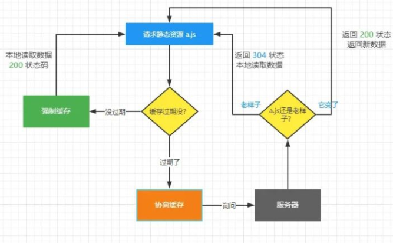

1. 

   强制缓存和协商缓存都针对静态资源

2. 

   强制缓存在前，协商缓存在后。

3. 

   资源未过期触发强制缓存，资源过期后再触发协商缓存。

4. 

   判断过期的方法expires（绝对时间）、cache-control（相对时间）

5. 

   判断资源是否有更新（Last-Modified 和 ETag）

> 需要注意的是，即使是静态资源，也是依靠url来进行缓存的，也就是说只要是url地址不一样，就一定会去获取最新的数据。
>
> 所以我们往往会有这样的需求，在静态文件的src后面添加一个时间戳，获取在打包的时候动态的生成带有hash值的文件名，这样可以阻止浏览器缓存，使用户获取到最新的文件，使用到最新的功能。


##### 13. http和https区别以及哪个更安全

HTTP明文传输，数据没有加密，安全性较差，HTTPS（HTTP + SSL），数据传输过程是加密的，安全性要好一些。

使用HTTPS协议要经过SSL认证来申请SSL证书，认证拿到证书的过程一般都是收费的，所以成本略高。

HTTP的速度要比HTTPS要更快一些，就是因为HTTP和服务器建立连接要通过TCP的三次握手，客户端和服务端只需要交换3个包，HTTPS在进行连接的时候除了要TCP的3个包，还要加上SSL握手的9个包，一共12个包。

默认端口不同，http默认80端口，https默认443接口。

HTTPS认证是怎么认证的？

客户端和服务端进行数据传输之前，先通过证书对双方进行身份验证：

1. 

   客户端在发送SSL握手信息给服务端要求连接

2. 

   服务端会将证书发送给客户端

3. 

   客户端检查服务端证书，确认这个这个证书的签发机构是否值得信任，如果检查有问题，客户端会将是否继续通讯的决定权交给客户端，如果检查无误，或者用户选择继续，就表现客户端认可服务端身份。

4. 

   服务端要求客户端发送证书，并且检查是否通过验证， 失败就关闭连接，成功的话就得到客户端的公钥

至此，服务端及客户端双方身份认证接受，双方都确保彼此身份可靠。

HTTPS一定安全吗？

不一定，HTTPS往往无法阻止中间人攻击。

A和B进行数据交互的时候，可以采用加密的方式，加密分为对称和不对称两种。

对称加密只要被破解出加密方式，就很容易泄露信息。

A生成一个秘钥ka，B生成一个秘钥kb；ka用于解密A加密的数据，kb用于解密B加密的数据。

A将ka传递给B，B将kb传递A，这样的话，A再给B传递信息的时候，B接受到之后用ka来进行解密。

HTTPS进行密文传输的时候采用的不对称加密的方式。但是如果有中间人拦截请求后模仿A和B来与B和A进行通信的时候也会泄露数据。


##### 14.对于工作中的跨域问题你是怎么解决的

在线上的各种环境中（开发、测试、生产）环境一般是不会有跨域问题的，因为服务器和前端资源一般是会部署在同一个域的服务器下的，但是也有端口或者不同域的情况，这些时候往往都是后端去利用CORS来处理的跨域问题。

在本地开发的过程中，本地服务器访问测试服务器接口的，也基本都是后端去处理CORS跨域，但是有些时候也可能需要前端在脚手架对应的devServer中配置Proxy来进行开发时候的跨域处理。

在一些极少的情况下加，项目中可能会访问一些第三方的Api，比如定位、天气等等接口的时候，可能会根据接口需求进行jsonp的跨域处理。


##### 15. 事件循环

```js
（1）所有同步任务在主线程上执行，形成一个执行栈 

（2）主线程之外，还存在一个"任务队列"（task queue）。只要异步任务(setInterval,setTimeout，i/o...)有了结果，就在"任务队列"之中放置一个事件。

（3）一旦"执行栈"中的所有同步任务执行完毕，系统就会读取"任务队列"，拿到队列的第一个任务，进入执行栈，开始执行。

（4）主线程不断重复上面的(3)。

主线程从"任务队列"中读取事件，这个过程是循环不断的，所以整个的这种运行机制又称为Event Loop（事件循环）

```

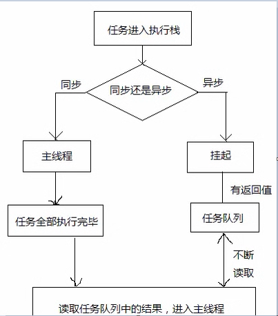

##### 16. 微任务和宏任务

> Promise的出现让问题变复杂了, 它跟setTimeout 优先级？ 上面的事件循环解释不够用了。

```js
console.log('script start')

setTimeout(function() {
    console.log('timer over')
}, 0)

Promise.resolve().then(function() {
    console.log('promise1')
}).then(function() {
    console.log('promise2')
})

console.log('script end')

// script start
// script end
// promise1
// promise2
// timer over

```


```js
所有任务分为宏任务（macrotask ）和微任务（microtask ） 两种。
MacroTask（宏任务）：* script全部代码、setTimeout、setInterval、I/O、UI Rendering。
MicroTask（微任务）：* Process.nextTick（Node独有）、Promise...

在挂起任务时，JS 引擎会将所有任务按照类别分到这两个队列中，首先在 宏任务 的队列中取出第一个任务，执行完毕后取出 微任务 队列中的所有任务顺序执行；之后新的事件循环开始，取宏任务的第一个，周而复始，直至两个队列的任务都取完。
```


##### 17. http相关

**http状态码有那些？分别代表是什么意思？**

```
    [
        100  Continue   继续，一般在发送post请求时，已发送了http header之后服务端将返回此信息，表示确认，之后发送具体参数信息
        200  OK         正常返回信息
        201  Created    请求成功并且服务器创建了新的资源
        202  Accepted   服务器已接受请求，但尚未处理
        
        301  Moved Permanently  请求的网页已永久移动到新位置。
        302 Found       临时性重定向。
        307 Internal Redirect  内部重定向
        
        304  Not Modified 自从上次请求后，请求的网页未修改过。 协商缓存 
		200  memory cache  强缓存

        400 Bad Request  服务器无法理解请求的格式，客户端不应当尝试再次使用相同的内容发起请求。
        401 Unauthorized 请求未授权。
        403 Forbidden   禁止访问。
        404 Not Found   找不到如何与 URI 相匹配的资源。

        500 Internal Server Error  最常见的服务器端错误。
        503 Service Unavailable 服务器端暂时无法处理请求（可能是过载或维护）。
    ]
```

##### 18. 一个页面从输入 URL 到页面加载显示完成，这个过程中都发生了什么？

- 01.浏览器查找域名对应的IP地址(DNS 查询：浏览器缓存->系统缓存->路由器缓存->ISP DNS 缓存->根域名服务器)
- 02.浏览器向 Web 服务器发送一个 HTTP 请求（TCP三次握手）
- 03.服务器 301 重定向（从 http://example.com 重定向到 http://www.example.com）
- 04.浏览器跟踪重定向地址，请求另一个带 www 的网址
- 05.服务器处理请求（通过路由读取资源）
- 06.服务器返回一个 HTTP 响应（报头中把 Content-type 设置为 'text/html'）
- 07.浏览器进 DOM 树构建
- 08.浏览器发送请求获取嵌在 HTML 中的资源（如图片、音频、视频、CSS、JS等）
- 09.浏览器显示完成页面
- 10.浏览器发送异步请求


##### 19. 前端攻击

###### 1) CSRF的基本概念、缩写、全称

> `CSRF`（`Cross-site request forgery`）：**跨站请求伪造**。


> 用户是网站A的注册用户，且登录进去，于是网站A就给用户下发`cookie`。

> 从上图可以看出，要完成一次`CSRF`攻击，受害者必须满足两个必要的条件：

1. 登录受信任网站`A`，并在本地生成`Cookie`。（如果用户没有登录网站`A`，那么网站`B`在诱导的时候，请求网站`A`的`api`接口时，会提示你登录）
2. 在不登出`A`的情况下，访问危险网站`B`（其实是利用了网站`A`的漏洞）。

> 我们在讲`CSRF`时，一定要把上面的两点说清楚。

> 温馨提示一下，`cookie`保证了用户可以处于登录状态，但网站`B`其实拿不到 `cookie`。

> 举个例子，前段时间里，微博网站有个`api`接口有漏洞，导致很多用户的粉丝暴增。

**CSRF的防范措施**

**方法一、Token 验证：**（用的最多）

1. 服务器发送给客户端一个`token`；
2. 客户端提交的表单中带着这个`token`。
3. 如果这个 `token` 不合法，那么服务器拒绝这个请求。

**方法二：隐藏令牌：**

- 把 `token` 隐藏在 `http` 的 `head`头中。

> 方法二和方法一有点像，本质上没有太大区别，只是使用方式上有区别。

**方法三、Referer 验证：**

> `Referer` 指的是页面请求来源。意思是，**只接受本站的请求，服务器才做响应**；如果不是，就拦截。

###### 2) XSS的攻击原理

> `XSS`攻击的核心原理是：不需要你做任何的登录认证，它会通过合法的操作（比如在`url`中输入、在评论框中输入），向你的页面注入脚本（可能是`js`、`hmtl`代码块等）。

> 最后导致的结果可能是：

- 盗用`Cookie`
- 破坏页面的正常结构，插入广告等恶意内容
- `D-doss`攻击

**XSS的防范措施主要有三个：**

**1. 编码**：

> 对用户输入的数据进行`HTML Entity`编码。

**2、过滤：**

- 移除用户输入的和事件相关的属性。如`onerror`可以自动触发攻击，还有`onclick`等。（总而言是，过滤掉一些不安全的内容）
- 移除用户输入的`Style`节点、`Script`节点、`Iframe`节点。（尤其是`Script`节点，它可是支持跨域的呀，一定要移除）。

###### 3)  CSRF 和 XSS 的区别

> 面试官还可能喜欢问二者的区别。

- `CSRF`：是利用网站`A`本身的漏洞，去请求网站`A`的`api`。
- `XSS`：是向网站 `A` 注入 `JS`代码，然后执行 `JS` 里的代码，篡改网站`A`的内容。


#### 四. ES6-ES13高频面试题


##### 1. ES6新增的方法

- let和const，解构赋值、模板字符串、箭头函数。

- Symbol、Map、Set三种常用的数据类型。

- Proxy重新定义了数据劫持的能力

- Reflect定义了一套标准化的数据操作的方式

- Promise确实的解决了异步逻辑嵌套及回调地狱问题。定义了异步逻辑的三种状态pending、rejected、fullfilled, 搭配then、catch、all、race等方法以及async await语法糖，大量简化了异步操作。


- Generator函数，可以将异步逻辑划片执行。
  - Generator 函数是 ES6 提供的一种异步编程解决方案
  - Generator 函数是一个状态机，封装了多个内部状态。
  - 执行 Generator 函数会返回一个遍历器对象，也就是说，Generator 函数除了状态机，还是一个遍历器对象生成函数。返回的遍历器对象，可以依次遍历 Generator 函数内部的每一个状态。

- 新增了class类的概念

- ES6 Modules


##### 2. var, let, const的区别

ES6新增了定义变量的关键字 let和const， 分别用于定义块级变量和常量

let， const不会声明提前， 存在暂时性死区

外部无法使用到内部的let和const定义的变量， 存在块级作用域限制]

const 定义的常量， 无法更改。

```js
  if(true){
       let name ="kerwin"
   }
   
   const obj = {name:"kerwin"}
   obj.name="xiaoming"
   // obj = {name:"xioamng"}
   // obj= 'dwadwa'
```

##### 3. 箭头函数

箭头函数是ES6推出的，所以在低版本浏览器是有兼容问题的，语法简介明了，逻辑更清晰。

箭头函数没有自己的this，this指向外部的this，并且this会在创建的时候就绑定好.

```js
const fn1 = function() {
  console.log(this)
}
fn1() // window
const obj = {  
  name: 'tom',  
  fn2 () {    
    fn1() // window    
    console.log(this) // obj  
  }
}
obj.fn2()
```

```

// 在箭头函数定义的位置往上数，这一行是可以打印出 this 的
// 因为这里的 this 是 window
// 所以箭头函数内部的 this 就是 window
const obj = {
  fn: function () {
    console.log(this)
  },
  // 这个位置是箭头函数的上一行，但是不能打印出 this
  fun: () => {
    // 箭头函数内部的 this 是书写箭头函数的上一行一个可以打印出 this 的位置
    console.log(this)
  }
}

obj.fn()
obj.fun()
```


##### 4. 解构

```js
	let {type,payload} = data;  // {type:"",payload:""}
```

##### 5 ... 展开合并

```js
	[...arr1,...arr2] 	
	{...obj1,...obj2} 
```

##### 6. promise

```js
	//异步处理方案
	1. 回调函数
    2. Promise
    3. generator 生成器 yield 
    4. async await

	//解决回调地狱 ，嵌套金字塔
	
	function test1(){
		return new Promise((resolve,rejet)=>{
			setTimeout(() => {
			  	resolve("123")
			}, 2000)
		})
	}
	
	test1().then(res=>{
	
	}).catch(error=>{
	
	})
	// pending reject fullfilled
	
	axios.get("1.php").then(res=>{
		return axios.get(2.php,{res})
	}).then(res=>{
		return axios.get(3.php)
	}).then(res=>{
		console.log(res.data)
	}).catch(error=>{
		console.log(error)
	})
	async await 写起来
	
	async function test(){
		var a = await axios.get(1);
		var b= await axios.get(2,{a});
		var c= await axios.get(3,{b})
		console.log(c);
	}
	
	test()
	
	//所有的异步都结束
	Promise.all([axios.get(1),axios.get(2)]).then(res=>{
		//loading隐藏
	}).catch(error=>{
	
	})
	
	Promise.race([axios.get(1),axios.get(2)])

	`Promise.any()`跟`Promise.race()`方法很像，只有一点不同，就是`Promise.any()`不会因为某个 Promise 变成`rejected`状态而结束，必须等到所有参数 Promise 变成`rejected`状态才会结束。
```

##### 7 .class (语法糖 =>  构造函数,babel-loader) 

```js
	class Person{
		constructor(name,age) {
		  this.name = name;
		  this.age =age;
		}
		say=()=>{
	
		}
	}
	
	class Test extends person{
		constructor(name,age,location) {
		  super(name,age);
		  this.location = location;
		}
       
	}
```

##### 8 .模块化 

```js
	import obj from "./a" ;  
	export default aaa;
	
	import {test} from "./b" ; 
	export {test} ; 
	export var test =function(){}

	AMD - 前端 异步加载 - 提前下载， 提前加载 require.js
	CMD -  异步加载 - 提前下载 ， 按需加载 -- 玉伯 -sea.js
	CommonJs -同步加载（webpack）
		require("./b")    
		=>module.exports 
		=>exports
	ES6 - 模块化
	
	//ES6 和 commonJS区别？
	//ES6可以导入某几个接口 import {a} from './module.js' + webpack- tree shaking 摇树优化

	//commonJS 导入整个文件
```

##### 9. 异步遍历器生成函数(大厂面试)

>Generator 函数返回一个同步遍历器，异步 Generator 函数的作用，是返回一个异步遍历器对象。在语法上，异步 Generator 函数就是async函数与 Generator 函数的结合。

```js
//使用柯里化函数
function timer(t){
    return ()=>new Promise((resolve)=>{
        setTimeout(()=>{
            resolve('data-'+t)
        },t)
    })
}
//异步生成器
async function *gen2(){
    for(let i=0;i<this.length;i++){
        //只有promise对象在这里执行才能符合逻辑
        yield this[i]()
    }
}
async function test(){
//平常的异步迭代器是因为在创建数组时，几个promise同时执行的，只有延迟到异步迭代器里才能在上一个执行结束后执行下一个
    let arr=[timer(1000),timer(2000),timer(3000)]
    arr[Symbol.asyncIterator]=gen2

    for await(let i of arr){
        console.log(Date.now())
        console.log(i)
        console.log(Date.now())
    }
}

test()
```


#### 五. 工程化&代码管理高频面试题

##### 1. git常用命令以及工作中都怎么工作

```js
git init 初始化仓库

git status 查看当前各个区域的代码状态。

git log查看commit记录

git reflog查看完整记录

git add 添加工作区代码到暂存区

Git commit 暂存区代码的提交

git reset 代码的版本回退

git stash 将暂存处代码收起来

git stash pop 将收起来的暂存区的代码释放出来

Git tag 可以打标签

Git branch 基于当前分支创建一个分支

git checkout 切换分支

git merge 合并分支

git remote add origin 添加远端仓库地址

git clone 克隆仓库

git pull下拉对应分支代码

git push 上传对应分支代码


```


公司中每一个项目都会有一个对应的远端仓库（gitLab），我们需要创建账号并配置权限。

一般公司会有几个主要分支，分别对应4个环境，当代码更新的时候会通过流水线自动部署到对应的环境：

1. 

   发布分支（prod、master）这个分支代码对应的就是线上的代码

2. 

   UAT分支（uat），这个分支上的代码对应的是公司内部演示用的分支

3. 

   TEST分支（test），这个分支的代码是用于测试

4. 

   DEV分支（dev），研发自测分支

正常功能开发或者bug修复， 从dev分支拉取代码，进行开发就可以。

如果是解决线上bug，应该从master拉取一个分支（hotfix__）, 然后开发完成后将其合并到test或者uat，测试没有问题后，将其合并到master。还要将hotfix上对应的commit合并到dev分支， 专业dev分支也就修复了这个bug。

如果当前版本代码需要回退（功能不做了，要么要去先着急干别的）， 执行git reset --hard， 再回到当前的commit也是git reset 只不过需要注意，此时要通过git reflog来查看时间最后的一次commit。


##### 2. sass和 scss的区别

```
Sass 是一款强化 CSS 的辅助工具，它在 CSS 语法的基础上增加了变量 (variables)、嵌套 (nested rules)、混合 (mixins)、导入 (inline imports) 等高级功能，这些拓展令 CSS 更加强大与优雅。使用 Sass 以及 Sass 的样式库（如 Compass）有助于更好地组织管理样式文件，以及更高效地开发项目。
```


scss只是sass的一个语言版本，.scss文件的特点是层级靠{}来区分，.sass文件的特点的层级靠缩进来区分


##### 3. 前端工程化工具

> gulp&webpack 

```js
gulp -src=>pipe(scss翻译).pipe(css 合并).pipe(css压缩)=>dist
gulp -src=>pipe(模块化编译).pipe(js压缩)=>dist
	流程化
webpack
    模块化 默认支持的commonjs规范

所有js模块打包生成一个js文件
编译解析浏览器不能识别的语言 （scss ,.vue, jsx, ts, ES6） 

配置？
 入口
 出口
 devserver 启动 自动刷新，热更新， 反向代理
 sourcemap-调试代码 .map （地图）

 loaders: sass-loader css-loader file-loader  babel-loader vue-loader postcss-loader

 plugin:  压缩, 提取公共库

```

##### 4. webpack配置并且是否熟知代码分割流程及操作

webpack包含mode模式、entry入口、output出口、plugins插件、loader、resolve、devServer开发服务器相关的基本配置。

在webpack中可以通过多入口的配置，每个入口都会去查询对应的依赖关系图，进行单独的代码。

在模块化开发过程中往往会将各种不同类型的文件都看做是模块来进行互相导入导出，比如将图片、css、sass之类的文件都可以导入到js文件中，但是在打包的过程中需要将这些文件都寻找到然后单独的分离出去，这样就需要用到对应的loader来进行文件处理，不同的文件、不同的loader，处理方式也不一样。

比如css文件可以利用style-loader将其代码生成style标签放入到head中，也可以利用minicssextra插件中 loader将其抽离成css文件。

img文件可以利用url-loader和file-loader对其进行base64的转化或者单独抽出。

组件模块化导入的时候可以采用懒加载的形式，就会单独打包对应的代码。

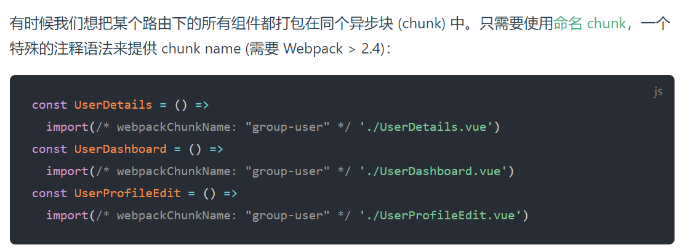


##### 5.  webpack 4大核心理念， 编译原理?

​      entry,output , loaders , pluguins
​       一切皆为模块，由于webpack只支持js文件，所以需要用loader 转换为webpack支持的模块，其中plugin 用于扩张webpack 的功能，在webpack构建生命周期的过程中，在合适的时机做了合适的事情。


##### 6. webapck构建优化实战 (打包时间过长， 可以优化时间短点  20s)

 	

    （1）提取公共库， 避免重复引用。  使用 DllPlugin，把第三方库文件分离出来单独编译，并且缓存; 极大的减少业务页面的编译时间  
     dll方式也就是通过配置，告诉webpack指定库在项目中的位置，从而直接引入，不将其打包在内。
     
    （2）happypack, 多线程解析文件，如babel-loader等耗时较长的。 
    还可以配合cache-loader使用。 
    （3）缓存  cache-loader 
    （4）  loaders应尽可能配置解析路径include参数，排除路径exclude参数， 减少解析时查询范围。 
    （5）dev 阶段 devtool 设置成cheap-module-eval-source-map， 已经能满足调试需求， 编译能更快。 
    （6）product 阶段 去掉source-map 
#### 六. NodeJS高频面试题

##### 1. nodejs 创建静态服务器？

> 要使用 HTTP 服务器和客户端，则必须 `require('http')`。

```js
const http = require('http');

// 创建本地服务器来从其接收数据
const server = http.createServer((req, res) => {
  res.writeHead(200, { 'Content-Type': 'application/json' });
  res.end(JSON.stringify({
    data: 'Hello World!'
  }));
});

server.listen(8000);

```

```js
const http = require('http');

// 创建本地服务器来从其接收数据
const server = http.createServer();

// 监听请求事件
server.on('request', (request, res) => {
  res.writeHead(200, { 'Content-Type': 'application/json' });
  res.end(JSON.stringify({
    data: 'Hello World!'
  }));
});

server.listen(8000);
```


##### 2. commonJS规范 vs ES6 模块化规范

	> require导入， module.exports 导出
	import 导入， export default 导出

> 区别：import {某个几个接口} from 'antd'  //webpack  (tree shaking 摇树优化)
> 		   var myview = require("antd") //导入整个接口

##### 3. socket通信 聊天

WebSocket并不是全新的协议，而是利用了HTTP协议来建立连接。我们来看看WebSocket连接是如何创建的。

首先，WebSocket连接必须由浏览器发起，因为请求协议是一个标准的HTTP请求，格式如下：

```js
GET ws://localhost:3000/ws/chat HTTP/1.1
Host: localhost
Upgrade: websocket
Connection: Upgrade
Origin: http://localhost:3000
Sec-WebSocket-Key: client-random-string
Sec-WebSocket-Version: 13
```

该请求和普通的HTTP请求有几点不同：

1. GET请求的地址不是类似`/path/`，而是以`ws://`开头的地址；
2. 请求头`Upgrade: websocket`和`Connection: Upgrade`表示这个连接将要被转换为WebSocket连接；
3. `Sec-WebSocket-Key`是用于标识这个连接，并非用于加密数据；
4. `Sec-WebSocket-Version`指定了WebSocket的协议版本。

随后，服务器如果接受该请求，就会返回如下响应：

```
HTTP/1.1 101 Switching Protocols
Upgrade: websocket
Connection: Upgrade
Sec-WebSocket-Accept: server-random-string
```

该响应代码`101`表示本次连接的HTTP协议即将被更改，更改后的协议就是`Upgrade: websocket`指定的WebSocket协议。

版本号和子协议规定了双方能理解的数据格式，以及是否支持压缩等等。如果仅使用WebSocket的API，就不需要关心这些。

现在，一个WebSocket连接就建立成功，浏览器和服务器就可以随时主动发送消息给对方。消息有两种，一种是文本，一种是二进制数据。通常，我们可以发送JSON格式的文本，这样，在浏览器处理起来就十分容易。

**为什么WebSocket连接可以实现全双工通信而HTTP连接不行呢？实际上HTTP协议是建立在TCP协议之上的，TCP协议本身就实现了全双工通信，但是HTTP协议的请求－应答机制限制了全双工通信。WebSocket连接建立以后，其实只是简单规定了一下：接下来，咱们通信就不使用HTTP协议了，直接互相发数据吧。**

安全的WebSocket连接机制和HTTPS类似。首先，浏览器用`wss://xxx`创建WebSocket连接时，会先通过HTTPS创建安全的连接，然后，该HTTPS连接升级为WebSocket连接，底层通信走的仍然是安全的SSL/TLS协议。

  `websocket全双工, 双向通信 onopen  onmessage  onclose onerror`

服务器：

```js
const  WebSocket = require("ws")
WebSocketServer = WebSocket.WebSocketServer
const wss = new WebSocketServer({ port: 8080 });
wss.on('connection', function connection(ws) {
    ws.on('message', function message(data, isBinary) {
        wss.clients.forEach(function each(client) {
            if (client !== ws && client.readyState === WebSocket.OPEN) {
                client.send(data, { binary: isBinary });
            }
        });

    });

    ws.send('欢迎加入聊天室');
});
```

客户端：

```js
var ws = new WebSocket("ws://localhost:8080")
ws.onopen = ()=>{
    console.log("open")
}
ws.onmessage = (evt)=>{
    console.log(evt.data)
}
```


##### 4. mongoDB 基本操作(增删改查)


连接数据库

```js
const mongoose = require("mongoose")

mongoose.connect("mongodb://127.0.0.1:27017/company-system")
```

创建模型

```js
const mongoose = require("mongoose")

const Schema = mongoose.Schema

const UserType = {
    username:String,
    password:String,
    gender:Number,
    introduction:String,
    avatar:String,
    role:Number
}
const UserModel = mongoose.model("user",new Schema(UserType))
module.exports  = UserModel 
```

增加数据

```js
UserModel.create({
    introduction,username,gender,avatar,password,role
})
```

查询数据

```js
UserModel.find({username:"kerwin"},["username","role","introduction","password"]).sort({createTime:-1}).skip(10).limit(10)
```

更新数据

```js
UserModel.updateOne({
    _id
},{
    introduction,username,gender,avatar
})
```

删除数据

```js
UserModel.deleteOne({_id})
```


##### 5. token（jwt-json web token） 与 session配合cookie  （登录，鉴权）

###### 1. Cookie&Session

「HTTP 无状态」**我们知道，HTTP 是无状态的。也就是说，HTTP 请求方和响应方间无法维护状态，都是一次性的，它不知道前后的请求都发生了什么。但有的场景下，我们需要维护状态。最典型的，一个用户登陆微博，发布、关注、评论，都应是在登录后的用户状态下的。**「标记」那解决办法是什么呢？


```js
const express = require("express");
const session = require("express-session");
const MongoStore = require("connect-mongo");
const app = express();


app.use(
  session({
    secret: "this is session", // 服务器生成 session 的签名
    resave: true, 
    saveUninitialized: true, //强制将为初始化的 session 存储
    cookie: {
      maxAge: 1000 * 60 * 10,// 过期时间
      secure: false, // 为 true 时候表示只有 https 协议才能访问cookie
    },
    rolling: true, //为 true 表示 超时前刷新，cookie 会重新计时； 为 false 表示在超时前刷新多少次，都是按照第一次刷新开始计时。
    store: MongoStore.create({
      mongoUrl: 'mongodb://127.0.0.1:27017/kerwin_session',
      ttl: 1000 * 60 * 10 // 过期时间
  }),

  })
);

app.use((req,res,next)=>{
  if(req.url==="/login"){
    next()
    return;
  }
  if(req.session.user){
      req.session.garbage = Date();
      next();
  }else{
   	  res.redirect("/login")   
  }
})

```


###### 2. JSON Web Token (JWT) 

###### （1）介绍


我为什么要保存这可恶的session呢， 只让每个客户端去保存该多好？


当然， 如果一个人的token 被别人偷走了， 那我也没办法， 我也会认为小偷就是合法用户， 这其实和一个人的session id 被别人偷走是一样的。

这样一来， 我就不保存session id 了， 我只是生成token , 然后验证token ， 我用我的CPU计算时间获取了我的session 存储空间 ！

解除了session id这个负担， 可以说是无事一身轻， 我的机器集群现在可以轻松地做水平扩展， 用户访问量增大， 直接加机器就行。 这种无状态的感觉实在是太好了！

缺点：

> 1. 占带宽，正常情况下要比 session_id 更大，需要消耗更多流量，挤占更多带宽，假如你的网站每月有 10 万次的浏览器，就意味着要多开销几十兆的流量。听起来并不多，但日积月累也是不小一笔开销。实际上，许多人会在 JWT 中存储的信息会更多；
> 2. 无法在服务端注销，那么久很难解决劫持问题；
> 3. 性能问题，JWT 的卖点之一就是加密签名，由于这个特性，接收方得以验证 JWT 是否有效且被信任。对于有着严格性能要求的 Web 应用，这并不理想，尤其对于单线程环境。

注意：

> CSRF攻击的原因是浏览器会自动带上cookie，而不会带上token；
>
> 以CSRF攻击为例：
>
> cookie：用户点击了链接，cookie未失效，导致发起请求后后端以为是用户正常操作，于是进行扣款操作；
> token：用户点击链接，由于浏览器不会自动带上token，所以即使发了请求，后端的token验证不会通过，所以不会进行扣款操作；

###### （2）实现

```js
//jsonwebtoken 封装
const jsonwebtoken = require("jsonwebtoken")
const secret = "kerwin"
const JWT = {
    generate(value,exprires){
        return jsonwebtoken.sign(value,secret,{expiresIn:exprires})
    },
    verify(token){
        try{
            return jsonwebtoken.verify(token,secret)
        }catch(e){
            return false
        }
    }
}

module.exports = JWT
```

##### 6. token 存储在 localStorage 里，当过期时过期的 token 怎么处理？

- 当前端进行页面跳转或者需要鉴权的操作时，会发送请求到后台，而 token 会跟随请求头一起发送，后台通过请求头接收到 token 时会进行判断，若是过期了，应该返回一个 401 的状态码给前端，前端接收到以后，应该重定向到登录页要求用户重新登陆。axios 拦截器。

##### 7. 如何使用原生 Node.js 操做 cookie？

- 获取 cookie： req.headers.cookie
- 设置 cookie： res.writeHead(200, { 'Set-Cookie': 'myCookie=test', 'Content-Type': 'text/plain' }) 

##### 8. nextTick 和 setImmediate 的区别是什么？

- nextTick 和 setImmediate 都是延迟加载。但是 nextTick 是放在当前队列的最后一个执行，setImmediate 是在下一个队列的队首执行


##### 9. koa 和 express 的区别

- 最大的区别在于语法，experss 的异步采用的是回调函数的形式，而 koa1 支持 generator + yeild，koa2 支持 await/async，无疑更加优雅。
- 中间件的区别，koa 采用洋葱模型，进去顺序执行，出去反向执行，支持 context 传递数据 express 本身无洋葱模型，需要引入插件，不支持 context express 的中间件中执行异步函数，执行顺序不会按照洋葱模型，异步的执行结果有可能被放到最后，response 之前。 这是由于，其中间件执行机制，递归回调中没有等待中间件中的异步函数执行完毕，就是没有 await 中间件异步函数
- 集成度区别 express 内置了很多中间件，集成度高，使用省心， koa 轻量简洁，容易定制

##### 10. koa 中间件的实现原理

1. 每个中间件默认接受两个参数，第一个参数是 Context 对象，第二个参数是 next 函数。只要调用 next 函数，就可以把执行权转交给下一个中间件。
2. 如果中间件内部没有调用 next 函数，那么执行权就不会传递下去。
3. 多个中间件会形成一个栈结构，以“先进后出”的顺序执行。整个过程就像，先是入栈，然后出栈的操作。

##### 11. 图片上传到服务器的过程

Multer 是一个 node.js 中间件，用于处理 `multipart/form-data` 类型的表单数据，它主要用于上传文件。

**注意**: Multer 不会处理任何非 `multipart/form-data` 类型的表单数据。

```
npm install --save multer
```

```js
//前后端分离-前端

const params = new FormData()
params.append('kerwinfile', file.file)
params.append('username', this.username)
const config = {
	headers: {
		"Content-Type":"multipart/form-data"
	}
}
http.post('/api/upload', params, config).then(res => {
	this.imgpath = 'http://localhost:3000' + res.data
})	
```

Multer 会添加一个 `body` 对象 以及 `file` 或 `files` 对象 到 express 的 `request` 对象中。 `body` 对象包含表单的文本域信息，`file` 或 `files` 对象包含对象表单上传的文件信息。

```js
//前后端分离-后端
router.post('/upload', upload.single('kerwinfile'),function(req, res, next) {
	console.log(req.file)
})
```


##### 12. 什么是服务端渲染，服务端渲染的优点？

- 服务端渲染：页面渲染过程是在服务端完成，最终的 HTML 字符串，直接通过请求发送给客户端。
- 服务器端渲染的优势就是利于 SEO 优化，首屏加载快，因为客户端接收到的是完整的 HTML 页面。


##### 13. Node.js 优缺点以及适用场景

- 优点
  - Node.js 采用事件驱动、异步编程，为网络服务而设计。简单易学，可以很快上手做后端设计。
  - Node.js 非阻塞模式的 IO 处理给 Node.js 带来在相对低系统资源耗用下的高性能与出众的负载能力，非常适合用作依赖其它 IO 资源的中间层服务。
  - Node.js 轻量高效，可以认为是数据密集型分布式部署环境下的实时应用系统的完美解决方案。
- 缺点
  - 单线程，可靠性低，一旦这个进程崩掉，那么整个 web 服务就崩掉了。
  - 开源组件库质量参差不齐，更新快，向下不兼容
  - 不适合做企业级应用开发，特别是复杂业务逻辑的，代码不好维护，事务支持不是很好。
- 适用场景
  - 大量 Ajax 请求的应用，例如个性化应用，每个用户看到的页面都不一样，需要在页面加载的时候发起 Ajax 请求，NodeJS 能响应大量的并发请求。
  - 实时 ：如在线聊天，实时通知推送等等
  - 工具类应用：海量的工具，小到前端压缩部署，大到桌面图形界面应用程序
  - 总而言之，NodeJS 适合运用在高并发、I/O 密集、少量业务逻辑的场景。


#### 七. Vue高频面试题

##### 1.  解释单向数据流和双向数据绑定

```JS
对于 Vue 来说，组件之间的数据传递具有单向数据流这样的特性称为单向数据流，单向数据流（Unidirectional data flow）方式使用一个上传数据流和一个下传数据流进行双向数据通信，两个数据流之间相互独立，单向数据流指只能从一个方向来修改状态。

而双向数据绑定即为当数据发生变化的时候，视图也就发生变化，当视图发生变化的时候，数据也会跟着同步变化，两个数据流之间互为影响。
```

##### 2. Object.defineProperty有什么缺点

```JS
1、无法监听es6的Set、Map 变化；
2、无法监听Class类型的数据；
3、属性的新加或者删除也无法监听；
4、数组元素的增加和删除也无法监听。

```

##### 3. 对MVC，MVP，MVVM的理解

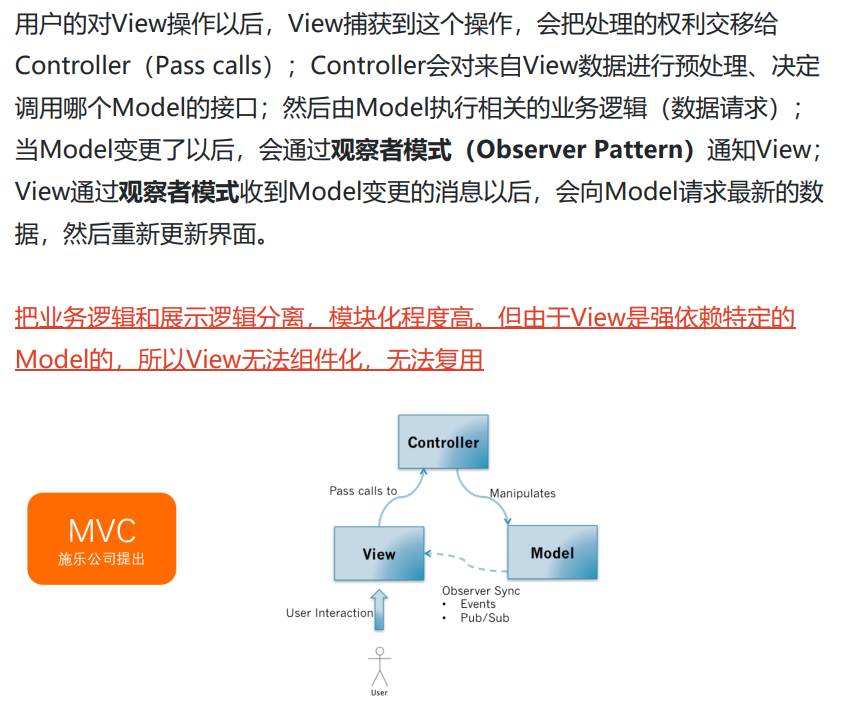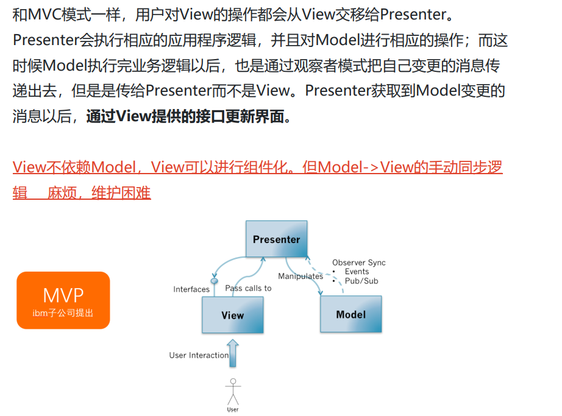


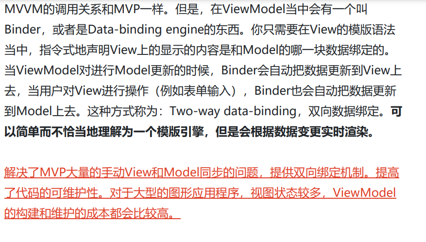

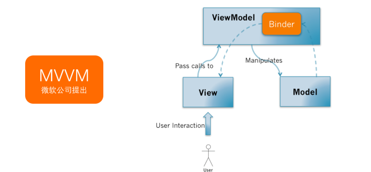


##### 4. 生命周期

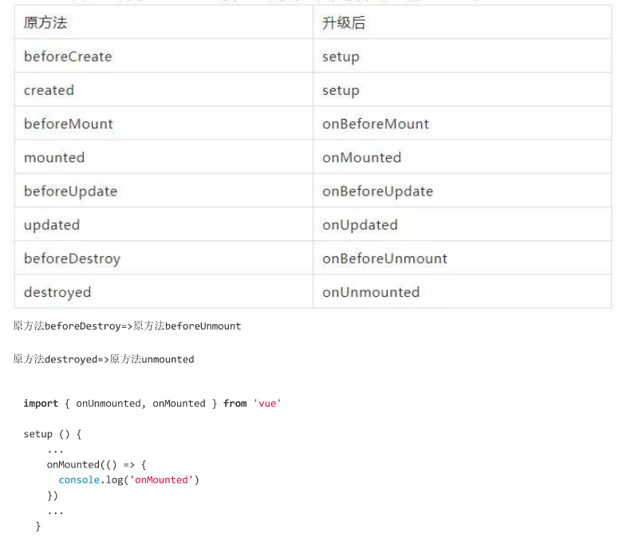

##### 5. 你知道Vue响应式数据原理吗？Proxy 与 Object.defineProperty 优劣对比？

```JS
// 响应式原理

vue的响应式实现主要是利用了Object.defineProperty的方法里面的setter 与getter方法的观察者模式来实现。在组件初始化时会给每一个data属性注册getter和setter，然后再new 一个自己的Watcher对象，此时watcher会立即调用组件的render函数去生成虚拟DOM。在调用render的时候，就会需要用到data的属性值，此时会触发getter函数，将当前的Watcher函数注册进sub里。当data属性发生改变之后，就会遍历sub里所有的watcher对象，通知它们去重新渲染组件。

// proxy的优势如下：

Proxy 可以直接监听对象而非属性，可以直接监听数组的变化；
Proxy 有多达 13 种拦截方法,不限于 apply、ownKeys、deleteProperty、has 等等是 Object.defineProperty 不具备的；
Proxy 返回的是一个新对象,我们可以只操作新的对象达到目的,而 Object.defineProperty 只能遍历对象属性直接修改；


// Object.defineProperty 的优势如下:

兼容性好，支持 IE9，而 Proxy 的存在浏览器兼容性问题,而且无法用 polyfill(垫片)来弥补
```

##### 6. Composition API 的出现带来哪些新的开发体验，为啥需要这个？

```JS
1：在Compostion API 中时根据逻辑相关组织代码的，提高可读性和可维护性，类似于react的hook写法。
2：更好的重用逻辑代码，在Options API中通过MIxins重用逻辑代码，容易发生命名冲突且关系不清。
3：解决在生命周期函数经常包含不相关的逻辑，但又不得不把相关逻辑分离到了几个不同方法中的问题，如在mounted中设置定时器，但需要在destroyed中来清除定时器，将同一功能的代码拆分到不同的位置，造成后期代码维护的困难。
```

##### 7. 对比 jQuery，Vue 有什么不同

```JS
jQuery 专注视图层，通过直接操作 DOM 去实现页面的一些逻辑渲染；Vue 专注于数据层，通过数据的双向绑定，最终表现在 DOM 层面，减少了 DOM 操作。Vue 使用了组件化思想，使得项目子集职责清晰，提高了开发效率，方便重复利用，便于协同开发
```

##### 8. 如何再Vue的单文件组件里的样式定义全局CSS？

```JS
在style标签上不加上scoped的属性，默认为全局css样式
```

##### 9. 说一下$root，$parent，$refs

```JS
$root，和$parent都能访问父组件的属性和方法，区别在于如果存在多级子组件，通过parent 访问得到的是它最近一级的父组件，通过root 访问得到的是根父组件。通过在子组件标签定义 ref 属性，在父组件中可以使用$refs 访问子组件实例。
```

##### 10. Vue 中怎么自定义指令

```JS
通过directive来自定义指令，自定义指令分为全局指令和局部指令，自定义指令也有几个的钩子函数，常用的有bind和update，当 bind 和 update 时触发相同行为，而不关心其它的钩子时可以简写。

Vue.directive('focus', {
  // 当被绑定的元素插入到 DOM 中时……
  inserted: function (el) {
    // 聚焦元素
    el.focus()
  }
})


Vue.directive('color-swatch', function (el, binding) {
  el.style.backgroundColor = binding.value
})


```

##### 11. Vue 中怎么自定义过滤器 (vue3不支持)

```JS
通过filter来定义过滤器，过滤器分为全局和局部过滤器，过滤器的主体为一个普通的函数，来对数据进行处理，可以传递参数。当有局部和全局两个名称相同的过滤器时候，会以就近原则进行调用，即：局部过滤器优先于全局过滤器被调用。

<!-- 在双花括号中 -->
{{ message | capitalize }}

<!-- 在 `v-bind` 中 -->
<div v-bind:id="rawId | formatId"></div>


filters: {
  capitalize: function (value) {
    if (!value) return ''
    value = value.toString()
    return value.charAt(0).toUpperCase() + value.slice(1)
  }
}

Vue.filter('capitalize', function (value) {
  if (!value) return ''
  value = value.toString()
  return value.charAt(0).toUpperCase() + value.slice(1)
})
```

##### 12. Vue 等单页面应用的优缺点

```JS
// 优点
1单页应用的内容的改变不需要重新加载整个页面，web应用更具响应性和更令人着迷。

2、单页应用没有页面之间的切换，就不会出现“白屏现象”,也不会出现假死并有“闪烁”现象

3、单页应用相对服务器压力小，服务器只用出数据就可以，不用管展示逻辑和页面合成，吞吐能力会提高几倍。

4、良好的前后端分离。后端不再负责模板渲染、输出页面工作，后端API通用化，即同一套后端程序代码，不用修改就可以用于Web界面、手机、平板等多种客户端。

// 缺点
1、首次加载耗时比较多。

2、SEO问题，不利于百度，360等搜索引擎收录。

3、容易造成Css命名冲突。

4、前进、后退、地址栏、书签等，都需要程序进行管理，页面的复杂度很高，需要一定的技能水平和开发成本高。
```

##### 13. Vue-router 使用params与query传参有什么区别

```JS
// 用法上
1：query要用path来引入，params要用name来引入，接收参数都是类似的，分别是this.$route.query和this.$route.params。

// 展示上

2：params是路由的一部分,必须要有。query是拼接在url后面的参数

// 命名的路由，并加上参数，让路由建立 url /users/eduardo	
router.push({ name: 'user', params: { username: 'eduardo' } })

// 带查询参数，结果是 /register?plan=private
router.push({ path: '/register', query: { plan: 'private' } })

// 带 hash，结果是 /about#team
router.push({ path: '/about', hash: '#team' })

```

##### 14. Vue中 keep-alive 的作用

```JS
keep-alive 是 Vue 内置的一个组件，可以使被包含的组件保留状态，或避免重新渲染。一旦使用keepalive包裹组件，此时mouted，created等钩子函数只会在第一次进入组件时调用，当再次切换回来时将不会调用。此时如果我们还想在每次切换时做一些事情，就需要用到另外的周期函数，actived和deactived，这两个钩子函数只有被keepalive包裹后才会调用。
```

##### 15. Vue如何实现单页面应用

```JS
通常的url 地址由以下内容构成：协议名 域名 端口号 路径 参数 哈希值，当哈希值改变，页面不会发生跳转，单页面应用就是利用了这一点，给window注册onhashchange事件，当哈希值改变时通过location.hash就能获得相应的哈希值，然后就能跳到相应的页面。

1.hash通过监听浏览器的onhashchange()事件变化，查找对应的路由规则

2.history原理： 利用H5的 history中新增的两个API pushState() 和 replaceState() 和一个事件onpopstate监听URL变化
```

##### 16. 说出至少4种Vue当中的指令和它的用法？

```JS
v-if(判断是否隐藏，用来判断元素是否创建)
v-show(元素的显示隐藏，类似css中的display的block和hidden)
v-for(把数据遍历出来)
v-bind(绑定属性)
v-model(实现双向绑定)
```

##### 17. 如何实现一个路径渲染多个组件？

```JS
可以通过命名视图(router-view)，它容许同一界面中拥有多个单独命名的视图，而不是只有一个单独的出口。如果 router-view 没有设置名字，那么默认为 default。通过设置components即可同时渲染多个组件。

<router-view class="view left-sidebar" name="LeftSidebar"></router-view>
<router-view class="view main-content"></router-view>
<router-view class="view right-sidebar" name="RightSidebar"></router-view>


const router = createRouter({
  history: createWebHashHistory(),
  routes: [
    {
      path: '/',
      components: {
        default: Home,
        // LeftSidebar: LeftSidebar 的缩写
        LeftSidebar,
        // 它们与 `<router-view>` 上的 `name` 属性匹配
        RightSidebar,
      },
    },
  ],
})
```

##### 18. 如何实现多个路径共享一个组件？

```JS
只需将多个路径的component字段的值设置为同一个组件即可。

const routes = [
  { path: '/', component: Home },
  { path: '/home', component: Home },
]
```

##### 19. 如何监测动态路由的变化

```JS
可以通过watch方法来对$route进行监听，或者通过导航守卫的钩子函数beforeRouteUpdate来监听它的变化。
```

##### 20. vue-router 中的 router-link上 v-slot属性怎么用？

```JS
router-link 通过一个作用域插槽暴露底层的定制能力。这是一个更高阶的 API，主要面向库作者，但也可以为开发者提供便利，多数情况用在一个类似 NavLink 这样的自定义组件里。

有时我们可能想把激活的 class 应用到一个外部元素而不是 <a> 标签本身，这时你可以在一个 router-link 中包裹该元素并使用 v-slot 属性来创建链接：

<router-link
  to="/foo"
  custom
  v-slot="{ href, route, navigate, isActive, isExactActive }"
>
  <li
    :class="[isActive && 'router-link-active', isExactActive && 'router-link-exact-active']"
  >
    <a :href="href" @click="navigate">{{ route.fullPath }}</a>
  </li>
</router-link>

```

##### 21. Vue 如何去除url中的 `#`

```JS
将路由模式改为history

由于我们的应用是一个单页的客户端应用，如果没有适当的服务器配置，用户在浏览器中直接访问 https://example.com/user/id，就会得到一个 404 错误。这就尴尬了。

不用担心：要解决这个问题，你需要做的就是在你的服务器上添加一个简单的回退路由。如果 URL 不匹配任何静态资源，它应提供与你的应用程序中的 index.html 相同的页面。

var history = require('connect-history-api-fallback');
app.use(history({
	index: '/index.html'
})); //注意放在所有的接口后面
```

##### 22.  $route 和 $router 的区别

```JS
$route用来获取路由的信息的，它是路由信息的一个对象，里面包含路由的一些基本信息，包括name、meta、path、hash、query、params、fullPath、matched、redirectedFrom等。而$router主要是用来操作路由的，它是VueRouter的实例，包含了一些路由的跳转方法push，go, replace，钩子函数等
```

##### 23. Vue 路由守卫

```JS
vue-router 提供的导航守卫主要用来对路由的跳转进行监控，控制它的跳转或取消，路由守卫有全局的, 单个路由独享的, 或者组件级的。导航钩子有3个参数：

1、to:即将要进入的目标路由对象；
2、from:当前导航即将要离开的路由对象；
3、next ：调用该方法后，才能进入下一个钩子函数（afterEach）。

router.beforeEach(async (to, from) => {
   if (
     // 检查用户是否已登录
     !isAuthenticated &&
     // ❗️ 避免无限重定向
     to.name !== 'Login'
   ) {
     // 将用户重定向到登录页面
     return { name: 'Login' }
   }
 })
```


##### 24. Vue路由实现的底层原理

```JS
在Vue中利用数据劫持defineProperty在原型prototype上初始化了一些getter,分别是router代表当前Router的实例 、 route 代表当前Router的信息。在install中也全局注册了router-view,router-link,其中的Vue.util.defineReactive, 这是Vue里面观察者劫持数据的方法，劫持_route，当_route触发setter方法的时候，则会通知到依赖的组件。

接下来在init中，会挂载判断是路由的模式，是history或者是hash,点击行为按钮，调用hashchange或者popstate的同时更_route,_route的更新会触发route-view的重新渲染。
```

##### 25. 路由懒加载

Vue Router 支持开箱即用的[动态导入](https://developer.mozilla.org/en-US/docs/Web/JavaScript/Reference/Statements/import#Dynamic_Imports)，这意味着你可以用动态导入代替静态导入：

```js
// 将
// import UserDetails from './views/UserDetails.vue'
// 替换成
const UserDetails = () => import('./views/UserDetails.vue')

const router = createRouter({
  // ...
  routes: [{ path: '/users/:id', component: UserDetails }],
})
```


##### 26. 用过插槽吗？用的是具名插槽还是匿名插槽

```JS
用过，都使用过。插槽相当于预留了一个位置，可以将我们书写在组件内的内容放入，写一个插槽就会将组件内的内容替换一次，两次则替换两次。为了自定义插槽的位置我们可以给插槽取名，它会根据插槽名来插入内容，一一对应。

举例来说，这里有一个 <FancyButton> 组件，可以像这样使用：
template
<FancyButton>
  Click me! <!-- 插槽内容 -->
</FancyButton>


而 <FancyButton> 的模板是这样的：

template
<button class="fancy-btn">
  <slot></slot> <!-- 插槽出口 -->
</button>

```

##### 27. Vue-loader解释一下

```JS
解析和转换 .vue 文件，提取出其中的逻辑代码 script、样式代码 style、以及 HTML 模版 template，再分别把它们交给对应的 Loader 去处理。
```

##### 28. Vue和React中diff算法区别

```JS
vue和react的diff算法，都是忽略跨级比较，只做同级比较。vue diff时调动patch函数，参数是vnode和oldVnode，分别代表新旧节点。

1.vue对比节点。当节点元素相同，但是classname不同，认为是不同类型的元素，删除重建，而react认为是同类型节点，只是修改节点属性。

2.vue的列表对比，采用的是两端到中间比对的方式，而react采用的是从左到右依次对比的方式。当一个集合只是把最后一个节点移到了第一个，react会把前面的节点依次移动，而vue只会把最后一个节点移到第一个。总体上，vue的方式比较高效。
```

##### 29. 请你说一下 Vue 中 create 和 mount 的区别

```JS
create为组件初始化阶段，在此阶段主要完成数据观测(data observer)，属性和方法的运算， watch/event 事件回调。然而，挂载阶段还没开始，此时还未生成真实的DOM，也就无法获取和操作DOM元素。而mount主要完成从虚拟DOM到真实DOM的转换挂载，此时html已经渲染出来了，所以可以直接操作dom节点。
```

##### 30. axios是什么？怎么使用？描述使用它实现登录功能的流程?

```JS
axios 是请求后台资源的模块。 通过npm install axios -S来安装，在大多数情况下我们需要封装拦截器，在实现登录的过程中我们一般在请求拦截器中来加入token，在响应请求器中通过判断后端返回的状态码来对返回的数据进行不同的处理。如果发送的是跨域请求，需在配置文件中 config/index.js 进行代理配置。


// Add a request interceptor
axios.interceptors.request.use(function (config) {
    // Do something before request is sent
    return config;
  }, function (error) {
    // Do something with request error
    return Promise.reject(error);
  });

// Add a response interceptor
axios.interceptors.response.use(function (response) {
    // Any status code that lie within the range of 2xx cause this function to trigger
    // Do something with response data
    return response;
  }, function (error) {
    // Any status codes that falls outside the range of 2xx cause this function to trigger
    // Do something with response error
    return Promise.reject(error);
  });

```

##### 31. computed和watch的区别？watch实现原理？watch有几种写法？

```JS
计算属性computed : 

1. 支持缓存，只有依赖数据发生改变，才会重新进行计算
2. 不支持异步，当computed内有异步操作时无效，无法监听数据的变化
3.computed 属性值会默认走缓存，计算属性是基于它们的响应式依赖进行缓存的，也就是基于data中声明过或者父组件传递的props中的数据通过计算得到的值
4. 如果一个属性是由其他属性计算而来的，这个属性依赖其他属性，是一个多对一或者一对一，一般用computed
5.如果computed属性属性值是函数，那么默认会走get方法；函数的返回值就是属性的属性值；在computed中的，属性都有一个get和一个set方法，当数据变化时，调用set方法。

computed: {
    // 一个计算属性的 getter
    publishedBooksMessage() {
      // `this` 指向当前组件实例
      return this.author.books.length > 0 ? 'Yes' : 'No'
    }
  }


侦听属性watch：

1. 不支持缓存，数据变，直接会触发相应的操作；
2.watch支持异步；
3.监听的函数接收两个参数，第一个参数是最新的值；第二个参数是输入之前的值；
4. 当一个属性发生变化时，需要执行对应的操作；一对多；
5. 监听数据必须是data中声明过或者父组件传递过来的props中的数据，当数据变化时，触发其他操作，函数有两个参数，
immediate：组件加载立即触发回调函数执行，
deep: 深度监听，为了发现对象内部值的变化，复杂类型的数据时使用，例如数组中的对象内容的改变，注意监听数组的变动不需要这么做。

watch: {
    // 每当 question 改变时，这个函数就会执行
    question(newQuestion, oldQuestion) {
      if (newQuestion.includes('?')) {
        this.getAnswer()
      }
    }
  },
watch: {
    someObject: {
      handler(newValue, oldValue) {
        // 注意：在嵌套的变更中，
        // 只要没有替换对象本身，
        // 那么这里的 `newValue` 和 `oldValue` 相同
      },
      deep: true
    }
  }

```

##### 32. Vue $forceUpdate的原理

**1、作用：**

迫使 `Vue` 实例重新渲染。注意它仅仅影响实例本身和插入插槽内容的子组件，而不是所有子组件。

**2、内部原理：**

```js
Vue.prototype.$forceUpdate = function () {
    const vm: Component = this
    if (vm._watcher) {
        vm._watcher.update()
    }
}
```

实例需要重新渲染是在依赖发生变化的时候会通知watcher，然后通知watcher来调用update方法，就是这么简单。


##### 33. v-for key

- key是为Vue中的vnode标记的唯一id,通过这个key,我们的diff操作可以更准确、更快速
- diff算法的过程中,先会进行新旧节点的首尾交叉对比,当无法匹配的时候会用新节点的key与旧节点进行比对,然后超出差异.

> diff程可以概括为：oldCh和newCh各有两个头尾的变量StartIdx和EndIdx，它们的2个变量相互比较，一共有4种比较方式。如果4种比较都没匹配，如果设置了key，就会用key进行比较，在比较的过程中，变量会往中间靠，一旦StartIdx>EndIdx表明oldCh和newCh至少有一个已经遍历完了，就会结束比较,这四种比较方式就是首、尾、旧尾新头、旧头新尾.
>
> 准确: 如果不加key,那么vue会选择复用节点(Vue的就地更新策略),导致之前节点的状态被保留下来,会产生一系列的bug. 快速: key的唯一性可以被Map数据结构充分利用,相比于遍历查找的时间复杂度`O(n)`,`Map`的时间复杂度仅仅为`O(1)`


##### 34. 为什么要设置key值，可以用index吗？为什么不能？

vue中列表循环需加:key="唯一标识" 唯一标识可以是item里面id index等，因为vue组件高度复用增加Key可以标识组件的唯一性，为了更好地区别各个组件 key的作用主要是为了高效的更新虚拟DOM


##### 35. diff复杂度原理及具体过程画图

diff算法是一种通过同层的树节点进行比较的高效算法，避免了对树进行逐层搜索遍历，所以时间复杂度只有 O(n)。

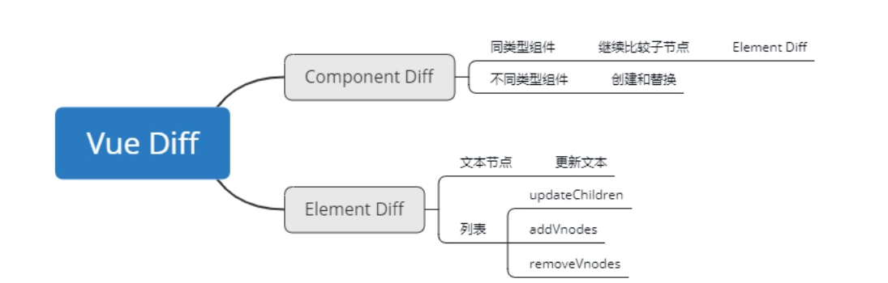

diff算法有两个比较显著的特点：

1、比较只会在同层级进行, 不会跨层级比较。

2、在diff比较的过程中，循环从两边向中间收拢。

diff流程： 首先定义 oldStartIdx、newStartIdx、oldEndIdx 以及 newEndIdx 分别是新老两个 VNode 的两边的索引。

接下来是一个 while 循环，在这过程中，oldStartIdx、newStartIdx、oldEndIdx 以及 newEndIdx 会逐渐向中间靠拢。while 循环的退出条件是直到老节点或者新节点的开始位置大于结束位置。

while 循环中会遇到四种情况：

情形一：当新老 VNode 节点的 start 是同一节点时，直接 patchVnode 即可，同时新老 VNode 节点的开始索引都加 1。

情形二：当新老 VNode 节点的 end 是同一节点时，直接 patchVnode 即可，同时新老 VNode 节点的结束索引都减 1。

情形三：当老 VNode 节点的 start 和新 VNode 节点的 end 是同一节点时，这说明这次数据更新后 oldStartVnode 已经跑到了 oldEndVnode 后面去了。这时候在 patchVnode 后，还需要将当前真实 dom 节点移动到 oldEndVnode 的后面，同时老 VNode 节点开始索引加 1，新 VNode 节点的结束索引减 1。

情形四：当老 VNode 节点的 end 和新 VNode 节点的 start 是同一节点时，这说明这次数据更新后 oldEndVnode 跑到了 oldStartVnode 的前面去了。这时候在 patchVnode 后，还需要将当前真实 dom 节点移动到 oldStartVnode 的前面，同时老 VNode 节点结束索引减 1，新 VNode 节点的开始索引加 1。

while 循环的退出条件是直到老节点或者新节点的开始位置大于结束位置。

情形一：如果在循环中，oldStartIdx大于oldEndIdx了，那就表示oldChildren比newChildren先循环完毕，那么newChildren里面剩余的节点都是需要新增的节点，把[newStartIdx, newEndIdx]之间的所有节点都插入到DOM中

情形二：如果在循环中，newStartIdx大于newEndIdx了，那就表示newChildren比oldChildren先循环完毕，那么oldChildren里面剩余的节点都是需要删除的节点，把[oldStartIdx, oldEndIdx]之间的所有节点都删除


##### 36. Vue组件中的Data为什么是函数，根组件却是对象呢？

综上可知，如果data是一个函数的话，这样每复用一次组件，就会返回一份新的data，类似于给每个组件实例创建一个私有的数据空间，让各个组件实例维护各自的数据。而单纯的写成对象形式，就使得所有组件实例共用了一份data，就会造成一个变了全都会变的结果。

所以说vue组件的data必须是函数。这都是因为js的特性带来的，跟vue本身设计无关。


##### 37. Vue的组件通信

1、props和$emit

父组件向子组件传递数据是通过prop传递的，子组件传递数据给父组件是通过$emit触发事件

2、$attrs和$listeners

3、中央事件总线 bus

上面两种方式处理的都是父子组件之间的数据传递，而如果两个组件不是父子关系呢？这种情况下可以使用中央事件总线的方式。新建一个Vue事件bus对象，然后通过bus.$emit触发事件，bus.$on监听触发的事件。

4、provide和inject

父组件中通过provider来提供变量，然后在子组件中通过inject来注入变量。不论子组件有多深，只要调用了inject那么就可以注入provider中的数据。而不是局限于只能从当前父组件的prop属性来获取数据，只要在父组件的生命周期内，子组件都可以调用。

5、v-model

父组件通过v-model传递值给子组件时，会自动传递一个value的prop属性，在子组件中通过this.$emit(‘input’,val)自动修改v-model绑定的值

6、$parent和$children

7、boradcast和dispatch

8、vuex处理组件之间的数据交互 如果业务逻辑复杂，很多组件之间需要同时处理一些公共的数据，这个时候才有上面这一些方法可能不利于项目的维护，vuex的做法就是将这一些公共的数据抽离出来，然后其他组件就可以对这个公共数据进行读写操作，这样达到了解耦的目的。

#####  38. 什么情况下使用 Vuex

```JS
如果应用够简单，最好不要使用 Vuex，一个简单的 store 模式即可，需要构建一个中大型单页应用时，使用Vuex能更好地在组件外部管理状态
```

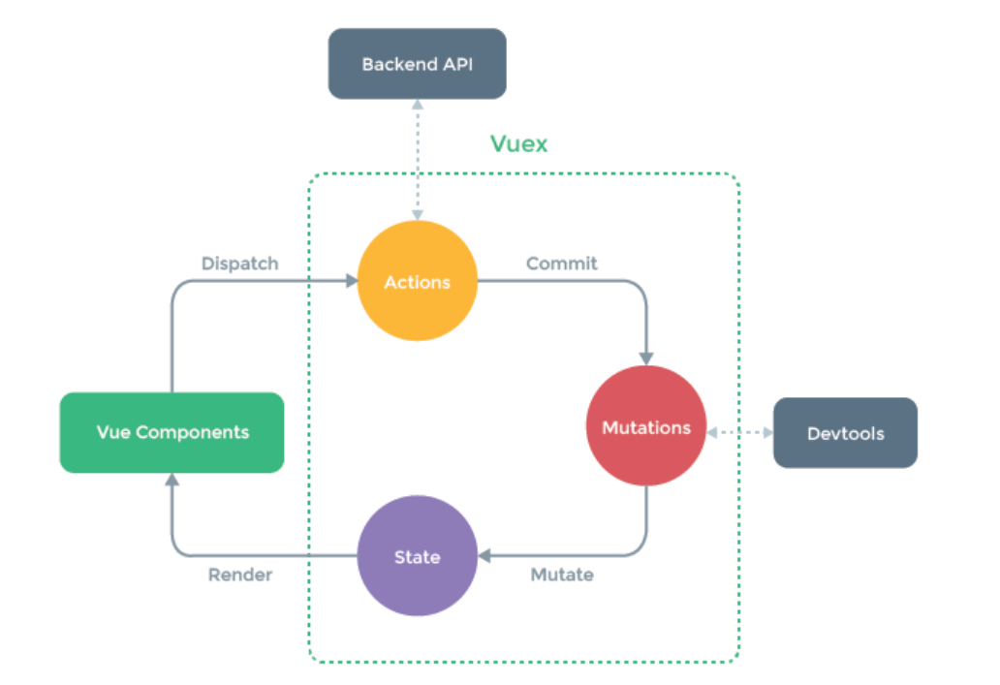

##### 39. Vuex可以直接修改state的值吗？

```JS
可以直接修改，但是极其不推荐，state的修改必须在mutation来修改，否则无法被devtool所监测，无法监测数据的来源，无法保存状态快照，也就无法实现时间漫游/回滚之类的操作。
```


##### 40. 为什么Vuex的mutation不能做异步操作

```JS
Vuex中所有的状态更新的唯一途径都是mutation，异步操作通过 Action 来提交 mutation实现，这样使得我们可以方便地跟踪每一个状态的变化，从而让我们能够实现一些工具帮助我们更好地了解我们的应用。每个mutation执行完成后都会对应到一个新的状态变更，这样devtools就可以打个快照存下来，否则无法被devtools所监测。如果mutation支持异步操作，就没有办法知道状态是何时更新的，无法很好的进行状态的追踪，给调试带来困难。
```

##### 41. 怎么修改Vuex中的状态？Vuex中有哪些方法

- 通过**this.$store.state.属性** 的方法来访问状态
- 通过**this.$store.commit(‘mutation中的方法’)** 来修改状态

##### 42. Vuex的缺点

```JS
如果您不打算开发大型单页应用，使用 Vuex 可能是繁琐冗余的，并且state中的值会伴随着浏览器的刷新而初始化，无缓存。
```

##### 43. 什么是 Vue.nextTick()？

1、$nextTick 是在下次DOM更新循环结束之后执行延迟回调。在修改数据之后立即使用这个方法，获取更新后的DOM，意思是 等你dom加载完毕以后再去调用nextTick()里面的数据内容


##### 44. nextTick知道吗、实现的原理是什么？是宏任务还是微任务？

微任务

原理：

nextTick方法主要是使用了宏任务和微任务，定义了一个异步方法，多次调用nextTick会将方法存入队列中，通过这个异步方法清空队列。

作用： nextTick用于下次Dom更新循环结束之后执行延迟回调，在修改数据之后使用nextTick用于下次Dom更新循环结束之后执行延迟回调，在修改数据之后使用nextTick用于下次Dom更新循环结束之后执行延迟回调，在修改数据之后使用nextTick,则可以在回调中获取更新后的DOM。

##### 45. 虚拟 dom 为什么会提高性能？

虚拟DOM其实就是一个JavaScript对象。通过这个JavaScript对象来描述真实DOM，真实DOM的操作，一般都会对某块元素的整体重新渲染，采用虚拟DOM的话，当数据变化的时候，只需要局部刷新变化的位置就好了 ,

虚拟`dom`相当于在`js`和真实`dom`中间加了一个缓存，利用`dom diff`算法避免了没有必要的`dom`操作，从而提高性能

**具体实现步骤如下**

- 用 `JavaScript` 对象结构表示 `DOM` 树的结构；然后用这个树构建一个真正的 `DOM` 树，插到文档当中
- 当状态变更的时候，重新构造一棵新的对象树。然后用新的树和旧的树进行比较，记录两棵树差异
- 把2所记录的差异应用到步骤1所构建的真正的`DOM`树上，视图就更新


##### 46. 你做过哪些Vue的性能优化？

1、首屏加载优化

2、路由懒加载

```js
{      
  path: '/',      
  name: 'home',      
  component: () => import('./views/home/index.vue'),      
  meta: { isShowHead: true }
}
```

3、开启服务器 Gzip

开启 Gzip 就是一种压缩技术，需要前端提供压缩包，然后在服务器开启压缩，文件在服务器压缩后传给浏览器，浏览器解压后进行再进行解析。首先安装 webpack 提供的`compression-webpack-plugin`进行压缩,然后在 vue.config.js：

```js
const CompressionWebpackPlugin = require('compression-webpack-plugin')
const productionGzipExtensions = ['js', 'css']......plugins: [      
  new CompressionWebpackPlugin(
    {        
      algorithm: 'gzip',        
      test:     new RegExp('\\.(' + productionGzipExtensions.join('|') +                 ')$'),            
      threshold: 10240,        
      minRatio: 0.8      
       }
)]....
```

4、启动 CDN 加速

我们继续采用 cdn 的方式来引入一些第三方资源，就可以缓解我们服务器的压力，原理是将我们的压力分给其他服务器点。

5、代码层面优化

- computed 和 watch 区分使用场景

  ```
  computed： 是计算属性，依赖其它属性值，并且 computed 的值有缓存，只有它依赖的属性值发生改变，下一次获取 computed 的值时才会重新计算 computed 的值。当我们需要进行数值计算，并且依赖于其它数据时，应该使用 computed，因为可以利用 computed 的缓存特性，避免每次获取值时，都要重新计算；
    watch：类似于某些数据的监听回调 ，每当监听的数据变化时都会执行回调进行后续操作；当我们需要在数据变化时执行异步或开销较大的操作时，应该使用 watch，使用 watch 选项允许我们执行异步操作 ( 访问一个 API )，限制我们执行该操作的频率，并在我们得到最终结果前，设置中间状态。这些都是计算属性无法做到的。
  ```

- v-if 和 v-show 区分使用场景 v-if 适用于在运行时很少改变条件，不需要频繁切换条件的场景；v-show 则适用于需要非常频繁切换条件的场景。这里要说的优化点在于减少页面中 dom 总数，我比较倾向于使用 v-if，因为减少了 dom 数量。

- v-for 遍历必须为 item 添加 key，且避免同时使用 v-if v-for 遍历必须为 item 添加 key，循环调用子组件时添加 key，key 可以唯一标识一个循环个体，可以使用例如 item.id 作为 key 避免同时使用 v-if，v-for 比 v-if 优先级高，如果每一次都需要遍历整个数组，将会影响速度。

6、Webpack 对图片进行压缩

7、避免内存泄漏

8、减少 ES6 转为 ES5 的冗余代码


##### 47. Vue的常用修饰符

**一、v-model修饰符**

1、.lazy：

输入框改变，这个数据就会改变，lazy这个修饰符会在光标离开input框才会更新数据：


2、.trim：

输入框过滤首尾的空格：


3、.number：

先输入数字就会限制输入只能是数字，先字符串就相当于没有加number，注意，不是输入框不能输入字符串，是这个数据是数字：

**二、事件修饰符**

4、.stop：

阻止事件冒泡，相当于调用了event.stopPropagation()方法：


5、.prevent：

阻止默认行为，相当于调用了event.preventDefault()方法，比如表单的提交、a标签的跳转就是默认事件：


6、.self：

只有元素本身触发时才触发方法，就是只有点击元素本身才会触发。比如一个div里面有个按钮，div和按钮都有事件，我们点击按钮，div绑定的方法也会触发，如果div的click加上self，只有点击到div的时候才会触发，变相的算是阻止冒泡：


7、.once：

事件只能用一次，无论点击几次，执行一次之后都不会再执行


8、.capture：

事件的完整机制是捕获-目标-冒泡，事件触发是目标往外冒泡

9、.sync

对prop进行双向绑定

10、.keyCode：

监听按键的指令，具体可以查看vue的键码对应表


##### 48. Vue 中 template 的编译过程

vue template模板编译的过程经过parse()生成ast(抽象语法树),optimize对静态节点优化，generate()生成render字符串 之后调用new Watcher()函数，用来监听数据的变化，render 函数就是数据监听的回调所调用的，其结果便是重新生成 vnode。 当这个 render 函数字符串在第一次 mount、或者绑定的数据更新的时候，都会被调用，生成 Vnode。 如果是数据的更新，那么 Vnode 会与数据改变之前的 Vnode 做 diff，对内容做改动之后，就会更新到 我们真正的 DOM


##### 49. 谈谈你对Vue3.0有什么了解？

###### 六大亮点

1. 性能比vue2.x快1.2~2倍
2. 支持tree-shaking，按需编译，体积比vue2.x更小
3. 支持组合API
4. 更好的支持TS
5. 更先进的组件

###### 性能比vue2.x快1.2~2倍如何实现的呢

1.diff算法更快

vue2.0是需要全局去比较每个节点的，若发现有节点发生变化后，就去更新该节点

vue3.0是在创建虚拟dom中，会根据DOM的的内容会不会发生内容变化，添加静态标记， 谁有flag！比较谁。

2、静态提升

vue2中无论元素是否参与更新，每次都会重新创建，然后再渲染 vue3中对于不参与更新的元素，会做静态提升，只被创建一次，在渲染时直接复用即可

3、事件侦听缓存

默认情况下，onclick为动态绑定，所以每次都会追踪它的变化，但是因为是同一函数，没有必要追踪变化，直接缓存复用即可

在之前会添加静态标记8 会把点击事件当做动态属性 会进行diff算法比较， 但是在事件监听缓存之后就没有静态标记了，就会进行缓存复用

###### 为什么vue3.0体积比vue2.x小

在vue3.0中创建vue项目 除了vue-cli，webpack外还有 一种创建方法是Vite Vite是作者开发的一款有意取代webpack的工具，其实现原理是利用ES6的import会发送请求去加载文件的特性，拦截这些请求，做一些预编译，省去webpack冗长的打包时间


##### 50. vue3.0组合API

说一说vue3.0的组合API跟之前vue2.0在完成业务逻辑上的区别：

在vue2.0中： 主要是往data 和method里面添加内容，一个业务逻辑需要什么data和method就往里面添加，而组合API就是 有一个自己的方法，里面有自己专注的data 和method。

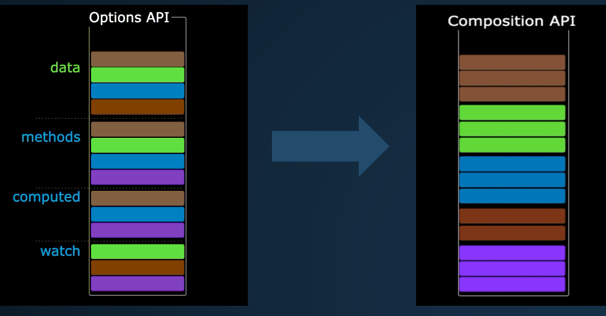

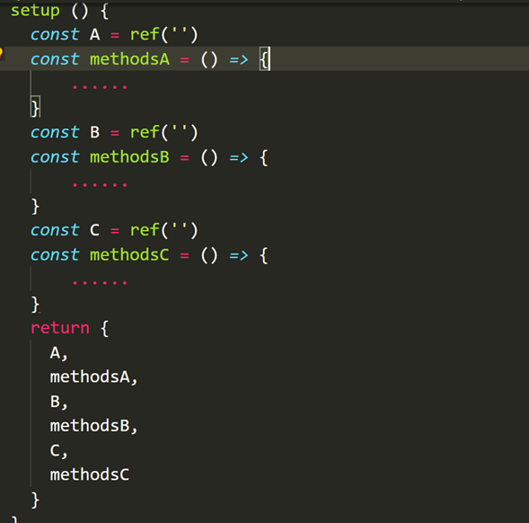

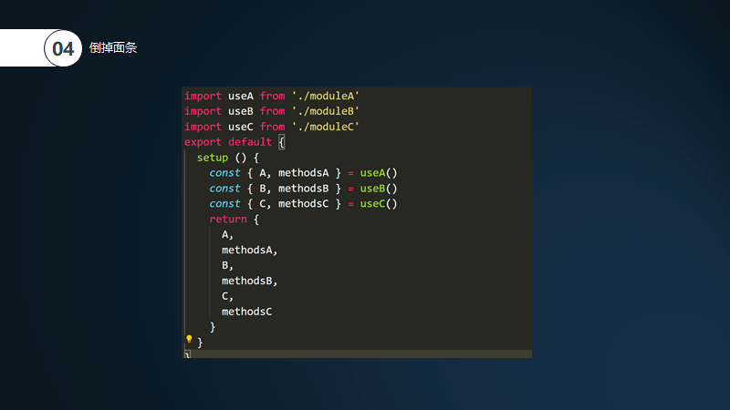

再说一下组合API的本质是什么： 首先composition API（组合API） 和 Option API（vue2.0中的data和method）可以共用 composition API（组合API）本质就是把内容添加到Option API中进行使用


##### 51. ref和reactive的简单理解

1.ref和reactive都是vue3的监听数据的方法，本质是proxy 2.ref 基本类型复杂类型都可以监听(我们一般用ref监听基本类型)，reactive只能监听对象（arr，json） 3.ref底层还是reactive，ref是对reactive的二次包装， ref定义的数据访问的时候要多一个.value


##### 52. Vuex和redux有什么区别？他们的共同思想。

###### Redux和Vuex区别

- Vuex改进了Redux中的Action和Reducer函数，以mutations变化函数取代Reducer，无需switch，只需在对应的mutation函数里改变state值就可以
- Vuex由于Vue自动重新渲染的特性，无需订阅重新渲染函数，只要生成新的state就可以
- Vuex数据流的顺序是:View调用store.commit提交对应的请求到Store中对应的mutation函数 -- store改变(vue检测到数据变化自动渲染)

###### 共同思想

- 单一的数据源
- 变化可以预测
- `本质上:`Redux和Vuex都是对MVVM思想的服务，将数据从视图中抽离的一种方案
- `形式上:`Vuex借鉴了Redux，将store作为全局的数据中心，进行数据管理


##### 53. 简单说一下 微信小程序 与 Vue 的区别

1、生命周期：

`小程序`的钩子函数要简单得多 。 `vue`的钩子函数在跳转新页面时，钩子函数都会触发，但是`小程序`的钩子函数，页面不同的跳转方式，触发的钩子并不一样。

在页面加载请求数据时，两者钩子的使用有些类似，`vue`一般会在`created`或者`mounted`中请求数据，而在`小程序`，会在`onLoad`或者`onShow`中请求数据。

2、数据绑定：

vue动态绑定一个变量的值为元素的某个属性的时候，会在变量前面加上冒号：

```js

```

小程序 绑定某个变量的值为元素属性时，会用两个大括号括起来，如果不加括号，为被认为是字符串

```js
<image src="{{imgSrc}}"></image>
```

3、列表循环

4、显示与隐藏元素

`vue`中，使用`v-if` 和`v-show`控制元素的显示和隐藏

`小程序`中，使用`wx-if`和`hidden`控制元素的显示和隐藏

5、事件处理

`vue`：使用`v-on:event`绑定事件，或者使用`@event`绑定事件

`小程序`中，全用`bindtap(bind+event)`，或者`catchtap(catch+event)`绑定事件

6、数据的双向绑定

在`vue`中,只需要再`表单`元素上加上`v-model`,然后再绑定`data`中对应的一个值，当表单元素内容发生变化时，`data`中对应的值也会相应改变 。

当表单内容发生变化时，会触发表单元素上绑定的方法，然后在该方法中，通过`this.setData({key:value})`来将表单上的值赋值给`data`中的对应值 。

7、绑定事件传参

在`vue`中，绑定事件传参挺简单，只需要在触发事件的方法中，把需要传递的数据作为形参传入就可以了

在`小程序`中，不能直接在绑定事件的方法中传入参数，需要将参数作为属性值，绑定到元素上的`data-`属性上，然后在方法中，通过`e.currentTarget.dataset.*`的方式获取

8、父子组件通信

父组件向子组件传递数据，只需要在子组件通过`v-bind`传入一个值，在子组件中，通过`props`接收，即可完成数据的传递

父组件向子组件通信和`vue`类似，但是`小程序`没有通过`v-bind`，而是直接将值赋值给一个变量 在子组件`properties`中，接收传递的值


##### 54. 如果你是leader，做管理系统项目 Vue和React 怎么选择？

```JS
 评估项目成员的水平，如果成员js基础较好、编码能力较强则选择React，否则Vue。
 评估系统的大小，如果想构建生态系统，则选择React，如果要求而快，简单和“能用就行",则选择Vue。
 评估系统运行环境，如果你想要一个同时适用于Web端和原生APP的框架，请选择React(RN)。
```

#### 八. React高频面试题

##### 1. 类组件和函数组件的区别

```js
/*            
            （1）语法上：函数组件是一个函数，返回一个jsx元素，而类组件是用es6语法糖class定义，继承component这个类
            （2）类组件中可以通过state进行状态管理，而在函数组件中不能使用setState()，在react16.8以后，函数组件可以通过hooks中的useState来模拟类组件中的状态管理；
            （3）类组件中有一系列的生命周期钩子函数，在函数组件中也需要借助hooks来使用生命周期函数；
            （4）类组件能够捕获最新的值（永远保持一致），这是因为当实例的props属性发生修改时，class组件能够直接通过this捕获到组件最新的props；而函数式组件是捕获渲染所使用的值，已经因为javascript闭包的特性，之前的props参数保存在内存之中，无法从外部进行修改。
*/
```

##### 2. React 事件绑定原理

```js
/*
        一、react并没有使用原生的浏览器事件，而是在基于Virtual DOM的基础上实现了合成事件，采用小驼峰命名法，默认的事件传播方式是冒泡，如果想改为捕获的话，直接在事件名后面加上Capture即可；事件对象event也不是原生事件对象，而是合成对象，但通过nativeEvent属性可以访问原生事件对象；
        二、react合成事件主要分为以下三个过程：
        1、事件注册
        在该阶段主要做了两件事：document上注册、存储事件回调。所有事件都会注册到document上，拥有统一的回调函数dispatchEvent来执行事件分发，类似于document.addEventListener("click",dispatchEvent)。
      register:
          addEventListener-click
          addEventListener-change

      listenerBank:
           {
                click: {key1: fn1, key2: fn2},
                change: {key1: fn3, key3: fn4}
           }
    2、事件合成
        事件触发后，会执行一下过程：
        （1）进入统一的事件分发函数dispatchEvent；
    （2）找到触发事件的 ReactDOMComponent；
    （3）开始事件的合成；
            —— 根据当前事件类型生成指定的合成对象
                —— 封装原生事件和冒泡机制
                —— 查找当前元素以及他所有父级
                —— 在listenerBank根据key值查找事件回调并合成到 event(合成事件结束)
   3、批处理
           批量处理合成事件内的回调函数
*/
```

##### 3. React中的 setState 缺点是什么呢

```js
/*
        setState执行的时候可以简单的认为，隶属于原生js执行的空间，那么就是属于同步，被react处理过的空间属于异步，这其实也是一种性能的优化，如果多次使用setState修改值，那么在异步中会先进行合并，再进行渲染，降低了操作dom的次数，具体如下：

        （1）setState 在合成事件和钩子函数中是“异步”的，在原生事件和 `setTimeout` 中都是同步的。
        （2）setState的“异步”并不是说内部由异步代码实现，其实本身执行的过程和代码都是同步的，只是合成事件和钩子函数的调用顺序在更新之前，导致在合成事件和钩子函数中没法立马拿到更新后的值，形式了所谓的“异步”，当然可以通过第二个参数 setState(partialState, callback) 中的callback拿到更新后的结果。
        （3）setState 的批量更新优化也是建立在“异步”（合成事件、钩子函数）之上的，在原生事件和setTimeout 中不会批量更新，在“异步”中如果对同一个值进行多次 setState， setState 的批量更新策略会对其进行覆盖，取最后一次的执行，如果是同时 setState 多个不同的值，在更新时会对其进行合并批量更新。
        （4）正是由于setState存在异步的机制，如果setState修改值的时候依赖于state本身的值，有时候并不可靠，这时候我们需要传入一个回调函数作为其入参，这个回调函数的第一个参数为更新前的state值。
*/
```

##### 4. React 组件中 props 和 state 有什么区别？

```js
/*
        1、props是从外部传入组件的参数，一般用于父组件向子组件通信，在组件之间通信使用；state一般用于组件内部的状态维护，更新组建内部的数据，状态，更新子组件的props等
        2、props不可以在组件内部修改，只能通过父组件进行修改；state在组件内部通过setState修改；
*/
```

##### 5. 虚拟DOM的优劣如何？实现原理？

```js
/*
        虚拟dom是用js模拟一颗dom树,放在浏览器内存中，相当于在js和真实dom中加了一个缓存，利用dom diff算法避免了没有必要的dom操作，从而提高性能。
        优点：
        （1）虚拟DOM具有批处理和高效的Diff算法,最终表现在DOM上的修改只是变更的部分，可以保证非常高效的渲染,优化性能；
        （2）虚拟DOM不会立马进行排版与重绘操作，对虚拟DOM进行频繁修改，最后一次性比较并修改真实DOM中需要改的部分；
        （3）虚拟 DOM 有效降低大面积真实 DOM 的重绘与排版，因为最终与真实 DOM 比较差异，可以只渲染局部；
        缺点：
        （1）首次渲染大量DOM时，由于多了一层虚拟DOM的计算，会比innerHTML插入慢；

      

        虚拟DOM的组成——ReactElementelement对象结构：
        （1）type：元素的类型，可以是原生html类型（字符串），或者自定义组件（函数或class）
        （2）key：组件的唯一标识，用于Diff算法，下面会详细介绍
        （3）ref：用于访问原生dom节点
        （4）props：传入组件的props，chidren是props中的一个属性，它存储了当前组件的孩子节点，可以是数组（多个孩子节点）或对象（只有一个孩子节点）
        （5）owner：当前正在构建的Component所属的Component
        （6）self：（非生产环境）指定当前位于哪个组件实例
        （7）_source：（非生产环境）指定调试代码来自的文件(fileName)和代码行数(lineNumber)
*/
```

#####  6. diff 和 Key 之间的联系

```js
/*
            diff算法即差异查找算法，对于DOM结构即为tree的差异查找算法，只有在React更新阶段才会有Diff算法的运用；react的diff运算为了降低时间复杂度，是按层比较新旧两个虚拟dom树的。diff运算的主要流程见下：

            1、tree diff : 新旧两棵dom树，逐层对比的过程就是 tree diff, 当整棵DOM树逐层对比完毕，则所有需要被按需更新的元素，必然能够被找到。
        2、component diff ： 在进行tree diff的时候，每一层中，都有自己的组件，组件级别的对比，叫做 component diff。如果对比前后，组件的类型相同，则暂时认为此组件不需要更新；如果对比前后，组件的类型不同，则需要移除旧组件，创建新组件，并渲染到页面上。
        React只会匹配类型相同的组件，也就是说如果<A>被<B>替换，那么React将直接删除A组件然后创建一个B组件；如果某组件A转移到同层B组件上，那么这个A组件会先被销毁，然后在B组件下重新生成，以A为根节点的树整个都被重新创建，这会比较耗费性能，但实际上我们很少跨层移动dom节点，一般都是同层横向移动；
        3、element diff ：在进行组件对比的时候，如果两个组件类型相同，则需要进行元素级别的对比，这叫做element diff。
        对于列表渲染，react会在创建时要求为每一项输入一个独一无二的key，这样就能进行高效的diff运算了。比如我们要在b和c节点中间插入一个节点f，jquery会将f这个节点后面的每一个节点都进行更新，比如c更新成f，d更新成c，e更新成d，这样操作的话就会特别多，而加了key的react咋不会频繁操作dom，而是优先采用移动的方式，找到正确的位置去插入新节点；所以我们不能省略key值，因为在对比两个新旧的子元素是，是通过key值来精确地判断两个节点是否为同一个，如果没有key的话则是见到谁就更新谁，非常耗费性能。
            当我们通过this.setState()改变数据的时候，React会将其标记为脏节点，在事件循环的最后才会重新渲染所有的脏节点以及脏节点的子树；另外我们可以使用shouldComponentUpdate这个生命周期来选择性的渲染子树，可以基于组件之前的状态或者下一个状态来决定它是否需要重新渲染，这样的话可以组织重新渲染大的子树。
*/
```

##### 7. React组件通信如何实现

```js
/*
        react本身:
                (1)props——父组件向子组件通过props传参
                (2)实例方法——在父组件中可以用 refs 引用子组件，之后就可以调用子组件的实例方法了
                (3)回调函数——用于子组件向父组件通信，子组件调用props传递过来的方法
                (4)状态提升——两个子组件可以通过父组件定义的参数进行传参
                (5)Context上下文——一般用作全局主题

            状态管理:
                (1) mobx/redux/dva——通过在view中触发action，改变state，进而改变其他组件的view
*/
```

##### 8. React中refs的作用是什么？

```jsx
// ref是React提供的用来操纵React组件实例或者DOM元素的接口。主要用来做文本框的聚焦、触发强制动画等；
// 类组件
class Foo extends React.Component {
      constructor(props) {
        super(props)
        this.myRef = React.createRef()
      }
      render() {
            return 
                  <div>
                <input ref={ this.myRef } />
                <button onClick = {()=>this.handle()}>聚焦</button>
               </div>
      }
      handle() {
          // 通过current属性访问到当前元素
            this.myRef.current.focus()
      }
}
// 函数组件
function Foo() {
  const inputEl = useRef(null)
  const handle = () => {
        inputEl.current.focus()
  }
  return 
          <div>
                <input type="text" ref={ inputEl }/>
            <button onClick = {handle}>聚焦</button>
      </div>
}
```

##### 9. 请列举react生命周期函数。

```js
/*
第一阶段：装载阶段3
    constructor()
    render()
    componentDidMount()
第二阶段：更新阶段2
    [shouldComponentUpdate()]
    render()
    componentDidUpdate()
第三阶段：卸载阶段1
    componentWillUnmount()

constructor生命周期：
    (1)当react组件实例化时，是第一个运行的生命周期；
    (2)在这个生命周期中，不能使用this.setState()；
    (3)在这个生命周期中，不能使用副作用(调接口、dom操作、定时器、长连接等)；
    (4)不能把props和state交叉赋值；

componentDidMount生命周期：
    (1)相当于是vue中的mounted；
    (2)它表示DOM结构在浏览器中渲染已完成；
    (3)在这里可以使用任何的副作用；

shouldComponentUpdate(nextProps,nextState)生命周期：
    (1)相当于一个开关，如果返回true则更新机制正常执行，如果为false则更新机制停止；
    (2)在vue中是没有的；
    (3)存在的意义：可以用于性能优化，但是不常用，最新的解决方案是使用PureComponent；
    (4)理论上，这个生命周期的作用，用于精细地控制声明式变量的更新问题，如果变化的声明式变量参与了视图渲染则返回true，如果被变化的声明式变量没有直接或间接参与视图渲染，则返回false；

componentDidUpdate生命周期：
    (1)相当于vue中的updated()；
    (2)它表示DOM结构渲染更新已完成，只发生在更新阶段；
    (3)在这里，可以执行大多数的副作用，但是不建议；
    (4)在这里，可以使用this.setState()，但是要有终止条件判断。

componentWillUnmount生命周期：
    (1)一般在这里清除定时器、长连接等其他占用内存的构造器；

render生命周期：
    (1)render是类组件中唯一必须有的生命周期，同时必须有return（return 返回的jsx默认只能是单一根节点，但是在fragment的语法支持下，可以返回多个兄弟节点）；
    (2)Fragment碎片写法: <React.Fragment></React.Fragment> 简写成<></>；
    (3)return之前，可以做任意的业务逻辑，但是不能使用this.setState()，会造成死循环；
    (4)render()在装载阶段和更新阶段都会运行；
    (5)当render方法返回null的时候，不会影响生命周期函数的正常执行。
*/
```

##### 10. A 组件嵌套 B 组件，生命周期执行顺序

```js
/*
    父组件创建阶段的生命周期钩子函数 constructor
    父组件创建阶段的生命周期钩子函数 render
    子组件创建阶段的生命周期钩子函数 constructor
    子组件创建阶段的生命周期钩子函数 render
    子组件创建阶段的生命周期钩子函数 componentDidMount
    父组件创建阶段的生命周期钩子函数 componentDidMount
*/
```

#####  11. 新出来两个钩子函数？和砍掉的will系列有啥区别？

```js
// react16 中废弃了三个钩子
componentWillMount                     // 组件将要挂载的钩子
componentWillReceiveProps        // 组件将要接收一个新的参数时的钩子
componentWillUpdate                    // 组件将要更新的钩子

// 新增了方法
getDerivedStateFromProps        // 静态方法
getSnapshotBeforeUpdate

/*
        在16.8版本以后，react将diff运算改进为Fiber，这样的话当我们调用setState方法进行更新的时候，在reconciler 层中js运算会按照节点为单位拆分成一个个小的工作单元，在render前可能会中断或恢复，就有可能导致在render前这些生命周期在进行一次更新时存在多次执行的情况，此时如果我们在里面使用ref操作dom的话，就会造成页面频繁重绘，影响性能。
        所以废弃了这几个will系列的勾子，增加了 getDerivedStateFromProps这个静态方法，这样的话我们就不能在其中使用this.refs以及this上的方法了；getSnapshotBeforeUpdate 这个方法已经到了commit阶段，只会执行一次，给想读取 dom 的用户一些空间。
*/
```

##### 12. React hooks 用过吗，为什么要用？

```js
/*
        Hooks 是React在16.8版本中出的一个新功能，本质是一种函数，可以实现组件逻辑复用，让我们在函数式组件中使用类组件中的状态、生命周期等功能，hooks的名字都是以use开头。

        react：
        1、useState——创建状态
                接收一个参数作为初始值；返回一个数组，第一个值为状态，第二个值为改变状态的函数
        2、useEffect——副作用（数据获取、dom操作影响页面——在渲染结束之后执行
                (1)第一个参数为函数，第二个参数为依赖列表，只有依赖更新时才会执行函数；返回一个函数，当页面刷新的时候先执行返回函数再执行参数函数
                (2)如果不接受第二个参数，那么在第一次渲染完成之后和每次更新渲染页面的时候，都会调用useEffect的回调函数
    3、useRef
        返回一个可变的ref对象，此索引在整个生命周期中保持不变。可以用来获取元素或组件的实例，用来做输入框的聚焦或者动画的触发。    
    4、useMemo——优化函数组件中的功能函数——在渲染期间执行
       （1）接收一个函数作为参数，同样接收第二个参数作为依赖列表，返回值可以是任何，函数、对象等都可以
       （2）这种优化有助于避免在每次渲染时都进行高开销的计算，仅会在某个依赖项改变时才重新计算            
        5、useContext——获取上下文注入的值    
                (1)接受一个context 对象，并返回该对象<MyContext.Provider> 元素的 value值；
                        const value = useContext(MyContext)；        
        6、useLayoutEffect——有DOM操作的副作用——
        简单来说就是调用时机不同，`useLayoutEffect`和原来`componentDidMount`&`componentDidUpdate`一致，在react完成DOM更新后马上**同步**调用的代码，会阻塞页面渲染。而`useEffect`是会在整个页面渲染完才会调用的代码。

官方建议优先使用`useEffect`

> However, **we recommend starting with useEffect first** and only trying useLayoutEffect if that causes a problem.

在实际使用时如果想避免**页面抖动**（在`useEffect`里修改DOM很有可能出现）的话，可以把需要操作DOM的代码放在`useLayoutEffect`里。在这里做点dom操作，这些dom修改会和 react 做出的更改一起被一次性渲染到屏幕上，只有一次回流、重绘的代价。
        7、useCallback——与useMemo类似
                useMemo与useCallback相同，接收一个函数作为参数，也同样接收第二个参数作为依赖列表；useCallback是对传过来的回调函数优化，返回的是一个函数

react-router:
        被route包裹的组件，可以直接使用props进行路由相关操作，但是没有被route包裹的组件只能用withRouter高阶组件修饰或者使用hooks进行操作
        1、useHistory——跳转路由
        2、useLocation——得到url对象
        3、useParams——得到url上的参数

react-redux:
        1、useSelector——共享状态——从redux的store中提取数据
        2、useDispatch——共享状态——返回edux的store中对dispatch的引用    
*/
```

```js
const getCinemaList = useMemo(() => cinemaList.filter(item=>item.name.toUpperCase().includes(mytext.toUpperCase()) || 
    item.address.toUpperCase().includes(mytext.toUpperCase())
    ), [cinemaList,mytext])
```

##### 13. hooks 的使用有什么注意事项

```js
/*
        （1）只能在React函数式组件或自定义Hook中使用Hook。
        （2）不要在循环，条件或嵌套函数中调用Hook，必须始终在React函数的顶层使用Hook。这是因为React需要利用调用顺序来正确更新相应的状态，以及调用相应的钩子函数。一旦在循环或条件分支语句中调用Hook，就容易导致调用顺序的不一致性，从而产生难以预料到的后果。
*/
```


##### 14. Hooks 会取代 `render props` 和高阶组件吗？

[官方简答](https://zh-hans.reactjs.org/docs/hooks-faq.html#do-hooks-replace-render-props-and-higher-order-components)

> - 可以取代，但没必要
> - 在Hook的渐进策略中也有提到，没有计划从React中移除class，在新的代码中同时使用Hook和class，所以这些方案目前还是可以有勇武之地

**what**

> - 为什么要把这3种技术拿过来对比？
>
> > 都在处理同一个问题，***逻辑复用\***
>
> - [高阶组件HOC](https://zh-hans.reactjs.org/docs/higher-order-components.html)---不是 *React API* 的一部分，是基于 *React* 的**组合特性**形成的设计模式。
>
> > 高阶组件是参数为组件，返回值为新组件的**函数**（将组件转换为另一个组件，纯函数，无副作用）
>
> - [Render Props](https://zh-hans.reactjs.org/docs/render-props.html#gatsby-focus-wrapper)
>
> > 是指一种在 *React* 组件之间使用一个值为函数的 *prop* 共享代码的 **简单技术？**
>
> - [Hooks](https://zh-hans.reactjs.org/docs/hooks-intro.html)
>
> > React16.8新增的特性，是一些可以让你在函数组件里“钩入”React state及生命周期等特性的函数，

**why**

> 虽然 ***HOC\*** & ***Render Props\*** 能处理逻辑复用的问题，但是却存在各自的问题。
>
> ***HOC\*** 存在的问题
>
> > - 写法破坏了原来组件的结构，DevTools中组件会形成“嵌套地狱”
> > - 不要在 **render** 方法中使用 **HOC** 每次调用render函数会创建一个新的高阶组件导致该组件及其子组件的状态丢失
> > - 需要修复静态方法，即拷贝原组件的静态方法到高级组件中
> > - 如需传递Ref则需要通过React.forwardRef创建组件
>
> ***Render Props\*** 存在的问题
>
> > - 同样的写法会破坏原来组件的结构，DevTools中组件会形成“嵌套地狱”
> > - 与React.PureComponent组件使用有冲突
>
> ***Hook\*** 目前最优雅的实现，React为共享状态逻辑提供最好的原生途径
>
> > - 没有破坏性改动，完全可选，100%向后兼容
> > - 解决复杂组件，中逻辑状态、副作用和各种生命周期函数中逻辑代码混在一起，难以拆分，甚至形成bug的问题
> > - 处理class组件中

**when**

> - 在函数组件中意识到要向其添加一些state---useState
> - 有副作用的行为时

**where**

> - 只能在函数最外层调用Hook，不要在循环、条件判断或者子函数中调用
> - 只能在函数组件或者自定义Hook中调用Hook

##### 15. 列举重新渲染 render 的情况

```js
this.setState() 
this.forceUpdate()
// 接受到新的props
// 通过状态管理，mobx、redux等
// 改变上下文
```

##### 16. 如何避免组件的重新渲染？


> 当porps/state改变时组件会执行render函数也就是重新渲染
>
> - class组件中 使用shouldComponentUpdate钩子函数
> - PureComponent默认有避免重新渲染的功能
> - 函数组件使用高阶组件memo处理


#####  17. 渲染一个react组件的过程

```jsx
/*
        1、babel编译
        当我们对代码进行编译的时候，babel会将我们在组件中编写的jsx代码转化为React.createElement的表达式，createElement方法有三个参数，分别为type(元素类型）、attributes(元素所有属性)、children(元素所有子节点)；
        2、生成element
        当render方法被触发以后，createElement方法会执行，返回一个element对象，这个对象描述了真实节点的信息，其实就是虚拟dom节点；
        3、生成真实节点(初次渲染)
        这时候我们会判断element的类型，如果是null、false则实例一个ReactDOMEmptyComponent对象; 是string、number类型的话则实例一个ReactDOMTextComponent对象； 如果element是对象的话，会进一步判断type元素类型，是原生dom元素，则实例化ReactDOMComponent； 如果是自定义组件，则实例化ReactCompositeComponentWrapper；
        在这些类生成实例对象的时候，在其内部会调用 mountComponent方法，这个方法里面有一系列浏览器原生dom方法，可以将element渲染成真实的dom并插入到文档中；
        4、生命周期
        componentDidMount：会在组件挂载后(插入DOM树中) 立即调用。一般可以在这里请求数据；
        componentDidUpdate：会在数据更新后立即调用，首次渲染不会执行此方法；可以在其中直接调用 setState，但必须用if语句进行判断，防止死循环；
        conponentWillUnmount：会在组件卸载及销毁之前调用，在此方法中执行必要的清理操作，如清除timer；
        static getDerivedStateFromProps(prps,state)：这个生命周期函数代替了componentWillMount和componentWillUpdate生命周期；props和state发生改变则调用，在初始化挂载及后续更新时都会被调用，返回一个对象来更新state，如果返回null则不更新任何内容；
        shouldComponentUpdate(nextProps,nextState)：这个生命周期函数的返回值用来判断React组件是否因为当前 state 或 props 更改而重新渲染，默认返回值是true；这个方法在初始化渲染或使用forceUpdate()时不会调用；当将旧的state的值原封不动赋值给新的state（即不改变state的值，但是调用了setState）和 无数据交换的父组件的重新渲染都会导致组件重新渲染，这时候都可以通过shouldComponentUpdate来优化。
*/
```


##### 18. 类组件怎么做性能优化？函数组件怎么做性能优化？

```js
/*
类组件：
    （1）使用shouldComponentUpdate：这个生命周期可以让我们决定当前状态或属性的改变是否重新渲染组件，默认返回ture，返回false时不会执行render，在初始化渲染或使用forceUpdate()时不会调用；如果在shouldComponentUpdate比较的值是引用类型的话，可能达不到我们想要的效果，因为引用类型指向同一个地址；
        当将旧的state的值原封不动赋值给新的state（即不改变state的值，但是调用了setState）和 无数据交换的父组件的重新渲染都会导致组件重新渲染，这时候都可以通过shouldComponentUpdate来优化；
    （2）React.PureComponent：基本上和Component用法一致，不同之处在于 PureComponent不需要开发者自己设置shouldComponentUpdate，因为PureComponent自带通过props和state的浅对比来实现 shouldComponentUpate；但是如果props和state对象包含复杂的数据结构，它可能会判断错误(表现为对象深层的数据已改变，视图却没有更新）；
    （3）使用Immutable：immutable是一种持久化数据，一旦被创建就不会被修改，修改immutable对象的时候返回新的immutable；也就是说在使用旧数据创建新数据的时候，会保证旧数据同时可用且不变；为了避免深度复制所有节点的带来的性能损耗，immutable使用了结构共享，即如果对象树中的一个节点发生变化，只修改这个节点和受他影响的父节点，其他节点仍然共享；
    （4）bind函数：在react中改变this的指向有三种方法，a)constructor中用bind绑定; b)使用时通过bind绑定; 3)使用箭头函数；选择第一种只在组件初始化的时候执行一次，第二种组件在每次render都要重新绑定，第三种在每次render时候都会生成新的箭头函数，所以选择第一种；

函数组件：
    （1）useCallback：接收一个函数作为参数，接收第二个参数作为依赖列表，返回值为函数，有助于避免在每次渲染时都进行高开销的计算，仅会在某个依赖项改变时才重新计算；可以使用useCallback把要传递给子组件的函数包裹起来，这样父组件刷新的时候，传递给子组件的函数指向不会发生改变，可以减少子组件的渲染次数；
            const handleUseCallback=useCallback(handleClick,[])
            <Child handleClick={handleUseCallback} />
    （2）useMemo：useMemo的使用和useCallback差不多，只是useCallback返回的是一个函数，useMemo返回值可以是函数、对象等都可以；

两者都可使用：
    （1）React.memo：React.memo 功能同React.PureComponent，但React.memo是高阶组件，既可以用在类组件中也可以用在函数组件中；memo还可以接收第二个参数，是一个可定制化的比较函数，其返回值与 shouldComponentUpdate的相反；
    （2）使用key：在列表渲染时使用key，这样当组件发生增删改、排序等操作时，diff运算后可以根据key值直接调整DOM顺序，避免不必要的渲染而避免性能的浪费；
    （3）不要滥用props：尽量只传需要的数据，避免多余的更新，尽量避免使用{…props}；
*/
```


##### 19. React 按需加载

```js
// 1、使用React.lazy， 但是React.lazy技术还不支持服务端渲染
const OtherComponent = React.lazy(() => import('./OtherComponent'))
// 2、使用Loadable Components这个库
import loadable from '@loadable/component'
const OtherComponent = loadable(() => import('./OtherComponent'))
```

#####  20. 纯函数有什么特点，副作用函数特点

```js
/*
        纯函数与外界交换数据只有一个唯一渠道——参数和返回值；函数从函数外部接受的所有输入信息都通过参数传递到该函数内部；函数输出到函数外部的所有信息都通过返回值传递到该函数外部。
        纯函数的优点：无状态，线程安全；纯函数相互调用组装起来的函数，还是纯函数；应用程序或者运行环境可以对纯函数的运算结果进行缓存，运算加快速度。
        函数副作用是指当调用函数时，除了返回函数值之外，还对主调用函数产生附加的影响。比如调接口、修改全局变量、抛出一个异常或以一个错误终止、打印到终端或读取用户输入、读取或写入一个文件等，所以说副作用是编程中最关键的部分，因为我们需要跟用户、跟数据进行交互。
*/
```

#####  21 React 中的StrictMode(严格模式)是什么？

```js
/*
    React的StrictMode是一种辅助组件，用<StrictMode />包装组件，可以帮助我们编写更好的react组件，不会渲染出任何可见的ui；仅在开发模式下运行，它们不会影响生产构建，可以做以下检查：
    （1）验证内部组件是否遵循某些推荐做法，如果没有，会在控制台给出警告；
    （2）验证是否使用的已经废弃的方法，如果有，会在控制台给出警告；
    （3）通过识别潜在的风险预防一些副作用。
*/
```

##### 22. 如何在 React 的 Props 上应用验证？

> 使用PropTypes进行类型检查

[PropTypes](https://zh-hans.reactjs.org/docs/typechecking-with-proptypes.html#gatsby-focus-wrapper)自React v15.5起，请使用这个库[prop-types](https://www.npmjs.com/package/prop-types)

What & Why & When

> - 随着应用的不断增长，也是为了使程序设计更加严谨，我们通常需要对数据的类型（值）进行一些必要的验证
> - 出于性能方面的考虑，propTypes仅在开发模式下进行检测,在程序运行时就能检测出错误，不能使用到用户交互提醒用户操作错误等
> - 也可以使用[Flow](https://flow.org/)或者[TypeScript](https://www.typescriptlang.org/)做类型检查，后期建议用typescript进行替代更好

Where

> - class组件
> - 函数组件
> - [React.memo](https://zh-hans.reactjs.org/docs/react-api.html#reactmemo)高阶组件 ***可自行扩展\***
> - [React.forwardRef](https://zh-hans.reactjs.org/docs/react-api.html#reactforwardref)组件 ***可自行扩展\***

How

> 我们在组件类下添加一个静态属性 propTypes (属性名不能更改)，它的值也是一个对象，用来设置组件中props的验证规则，key 是要验证的属性名称，value 是验证规则。

```js
// 类组件
import PropTypes from 'prop-types';
class Greeting extends React.Component {
  render() {
    return (
      <h1>Hello, {this.props.name}</h1>
    );
  }
}
// 指定 props 的默认值：
Greeting.defaultProps = {
  name: 'Stranger'
};
// 类组件在这里做检测
Greeting.propTypes = {
  // v15.4 and below
  // name: React.PropTypes.string
  name: PropTypes.string
};

// 函数组件
function HelloWorldComponent({ name }) {
  return (
    <div>Hello, {name}</div>
  )
}
// 函数组件在这里做检测
HelloWorldComponent.propTypes = {
  name: PropTypes.string
}
export default HelloWorldComponent
```

##### 23. 什么是高阶组件、受控组件及非受控组件？都有啥区别


***定义\***

> - [高阶组件HOC](https://zh-hans.reactjs.org/docs/higher-order-components.html)---不是 *React API* 的一部分，是基于 *React* 的**组合特性**形成的设计模式。
>
> > 高阶组件是参数为组件，返回值为新组件的**函数**（将组件转换为另一个组件，纯函数，无副作用）
>
> - [受控组件](https://zh-hans.reactjs.org/docs/forms.html#controlled-components)
>
> > 在表单元素中，state是唯一数据源，渲染表单的React组件控制着用户输入过程中表单发生的操作。被React以这种方式控制取值的表单输入元素叫做受控组件
>
> - [非受控组件](https://zh-hans.reactjs.org/docs/uncontrolled-components.html)
>
> > 表单数据由DOM节点来处理，而不是用state来管理数据，一般可以使用ref来从DOM节点中获取表单数据

***区别\***

> - 受控组件和非受控组件是表单中的组件，高阶组件相当于对某个组件注入一些属性方法
> - 高阶组件是解决代码复用性问题产生的技术
> - 受控组件必须要有一个value，结合onChange来控制这个value，取值为event.target.value/event.target.checked
> - 非受控组件相当于操作DOM，一般有个defaultValue，通过onBlur触发响应方法

##### 24. 请你说说React的路由是什么？

```js
/*
        路由分为前端路由和后端路由，后端路由是服务器根据用户发起的请求而返回不同内容，前端路由是客户端根据不同的URL去切换组件；在web应用前端开发中，路由系统是最核心的部分，当页面的URL发生改变时，页面的显示结果可以根据URL的变化而变化，但是页面不会刷新。

        react生态中路由通常是使用react-router来进行配置，其主要构成为：
（1）Router——对应路由的两种模式，包括<BrowsersRouter>与<HashRouter>；
（2）route matching组件——控制路径对应的显示组件，可以进行同步加载和异步加载，<Route>；
（3）navigation组件——用做路由切换和跳转，<Link>；

        BrowserRouter与HashRouter的区别：
（1）底层原理不一样：BrowserRouter使用的是H5的history API，不兼容IE9及以下版本；HashRouter使用的是URL的哈希值；
（2）path表现形式不一样：BrowserRouter的路径中没有#,例如：localhost:3000/demo/test；HashRouter的路径包含#,例如：localhost:3000/#/demo/test；
（3）刷新后对路由state参数的影响：BrowserRouter没有任何影响，因为state保存在history对象中；HashRouter刷新后会导致路由state参数的丢失；
*/
```

##### 25. React路由懒加载的实现

- ***原理\***

> - webpack代码分割
> - React利用 React.lazy与import()实现了渲染时的动态加载
> - 利用Suspense来处理异步加载资源时页面应该如何显示的问题

- *1.React.lazy*

> - 通过lazy() api来动态import需要懒加载的组件
> - import的组件目前只支持export default的形式导出
> - Suspense来包裹懒加载的组件进行加载，可以设置fallback现实加载中效果
> - React.lazy可以结合Router来对模块进行懒加载。

```jsx
import { BrowserRouter as Router, Route, Switch } from 'react-router-dom';
import { Suspense, lazy } from 'react';
const Home = lazy(() => import('./routes/Home'))
const AnyComponent = lazy(() => import('./routes/AnyComponent'))

...
return (
  <Router>
    <Suspense fallback={<div>Loading...</div>}>
      <Switch>
        <Route exact path="/" component={Home}/>
        <Route path="/anyManage" component={AnyComponent}/>
        ...
      </Switch>
    </Suspense>
  </Router>
```

- *2.react-loadable*

> react-loadable是以组件级别来分割代码的，这意味着，我们不仅可以根据路由按需加载，还可以根据组件按需加载，使用方式和路由分割一样，只用修改组件的引入方式即可

```js
// 路由懒加载（异步组件）
import Loadable from 'react-loadable';
//通用过场组件
const LoadingComponent = () => {
  return (
    <div>loading</div>
  )
}
...
export default (loader, loading=LoadingComponent) => {
  return Loadable({
    loader,
    loading
  })
}

//Route中调用
import { BrowserRouter, Route } from 'react-router-dom'
const loadable from './loadable';
const AnyComponent = loadable(() => import('./AnyComponent'))
const Routes = () => (
  <BrowserRouter>
    <Route path="/home" component={AnyComponent}/>
  </BrowserRouter>
);
export default Routes;
```

- *3.webpack配置中使用lazyload-loader*

```js
// webpack 配置中
module: {
 rules: [
 {
 test: /.(js|jsx)$/,,
 use: [
 'babel-loader',
 'lazyload-loader'
 ]
},

// 业务代码中
// 使用lazy! 前缀 代表需要懒加载的Router
 import Shop from 'lazy!./src/view/Shop';
 // Router 正常使用
 <Route path="/shop" component={Shop} />
```

- *4.import()* webpack v2+

> 符合ECMAScript提议的import()语法，该提案与普通 import 语句或 require 函数的类似，但返回一个 Promise 对象

```js
function component() {
 return import( /* webpackChunkName: "lodash" */ 'lodash').then(_ => {
 var element = document.createElement('div');
 element.innerHTML = _.join(['Hello', 'webpack'], ' ');
 return element;
 }).catch(error => 'An error occurred while loading the component');
}
// 或者使用async
async function getComponent() {
 var element = document.createElement('div');
 const _ = await import(/* webpackChunkName: "lodash" */ 'lodash');
 element.innerHTML = _.join(['Hello', 'webpack'], ' ');
 return element;
}
```

- *5.requre.ensure* webpack v1 v2

```js
require.ensure([], function(require){
 var list = require('./list');
 list.show();
，'list');
<!-- Router -->
const Foo = require.ensure([], () => {
 require("Foo");
}, err => {
 console.error("We failed to load chunk: " + err);
}, "chunk-name");
//react-router2 or 3
<Route path="/foo" getComponent={Foo} />
```

##### 26. React-router-dom内部是怎么样实现的，怎么做路由守卫？

###### 内部实现

- 总

> react-router-dom利用了Context API，通过上下文对象将当前路由信息对象注入到 *Router* 组件中，所以 *Router* 组件中 *render()* 渲染的内容就是 *ContextAPI* 提供的 *Provider* 组件，然后接收 *Router* 组件中的当前路由信息对象。 这样 *Router* 组件下的所有组件都能通过上下文拿到当前路由信息对象，即其中的*Switch* 、 *Route* 、 *Link* 、*Redirect* 等组件都可以拿到当前路由信息对象，然后通过改变当前路由信息来实现动态切换 *Route* 组件的渲染。

- 分

> - RouterContext：react-router使用context实现跨组件间数据传递，所以react-router定义了一个routerContext作为数据源，
> - Router：BrowserRouter和HashRouter将当前路由注入到上下文中，同时路由信息包含location、match、history
> - Route：路由规则，获取RouterContext的信息(location对象)，获取path和component属性，判断path和当前的location是否匹配，如果匹配，则渲染component，否则返回null，不渲染任何内容
> - Switch：遍历所有子元素(Route)，判断Route的path和location是否匹配，如果匹配，则渲染，否则不渲染
> - Redireact：未能配则重定向到指定页面
> - Link/NavLink: Link组件本质就是a标签，它修改了a标签的默认行为，当点击Link时，会导航到对应的路由，导致locaiton对象的改变，出发组件的更新
> - withRouter：对传入的组件进行加强，功能就是获取routerContext上面的信息，然后作为props传给需要加强的组件

###### 怎么做路由守卫

- 路由里设置meta元字符实现路由拦截

> - React Router 4.0之前也像vue中一样有个钩子函数 *onEnter* 可实现
> - ReactRouter 4.0开始自己实现如下

```js
// routerMap.js中
import Index from './page/index'
export default [
  { path:'/', name: 'App', component:Index, auth: true },
  ...
]

//入口文件 app.js中
import { BrowserRouter as Router, Switch } from "react-router-dom";
import FrontendAuth from "./FrontendAuth";
import routerMap from "./routerMap";
...

return (
  <Router>
    <div>
      <Switch>
        <FrontendAuth routerConfig={routerMap} />
      </Switch>
    </div>
  </Router>
)

// 高阶组件FrontendAuth 处理路由跳转，即路由守卫功能

//FrontendAuth.js
import React, { Component } from "react";
import { Route, Redirect } from "react-router-dom";
class FrontendAuth extends Component {
  // eslint-disable-next-line no-useless-constructor
  constructor(props) {
    super(props);
  }
  render() {
    const { routerConfig, location } = this.props;
    const { pathname } = location;
    const isLogin = sessionStorage.getItem("username");
    console.log(pathname, isLogin);
    console.log(location);
    // 如果该路由不用进行权限校验，登录状态下登陆页除外
    // 因为登陆后，无法跳转到登陆页
    // 这部分代码，是为了在非登陆状态下，访问不需要权限校验的路由
    const targetRouterConfig = routerConfig.find(
      (item) => item.path === pathname
    );
    console.log(targetRouterConfig);
    if (targetRouterConfig && !targetRouterConfig.auth && !isLogin) {
      const { component } = targetRouterConfig;
      return <Route exact path={pathname} component={component} />;
    }
    if (isLogin) {
      // 如果是登陆状态，想要跳转到登陆，重定向到主页
      if (pathname === "/login") {
        return <Redirect to="/" />;
      } else {
        // 如果路由合法，就跳转到相应的路由
        if (targetRouterConfig) {
          return (
            <Route path={pathname} component={targetRouterConfig.component} />
          );
        } else {
          // 如果路由不合法，重定向到 404 页面
          return <Redirect to="/404" />;
        }
      }
    } else {
      // 非登陆状态下，当路由合法时且需要权限校验时，跳转到登陆页面，要求登陆
      if (targetRouterConfig && targetRouterConfig.auth) {
        return <Redirect to="/login" />;
      } else {
        // 非登陆状态下，路由不合法时，重定向至 404
        return <Redirect to="/404" />;
      }
    }
  }
}
export default FrontendAuth;
```

- 总结一下，实现路由守卫需要考虑到以下的问题：

> - 未登录情况下，访问不需要权限校验的合法页面：允许访问
> - 未登录情况下，访问需要权限校验的页面：禁止访问，跳转至登陆页
> - 未登录情况下，访问所有的非法页面：禁止访问，跳转至 404
> - 登陆情况下，访问登陆页面：禁止访问，跳转至主页
> - 登陆情况下，访问除登陆页以外的合法页面：允许访问
> - 登陆情况下，访问所有的非法页面：禁止访问，跳转至 404

##### 27. React有哪些性能优化的手段？

```js
/*
    1、使用纯组件；
    2、使用 React.memo 进行组件记忆（React.memo 是一个高阶组件），对于相同的输入，不重复执行；
    3、如果是类组件，使用 shouldComponentUpdate（这是在重新渲染组件之前触发的其中一个生命周期事件）生命周期事件，可以利用此事件来决定何时需要重新渲染组件；
    4、路由懒加载；
    5、使用 React Fragments 避免额外标记；
    6、不要使用内联函数定义（如果我们使用内联函数，则每次调用“render”函数时都会创建一个新的函数实例）；
    7、避免在Willxxx系列的生命周期中进行异步请求，操作dom等；
    8、如果是类组件，事件函数在Constructor中绑定bind改变this指向；
    9、避免使用内联样式属性；
    10、优化 React 中的条件渲染；
    11、不要在 render 方法中导出数据；
    12、列表渲染的时候加key；
    13、在函数组件中使用useCallback和useMemo来进行组件优化，依赖没有变化的话，不重复执行；
    14、类组件中使用immutable对象；
*/
```

##### 28. 描述 Flux 与 MVC？

```js
/*
        传统的 MVC 模式在分离数据(Model)、UI(View和逻辑(Controller)方面工作得很好，但是 MVC 架构经常遇到两个主要问题:
        数据流不够清晰——跨视图发生的级联更新常常会导致混乱的事件网络，难于调试。
        缺乏数据完整性——模型数据可以在任何地方发生突变，从而在整个UI中产生不可预测的结果。

        使用 Flux 模式的复杂用户界面不再遭受级联更新，任何给定的React 组件都能够根据 store 提供的数据重建其状态。Flux 模式还通过限制对共享数据的直接访问来加强数据完整性。
*/
```

#####  29. Redux遵循的三个原则是什么？

> ***单一数据源\***
>
> - 整个应用的state被存储在一棵object tree中，并且整个 object tree 只存在于唯一一个 store 中
>
> ***State是只读的\***
>
> - 唯一改变state的方法就是触发 action，action是一个描述已发生事件的普通对象
> - 这样确保视图和网络请求不能直接修改state
>
> ***使用纯函数来执行修改\***
>
> - 为了描述action如何改变state tree，你需要编写reducers

#####  30. react中使用setState不能立刻获取值，怎么办

> setState 只在合成事件和钩子函数中是异步的，在原生事件和 setTimeout 中都是同步
>
> - ①addeventListener添加的事件或者dom事件中触发
> - ②setState接收的参数还可以是一个函数，在这个函数中可以拿先前的状态，并通过这个函数的返回值得到下一个状态。

```js
 this.setState((preState) => {
  return {
    xxx: preState.xxx + yyy
  }
})
```

> - ③async/await 异步调用处理

##### 31. 聊聊 Redux 和 Vuex 的设计思想

```js
/*
        Flux的核心思想就是数据和逻辑永远单向流动，由三大部分组成 dispatcher(负责分发事件), store(负责保存数据，同时响应事件并更新数据)和 view(负责订阅store中的数据，并使用这些数据渲染相应的页面)，Redux和Vuex是flux思想的具体实现，都是用来做状态管理的工具，Redux主要在react中使用，Vuex主要在vue中使用。

        Redux设计和使用的三大原则：
      （1）单一的数据源：整个应用的 state被储存在唯一一个 store中；
      （2）状态是只读的：Store.state不能直接修改（只读），必须调用dispatch(action) => store.reducer => return newState；action是一个对象，有type（操作类型）和payload（新值）属性；
      （3）状态修改均由纯函数完成：在Redux中，通过纯函数reducer来确定状态的改变，因为reducer是纯函数，所以相同的输入，一定会得到相同的输出，同时也不支持异步；返回值是一个全新的state；

        vuex由State + Muatations(commit) + Actions(dispatch) 组成：
      （1）全局只有一个Store实例（单一数据源）；
      （2）Mutations必须是同步事务，不同步修改的话，会很难调试，不知道改变什么时候发生，也很难确定先后顺序，A、B两个mutation，调用顺序可能是A -> B，但是最终改变 State的结果可能是B -> A；
      （3）Actions负责处理异步事务，然后在异步回调中触发一个或多个mutations，也可以在业务代码中处理异步事务，然后在回调中同样操作；
      （4）模块化通过module方式来处理，这个跟Redux-combineReducer类似，在应用中可以通过namespaceHelper来简化使用；
*/
```

##### 32. redux本来是同步的，为什么它能执行异步代码？中间件的实现原理是什么？

```js
/*
        当我们需要修改store中值的时候，我们是通过 dispatch(action)将要修改的值传到reducer中的，这个过程是同步的，如果我们要进行异步操作的时候，就需要用到中间件；中间件其实是提供了一个分类处理action的机会，在 middleware 中，我们可以检阅每一个流过的action，并挑选出特定类型的 action进行相应操作，以此来改变 action；

         applyMiddleware 是个三级柯里化的函数。它将陆续的获得三个参数：第一个是 middlewares 数组，第二个是 Redux 原生的 createStore，最后一个是 reducer；然后applyMiddleware会将不同的中间件一层一层包裹到原生的 dispatch 之上；
         redux-thunk 中间件的作用就是让我们可以异步执行redux，首先检查参数 action 的类型，如果是函数的话，就执行这个 action这个函数，并把 dispatch, getState, extraArgument 作为参数传递进去，否则就调用next让下一个中间件继续处理action。
*/

// redux-thunk部分源码
function createThunkMiddleware(extraArgument) {
  return ({ dispatch, getState }) => next => action => {
    if (typeof action === 'function') {
      return action(dispatch, getState, extraArgument)
    }
    return next(action)
  }
}
const thunk = createThunkMiddleware()
thunk.withExtraArgument = createThunkMiddleware
export default thunk
```

##### 33. redux中sages和thunk中间件的区别，优缺点

- 区别

> - redux-thunk异步采取 async/await redux-saga采取generate函数

- 优缺点

> - redux-thunk
>
> > 优点： 库小，代码就几行 缺点：代码臃肿，reducer不再是纯粹函数，直接返回对象，违背了当初的设计原则；action的形式不统一，异步操作太为分散，分散在了各个action中
>
> - redux-saga
>
> > 优点： 将异步与reducer区分开了，更加优雅，适合大量APi请求，而且每个请求之间存在复杂的以来关系 缺点：学习曲线比较陡，理解async await；而且库也比较大，即使发布的最小也有25kb,gzip压缩后也有7KB,React压缩后才45kb


##### 34. redux 和 mobx 的区别

> - ①Redux的编程范式是函数式的而Mobx是面向对象的
> - ②因此数据上来说Redux理想的是immutable的，每次都返回一个新的数据，而Mobx从始至终都是一份引用。因此Redux是支持数据回溯的
> - ③然而和Redux相比，使用Mobx的组件可以做到精确更新，这一点得益于Mobx的observable；对应的，Redux是用dispatch进行广播，通过Provider和connect来比对前后差别控制更新粒度，有时需要自己写SCU；Mobx更加精细一点
> - ④Mobx-react vs React-rdux：
>
> > redux,采取Provider和connect方式，mobx采取Provider和inject、observer


#####   35. 什么是 immutable？为什么要使用它？

> immutable是一种持久化数据。一旦被创建就不会被修改。修改immutable对象的时候返回新的immutable。但是原数据不会改变。
>
> 在Rudux中因为深拷贝对性能的消耗太大了（用到了递归，逐层拷贝每个节点）。 但当你使用immutable数据的时候：只会拷贝你改变的节点，从而达到了节省性能。 总结：immutable的不可变性让纯函数更强大，每次都返回新的immutable的特性让程序员可以对其进行链式操作，用起来更方便。
>
> 因为在react中，react的生命周期中的setState()之后的shouldComponentUpdate()阶段默认返回true，所以会造成本组件和子组件的多余的render，重新生成virtual dom，并进行virtual dom diff，所以解决办法是我们在本组件或者子组件中的shouldComponentUpdate()函数中比较，当不需要render时，不render。
>
> 当state中的值是对象时，我们必须使用深拷贝和深比较！
>
> 如果不进行深拷贝后再setState，会造成this.state和nextState指向同一个引用，所以shouldComponentUpdate()返回值一定是false，造成state值改了，而组件未渲染（这里不管shouldComponentUpdate中使用的是深比较还是浅比较）。所以必须深拷贝。
>
> 如果不在shouldComponentUpdate中进行深比较，会造成即使state中的对象值没有改变，因为是不同的对象，而在shouldComponentUpdate返回true，造成不必要的渲染。
>
> 所以只能是深拷贝和深比较。


#### 九. 小程序高频面试题


##### 1. 简述微信小程序原理

> 微信小程序采用 `JavaScript`、`WXML`、`WXSS` 三种技术进行开发,本质就是一个单页面应用，所有的页面渲染和事件处理，都在一个页面内进行，但又可以通过微信客户端调用原生的各种接口微信的架构，是数据驱动的架构模式，它的 `UI` 和数据是分离的，所有的页面更新，都需要通过对数据的更改来实现 小程序分为两个部分 `webview` 和 `appService` 。其中 `webview` 主要用来展现 `UI` ，`appService` 有来处理业务逻辑、数据及接口调用。它们在两个进程中运行，通过系统层 `JSBridge` 实现通信，实现 `UI` 的渲染、事件的处理

##### 2. 简单描述下微信小程序的相关文件类型

> 微信小程序项目结构主要有四个文件类型

- `WXML`（WeiXin Markup Language）是框架设计的一套标签语言，结合基础组件、事件系统，可以构建出页面的结构。内部主要是微信自己定义的一套组件
- `WXSS` (WeiXin Style Sheets)是一套样式语言，用于描述 `WXML` 的组件样式
- `js` 逻辑处理，网络请求
- `json` 小程序设置，如页面注册，页面标题及`tabBar`

> 主要文件

- `app.json` 必须要有这个文件，如果没有这个文件，项目无法运行，因为微信框架把这个作为配置文件入口，整个小程序的全局配置。包括页面注册，网络设置，以及小程序的 `window` 背景色，配置导航条样式，配置默认标题
- `app.js` 必须要有这个文件，没有也是会报错！但是这个文件创建一下就行 什么都不需要写以后我们可以在这个文件中监听并处理小程序的生命周期函数、声明全局变量
- `app.wxss` 可选

##### 3. 小程序的双向绑定和vue哪里不一样

1. 小程序直接修改 `this.data` 的属性是不可以同步到视图的，必须调用：


 ```js
 this.setData({
     // 这里设置
 })
 ```


2. 在vue中,只需要再表单元素上加上v-model,然后再绑定data中对应的一个值，当表单元素内容发生变化时，data中对应的值也会相应改变，这是vue非常nice的一点。 但是在小程序中，却没有这个功能。那怎么办呢？当表单内容发生变化时，会触发表单元素上绑定的方法，然后在该方法中，通过this.setData({key:value})来将表单上的值赋值给data中的对应值。下面是代码，可以感受一下:

```js
<input bindinput="bindReason" placeholder="填写理由" class='reason' value='{{reason}}' name="reason" />  
  Page({  
  data:{  
  reason:''  
  },  
  bindReason(e) {  
  this.setData({  
  reason: e.detail.value  
  })  
  }  
  })
```

当页面表单元素很多的时候，更改值就是一件体力活了。和小程序一比较，vue的v-model简直爽的不要不要的。

3. 取值

- vue中，通过this.reason取值

- 小程序中，通过this.data.reason取值

##### 4. 如何自定义小程序的navigationBar

- 思路

  > 隐藏原生样式 获取胶囊按钮、状态栏相关数据以供后续计算 根据不同机型计算出该机型的导航栏高度，进行适配 编写新的导航栏 引用到页面

参考[这里](https://zhuanlan.zhihu.com/p/117244248)

##### 5. 说说小程序中wx:if和hidden的区别

> 相同点：

wx:if 与 hidden 都用来控制小程序元素的显示

> 不同点

wx:if：

- 1、条件为 true 时显示
- 2、当元素显示时渲染
- 3、元素变为不显示时销毁元素

hidden：

- 1、条件为 false 时显示
- 2、当元素显示时渲染
- 3、元素变为不显示时保留元素
- 4、相当于使用了dispaly

总结： 1、当元素频繁切换是否显示时使用 hidden ，因为 wx:if 会频繁地销毁渲染元素 2、当元素不频繁切换是否显示时使用 wx:if，因为 wx:if 会避免页面加载时渲染过多，导致页面加载缓慢

##### 6. 小程序的 wxss 和 css 有哪些不一样的地方

> `WXSS` 和 `CSS` 类似，不过在 `CSS` 的基础上做了一些补充和修改

- 尺寸单位 `rpx`

`rpx` 是响应式像素,可以根据屏幕宽度进行自适应。规定屏幕宽为 `750rpx`。如在 `iPhone6` 上，屏幕宽度为 `375px`，共有 `750` 个物理像素，则 `750rpx = 375px = 750` 物理像素

- 使用 `@import` 标识符来导入外联样式。`@import` 后跟需要导入的外联样式表的相对路径，用;表示语句结束

```css
/** index.wxss **/
@import './base.wxss';

.container{
    color: red;
}
```

##### 7. 小程序页面间有哪些传递数据的方法

- 使用全局变量实现数据传递

在 `app.js` 文件中定义全局变量 `globalData`， 将需要存储的信息存放在里面

```js
// app.js

App({
     // 全局变量
  globalData: {
    userInfo: null
  }
})
```

使用的时候，直接使用 `getApp()` 拿到存储的信息

- 使用 `wx.navigateTo` 与 `wx.redirectTo` 的时候，可以将部分数据放在 `url` 里面，并在新页面 `onLoad` 的时候初始化

```js
//pageA.js

// Navigate
wx.navigateTo({
  url: '../pageD/pageD?name=raymond&gender=male',
})

// Redirect
wx.redirectTo({
  url: '../pageD/pageD?name=raymond&gender=male',
})


// pageB.js
...
Page({
  onLoad: function(option){//option里面可以拿到路由参数
    console.log(option.name + 'is' + option.gender)
    this.setData({
      option: option
    })
  }
})
```

需要注意的问题：

`wx.navigateTo` 和 `wx.redirectTo` 不允许跳转到 `tab` 所包含的页面

`onLoad` 只执行一次

- 使用本地缓存 `Storage` 相关


##### 8. 小程序的生命周期函数

- `onLoad` 页面加载时触发。一个页面只会调用一次，可以在 `onLoad` 的参数中获取打开当前页面路径中的参数,建议在此调接口
- `onShow()` 页面显示/切入前台时触发，不建议在此调接口
- `onReady()` 页面初次渲染完成时触发。一个页面只会调用一次，代表页面已经准备妥当，可以和视图层进行交互
- `onHide()` 页面隐藏/切入后台时触发。 如 `navigateTo` 或底部 `tab` 切换到其他页面，小程序切入后台等
- `onUnload()` 页面卸载时触发。如 `redirectTo` 或 `navigateBack` 到其他页面时

详见 [生命周期回调函数](https://link.zhihu.com/?target=https%3A//developers.weixin.qq.com/miniprogram/dev/framework/app-service/page.html%23生命周期回调函数)


##### 9. 哪些方法可以用来提高微信小程序的应用速度

1、提高页面加载速度

2、用户行为预测

3、减少默认 `data` 的大小

4、组件化方案

##### 10. 微信小程序的优劣势

> 优势

- 即用即走，不用安装，省流量，省安装时间，不占用桌面
- 依托微信流量，天生推广传播优势
- 开发成本比 `App` 低

> 缺点

- 用户留存，即用即走是优势，也存在一些问题
- 入口相对传统 `App` 要深很多
- 限制较多,页面大小不能超过2M。不能打开超过10个层级的页面

##### 11. 怎么解决小程序的异步请求问题

> 小程序支持大部分 `ES6` 语法

- 在返回成功的回调里面处理逻辑
- `Promise` 异步

##### 12. 小程序关联微信公众号如何确定用户的唯一性

> 如果开发者拥有多个移动应用、网站应用、和公众帐号（包括小程序），可通过 `unionid` 来区分用户的唯一性，因为只要是同一个微信开放平台帐号下的移动应用、网站应用和公众帐号（包括小程序），用户的 `unionid` 是唯一的。换句话说，同一用户，对同一个微信开放平台下的不同应用，`unionid` 是相同的

##### 13. 如何实现下拉刷新

- 首先在全局 `config` 中的 `window` 配置 `enablePullDownRefresh`
- 在 `Page` 中定义 `onPullDownRefresh` 钩子函数,到达下拉刷新条件后，该钩子函数执行，发起请求方法
- 请求返回后，调用 `wx.stopPullDownRefresh` 停止下拉刷新

参考 [这里](https://link.zhihu.com/?target=https%3A//juejin.im/post/5a781c756fb9a063606eb742)

##### 14. bindtap 和 catchtap 的区别是什么

相同点：首先他们都是作为点击事件函数，就是点击时触发。在这个作用上他们是一样的，可以不做区分

不同点：他们的不同点主要是bindtap是不会阻止冒泡事件的，catchtap是阻止冒泡的

##### 15. 简述微信支付的业务流程

- 步骤1：用户在商户APP中选择商品，提交订单，选择微信支付。

- 步骤2：商户后台收到用户支付单，调用微信支付统一下单接口。参见[统一下单API](https://pay.weixin.qq.com/wiki/doc/api/app/app.php?chapter=9_1)。

- 步骤3：统一下单接口返回正常的prepay_id，再按签名规范重新生成签名后，将数据传输给APP。参与签名的字段名为`appid`，`partnerid`，`prepayid`，`noncestr`，`timestamp`，`package`。注意：package的值格式为`Sign=WXPay`

- 步骤4：商户APP调起微信支付。

  ```js
  wx.requestPayment({
    timeStamp: '',
    nonceStr: '',
    package: '',
    signType: 'MD5',
    paySign: '',
    success (res) { },
    fail (res) { }
  })
  ```

  

- 步骤5：商户后台接收支付通知。`api`参见[支付结果通知API](https://pay.weixin.qq.com/wiki/doc/api/app/app.php?chapter=9_7)

- 步骤6：商户后台查询支付结果。，`api`参见[查询订单API](https://pay.weixin.qq.com/wiki/doc/api/app/app.php?chapter=9_2)（查单实现可参考：[支付回调和查单实现指引](https://pay.weixin.qq.com/wiki/doc/api/app/app.php?chapter=23_9&index=1)） 详情参考[这里](https://pay.weixin.qq.com/wiki/doc/api/app/app.php?chapter=8_3)

##### 16. 什么是小程序自定义组件样式隔离,他有哪几种隔离模式？

默认情况下，自定义组件的样式只受到自定义组件 wxss 的影响。除非以下两种情况：

- `app.wxss` 或页面的 `wxss` 中使用了标签名选择器（或一些其他特殊选择器）来直接指定样式，这些选择器会影响到页面和全部组件。通常情况下这是不推荐的做法。
- 指定特殊的样式隔离选项 `styleIsolation` 。

```js
Component({
  options: {
    styleIsolation: 'isolated'
  }
})
```

[在开发者工具中预览效果](https://developers.weixin.qq.com/s/xPQhJcm37e7h)

`styleIsolation` 选项从基础库版本 [2.6.5](https://developers.weixin.qq.com/miniprogram/dev/framework/compatibility.html) 开始支持。它支持以下取值：

- `isolated` 表示启用样式隔离，在自定义组件内外，使用 class 指定的样式将不会相互影响（一般情况下的默认值）；
- `apply-shared` 表示页面 wxss 样式将影响到自定义组件，但自定义组件 wxss 中指定的样式不会影响页面；
- `shared` 表示页面 wxss 样式将影响到自定义组件，自定义组件 wxss 中指定的样式也会影响页面和其他设置了 `apply-shared` 或 `shared` 的自定义组件。（这个选项在插件中不可用。）

##### 17. 在小程序中又哪些方法让图片宽高比例保持不变？

- 使用mode：widthFix

  > `widthFix`：宽度不变，高度自动变化，保持原图宽高比不变。 首先我们先设置image的mode为`widthFix`，然后给图片加一个固定`rpx`的宽度，比如：`730rpx`。 这样图片也可以自适应了。。因为小程序的`rpx`本身就是一个自适应显示的单位


##### 18. 小程序组件传参(父子，子父)

- 父传子

  > 自定义属性，属性的值来自声明式变量 子组件通过props接收

- 子传父

  > 自定义事件，父组件通过事件接收子组件传过来的值 自定义封装组件的例子：

```js
<component-tag-name inner-text="Some text"></component-tag-name>
Component({
  properties: {
    // 这里定义了 innerText 属性，属性值可以在组件使用时指定
    innerText: {
      type: String,
      value: 'default value',
    }
  },
  data: {
    // 这里是一些组件内部数据
    someData: {}
  },
  methods: {
    // 这里是一个自定义方法
    customMethod: function(){}
  }
})


<component-tag-name bind:myevent="onMyEvent" />
Component({
  properties: {},
  methods: {
    onTap: function(){
      var myEventDetail = {} // detail对象，提供给事件监听函数
      var myEventOption = {} // 触发事件的选项
      this.triggerEvent('myevent', myEventDetail, myEventOption)
    }
  }
})
```


##### 19. 小程序组件生命周期

```js
Component({
  lifetimes: {
    attached: function() {
      // 在组件实例进入页面节点树时执行
    },
    detached: function() {
      // 在组件实例被从页面节点树移除时执行
    },
  },
  // 以下是旧式的定义方式，可以保持对 <2.2.3 版本基础库的兼容
  attached: function() {
    // 在组件实例进入页面节点树时执行
  },
  detached: function() {
    // 在组件实例被从页面节点树移除时执行
  },
  // ...
})
```

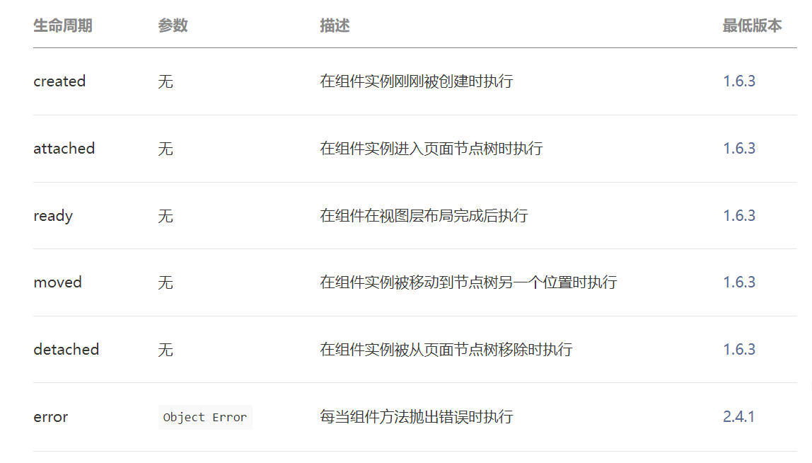

##### 20. 小程序页面生命周期

- 1、小程序注册完成后，加载页面，触发`onLoad`方法，一个页面只会调用一次。
- 2、页面载入后触发`onShow`方法，显示页面，每次打开页面都会调用一次。
- 3、首次显示页面，会触发`onReady`方法，渲染页面元素和样式，一个页面只会调用一次。
- 4、当小程序后台运行或跳转到其他页面时，触发`onHide`方法。
- 5、当小程序有后台进入到前台运行或重新进入页面时，触发`onShow`方法。
- 6、当使用重定向方法`wx.redirectTo(OBJECT)`或关闭当前页返回上一页`wx.navigateBack()`，触发`onUnload`

##### 21. 小程序怎么样实现路由传参

- wx.navigateTo
  
  ```js
wx.navigateTo({
    url: '../placeIntroduce/placeIntroduce?placeId=2',//在路径后面拼接
  })
    另外一个页面通过onload(options)这个生命周期获取到placeId
  ```
```
  
- wx.redirectTo
  
  ```js
wx.redirectTo （非 tabBar 的页面的路径，不能返回来，不限层）
  wx.redirectTo ({
  url: '../placeIntroduce/placeIntroduce?placeId=2',//在路径后面拼接
```

  

##### 22. 小程序中的路由跳转switchTab navigateTo redirectTo的区别

- wx.navigateTo()：保留当前页面，跳转到应用内的某个页面。但是不能跳到 `tabbar` 页面
- wx.redirectTo()：关闭当前页面，跳转到应用内的某个页面。但是不允许跳转到 `tabbar` 页面
- wx.switchTab()：跳转到 `abBar` 页面，并关闭其他所有非 `tabBar` 页面
- wx.navigateBack()关闭当前页面，返回上一页面或多级页面。可通过 `getCurrentPages()` 获取当前的页面栈，决定需要返回几层
- wx.reLaunch()：关闭所有页面，打开到应用内的某个页面

##### 23. 小程序tabbar实现原理

- 要实现tabbar的导航条其实很简单，我们要实现全局的tabbar只需要在app.json文件中定义即可，局部的就在局部的tabbar文件中实现。

  > 来看看app.json代码：
  >
  > ```js
  > export default {
  > pages: [
  >   'pages/index/index',
  >   "pages/search/search",
  >   'pages/news/news',
  >   'pages/attention/attention',
  >   'pages/collect/collect',
  >   'pages/comment/comment',
  >   'pages/my/my',
  >   "pages/detail/detail",
  >   "pages/chat/chat",
  > ],
  > window: {
  >   backgroundTextStyle: 'light',
  >   navigationBarBackgroundColor: '#fff',
  >   navigationBarTitleText: '小红书',
  >   navigationBarTextStyle: 'black',
  >   enablePullDownRefresh: true
  > },
  > tabBar: {
  >   "list": [
  >     {
  >       "pagePath": "pages/index/index",
  >       "text": "首页",
  >       "iconPath": "assets/tabbar/1.png",
  >       "selectedIconPath": "assets/tabbar/2.png"
  >     },
  >     {
  >       "pagePath": "pages/news/news",
  >       "text": "消息",
  >       "iconPath": "assets/tabbar/news1.png",
  >       "selectedIconPath": "assets/tabbar/news2.png"
  >     },
  >     {
  >       "pagePath": "pages/my/my",
  >       "text": "我的",
  >       "iconPath": "assets/tabbar/3.png",
  >       "selectedIconPath": "assets/tabbar/4.png"
  >     }
  >   ]
  > },
  > permission: {
  >   "scope.userLocation": {
  >     "desc": "为了更好的为你服务，请允许访问你的地址"
  >   }
  > }
  > }
  > ```
  >
  > 参考[这里](https://www.cnblogs.com/izhaofu/p/6278589.html)

##### 24. 小程序性能为什么那么好，为什么能做到即用即走的效果

- 因为是轻量级的，代码包体积限制在2M以内，如果超过2M还可以进行分包，提高性能优化
- 运行在微信端,很多功能只需要使用API来实现，就可以实现跟APP的一样的功能
- 是基于微信宿主环境的，微信客户端提供双线程去执行wxml, wxss, js文件，让小程序可以快速的一下将数据渲染出来呈现在用户的面前


#### 十. 网络面试真题

##### 1. url从输入到渲染页面的全过程

- 浏览器构建HTTP Request请求， DNS解析URL地址、生成HTTP请求报文、构建TCP连接、使用IP协议选择传输路线
- 将请求通过网络传输到服务端 从客户机到服务器需要通过许多网络设备，一般包括集线器、交换器、路由器等
- 服务器构建HTTP Response响应，响应客户端的请求
- 将响应体的数据通过网络传输返回给客户端
- 浏览器渲染页面 解析HTML、CSS、JS，生成RenderTree渲染页面

##### 2. tcp三次握手，四次挥手，可靠传输原理

###### 三次握手

- 第一次握手：客户端发送syn报文，并发送seq为x序列号给服务端，等待服务端的确认。

- 第二次握手：服务端发送syn+ack报文，并发送seq为Y的序列号，在确认序列号为x+1

- 第三次握手：客户端发送ack报文，并发送seq序列号为z，在确认序列号为y+1

  四次挥手

- 第一次挥手：先由客户端向服务器端发送一个FIN，请求关闭数据传输。

- 第二次挥手：当服务器接收到客户端的FIN时，向客户端发送一个ACK，其中ack的值等于FIN+SEQ

- 第三次挥手：然后服务器向客户端发送一个FIN，告诉客户端应用程序关闭。

- 第四次挥手：当客户端收到服务器端的FIN是，回复一个ACK给服务器端。其中ack的值等于FIN+SEQ

##### 3. `http200` 和 `302` 的区别

- http_200的意思是 成功处理了请求
- http_302的意思是（临时移动）服务器目前从不同位置的网页响应请求， 但请求者应继续使用原有位置来进行以后的请求。

##### 4. 你知道哪些http首部字段？

| 首部字段名        | 说明                       |
| ----------------- | -------------------------- |
| Cache-Control     | 控制缓存的行为             |
| Connection        | 逐跳首部、连接的管理       |
| Date              | 创建报文的日期时间         |
| Program           | 报文指令                   |
| Trailer           | 报文末端的首部一览         |
| Transfer-Encoding | 指定报文主体的传输编码方式 |
| Upgrade           | 升级为其他协议             |
| Via               | 代理服务器的相关信息       |
| Warning           | 错误通知                   |
| Authorization     | Web认证信息                |

##### 5. 说一下http缓存策略，有什么区别，分别解决了什么问题？

浏览器每次发起请求时，先在本地缓存中查找结果以及缓存标识，根据缓存标识来判断是否使用本地缓存, 如果缓存有效，则使用本地缓存。
向服务器发起请求并携带缓存标识。根据是否需向服务器发起HTTP请求， 将缓存过程划分为两个部分：强制缓存和协商缓存，强缓优先于协商缓存。

- 强缓存，服务器通知浏览器一个缓存时间，在缓存时间内，下次请求，直接用缓存，不在时间内，执行比较缓存策略。
- 协商缓存，让客户端与服务器之间能实现缓存文件是否更新的验证、提升缓存的复用率， 将缓存信息中的Etag和Last-Modified,通过请求发送给服务器，由服务器校验，返回304状态码时，浏览器直接使用缓存。
- 解决问题
  1.减少了冗余的数据传输
  2.减少了服务器的负担，大大提升了网站的性能
  3.加快了客户端加载网页的速度
   

##### 6. 为什么浏览器要限制TCP的最大个数

- 建立一个tcp连接需要：1，socket文件描述符；2，IP地址；3，端口；4，内存

- 1、内存资源： 一个tcp连接最小占用内存为4096+4096 = 8k， 那么对于一个8G内存的机器，在不考虑其他限制下， 最多支持的并发量为：810241024/8 约等于100万， 在实际中，由于linux kernel对一些资源的限制， 加上程序的业务处理，所以，8G内存是很难达到100万连接的

- 2、CPU资源

  

##### 7. HTTP2.0的特点

  HTTP2.0大幅度的提高了web性能，在HTTP1.1完全语意兼容的基础上，进一步减少了网络的延迟。

  1、二进制分帧

  2、多路复用

  3、首部压缩

  4、流量控制

  5、请求优先级

  6、服务器推送

  ##### 8. 说一下HTTP2 多路复用原理，以及多路复用优势？

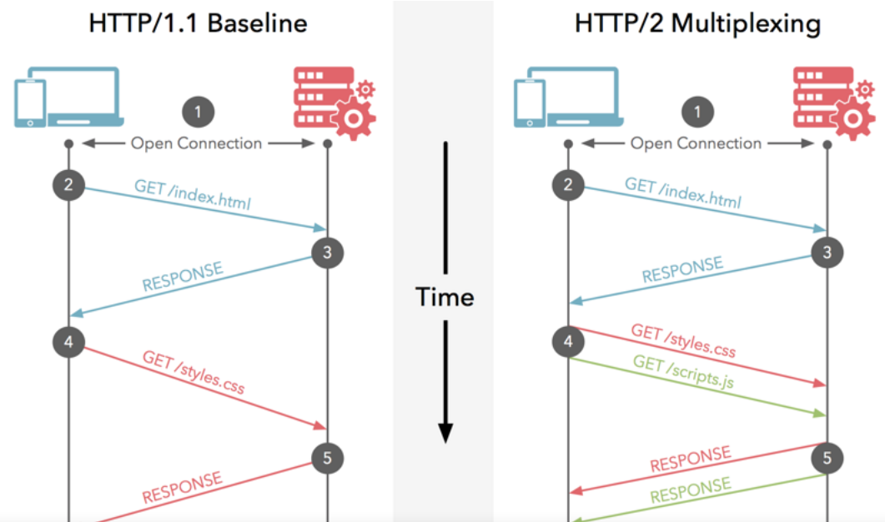

HTTP/1.1中的消息是“管道串形化”的：只有等一个消息完成之后，才能进行下一条消息；而HTTP/2中多个消息交织在了一起，这无疑提高了“通信”的效率。这就是多路复用：**在一个HTTP的连接上，多路“HTTP消息”同时工作**。

##### 9. 简述https原理，以及与http的区别

- HTTP协议工作在80端口，HTTPS协议工作在443端口

- HTTPS需要申请证书（用于验证服务器身份）

- HTTP在TCP三次握手建立连接之后即可开始传输数据；HTTPS协议则需要在建立TCP连接之后客户端与服务器在进行SSL加密，确定对话密钥，完成加密后才开始传输数据。

- HTTPS协议传输是密文，HTTP协议传输是明文

##### 10. CDN 是什么？描述下 CDN 原理？为什么要用 CDN?

  CDN的全称是Content Delivery Network，即内容分发网络 共有云厂商在全世界各地都遍布不计其数都数据中心和服务器， CDN服务简单来讲就是这些厂商将你的服务器上面的文档分发到他们不同地区的服务器的当中， 每个地区可以称为一个节点，这样用户在访问你的网址时， 浏览器发送的请求就会优先绕去离客户最近的节点来获取数据， 这样方便客户更快的速度访问网站。 CDN是构建在现有网络基础之上的智能虚拟网络，依靠部署在各地的边缘服务器， 通过中心平台的负载均衡、内容分发、调度等功能模块，使用户就近获取所需内容， 降低网络拥塞，提高用户访问响应速度和命中率。CDN的关键技术主要有内容存储和分发技术。

##### 11.  为什么form表单提交没有跨域问题，但ajax有跨域问题

  浏览器的策略本质是：一个域名下面的JS，没有经过允许是不能读取另一个域名的内容，但是浏览器不阻止你向另外一个域名发送请求。 所以form表单提交没有跨域问题，提交form表单到另外一个域名，原来页面是无法获取新页面的内容，或者说form提交后不需要返回，但是ajax是需要返回的。 而ajax是想要读取响应内容，浏览器是不允许你这么做的。 浏览器的安全策略限制的是js脚本，并不限制src，form表单提交之类的请求， 就是说form表单提交不存在安全问题，ajax提交跨域存在安全问题。


#### 十一. 高频算法-排序算法

##### 1. 冒泡排序

> 冒泡排序比较所有相邻的两个项，如果第一个比第二个大，则交换它们。元素项向上移动至 正确的顺序，就好像气泡升至表面一样，冒泡排序因此得名。

```js
function bubbleSort(array) {
    const {
        length
    } = array;
    for (let i = 0; i < length; i++) {
        for (let j = 0; j < length - 1; j++) {
            if (array[j] > array[j + 1]) {
                swap(array, j, j + 1);
            }
        }
    }
    return array;
}

function swap(array, a, b) {
    const temp = array[a];
    array[a] = array[b];
    array[b] = temp;
}
```


##### 2. 选择排序

> 选择排序算法是一种原址比较排序算法。选择排序大致的思路是找到数据结构中的最小值并 将其放置在第一位，接着找到第二小的值并将其放在第二位，以此类推。

```js
function selectionSort(array) {
    const {
        length
    } = array;
    let indexMin;
    for (let i = 0; i < length - 1; i++) {
        indexMin = i;
        for (let j = i; j < length; j++) {
            if (array[indexMin] > array[j]) {
                indexMin = j;
            }
        }
        if (i !== indexMin) {
            swap(array, i, indexMin);
        }
    }
    return array;
};
```


##### 3. 插入排序

> 插入排序每次排一个数组项，以此方式构建最后的排序数组。

```js
function insertionSort(array) {
    const {
        length
    } = array;
    let temp;
    for (let i = 1; i < length; i++) {
        let j = i;
        temp = array[i];
        while (j > 0 && array[j - 1] > temp) {
            array[j] = array[j - 1];
            j--;
        }
        array[j] = temp;
    }
    return array;
};
```


##### 4. 归并排序

> 归并排序是一种分而治之算法。其思想是将原始数组切分成较小的数组，直到每个小数组只 有一个位置，接着将小数组归并成较大的数组，直到最后只有一个排序完毕的大数组。


```js
function mergeSort(array) {
    if (array.length > 1) { 
        const {
            length
        } = array;
        const middle = Math.floor(length / 2); 
        const left = mergeSort(array.slice(0, middle)); 
        const right = mergeSort(array.slice(middle, length)); 
        array = merge(left, right); 
    }
    return array;
}

function merge(left, right ) {
    let i = 0; 
    let j = 0;
    const result = [];
    while (i < left.length && j < right.length) { 
        result.push(
            left[i] < right[j] ? left[i++] : right[j++]
        ); 
        console.log(result)
        //先push ，再++
    }
    return result.concat(i < left.length ? left.slice(i) : right.slice(j)); 
}
```


##### 5. 快速排序

```js
function quickSort(arr){
    const {length} = arr
    if(length<2){
        return arr
    }

    let base = arr[0]
    let min = arr.slice(1).filter(item=>item<=base)
    let max = arr.slice(1).filter(item=>item>base)

    return quickSort(min).concat([base]).concat(quickSort(max))
}
```


##### 6. 计数排序

> 计数排序使用一个用来存储每个元素在原始 数组中出现次数的临时数组。在所有元素都计数完成后，临时数组已排好序并可迭代以构建排序 后的结果数组。

```js
function countingSort(array) {
    if (array.length < 2) { 
        return array;
    }
    const maxValue = findMaxValue(array);
    const counts = new Array(maxValue + 1); 
    array.forEach(element => {
        if (!counts[element]) { 
            counts[element] = 0;
        }
        counts[element]++; 
    });
    let sortedIndex = 0;
    counts.forEach((count, i) => {
        while (count > 0) { 
            array[sortedIndex++] = i; 
            count--; 
        }
    });
    return array;
}

function findMaxValue(array) {
    let max = array[0];
    for (let i = 1; i < array.length; i++) {
        if (array[i] > max) {
            max = array[i];
        }
    }
    return max;
}

countingSort([5,7,4,9,1])
```


##### 7.  桶排序

> 桶排序（也被称为箱排序）也是分布式排序算法，它将元素分为不同的桶（较小的数组）， 再使用一个简单的排序算法，例如插入排序（用来排序小数组的不错的算法），来对每个桶进行 排序。然后，它将所有的桶合并为结果数组。


````js
function insertSort(arr) {
    const {
        length
    } = arr
    let temp; //存 当前这一轮对应索引的元素值
    for (let i = 1; i < length; i++) {
        temp = arr[i]
        let j = i;
        while (j > 0 && arr[j - 1] > temp) {
            arr[j] = arr[j - 1]
            j--
        }

        arr[j] = temp
    }

    console.log(arr)
}

function bucketSort(array, bucketSize = 3) { 
    if (array.length < 2) {
        return array;
    }
    const buckets = createBuckets(array, bucketSize); 
    //分桶装
    return sortBuckets(buckets); 
}

function createBuckets(array, bucketSize) {
    let minValue = array[0];
    let maxValue = array[0];
    for (let i = 1; i < array.length; i++) { 
        if (array[i] < minValue) {
            minValue = array[i];
        } else if (array[i] > maxValue) {
            maxValue = array[i];
        }
    }//一次循环找到最小最大值
    const bucketCount = Math.floor((maxValue - minValue) / bucketSize) + 1; // 最后一个索引+1
    const buckets = [];
    for (let i = 0; i < bucketCount; i++) {
        buckets[i] = [];
    }
    for (let i = 0; i < array.length; i++) { 
        const bucketIndex = Math.floor((array[i] - minValue) / bucketSize); 
        buckets[bucketIndex].push(array[i]);
    }
    return buckets;
}

function sortBuckets(buckets) {
    const sortedArray = []; 
    for (let i = 0; i < buckets.length; i++) { 
        if (buckets[i] != null) {
            insertSort(buckets[i]); 
            sortedArray.push(...buckets[i]); 
        }
    }
    return sortedArray;
}

bucketSort([5,4,3,2,6,1,7,10,9,8])
````


##### 8. 基数排序

> 基数排序也是一个分布式排序算法，它根据数字的有效位或基数（这也是它为什么叫基数排 序）将整数分布到桶中。基数是基于数组中值的记数制的。

```js
const arr = [35, 2, 26, 2, 5, 8, 34, 1, 56, 99, 33];
const radixSort = (arr = []) => {
    const base = 10;
    let divider = 1;
    let maxVal = 0;
    while (divider === 1 || divider <= maxVal) {
        const buckets = [...Array(10)].map(() => []);
        for (let val of arr) {
            buckets[Math.floor((val / divider) % base)].push(val);
            maxVal = val > maxVal ? val : maxVal;
        }

        arr = [].concat(...buckets);

        console.log(arr)
        divider *= base;
    };
    return arr;
};
```


#### 十二. 高频算法-搜索算法


##### 1. 顺序搜索

> 顺序或线性搜索是最基本的搜索算法。它的机制是，将每一个数据结构中的元素和我们要找 的元素做比较。顺序搜索是最低效的一种搜索算法。

```js
function sequentialSearch(array, value) {
    for (let i = 0; i < array.length; i++) {
        if (value===array[i]) { 
            return i;
        }
    }
    return -1
}

sequentialSearch([3,2,1],2)
```


##### 2.二分搜索


```js
var Arr = [5, 7, 4, 2, 9];

function binarySearch(find, arr, low, high) {
    arr = quickSort(arr);
    if (low <= high) {
        if (arr[low] == find) {
            return low;
        }
        if (arr[high] == find) {
            return high;
        }
        var mid = Math.ceil((high + low) / 2);
        if (arr[mid] == find) {
            return mid;
        } else if (arr[mid] > find) {
            return binarySearch(find, arr, low, mid - 1);
        } else {
            return binarySearch(find, arr, mid + 1, high);
        }
    }
    return -1;
}
binarySearch(9, Arr, 0, Arr.length - 1)
```


##### 3.内插搜索

> 内插搜索是改良版的二分搜索。二分搜索总是检查 mid 位置上的值，而内插搜索可能会根 据要搜索的值检查数组中的不同地方。


```js
var arr = [5, 7, 4, 2, 9];

function InsertionSearch(arr, val, start, end) {
    arr = quickSort(arr);
    var end = end || arr.length - 1;
    var start = start || 0;

    if (start <= end && val>=arr[start] && val<=arr[end]) {
        var mid = start + Math.floor((val - arr[start]) / (arr[end] - arr[start]) * (end - start))
        if (arr[mid] == val) {
            return mid;
        }


        if (arr[mid] > val) {
            return InsertionSearch(arr, val, start, mid - 1);
        } else {
            return InsertionSearch(arr, val, mid + 1, end);
        }
    }

    return -1
}

InsertionSearch(arr, 2)
```


#### 十三. 高频算法-随机算法

> 迭代数组，从最后一位开始并将当前位置和一个随机位置进行交换。这个随机位 置比当前位置小。这样，这个算法可以保证随机过的位置不会再被随机一次

```js
function shuffle(array) {
 for (let i = array.length - 1; i > 0; i--) {
 const randomIndex = Math.floor(Math.random() * (i + 1));
 swap(array, i, randomIndex);
 }
 return array;
} 
```


#### 十四. 高频算法-算法设计

##### 1.分而治之

> 分而 治之是算法设计中的一种方法。它将一个问题分成多个和原问题相似的小问题，递归解决小问题， 再将解决方式合并以解决原来的问题。

分而治之算法可以分成三个部分。

 (1) 分解原问题为多个子问题（原问题的多个小实例）。 

 (2) 解决子问题，用返回解决子问题的方式的递归算法。递归算法的基本情形可以用来解决子 问题。

 (3) 组合这些子问题的解决方式，得到原问题的解。


##### 2.动态规划

> 动态规划（dynamic programming，DP）是一种将复杂问题分解成更小的子问题来解决的优 化技术。

用动态规划解决问题时，要遵循三个重要步骤：

 (1) 定义子问题；

 (2) 实现要反复执行来解决子问题的部分； 

(3) 识别并求解出基线条件。


###### 2-1 背包问题

> 背包问题是一个组合优化问题。它可以描述如下：给定一个固定大小、能够携重量 W 的背 包，以及一组有价值和重量的物品，找出一个最佳解决方案，使得装入背包的物品总重量不超过 W，且总价值最大。


```js
function knapSack(weights, values, W) {
    var n = weights.length;
    var f = new Array(n)
    f[-1] = new Array(W + 1).fill(0)//第-1个物品，
    //负一行的出现可以大大减少了在双层循环的分支判定。
    // console.log(f)
    for (var i = 0; i < n; i++) { 
        f[i] = new Array(W).fill(0)
        for (var j = 0; j <= W; j++) { 
            if (j < weights[i]) { 
                f[i][j] = f[i - 1][j]
            } else {
                f[i][j] = Math.max(f[i - 1][j], f[i - 1][j - weights[i]] + values[i]); //case 3
            }//即使i = 0 也不怕，i-1 为-1 有-1行不怕
        }
    }
    return f[n - 1][W]
}
```


###### 2-2 最长公共子序列

> 找出两个字符 串序列的最长子序列的长度。最长子序列是指，在两个字符串序列中以相同顺序出现，但不要求 连续（非字符串子串）的字符串序列。


```js
function LCS(str1, str2) {
    var m = str1.length
    var n = str2.length
    var dp = [new Array(n + 1).fill(0)] //第一行全是0
    for (var i = 1; i <= m; i++) { //一共有m+1行
        dp[i] = [0] //第一列全是0
        for (var j = 1; j <= n; j++) { //一共有n+1列
            if (str1[i - 1] === str2[j - 1]) {
                //注意这里，str1的第一个字符是在第二列中，因此要减1，str2同理
                dp[i][j] = dp[i - 1][j - 1] + 1 //对角＋1
            } else {
                dp[i][j] = Math.max(dp[i - 1][j], dp[i][j - 1])
            }
        }
    }
    return dp[m][n];
}
console.log(LCS("abcadf", "acbaed"))
```


##### 3. 贪心算法

> 在对问题求解时，总是做出在当前看来是最好的选择。也就是说，不从整体最优上加以考虑，他所做出的仅是在某种意义上的局部最优解。贪心算法不是对所有问题都能得到整体最优解，但对范围相当广泛的许多问题他能产生整体最优解或者是整体最优解的近似解。


```js
function tanx(capacity, weights, values) {
    var list = [];
    for (var i = 0, len = weights.length; i < len; i++) {
        list.push({
            num: i + 1, //第几件商品
            w: weights[i], //重量
            v: values[i],
            rate: values[i] / weights[i]
        });
    }

    list.sort(function (a, b) {
        return b.rate-a.rate
    });
    // console.log(list)

    var selects = [];
    var total = 0;
    for (var i = 0, len = list.length; i < len; i++) {
        var item = list[i];

        if (item['w'] <= capacity) {
            selects.push({
                num: item.num,
                rate: 1, //完整的商品记录为1
                v: item.v,
                w: item.w
            });

            total = total + item.v;
            capacity = capacity - item.w;
        } else if (capacity > 0) {
            //选取不完整的商品
            var rate = capacity / item['w'];
            var v = item.v * rate;
            selects.push({
                num: item.num,
                rate: rate,
                v: item.v * rate,
                w: item.w * rate
            });
            total = total + v;
            break;
        } else {
            break;
        }
    }

    return {
        selects,
        total
    }
}

```

#### 十五. 手写代码&场景题


##### 1.手写Promise

```js
/*
 * @作者: kerwin
 */
function KerwinPromise(executor) {
    this.status = "pending";
    this.result = undefined;
    this.cb = []
    var _this = this;

    function resolve(res) {
        if (_this.status !== "pending") return;
        // console.log(_this)
        _this.status = "fulfilled"
        _this.result = res;

        _this.cb.forEach(item => {
            item.successCB && item.successCB(_this.result)
        });
    }

    function reject(res) {
        if (_this.status !== "pending") return;
        // console.log("reject")
        _this.status = "rejected"
        _this.result = res;
        _this.cb.forEach(item => {
            item.failCB && item.failCB(_this.result)
        });
    }
    executor(resolve, reject)
}

KerwinPromise.prototype.then = function (successCB, failCB) {

    if(!successCB){
        successCB = value=>value
    }
    if(!failCB){
        failCB = error=>error
    }

    // successCB()
    return new KerwinPromise((resolve, reject) => {
        if (this.status === "fulfilled") {
            var result = successCB && successCB(this.result)
            // console.log(result);

            if (result instanceof KerwinPromise) {
                result.then(res => {
                    // console.log(res)
                    resolve(res);
                }, err => {
                    // console.log(err)
                    reject(err)
                })
            } else {
                resolve(result);
            }
        }
        if (this.status === "rejected") {
            var result = failCB && failCB(this.result)

            if (result instanceof KerwinPromise) {
                result.then(res => {
                    // console.log(res)
                    resolve(res);
                }, err => {
                    // console.log(err)
                    reject(err)
                })
            } else {
                reject(result);
            }
        }

        if (this.status === "pending") {
            //收集回调
            this.cb.push({
                successCB: () => {
                    var result = successCB && successCB(this.result)

                    if (result instanceof KerwinPromise) {
                        result.then(res => {
                            // console.log(res)
                            resolve(res);
                        }, err => {
                            // console.log(err)
                            reject(err)
                        })
                    } else {
                        resolve(result);
                    }
                },
                failCB: () => {
                    var result = failCB && failCB(this.result)
                    if (result instanceof KerwinPromise) {
                        result.then(res => {
                            // console.log(res)
                            resolve(res);
                        }, err => {
                            // console.log(err)
                            reject(err)
                        })
                    } else {
                        reject(result);
                    }
                }
            })
        }
    })
}

KerwinPromise.prototype.catch= function(failCB){
    this.then(undefined,failCB)
}
```

##### 2.手写实现发布/订阅模式

```javascript
class Subject { //定义被观察者
  constructor() {
    this.observers = []
  }

  addObserver(observer) { //订阅
    this.observers.push(observer)
  }

  removerObserver(observer) {//取消订阅
    let index = this.observers.indexOf(observer)
    if (index !== -1) {
      this.observers.splice(index, 1)
    }

  }

  notify() {  //通知
    this.observers.forEach(observer => {
      observer.update()
    })
  }
}

class Observer { // 定义观察者
  update() {
    console.log('subject更新了');
  }
  subscribeTo(subject) {
    subject.addObserver(this)
  }
}

let subject = new Subject() //被观察者
let observer1 = new Observer()  //观察者
observer1.subscribeTo(subject) //观察者进行订阅
let observer2 = new Observer()  //观察者
observer2.subscribeTo(subject) //观察者进行订阅
subject.notify()
```


##### 3. 手写代码，监测数组变化，并返回数组长度

```javascript
//手写代码，监测数组变化，并返回数组长度
// 获取Array的原型，并创建一个新的对象指向这个原型
    // const arrayMethods = Object.create(Array.prototype)
    // 创建一个新的原型，这就是改造之后的数组原型
    const ArrayProto = []
    // 重新构建Array原型里面的虽有方法
    Object.getOwnPropertyNames(Array.prototype).forEach(method => {
      if (typeof Array.prototype[method] === "function") {
        ArrayProto[method] = function () {
          console.log("我已经监听到数组触发了" + method + "事件")
          let len = this.length
          let result = Array.prototype[method].apply(this, arguments)
          console.log(len, this.length);
          if (len !== this.length) return this.length
          return result
        }
      }
    })
    let list = [1, 2, 3]
    // 将数组的原型链指向新构造的原型
    list.__proto__ = ArrayProto
    // 执行push事件
    console.log(list.push(2), list.pop(2), list.slice(2), list.unshift(2));
```


##### 4. 手写ajax

```javascript
//1.创建对象
let  xhq = new XMLHttpRequest()
//2.初始话http请求参数
xhq.open(methode, url, true)
//3.发送请求
xhq.send({
    username:'wzx'
})
//4.监听请求状态,执行对应的回调函数
xhq.onreadystatechange = function () {
    if ( xhq.readystate == 4 && xhq.status == 200 ) {
        // success 回调
        success(xhq.responseText)
    }  else if (xhq.readyState == 4 && xhq.status !== 200) {
        // error 回调
        error()
    }
}


//-----------完整实现-----------
function sendAjax(obj) {
    function splicStr(data) {// get方式传入时，将内容进行data内容进行拼接
        var str = ''
        for (var i in data) {
            str = i + '=' + data[i]
        }
        return str
    }

// 原生ajax实现 步骤分析
// 一、声明XMLHttpRequest, 为了兼容IE5、6需要使用ActiveXObject()
    let xhq = new XMLHttpRequest() // 创建对象
// 二、初始化HTTP请求参数， 只初始化并不会发送
    if (obj.method.toUpperCase() === 'GET') { // get方法
        xhq.open(obj.method, obj.url + '?' + splicStr(obj.data),  typeof obj.async === 'boolean'? obj.async : true) // 路径拼接
        xhq.send()// 三、发送此次请求
    }
    else if (obj.method.toUpperCase() === 'POST') { // post方法
        xhq.open(obj.method, obj.url, typeof obj.async === 'boolean'? obj.async : true)
        xhq.setRequestHeader("content-type","application/json") // 以表单提交
        xhq.send(obj.data)// 三、发送此次请求
    }
//四、监听发送
    xhq.onreadystatechange = function () {
        if ( xhq.readyState == 4 && xhq.status == 200 ) {
            // success 回调
            success(xhq.responseText)
        } else if (xhq.readyState == 4 && xhq.status !== 200) {
            // error 回调
            error()
        }
    }
}

sendAjax({
    url: 'your url',
    method: 'post',
    async: true,
    data: {
        username: 'xiong',
        pwd: '123'
    },
    success: function (data) {
        console.log(data)
    },
    error: function () {
        console.log('发生了错误')
    }
})
```

##### 5.手写深拷贝

```javascript
//1
function deepCopy(obj){
    return JSON.parse(JSON.stringify(obj))
}

//2
function deepCopy(obj){
    if(typeof obj =='object'){//判断是否为复杂数据源类型
        var result = obj.constructor == Array?[]:{}  //数组还是对象
        for(let i in obj){
            result[i]= typeof obj[i] =='object'? deepCopy(obj[i]):obj[i]
        }
    }else{
        //简单数据类型 
        var result = obj;
    }
    return result
}
```


##### 6. Antd-树组件-点击变成输入框-输入完还能保存

```jsx
import React, { useState } from 'react';
import { Tree } from 'antd';
import './DemoTree.css'

const Demo = () => {
  const [valueobj,setValObj]=useState({})
  const [id,setId]=useState({})
  const treeData = [
    {
      title:'0-0',
      key: '0-0',
      children: [
        {
          title: '0-0-0',
          key: '0-0-0',
          children: [
            { title: '0-0-0-0', key: '0-0-0-0' },
            { title: '0-0-0-1', key: '0-0-0-1' },
            { title: '0-0-0-2', key: '0-0-0-2' },
          ],
        },
        {
          title: '0-0-1',
          key: '0-0-1',
          children: [
            { title: '0-0-1-0', key: '0-0-1-0' },
            { title: '0-0-1-1', key: '0-0-1-1' },
            { title: '0-0-1-2', key: '0-0-1-2' },
          ],
        },
        {
          title: '0-0-2',
          key: '0-0-2',
        },
      ],
    },
    {
      title: '0-1',
      key: '0-1',
      children: [
        { title: '0-1-0-0', key: '0-1-0-0' },
        { title: '0-1-0-1', key: '0-1-0-1' },
        { title: '0-1-0-2', key: '0-1-0-2' },
      ],
    },
    {
      title: '0-2',
      key: '0-2',
    }
  ];
  const [checkedKeys, setCheckedKeys] = useState(['0-0-0']);
  const [selectedKeys, setSelectedKeys] = useState([]);


  const onCheck = (checkedKeysValue) => {
    console.log('onCheck', checkedKeysValue);
    setCheckedKeys(checkedKeysValue);
  };

  const onSelect = (selectedKeysValue, info) => {
    console.log('onSelect', info.node.key,info.node);
    setSelectedKeys(selectedKeysValue);
    setId(info.node)
  };
  const recursionTreeData = (treeData) => {
    let nodeData = [];
    treeData.forEach(item => {
        if(item.children){
            item.children = recursionTreeData(item.children);
        }
        if(id.key===item.key){
          item.isStop=!item.isStop
          item.title=valueobj[item.key]
        }else{
          // console.log(item.title)
          item.title=valueobj[item.key]?valueobj[item.key]:item.key
        }
        item.title = (
                <div>
                    <span>{item.title}</span>
                    <input type='text' style={item.isStop?{display:'block'}:{display:'none'}}
                     onBlur={(ev)=>{
                      valueobj[item.key] = ev.target.value

                      console.log(valueobj)
                      setValObj({...valueobj})

                       ev.target.style.display="none"
                     }}/> 
                </div>
        );
        nodeData.push(item);
    });
    return nodeData;
};
  return (
    <Tree
      checkable
      checkedKeys={checkedKeys}
      onCheck={onCheck}
      onSelect={onSelect}
      select7edKeys={selectedKeys}
      treeData={recursionTreeData(treeData)}
    />
  );
};
export default Demo
```

##### 7. 场景

**经过两个月“选课系统“开发，测试，上线，”选课系统“服务于学校教学的第一站，参与选课学校的学生上午8点集中开测。市场反馈有如下情况：**

**1）打开网站出现502**

**2）登录进不去系统**

**3）提交数据一致反复**

**4）有时出现白屏现象**

**对于市场反馈情况谈谈你的认识？**

```tex
    首先，502错误，意思是worker进程忙不过来，参与选课的学生上午8点集中开测，在短时间内访问人数过多导致积累了大量的请求，后台服务器忙不过来。解决方法贵公司可以看看CPU和内存满没满，没满就多开一些worker，满了就多加一些机子。也可能是数据库响应缓慢，然后人多了数据库是否能撑住也是一个考虑，多用一些缓存吧。

    第二个问题，结合502报错来看，登录不进系统的原因估计也是短时间内访问人数过多导致服务器崩了。

    提交数据一直反复就相对复杂了，可能出现的使用场景也有很多。
    比如说我们在提交表单的时候，有可能是网络延迟或内存不足，导致点击一次提交按钮，页面没有反应，结果强迫症就犯了，就疯狂的点提交恨不得把手机屏幕点烂来。也有可能是有些毛孩子，点完提交按钮立马点击刷新页面，或直接返回上层页面想卡bug
    对于这种情况，我以前工作的做法就是设置蒙版层，不管你怎么点，只要你点提交，我就给你弹出蒙版层。其实这个问题最根本的原因是程序没有进行重复判断，导致数据库重复写入。前端后端都可以添加一个重复判断逻辑，判断后台数据库中是否已经存在当前提交的数据，避免重复添加。但是这种判断只解决了两次表单依次提交的问题，如果不同用户同时提交表单，数据就不一定会正确了。这种问题就是我们常说的并发问题，并发问题的解决方案也有很多，比如：加锁排队处理等。

    最后提到解决白屏问题，我个人在白屏优化实践上尝试过SSR、路由懒加载、还有骨架屏等一些方案，每个方案都个有自己的优劣，需要根据实际的业务场景进行取舍。
    SSR服务端渲染，这个方案可以让页面直接在服务端渲染，但是不利于前后端分离，开发的效率也比客户端渲染低，同时也加大了服务器的压力。
    当打包构建应用时，JavaScript 包会变得非常大，影响页面加载。如果我们能把不同路由对应的组件分割成不同的代码块，然后当路由被访问的时候才加载对应组件，这样就会更加高效。
    使用骨架屏的话，存在与业务深度耦合，页面复杂度变高的问题。当应对需求变更时，骨架屏结构成本，工具实现成本，配置成本，项目的维护成本，都比较高。
```


#### 十六. 综合题目

##### 1. 项目研发流程中作为前端开发一般扮演的啥角色？

```tex
    前端开发一般扮演着一个“团队核心废物”的角色。为什么这么说，首先在项目的研发中，UI小姐姐总感觉前端开发的页面满足不了她们的设计理念，说你没品味；后端小哥哥觉得前端开发就像只会写写样式的js交互工程师，像极了一个破美工的；测试小哥哥拿着测试报告说：这锅谁他娘的来背一下。还记得当年那个请你根据手机壳的颜色，来实现APP启动的颜色的产品经理嘛？这些对前端开发的误会难道不能折射出前端是团队里最应该学会沟通的人嘛？
    界面有问题需要和UI沟通,数据有问题需要和后台沟通,功能有问题需要和产品沟通,测试的时候给你提bug你还需要和测试沟通……毕竟前端是最接近用户的人,用户对一个网站,软件最直观的感受是反映到前端；交互体验更是前端项目的核心点。
    和UI的沟通,在工作中我们不应该是被动的实现UI的设计,而是应该合理化的提出自己的想法,不然日后返工浪费的是双方的时间。比如通用组件的设计，每次页面的提示弹窗设计，再比如你需要做一个图表,用到了echarts,你完全可以让UI基于echarts去设计样式,而不是让她在那里自由发挥，因为你永远不知道设计师的脑子里装了多少创意,这样节省的是两个人的时间,不会出现他做好样式而你实现不了的尴尬。
    和后端联调接口前，先要对业务需求了解透彻，需要哪些数据，有时候明明后台来处理某个事件很简单,后台非要你来做,这就需要我们对一个需求,一个任务的要有清晰认识了,如果对任务含糊不清,自己都没搞明白,你只能受后台摆布了.最后可能也会因为任务没有完成而备受责难了。有理有据,后台开发人员是不会说什么的,否则,后台会很不耐烦的,甚至骂你的可能都有,本身做后台比较难,尤其在查询数据,取数据,封装数据方面都比较难处理。
    面对产品经理的需求，前端应该深刻理解需求，毕竟工作性质影响了一个人的思维逻辑，前端能站在一个产品经理的角度去思考每一个需求，便显得尤其重要。不放过每一个细节也很重要。产品经理在设计一个产品的时候，都是从大方向去想问题的，大方向没有错就行了，细节脱离不了大方向。这是他们想的。但是对于程序来说，却万万不能。因为一个细节的逻辑往往决定了整个大方向。
    举个例子：有一个需求，用户的作品需要提交审核，经过审核才可以让所有人看到。当产品经理交这个需求给你的时候，你能察觉到什么问题了吗？这里面有几个细节：1.用户提交审核后，用户可以不可以再编辑作品；2.作品是否会多次审核；3.需不需要记录审核历史；4.用户作品是否需要有版本的控制，如要产生版本，版本又是如何产生的；5.审核通过后，用户可以不可以再修改作品，若不可以，那么是不是其他人就看不见用户作品等等。
    我认为前端开发是团队里最应该学会沟通的人，一个好的前端开发模式可以推动整个项目的进步的，尽管有时可能会被误解成废物，但是这何尝不是大家公认的核心呢？
```

##### 2. 项目中让你印象深刻的问题

```tex
    之前用vue做了一个动态官网项目，后期客户要求seo，百度上之前搜索不到官网地址，后来在项目的入口文件index.html页面加上了，固定的meta标签，加上name名为keywords、description的meta标签。以上做了个简单的seo优化，这个项目有几个官网，但是其中只有一个官网要求seo，也就是在百度能够搜索到，当时为了应急，就写死了，但是，其它的网站也就会受到干扰了，也就是对于一个项目对应几个官网，写死的meta标签做seo是不科学的。
    如果这个项目要解决seo优化，可以用服务端渲染（ssr），如果项目刚开始就考虑到seo，采用服务端渲染，那么就用服务端渲染就得了。但是一般来讲，项目做到后期才会考虑到seo的问题，这时再去搞服务端渲染，相当于重头写项目，非常耗费人力物力。
    所以先只考虑在首页加入 meta 标签提供一些元数据，使用简单、具有表意性的 title 以及使用 h5 提供的具有语义化的标签（不要一堆 div），生成对 search engine 友好的 sitemap，使用合理的 html 结构（比如按标题、内容、页脚这样的顺序、或者将重要的内容放在 html 前，其他放在后）
```

##### 3. 项目开发中有遇到什么挑战没？

> 1.问题描述：1）简单介绍这个项目规模、背景2）什么情况下遇到什么样的问题
>
> 2.你处理这个问题的过程及结果：1）遇到问题你如何思考；2）你如何执行的；3）处理结果如何
>
> 3.通过处理这个问题，你学到了什么或者说通过这个问题，你看到了你们什么不足，后续动作（采用什么样的方式，在以后的项目中避免再出现这类问题）

```tex
1.（使用缓存处理）
    在做Vue开发移动端APP时，有个页面比较常见，左边是对所有菜谱品类的展示，右边是对对应菜谱的展示，一开始在开发的时候没注意，就直接在mounted()前面使用async,里面使用await调了两边接口后，又通过watch监听了品类索引变化，调了一遍接口。后面发现每次切换品类时，页面都有一闪而过的感觉，发现每次都调了一遍接口，这对性能消耗挺大。所以就尝试的走了Vuex做缓存处理。当时解决这个缓存问题用了一些巧妙的方法，首先缓存的数据，采用的是对象形式，不是数组。这样写起来更快，因为用品类的下标直接做缓存数据的key值，非常好写。不过后面又有点坑，就是我监听的是引用数据类型，不管是vue还是react，引用数据类型发生变化时，页面可能不会更新。后面又在mutation中对vuex中的数据更新时，做了一下深复制，就做好了缓存处理。因为我是根据判断这个对象中有没有数据去调接口的，如果存在，就不调接口。现在做了缓存没错，那如果以后后台的数据发生了变化的话，那我这里也不调接口了，后台数据就没有在页面上实现更新，所以在跳出这个页面的时候还要清下缓存。清缓存要在生命周期结束的时候清，如果碰到了动态组件把APP页面下的 Tap 栏包住的时候， Keep-alive。就不能用 destroyed 生命周期清除，要用 deactivated 生命周期去清除。这样才有始有终，完成缓存处理。

2.（解决关键词高亮问题---->原理和字符串敏感词替换一样，但是用在关键词高亮上算是一个技术亮点吧）
    用户配置一堆关键词，在页面上将这些关键词高亮，也许你会觉得这有什么难度？用正则匹配一下出来高亮不就行了吗？但是，一开始，用户的词不多，我确实使用的是遍历，时间复杂度为n2。后来用户会配置100w量级的词，使用遍历就会使页面卡死崩溃。解决的方法就是：优化性能，高亮分三步，生成字典树，遍历页面文字，取出文字进行匹配。使用字典树代替遍历，整个页面100w量级的词绘制可以实现在1秒以内。

3.（封装自定义组件）
    在一个小程序项目需求中，要求页面头部tab栏切换的同时，对应tab栏品类的页面也要展示出来。你可能会觉得这个需求用个taroUI组件库中的tabs标签页组件不就可以完成吗？但是这个需求想满足用户的沉浸式体验，切换页面时需要有独特丝滑的专场特效。所以当时面临的问题就是，使用的UI库的组件默认样式生硬，满足不了需求。我当时是对小程序原生swiper组件进行了二次封装，主要实现了几点自定义需求：头部Tab栏品类样式使用flex动态布局，实现品类数量可变；使用 slot 插槽来动态渲染 Tab区块中的内容，配合原生swiper组件使用定义插槽；小程序原生组件<swiper>是有默认高度的，必须手动设置其高度，这里使用wx.getSystemInfo来动态获取屏幕尺寸。自己封装组件，踩了不少坑，但从中我学习到了：使用小程序的原生组件，并修改其默认的样式；学会使用 slot 插槽，实现组件内容的差异化；学会了使用小程序原生 api 获取手机信息，用 js 改变组件样式等等

4.（遇到了难用的轮子）
    在写XXX小程序项目中需要实现音频播放的功能，官方已经推荐使用新的API了，然而这个小程序官方文档文档写得并不好，很多时候我们会遇到一些需求，或者改变而这些需求文档里又写得非常模糊，这就比较头疼了。小程序官方文档更新十分频繁，坑非常多。所以很多时候，我就要去不断地从文档的字里行间猜测，并结合源码一步一步地去跟踪，去尝试解决这个音频播放问题。但有时候确实超出了我的能力范围，那么我就会把我的问题提炼成一个小demo，到知乎、segmentfault思否去问，或者提问一些同样用这个轮子的作者，最终找到了新API的使用规范。
```

**注意**：这个时候你就要说你最擅长的，一定是你最擅长的点，告诉他这个问题怎么解决，一定是你最懂的，而且经得起推敲的解决方案。**你要准备的不仅仅是你的项目中有哪些难点，更重要的是和这个难点相关的知识都要准备充分。**所以，**你的答案并不是这个项目中最难的点，而是一个最能让你回答好整套相关问题的难点**。


##### 4. 谈谈对前后端分离的理解。

```tex
    在我看来，前后端分离给开发工作带来了很多好处，在以前，没有这个概念的时候，一种经典的设计模式MVC模式。前端开发很不盛行，几乎很多后端程序员就兼顾了前端开发工作，前后端耦合性极强，在jsp时代，前端写好的页面最后要和后端实现交互，需要程序员手动的更改代码，这是很大的一个工作量，这种事情交给前端还是后端？谁都不愿意做吧！
    前后端分离过后，通过预先定义好接口规范，前端后端独立部署独立开发，后端只需要提供接口供调用即可，解耦效果是真的强，这对工作效率的提升是巨大的，对于后期的维护只需要前后端单独完成即可！
   
```

##### 5. 项目负责什么

```tex
    1. 这个项目的列表展示与详情页是我负责的。我对于后端传递的数据进行了怎样的处理，在异步请求中选择了一定的异步分割处理数据，拆分一次性阻塞主线程的时间，可以减少用户的等待，页面滚动时选择节流，减少无效的axios请求等等，对自己模块所负责的内容，进行梳理。

    2. 这个项目的登录，注册，模块是我负责的。我对不同角色的鉴权是怎么实现的。。。

    3. 这个项目的表单提交页是我负责的。。。。用了什么UI组件。。。
```

##### 6. 流程&规范

###### 1) 对接UI与交互

> 

**(1)原型**

- axure （发音：Ack-sure）
  `生成的html代码,页面代码杂乱，代码冗余量较大，不利于后期的优化`

- 墨刀
  `https://free.modao.cc/app/ltnSwMXEFqjon7QtRssBgKkPXZmL3os#screen=s6A4B80F6FE1540952810987`

- 蓝湖

  `https://lanhuapp.com/`

**(2)标注图** 

> 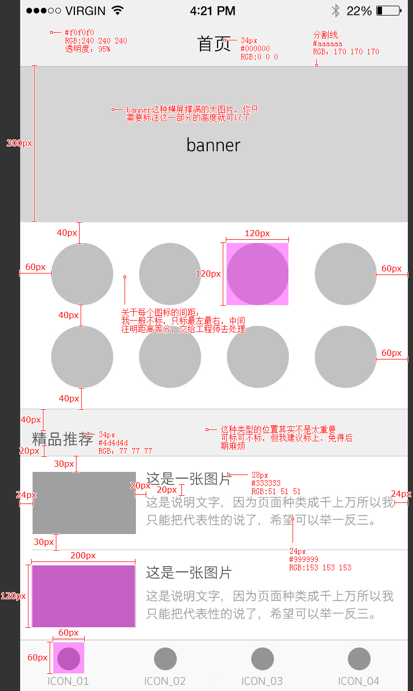

**(3)谁来切图**

`UI? 前端？后端？`

###### 2) 对接后端

**(1) 亲嘴对接**

**(2) 接口文档**

> 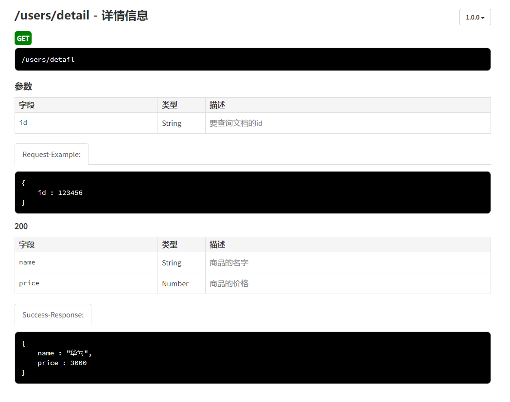

###### 3)多环境

| 英文缩写 | 英文                        | 中文                 |
| -------- | --------------------------- | -------------------- |
| DEV      | development                 | 开发                 |
| SIT      | System Integrate Test       | 系统整合测试（内测） |
| UAT      | User Acceptance Test        | 用户验收测试         |
| PET      | Performance Evaluation Test | 性能评估测试（压测） |
| PROD     | production                  | 产品/正式/生产       |


> 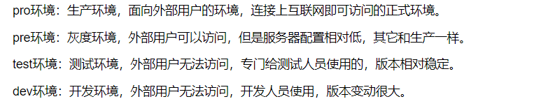
> 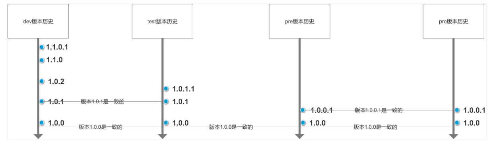
> **保证pre的版本和pro环境的版本一致**，如果pro环境出现bug,我们只需要在pre环境fix bug,从1.0.0 ==>1.0.0.1 ,不会影响开发进度以及测试进度(不用单独创建分支修改)


##### 7. 工作中能够持续学习么？

```tex
    工作中当然可以持续学习，我认为每次对自己的总结就是很好学习机会，可以是工作上的总结，生活上的总结，某一件小事的总结都可以学习。
    总结自己掌握的前端知识体系，总结知识体系的过程是一个查缺补漏的过程。遇到没掌握或者了解不深的知识点，务必去了解、搞清楚，否则就不算掌握。还可以，总结自己做过的项目中有哪些难点，或者技术架构。涉及到的所有技术点都可以挖一下，看看有没有某个点是自己描述不清的。
    有空闲时间，会去leetcode社区上找点算法题，可以去bestofjs社区看看社区又出了什么比较前沿的技术，框架 。还可以去Github上看看别人写的代码，或者翻翻Vue，React源码研究研究。
```

##### 8. 为什么辞职

```tex
    在上一家公司，我也想过要早些辞职，但是考虑某个未完成的重要项目、或是继任者短期内还不能胜任角色所以晚了一些。主要离职的原因是在上一家公司待的时间比较长了，公司的各种业务已经非常熟练了，感觉工作成了流水线般的生产工具，技术达到了一定的瓶颈，我觉得我应该跳出舒适圈去接触更多的新技术与新的业务从而扩展自己的技术广度。我觉得贵公司的技术要求与我非常符合，有一些我自己非常熟练或精通的技术，更重要的事有一些我之前只是自己业余时间研究过但一直没有几乎用于实战的技术。我相信贵公司的岗位对我虽然有一定的挑战信但是会给我带来更多的提升机会。同时我上一家公司中用的React加koa框架做的项目也有很多设计上的亮点，我也可以将上一家优秀完整的项目开发流程与管理经验，项目设计思路与贵公司分享。完成互利互惠共同成长。
```

