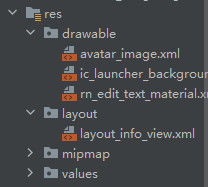

::: tip 介绍
react native桥接原生
:::

<!-- more -->

## react native桥接原生

**为什么需要桥接原生**

**实现react层JS实现不了的需求**

- 复杂、 高性能组件:复杂表格、视屏播放等
- 原生层开发能力:传感器编程、widget等
- 平台属性:系统信息、设备信息等
- 对接三方应用: 相机、相册、地图等


### 1.桥接原生方法

**在该文件下编写**


#### 1.先创建一个package

**新建一个类继承ReactPackage**

```java
package com.rnstudy1.rn;

import androidx.annotation.NonNull;

import com.facebook.react.ReactPackage;
import com.facebook.react.bridge.NativeModule;
import com.facebook.react.bridge.ReactApplicationContext;
import com.facebook.react.uimanager.ViewManager;

import java.util.ArrayList;
import java.util.List;

public class DemoPackage implements ReactPackage {

    @NonNull
    @Override
    public List<NativeModule> createNativeModules(@NonNull ReactApplicationContext reactApplicationContext) {
        //注册模块
        List<NativeModule> modules=new ArrayList<>();
        modules.add(new AppModule(reactApplicationContext));
        return modules;
    }

    @NonNull
    @Override
    public List<ViewManager> createViewManagers(@NonNull ReactApplicationContext reactApplicationContext) {
        List<ViewManager> viewManagerList=new ArrayList<>();
        return viewManagerList;
    }
}

```

#### 2.然后创建一个模块

**新建一个类继承ReactContextBaseJavaModule**

```java
package com.rnstudy1.rn;


import androidx.annotation.NonNull;
import androidx.annotation.Nullable;

import com.facebook.react.bridge.Promise;
import com.facebook.react.bridge.ReactApplicationContext;
import com.facebook.react.bridge.ReactContextBaseJavaModule;
import com.facebook.react.bridge.ReactMethod;
import com.rnstudy1.BuildConfig;


public class AppModule extends ReactContextBaseJavaModule {

    public AppModule(@Nullable ReactApplicationContext context){
        super(context);
    }

    @NonNull
    @Override
    public String getName() {
        //返回模块名称
        return "App";
    }
    
	//添加方法注解，这样js层就能调用
    @ReactMethod
    public void getVersionName(Promise promise){
        String versionName= BuildConfig.VERSION_NAME;
        if(versionName==null){
            promise.reject(new Throwable("获取版本失败"));
        }else{
            promise.resolve(versionName);
        }
    }
}

```


#### 3.js层调用

```tsx
import React, { useEffect } from "react"
import { StyleSheet, Text, TouchableOpacity, View ,NativeMethods, NativeModules} from "react-native"

type IReactComponent=React.FunctionComponent
|React.ClassicComponentClass
|React.ComponentClass
|React.ForwardRefExoticComponent<any>


export const withFloatButton=<T extends IReactComponent>(OriginValue:T):T=>{

    const HOCValue=(props:any)=>{
        return <>
            <OriginValue {...props}></OriginValue>
            <TouchableOpacity onPress={()=>{
                //使用原生模块，根据之前暴露的名称获取
                const {App}=NativeModules
               //通过模块调用桥接方法
                App?.getVersionName().then((res:any)=>console.log(res))
            }}>
                <View style={styles.button}>
                    <Text style={styles.txt}>点我</Text>
                </View>
            </TouchableOpacity>
        </>
    }

    return HOCValue as T
}


```


### 2.桥接原生常量

1. 编写并注册原生常量方法
2. JS层获取原生常量(同步获取)


**1.在模块里重写getConstants方法**

```java
//....
public class AppModule extends ReactContextBaseJavaModule {

    public AppModule(@Nullable ReactApplicationContext context){
        super(context);
    }

    //重写getConstants方法返回常量
    @Override
    public Map<String,Object> getConstants(){
        Map map=new HashMap<String,Object>();
        map.put("versionName",BuildConfig.VERSION_NAME);
        map.put("versionCode",BuildConfig.VERSION_CODE);

        return map;
    }
}

```


**2.在js层直接使用**

```tsx
import React, { useEffect } from "react"
import { StyleSheet, Text, TouchableOpacity, View ,NativeMethods, NativeModules} from "react-native"

type IReactComponent=React.FunctionComponent
|React.ClassicComponentClass
|React.ComponentClass
|React.ForwardRefExoticComponent<any>


export const withFloatButton=<T extends IReactComponent>(OriginValue:T):T=>{

    const HOCValue=(props:any)=>{
        return <>
            <OriginValue {...props}></OriginValue>
            <TouchableOpacity onPress={()=>{
                const {App}=NativeModules
                App?.getVersionName().then((res:any)=>console.log(res))
                console.log(App)//{"getConstants": [Function anonymous], "getVersionName": [Function promiseMethodWrapper], "versionCode": 1, "versionName": "1.0"}
                console.log(App.versionCode)
            }}>
                <View style={styles.button}>
                    <Text style={styles.txt}>点我</Text>
                </View>
            </TouchableOpacity>
        </>
    }

    return HOCValue as T
}
```


### 3.桥接原生组件

#### 1.注册原生组件



**在drawable中导入图片**

**在layout下编写布局文件**


**新建一个包名为view**

**然后创建一个类InfoView**

```java
package com.rnstudy1.view;

import android.content.Context;
import android.view.LayoutInflater;
import android.view.View;
import android.widget.LinearLayout;

import com.rnstudy1.R;

public class InfoView extends LinearLayout {
    
    public InfoView(Context context) {
        super(context);
        initValue();
    }

    //返回原生的布局信息
    private void initValue(){
        //加载布局文件
        View view = LayoutInflater.from(getContext()).inflate(R.layout.layout_info_view,null);
        //让布局宽高跟父容器一样
        LayoutParams lp=new LayoutParams(LayoutParams.MATCH_PARENT,LayoutParams.MATCH_PARENT);
        //调用方法添加布局文件和配置信息
        this.addView(view,lp);
    }
}
```

然后创建一个viewManage包

新建一个infoViewManage管理类继承SimpleViewManage

在重写方法createViewInstance返回上面刚刚编写的View类实例

```java
package com.rnstudy1.viewManage;

import androidx.annotation.NonNull;

import com.facebook.react.uimanager.SimpleViewManager;
import com.facebook.react.uimanager.ThemedReactContext;
import com.rnstudy1.view.InfoView;

public class InfoViewManage extends SimpleViewManager<InfoView> {

    @NonNull
    @Override
    public String getName() {
        //返回名称方便js层调用
        return "NativeInfoView";
    }

    @NonNull
    @Override
    protected InfoView createViewInstance(@NonNull ThemedReactContext themedReactContext) {
        //注册组件
        return new InfoView(themedReactContext);
    }
}

```

然后在继承了ReactPackage的类重写方法createViewManage里把上面编写的InfoViewManage管理类注册进去

```java

public class DemoPackage implements ReactPackage {

    @NonNull
    @Override
    public List<NativeModule> createNativeModules(@NonNull ReactApplicationContext reactApplicationContext) {
        //注册模块
        List<NativeModule> modules=new ArrayList<>();
        modules.add(new AppModule(reactApplicationContext));
        return modules;
    }

    @NonNull
    @Override
    public List<ViewManager> createViewManagers(@NonNull ReactApplicationContext reactApplicationContext) {
        List<ViewManager> viewManagerList=new ArrayList<>();
        //注册原生组件
        viewManagerList.add(new InfoViewManage());
        return viewManagerList;
    }
}

```


#### 2.使用原生组件

```tsx
import { StyleSheet, ViewProps, requireNativeComponent } from "react-native"

//定义类型
type NativeInfoViewType=ViewProps|{
    
}
//从原生层中请求出原生组件
const InfoView=requireNativeComponent<NativeInfoViewType>('NativeInfoView')
export const NativeInfoView=()=>{
    return <InfoView style={styles.infoView}></InfoView>
}

const styles=StyleSheet.create({
    infoView:{
        width:"100%",
        height:300
    }
})
```


#### 3.原生组件自定义属性

**在ViewManage中添加属性**

**使用ReactProp注解进行属性定义，然后方法中第一个传组件，第二个传js层定义的参数**

```java
//...

public class InfoViewManage extends SimpleViewManager<InfoView> {

   //...

    //js层组件属性
    @ReactProp(name = "avatar")
    public void setAvatar(InfoView infoView,String url){
        infoView.setAvatar(url);
    }

    @ReactProp(name ="name")
    public void setName(InfoView infoView,String name){
        infoView.setName(name);
    }

    @ReactProp(name ="desc")
    public void setDesc(InfoView infoView,String desc){
        infoView.setDesc(desc);
    }
}

```


**然后在InfoView中编写相关的实现方法**

```java
package com.rnstudy1.view;


import android.content.Context;
import android.view.LayoutInflater;
import android.view.View;
import android.widget.ImageView;
import android.widget.LinearLayout;
import android.widget.TextView;

import com.rnstudy1.R;

public class InfoView extends LinearLayout {
    ImageView imageAvatar;
    TextView name;
    TextView desc;

    public InfoView(Context context) {
        super(context);
        initValue();
    }

    private void initValue(){
        View view = LayoutInflater.from(getContext()).inflate(R.layout.layout_info_view,null);
        //根据布局文件的id获取节点
        imageAvatar=view.findViewById(R.id.image_avatar);
        name=view.findViewById(R.id.name);
        desc=view.findViewById(R.id.desc);

        LayoutParams lp=new LayoutParams(LayoutParams.MATCH_PARENT,LayoutParams.MATCH_PARENT);
        this.addView(view,lp);
    }

    public void setAvatar(String url){

    }

    public void setName(String n){
        //设置文本
        name.setText(n);
    }

    public void setDesc(String d){
        desc.setText(d);
    }
}

```

