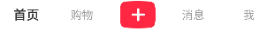
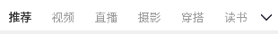
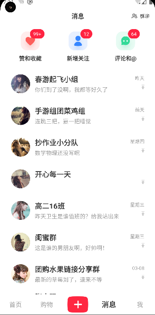
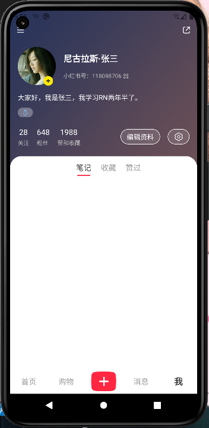

::: tip 介绍
项目主要是对小红书的一些页面进行仿写，使用react native实现小红书一些常见的页面，主要是对样式和布局的练习，不能发布文章，只能获取服务器数据展示文章。然后集成pushy热更新框架。
:::

<!-- more -->
# 仿小红书app

[ react-native 首次运行慢_鲤鱼的日常生活的博客-CSDN博客](https://blog.csdn.net/liyu_ya/article/details/129403811)

查看这篇文章可解决初始构建速度慢，下载依赖慢等问题

## 1.路由管理

### 1.安装依赖

**使用pnpm软链接**

```js
const MetroSymlinkResolve = require("@rnx-kit/metro-resolver-symlinks");
module.exports = {
  transformer: {
    getTransformOptions: async () => ({
      transform: {
        experimentalImportSupport: false,
        inlineRequires: true,
      },
    }),
  },
  resolver: {
    //使用软链接导入
    resolveRequest: MetroSymlinkResolve(),
  },
};

```

**集成react-navigation**

```bash
#构建底部tab页
pnpm add @react-navigation/bottom-tabs
pnpm add @react-navigation/native
pnpm add @react-navigation/stack
#手势处理
pnpm add react-native-gesture-handler
pnpm add react-native-safe-area-context
pnpm add react-native-screens
```


### 2.构建导航栈

**在App.tsx根节点构建导航栈**

**配置导航栈属性**

**App.tsx**

**可以通过ScreenOptions或者单个路由的options设置页面跳转动画**

```tsx
import React from "react";
import { StatusBar } from "react-native";

import {SafeAreaProvider} from 'react-native-safe-area-context'
import { NavigationContainer } from "@react-navigation/native";
import { TransitionPresets, createStackNavigator } from "@react-navigation/stack";
import { PageA } from "./src/modules/PageA";
import { PageB } from "./src/modules/PageB";

const Stack=createStackNavigator()
export default function App(): JSX.Element {
  return (
    <SafeAreaProvider>
      <StatusBar barStyle="dark-content" backgroundColor="white"></StatusBar>
      {/* 整个导航栈的容器 */}
      <NavigationContainer>
        {/* 创建导航器 */}
        <Stack.Navigator 
        screenOptions={{
          /* 配置该属性解决当层级过多渲染混乱问题 */
          cardStyle:{
            elevation:1
          },
          //全局添加跳转动画
          ...TransitionPresets.SlideFromRightIOS
        }}
        initialRouteName="PageA">
          {/* 构建路由 */}
          <Stack.Screen 
          component={PageA} 
          options={{
            //不显示页头
            headerShown:false
          }}
          name="PageA" />

          <Stack.Screen 
          component={PageB} 
          options={{
            headerShown:false,
            //单个页面跳转动画
            ...TransitionPresets.ModalSlideFromBottomIOS
          }}
          name="PageB" />

        </Stack.Navigator>
      </NavigationContainer>
    </SafeAreaProvider>
  );
}

```

**PageA.tsx**

使用navigation进行路由跳转

```tsx
import {  useNavigation } from "@react-navigation/native"
import { StackNavigationProp } from "@react-navigation/stack"
import { Button, Text, View } from "react-native"

export const PageA=()=>{
    //使用泛型才可提示push
    const navigation=useNavigation<StackNavigationProp<any>>()
    return <View style={{marginTop:20,flex:1}}>
        <Text style={{fontSize:24}}>
            我是页面A
        </Text>
        <Button title="跳转到PageB" 
        onPress={()=>{
            navigation.push('PageB')
        }}
        ></Button>
    </View>
}
```


## 2.欢迎页面，登录页面

**跟写web网页差不多，大部分都是重复性的体力活**

**发现编写样式起名有点难，探索使用unocss在rn中能否很好的支持**

### 注意

**如果绝对定位不生效，可能是在TouchableOpacity上进行布局，最好在外面包层View再进行布局**

```tsx
import {
  Image,
  LayoutAnimation,
  Linking,
  StyleSheet,
  Text,
  View,
} from "react-native";
import welcomeImage from "../../assets/icon_main_logo.png";
import { useMemo, useState } from "react";
import icon_unselected from "../../assets/icon_unselected.png";
import icon_selected from "../../assets/icon_selected.png";
import icon_arrow from "../../assets/icon_arrow.png";
import icon_wx from "../../assets/icon_wx_small.png";
import icon_triangle from "../../assets/icon_triangle.png";
import icon_eye_open from "../../assets/icon_eye_open.png";
import icon_eye_close from "../../assets/icon_eye_close.png";
import icon_exchange from "../../assets/icon_exchange.png";
import icon_wx_big from "../../assets/icon_wx.png";
import icon_qq from "../../assets/icon_qq.webp";
import icon_close_modal from "../../assets/icon_close_modal.png";
import { TextInput, TouchableOpacity } from "react-native-gesture-handler";
import { useNavigation } from "@react-navigation/native";
import { StackNavigationProp } from "@react-navigation/stack";
import { parsePhone, replacePhone } from "../../utils/stringUtil";

export const Login = () => {
  //登录类型
  const [loginType, setLoginType] = useState<"quick" | "input">("quick");

  //同意协议
  const [check, setCheck] = useState(false);

 
  const navigator=useNavigation<StackNavigationProp<any>>()

  const renderQuickLogin = () => {
    const styles = StyleSheet.create({
      root: {
        backgroundColor: "white",
        flexDirection: "column-reverse",
        height: "100%",
        paddingHorizontal: 56,
        width: "100%",
        alignItems: "center",
      },
      img: {
        resizeMode: "contain",
        width: 150,
        height: 80,
        marginTop: 150,
      },
      protocolLayout: {
        width: "100%",
        marginBottom: 32,
        flexDirection: "row",
      },
      radioButton: {
        width: 20,
        height: 20,
      },
      labelText: {
        fontSize: 12,
        color: "#999",
        textAlignVertical: "center",
        marginLeft: 6,
      },
      protocolTxt: {
        fontSize: 12,
        color: "#374466",
        textAlignVertical: "center",
      },
      otherLoginButton: {
        alignItems: "center",
        flexDirection: "row",
        justifyContent: "center",
        marginBottom: 100,
        //添加padding方便点击
        paddingHorizontal: 20,
        paddingVertical: 10,
      },
      otherImg: {
        height: 16,
        width: 16,
        marginLeft: 6,
        transform: [
          {
            rotate: "180deg",
          },
        ],
      },
      otherTxt: {
        fontSize: 14,
        color: "#303030",
      },
      wxLoginButton: {
        width: 280,
        flexDirection: "row",
        backgroundColor: "#05c160",
        height: 50,
        borderRadius: 25,
        justifyContent: "center",
        alignItems: "center",
        marginBottom: 20,
      },
      wxImg: {
        width: 32,
        height: 32,
      },
      wxTxt: {
        color: "white",
        fontSize: 16,
        marginLeft: 6,
      },
      redColor: {
        backgroundColor: "#ff2442",
      },
      welcomeImg: {
        width: 180,
        height: 95,
        resizeMode: "contain",
        position: "absolute",
        top: 180,
      },
    });
    return (
      <View style={styles.root}>
        {/* 底部协议 */}
        <View style={styles.protocolLayout}>
          <TouchableOpacity
            activeOpacity={1}
            onPress={() => {
              setCheck((preValue) => !preValue);
            }}
          >
            <Image
              style={styles.radioButton}
              source={check ? icon_selected : icon_unselected}
            ></Image>
          </TouchableOpacity>
          <Text style={styles.labelText}>我已经阅读并同意</Text>
          <TouchableOpacity
            onPress={() => {
              Linking.openURL("https://www.baidu.com");
            }}
          >
            <Text style={styles.protocolTxt}>《用户协议》和《隐私政策》</Text>
          </TouchableOpacity>
        </View>
        {/* 其他登录按钮 */}
        <TouchableOpacity
          onPress={() => {
            LayoutAnimation.easeInEaseOut()
            setLoginType((preValue) => {
              if (preValue === "quick") return "input";
              return "quick";
            });
          }}
        >
          <View style={styles.otherLoginButton}>
            <Text style={styles.otherTxt}>其他登录方式</Text>
            <Image style={styles.otherImg} source={icon_arrow}></Image>
          </View>
        </TouchableOpacity>
        {/* 微信登录 */}
        <TouchableOpacity style={styles.wxLoginButton} activeOpacity={0.7}>
          <Image style={styles.wxImg} source={icon_wx}></Image>
          <Text style={styles.wxTxt}>微信登录</Text>
        </TouchableOpacity>
        {/* 一键登录 */}
        <TouchableOpacity
          style={[styles.wxLoginButton, styles.redColor]}
          activeOpacity={0.7}
        >
          <Text style={styles.wxTxt}>一键登录</Text>
        </TouchableOpacity>

        {/* 小红书标识 */}
        <Image source={welcomeImage} style={styles.welcomeImg}></Image>
      </View>
    );
  };
   //展示密码
  const [showPassword, setShowPassword] = useState(false);
  const [pwd,setPwd]=useState('')
  const [phoneNumber,setPhoneNumber]=useState('')
  const renderInputLogin = () => {
    const styles = StyleSheet.create({
      root: {
        width: "100%",
        height: "100%",
        alignItems: "center",
        flexDirection: "column",
        paddingHorizontal: 56,
        backgroundColor: "white",
      },
      pwdLogin: {
        fontSize: 28,
        color: "#333",
        fontWeight: "bold",
        marginTop: 56,
      },
      tip: {
        color: "#E6E6E6",
        marginTop: 10,
      },
      phoneLayout: {
        width: "100%",
        height: 60,
        flexDirection: "row",
        alignItems: "center",
        borderBottomWidth: 1,
        borderBottomColor: "#ccc",
        marginTop: 20,
      },
      pre86: {
        fontSize: 24,
        color: "#999",
      },
      triangle: {
        width: 12,
        height: 7,
        marginLeft: 4,
      },
      input: {
        flex: 1,
        textAlign: "left",
        textAlignVertical: "center",
        fontSize: 24,
        color: "#333",
        backgroundColor: "transparent",
        marginLeft: 6,
      },
      pwdLayout: {
        width: "100%",
        height: 60,
        flexDirection: "row",
        alignItems: "center",
        borderBottomWidth: 1,
        borderBottomColor: "#ccc",
        marginTop: 10,
      },
      pwdShowImg: {
        width: 24,
        height: 24,
        resizeMode: "contain",
      },
      changeLayout: {
        flexDirection: "row",
        justifyContent: "space-between",
        width: "100%",
        height: 64,
        alignItems: "center",
      },
      changeImg: {
        width: 24,
        height: 24,
      },
      changeImgBox: {
        flexDirection: "row",
      },
      changeTxt: {
        color: "#314B70",
        fontSize: 16,
      },
      loginButton: {
        width: "100%",
        height: 56,
        backgroundColor: "#ff2442",
        flexDirection: "row",
        alignItems: "center",
        borderRadius: 28,
      },
      loginButtonDisable:{
        backgroundColor:'#ddd'
      },
      loginTxt: {
        color: "white",
        width: "100%",
        textAlign: "center",
        fontSize: 18,
      },
      //拷贝的样式
      protocolLayout: {
        marginTop: 24,
        width: "100%",
        marginBottom: 32,
        flexDirection: "row",
      },
      radioButton: {
        width: 20,
        height: 20,
      },
      labelText: {
        fontSize: 12,
        color: "#999",
        textAlignVertical: "center",
        marginLeft: 6,
      },
      protocolTxt: {
        fontSize: 12,
        color: "#374466",
        textAlignVertical: "center",
      },
      icon_img: {
        width: 50,
        height: 50,
      },
      iconContainer: {
        width: "100%",
        flexDirection: "row",
        justifyContent: "space-between",
        paddingHorizontal: 30,
      },
      closeButton: {
        position: "absolute",
        top: 24,
        left: 36,
      },
      closeImg: {
        width: 28,
        height: 28,
      },
    });

    const loginHandle=()=>{
      const purePhone=replacePhone(phoneNumber)
      navigator.replace('home')
    }
    const canLogin=phoneNumber.length===13 && pwd.length!=0 && check
    return (
      <View style={styles.root}>
        <Text style={styles.pwdLogin}>密码登录</Text>
        <Text style={styles.tip}>未注册的手机号登录成功后将自动注册</Text>
        {/* 账号框 */}
        <View style={styles.phoneLayout}>
          <Text style={styles.pre86}>+86</Text>
          <Image style={styles.triangle} source={icon_triangle} />
          <TextInput
            keyboardType="number-pad"
            maxLength={13}
            placeholder="请输入手机号码"
            placeholderTextColor="#CFCFCF"
            style={styles.input}
            value={phoneNumber}
            onChangeText={(text)=>setPhoneNumber(parsePhone(text))}
            
          />
        </View>
        {/* 密码框 */}
        <View style={styles.pwdLayout}>
          <TextInput
            placeholder="密码"
            placeholderTextColor="#CFCFCF"
            secureTextEntry={showPassword}
            style={styles.input}
            value={pwd}
            onChangeText={(text)=>setPwd(text)}
          />
          <TouchableOpacity
            onPress={() => {
              setShowPassword((preValue) => !preValue);
            }}
          >
            <Image
              style={styles.pwdShowImg}
              source={showPassword ? icon_eye_close : icon_eye_open}
            />
          </TouchableOpacity>
        </View>

        {/* 切换验证码登录 */}
        <View style={styles.changeLayout}>
          <TouchableOpacity style={styles.changeImgBox}>
            <Image style={styles.changeImg} source={icon_exchange}></Image>
            <Text style={styles.changeTxt}>验证码登录</Text>
          </TouchableOpacity>
          <TouchableOpacity>
            <Text style={styles.changeTxt}>忘记密码?</Text>
          </TouchableOpacity>
        </View>

        {/* 登录按钮 */}
        <TouchableOpacity activeOpacity={0.7} 
          onPress={loginHandle}
          disabled={!canLogin}
        >
          <View style={[styles.loginButton,!canLogin?styles.loginButtonDisable:null]}>
            <Text style={styles.loginTxt}>登录</Text>
          </View>
        </TouchableOpacity>

        <View style={styles.protocolLayout}>
          <TouchableOpacity
            activeOpacity={1}
            onPress={() => {
              setCheck((preValue) => !preValue);
            }}
          >
            <Image
              style={styles.radioButton}
              source={check ? icon_selected : icon_unselected}
            ></Image>
          </TouchableOpacity>
          <Text style={styles.labelText}>我已经阅读并同意</Text>
          <TouchableOpacity
            onPress={() => {
              Linking.openURL("https://www.baidu.com");
            }}
          >
            <Text style={styles.protocolTxt}>《用户协议》和《隐私政策》</Text>
          </TouchableOpacity>
        </View>

        <View style={styles.iconContainer}>
          <TouchableOpacity>
            <Image style={styles.icon_img} source={icon_wx_big}></Image>
          </TouchableOpacity>
          <TouchableOpacity>
            <Image style={styles.icon_img} source={icon_qq}></Image>
          </TouchableOpacity>
        </View>
        
        {/* 解决绝对定位问题，最好是在TouchableOpacity外面包一层view */}
        <View style={styles.closeButton}>
          {/* TouchableOpacity最好不要拿来布局 */}
          <TouchableOpacity
            onPress={() => {
              LayoutAnimation.easeInEaseOut();
              setLoginType("quick");
            }}
          >
            <Image style={styles.closeImg} source={icon_close_modal} />
          </TouchableOpacity>
        </View>
      </View>
    );
  };

  return <>{loginType === "quick" ? renderQuickLogin() : renderInputLogin()}</>;
};


```


**对手机号格式进行处理**

```tsx
export function parsePhone(phone: string) {

    //对空格进行替换
  phone = phone.replace(/\s+/g,'');
  let res=[
    phone.slice(0,3),
    phone.slice(3,7),
    phone.slice(7,11)
    //过滤掉空的字串
  ].filter(item=>!!item).join(' ')

  return res
}

export function replacePhone(phone:string){
    return phone?phone.replace(/\s+/g,''):''
}
```


## 3.封装axios请求

**request.ts**

```typescript
import { apiConfig } from "./../api/Apis";
import axios, { AxiosResponse } from "axios";

const app = axios.create();
app.defaults.baseURL = "http://10.44.18.71:7001/";

app.interceptors.response.use(
    response=>response,
    error=>{
        const {response}=error
        if(response){
            const {status}=response
            if(status>=500){
                //服务器报错
            }else if(status===400){
                //接口参数异常
            }else if(status===401){
                //登录信息过期，需要重新登录
            }else{
                //其他错误类型，统一按照接口报错处理
            }
        }else{
            //网络异常
        }
        return Promise.reject(error)
    }
)

//get请求
const get = async (url: string, params?: Record<any, any>) => {
  return await app.get(url, {
    params,
  });
};
//post请求
const post = async (url: string, params: Record<any, any>) => {
  return await app.post(url, params);
};

//封装通用接口
export const request = async (
  key: keyof typeof apiConfig,
  params: any
): Promise<AxiosResponse<any, any>> => {
  if (apiConfig[key].method === "get") {
    return await get(apiConfig[key].url, params);
  } else {
    return await post(apiConfig[key].url, params);
  }
};

```

**apis.ts**

```typescript
export const apiConfig={
    login:{
        url:'/user/login',
        method:'get'
    }
}
```


### 总结

**将接口配置信息和get，post等请求分离，然后使用外观模式，组合模式，对外暴露一个统一的接口，只需要根据名称拿到对应的url和method，然后请求**


## 4.使用zuStand进行状态管理

**UserStore.ts**

```typescript
import { create } from "zustand";
import { request } from "../utils/request";
import { getItem, setItem } from "../utils/storage";
import { createJSONStorage, persist } from "zustand/middleware";
import AsyncStorage from "@react-native-async-storage/async-storage";

type UserStore={
    userInfo: {
      avatar: string;
      desc: string;
      location: string;
      name: string;
      nickName: string;
      redBookId: number;
      sex: string;
    } | null;
    requestLogin: (a: string, b: string) => Promise<any>;
  }
export const useUserStore = create(
  //使用ZuStand内置的中间件
  persist<UserStore>(
    (set) => ({
      userInfo: null,
      requestLogin: async (pureNumber: string, pwd: string) => {
        try {
          const { data } = await request("login", {
            name: pureNumber,
            pwd,
          });
          if (data) {
            set(() => ({ userInfo: data }));
          }
          return data;
        } catch (error) {
          console.log(error);
        }
      },
    }),
    //初始化本地存贮信息
    {
      name: "userInfo",
      storage: createJSONStorage(() => AsyncStorage),
    }
  )
);

```

**使用起来确实比mobx，redux等简便许多，跟vue的pinia类似**

**不过有个中间件的概念**

[中间件 | ZUSTAND (awesomedevin.github.io)](https://awesomedevin.github.io/zustand-vue/docs/basic/middleware)


## 5.构建tab

1. 使用bottom-tab组件构建首页Tab页
2. 实现自定义Tab样式
3. 集成相册选择模块,跳转系统图库


### 1.传统Tab页

**构建传统的tab页面**


```tsx
import { createBottomTabNavigator } from "@react-navigation/bottom-tabs";
import { Home } from "../home/Home";
import { Shop } from "../shop/Shop";
import { Message } from "../message/Message";
import { Mine } from "../mine/Mine";
import icon_tab_home_normal from '../../assets/icon_tab_home_normal.png'
import icon_tab_home_selected from '../../assets/icon_tab_home_selected.png'
import icon_tab_shop_normal from '../../assets/icon_tab_shop_normal.png'
import icon_tab_shop_selected from '../../assets/icon_tab_shop_selected.png'
import icon_tab_message_normal from '../../assets/icon_tab_message_normal.png'
import icon_tab_message_selected from '../../assets/icon_tab_message_selected.png'
import icon_tab_mine_normal from '../../assets/icon_tab_mine_normal.png'
import icon_tab_mine_selected from '../../assets/icon_tab_mine_selected.png'
import { Image } from "react-native";

const BottomTab = createBottomTabNavigator();

export const MainTab = () => {
  return (
    <>
      <BottomTab.Navigator initialRouteName="home"
        screenOptions={({route})=>{
            return {
                //根据路由设置图标
                tabBarIcon:({focused,size,color})=> {
                    let img
                    if(route.name==='home'){
                        img=focused?icon_tab_home_selected:icon_tab_home_normal
                    }else if(route.name==='shop'){
                        img=focused?icon_tab_shop_selected:icon_tab_shop_normal
                    }else if(route.name==='message'){
                        img=focused?icon_tab_message_selected:icon_tab_message_normal
                    }else{
                        img=focused?icon_tab_mine_selected:icon_tab_mine_normal
                    }
                    return <Image source={img} style={{
                        width:size,
                        height:size,
                        tintColor:color
                    }} ></Image>
                },
                //设置选中颜色
                tabBarActiveTintColor:'#ff2442',
                //没选中时的颜色
                tabBarInactiveTintColor:'#999'
            }
        }}
        
      >
        <BottomTab.Screen
          name="home"
          component={Home}
          options={{
            title: "首页",
            
          }}
          
        />
        <BottomTab.Screen
          name="shop"
          component={Shop}
          options={{
            title: "购物",
          }}
        />
        <BottomTab.Screen
          name="message"
          component={Message}
          options={{
            title: "消息",
          }}
        />
        <BottomTab.Screen
          name="mine"
          component={Mine}
          options={{
            title: "我",
          }}
        />
      </BottomTab.Navigator>
    </>
  );
};

```


### 2.自定义tab页

**通过Bottom.Navigator属性tabBar传递自定义底部tab组件**



```tsx
import { createBottomTabNavigator } from "@react-navigation/bottom-tabs";
import { Home } from "../home/Home";
import { Shop } from "../shop/Shop";
import { Message } from "../message/Message";
import { Mine } from "../mine/Mine";
import { Image, StyleSheet, Text, TouchableOpacity, View } from "react-native";
import { BottomTabNavigationConfig } from "@react-navigation/bottom-tabs/lib/typescript/src/types";

import icon_tab_publish from '../../assets/icon_tab_publish.png'
const BottomTab = createBottomTabNavigator();

export const MainTab = () => {
    
  //自定义tab组件
  const RedBookTabBar: BottomTabNavigationConfig["tabBar"] = ({
    state,
    navigation,
    descriptors,
  }) => {
    //根据state获取路由和当前选中索引
    const { routes, index } = state;
      
    return (
      <View style={styles.tabBarContainer}>
        {routes.map((item, i) => {
          const { options } = descriptors[item.key];
          const isFocused = i === index;
					//中间图片publish TabBar
					if(i===2){
						return (
							<TouchableOpacity
								style={styles.tabItem}
								onPress={() => {
									//TODO
									
								}}
								key={item.name}
							>
								<Image style={styles.icon_tab_publish} source={icon_tab_publish} />
							</TouchableOpacity>
						);
					}
          return (
            <TouchableOpacity
              style={styles.tabItem}
              onPress={() => {
                //TODO
				navigation.navigate(item.name)
              }}
              key={item.name}
            >
              <Text style={{
                        fontSize:isFocused?18:16,
                        color:isFocused?'#333':'#999',
                        fontWeight:isFocused?'bold':'normal'
                      }}>{options.title}</Text>
            </TouchableOpacity>
          );
        })}
      </View>
    );
  };

  return (
    <>
      <BottomTab.Navigator initialRouteName="home" tabBar={RedBookTabBar}>
        <BottomTab.Screen
          name="home"
          component={Home}
          options={{
            title: "首页",
          }}
        />
        <BottomTab.Screen
          name="shop"
          component={Shop}
          options={{
            title: "购物",
          }}
        />
				<BottomTab.Screen
          name="publish"
          component={Shop}
          options={{
            title: "发布",
          }}
        />
        <BottomTab.Screen
          name="message"
          component={Message}
          options={{
            title: "消息",
          }}
        />
        <BottomTab.Screen
          name="mine"
          component={Mine}
          options={{
            title: "我",
          }}
        />
      </BottomTab.Navigator>
    </>
  );
};

const styles = StyleSheet.create({
  tabBarContainer: {
    width: "100%",
    flexDirection: "row",
    alignItems: "center",
    backgroundColor: "white",
    height: 56,
  },
  tabItem: {
    height: "100%",
    justifyContent: "center",
    flex: 1,
    alignItems: "center",
  },
	icon_tab_publish:{
		width:60,
		height:40,
		resizeMode:'contain'
	}
});

```


### 3.系统相册选择

安装依赖

```bash
pnpm add react-native-image-picker
```

```tsx
//导入图片库
import {launchImageLibrary} from 'react-native-image-picker'

const BottomTab = createBottomTabNavigator();

export const MainTab = () => {
  const RedBookTabBar: BottomTabNavigationConfig["tabBar"] = ({
    state,
    navigation,
    descriptors,
  }) => {
    const { routes, index } = state;
    return (
      <View style={styles.tabBarContainer}>
        {routes.map((item, i) => {
          const { options } = descriptors[item.key];
          const isFocused = i === index;
			
          const onPublishPress=() => {
            //选择图片
            launchImageLibrary({
              mediaType:'photo',
              quality:1,
              includeExtra:true
            },({assets})=>{
              if(assets?.length===0){
                ToastAndroid.show('选择图片失败',ToastAndroid.LONG)
                return;
              }
              console.log(assets![0])
            })
          }
          //....
        })}
      </View>
    );
  };

  //...
};

```


## 6.首页

### 1.基本结构

1. **绘制每个Item**
2. **上拉刷新/下拉加载**
3. **footer展示没有数据提示**


**useHomeStore.ts**

```typescript
import { create } from "zustand";
import { request } from "../../utils/request";
type HomeStore = {
  homeList: ArticleSimple[];
  page: number;
  size: number;
  refreshing: boolean;
  requestHomeList: () => Promise<any>;
  setPage: (page: number) => void;
};

export const useHomeStore = create<HomeStore>((set, get) => ({
  homeList: [],
  page: 1,
  size: 10,
  //用于flatList展示加载状态
  refreshing: false,
  //请求数据
  requestHomeList: async () => {
      
    //进行防抖
    if (get().refreshing) return;
    set(() => ({ refreshing: true }));

		const page=get().page

    const { data } = await request("homeList", {
      page,
			size:get().size
    });

    try {
      if (data?.length) {
        if (page === 1) {
          set(() => ({ homeList: data }));
        } else {
          set((state) => ({ homeList: state.homeList.concat(data) }));
        }
				get().setPage(page+1)
      } else {
        if (page === 1) {
          set(() => ({ homeList: [] }));
        } else {
          //已经加载完了，没有更多数据了
        }
      }
    } catch (e) {
			console.log(e)
    } finally {
      set(() => ({ refreshing: false }));
    }
    return data;
  },
  setPage: (page: number) => {
    set((state) => ({ page: page }));
  },
}));

```

**Home.tsx**

```tsx
//...
const { width } = Dimensions.get("screen");

export const Home = () => {
  //获取状态
  const [homeList, requestHomeList, setPage, refreshing] = useHomeStore(
    (state) => [
      state.homeList,
      state.requestHomeList,
      state.setPage,
      state.refreshing,
      state.page,
    ]
  );

  //初始请求数据
  useEffect(() => {
    requestHomeList();
  }, []);

  //刷新数据
  const refreshData = () => {
    setPage(1);
    requestHomeList();
  };

  //上拉加载
  const endReachedHandle = () => {
    requestHomeList();
  };

  /* 渲染每个文章 */
  const renderItem: FlatListProps<ArticleSimple>["renderItem"] = ({ item }) => {
    return (
      <View key={item.id} style={styles.item}>
        {/* 首图 */}
        <Image style={styles.itemImage} source={{ uri: item.image }} />
        {/* 标题 */}
        <Text style={styles.titleTxt}>{item.title}</Text>
        {/* 发布者 */}
        <View style={styles.authorBox}>
          <Image
            style={styles.avatarImage}
            source={{ uri: item.avatarUrl }}
          ></Image>
          <Text style={styles.nameTxt}>{item.userName}</Text>
          <Image
            style={styles.icon_heart}
            source={item.isFavorite ? icon_heart : icon_heart_empty}
          ></Image>
          <Text style={styles.favoriteCount}>{item.favoriteCount}</Text>
        </View>
      </View>
    );
  };

  const Footer = () => {
    return <Text style={styles.footer}>没有更多数据了~</Text>;
  };
  return (
    <View style={styles.root}>
      <FlatList
        style={styles.homeList}
        data={homeList}
        renderItem={renderItem}
        numColumns={2}
        contentContainerStyle={styles.container}
        //下拉刷新
        refreshing={refreshing}
        onRefresh={refreshData}
        //距离底部多少百分比加载更多
        onEndReachedThreshold={0.1}
        //上拉加载
        onEndReached={endReachedHandle}
        //添加footer
        ListFooterComponent={Footer}
      ></FlatList>
    </View>
  );
};

const styles = StyleSheet.create({
  root: {
    height: "100%",
    width: "100%",
    backgroundColor: "#f0f0f0",
  },
  homeList: {
    height: "100%",
    width: "100%",
  },
  item: {
    width: (width - 18) >> 1,
    /* height: 260, */
    backgroundColor: "white",
    marginLeft: 6,
    marginBottom: 6,
    borderRadius: 8,
    overflow: "hidden",
  },
  container: {
    paddingTop: 6,
  },
  itemImage: {
    width: "100%",
    height: 200,
    resizeMode: "cover",
  },
  titleTxt: {
    fontSize: 14,
    color: "#333",
    marginHorizontal: 10,
    marginVertical: 4,
    fontWeight: "bold",
  },
  avatarImage: {
    width: 20,
    height: 20,
    resizeMode: "cover",
    borderRadius: 10,
  },
  authorBox: {
    flexDirection: "row",
    alignItems: "center",
    paddingHorizontal: 10,
    marginBottom: 10,
    overflow: "hidden",
    height: 20,
  },
  nameTxt: {
    marginLeft: 4,
    color: "#999",
    fontSize: 12,
    flex: 1,
  },
  icon_heart: {
    width: 16,
    height: 16,
    resizeMode: "cover",
  },
  favoriteCount: {
    marginLeft: 4,
    color: "#999",
    fontSize: 12,
  },
  footer: {
    fontSize: 14,
    width: "100%",
    color: "#999",
    marginVertical: 16,
    textAlign: "center",
    textAlignVertical: "center",
  },
});

```


### 2.瀑布流列表

1. **使用FlowList替换FlatList实现瀑布流布局**
2. **使用自定义ResizeImage组件，实现可变大小图片**
3. **自定义Heart组件实现点赞特效**

**瀑布流布局可以去网上查找一下，核心思想就是计算子元素的高度然后让下一个元素排列在短的地方。**

**ResizeImage.tsx**

**获取图片原始宽高，然后计算出比例，然后根据对应宽度计算出对应的高度**

```tsx
import { useEffect, useState } from "react";
import { Dimensions, Image, ImageProps, StyleSheet } from "react-native";

type Props = ImageProps
const { width } = Dimensions.get("screen");
const showWidth = (width - 18) >> 1;

export const ResizeImage = ({ source, style }: Props) => {
  const [height, setHeight] = useState(200);

  useEffect(() => {
    //获取图片宽高，根据原图片宽高比设置对应的高度
    Image.getSize((source as any).uri, (width, height) => {
      setHeight((height / width) * showWidth);
    });
  }, []);
  return (
    <Image
      source={source}
      style={[
        style,
        {
          width: showWidth,
          height,
          resizeMode:'cover'
        },
      ]}
    />
  );
};

```


**结合动画实现点击喜欢的光圈效果**

```tsx
import icon_heart_empty from "../assets/icon_heart_empty.png";
import icon_heart from "../assets/icon_heart.png";
import { Animated, Image, StyleSheet, TouchableOpacity, View } from "react-native";
import { useRef, useState } from "react";

type Props={
	value:boolean,
	size?:number,
	onValueChange?:(newValue:boolean)=>void
}

export const Heart = ({value,onValueChange,size=16}:Props) => {

  const [showState,setShowState]=useState(value)

	const scale=useRef(new Animated.Value(0)).current
	const alpha=useRef(new Animated.Value(1)).current

	const scaleAnimate=Animated.timing(scale,{
		useNativeDriver:false,
		toValue:1.8,
		duration:300
	})

	const alphaAnimate=Animated.timing(alpha,{
		useNativeDriver:false,
		toValue:0,
		duration:400,
		delay:200
	})

	const animate=Animated.parallel([scaleAnimate,alphaAnimate])

	const onHeartPress=()=>{
		onValueChange?.(!showState)
		
		setShowState(preValue=>!preValue)
		if(!showState){
			animate.start()
		}else{
			animate.reset()
		}
	}

  return (
    <TouchableOpacity onPress={onHeartPress}>
      <Image style={[styles.icon_heart,{
				width:size,
				height:size
			}]} source={showState?icon_heart:icon_heart_empty}></Image>

			{/* 加点击特效 */}
			<Animated.View style={{
				width:size,
				height:size,
				borderRadius:size/2,
				borderWidth:size/16,
				position:'absolute',
				borderColor:'#ff2442',
				zIndex:9,
				transform:[
					{
						scale:scale
					}
				],
				opacity:alpha
			}}></Animated.View>
    </TouchableOpacity>
  );
};
const styles = StyleSheet.create({
  icon_heart: {
    width: 16,
    height: 16,
    resizeMode: "cover",
  },
});

```


### 3.顶部Tab

1. **封装标题栏组件，回调多种事件**
2. **在Home中集成标题栏组件**

**采用两边固定宽高大小**

**中间flex=1充满剩余空间**

**然后两边分别设置右左间距**


```tsx
import { useState } from "react";
import { TouchableOpacity } from "react-native-gesture-handler";
import { StyleSheet, View, Image, Text } from "react-native";
import icon_daily from "../../../assets/icon_daily.png";
import icon_search from "../../../assets/icon_search.png";


type Props={
    tab?:number,
    onTabChange?:(tab:number)=>void
}

export const TitleBar = ({tab=1,onTabChange}:Props) => {
  const [index, setIndex] = useState(tab);


  return (
    <View style={styles.titleLayout}>
      <TouchableOpacity style={styles.dailyButton}>
        <Image style={styles.icon_style} source={icon_daily} />
      </TouchableOpacity>
      {/* 中间主体内容 */}
      <View style={styles.tabButton}>
        <TouchableOpacity
          style={styles.tabButton}
          onPress={() => {
            setIndex(0);
            onTabChange?.(0)
          }}
        >
          <Text style={[index === 0 ? styles.tabTxtSelected : styles.tabTxt]}>
            关注
          </Text>
          {index === 0 && <View style={styles.line}></View>}
        </TouchableOpacity>
      </View>

      <View style={styles.tabButton}>
        <TouchableOpacity
          style={styles.tabButton}
          onPress={() => {
            setIndex(1);
            onTabChange?.(1)
          }}
        >
          <Text style={[[index === 1 ? styles.tabTxtSelected : styles.tabTxt]]}>
            发现
          </Text>
          {index === 1 && <View style={styles.line}></View>}
        </TouchableOpacity>
      </View>

      <View style={styles.tabButton}>
        <TouchableOpacity
          style={styles.tabButton}
          onPress={() => {
            setIndex(2);
            onTabChange?.(2)
          }}
        >
          <Text style={[[index === 2 ? styles.tabTxtSelected : styles.tabTxt]]}>
            郑州
          </Text>
          {index === 2 && <View style={styles.line}></View>}
        </TouchableOpacity>
      </View>

      <TouchableOpacity style={styles.searchButton}>
        <Image style={styles.icon_style} source={icon_search} />
      </TouchableOpacity>
    </View>
  );
};

const styles = StyleSheet.create({
  titleLayout: {
    width: "100%",
    height: 48,
    flexDirection: "row",
    alignItems: "center",
    backgroundColor: "white",
    paddingHorizontal: 16,
  },
  icon_style: {
    width: 28,
    height: 28,
    resizeMode: "cover",
  },

  dailyButton: {
    height: "100%",
    justifyContent: "center",
    alignItems: "center",
    paddingRight: 12,
    marginRight: 42,
  },
  searchButton: {
    height: "100%",
    justifyContent: "center",
    alignItems: "center",
    paddingLeft: 12,
    marginLeft: 42,
  },
  line: {
    width: 28,
    height: 2,
    backgroundColor: "#ff2442",
    borderRadius: 1,
    position: "absolute",
    bottom: 6,
  },
  tabButton: {
    height: "100%",
    alignItems: "center",
    justifyContent: "center",
    flex: 1,
    position:'relative'
  },
  tabTxt: {
    fontSize: 16,
    color: "#999",
  },
  tabTxtSelected: {
    fontSize: 17,
    color: "#333",
  },
});

```


### 4.频道列表

1. 本地定义频道数据，并在store提供存取功能
2. 使用横向ScrollView实现频道列表
3. 使用自定义Modal实现频道编辑弹窗



**通过FlatList的header编写频道列表，使用scrollView设置horizontal，让其水平滚动。**

```tsx
import { Image, StyleSheet, Text, TouchableOpacity, View } from "react-native";
import { useHomeStore } from "../useHomeStore";
import { ScrollView } from "react-native-gesture-handler";
import icon_arrow from "../../../assets/icon_arrow.png";
import { useMemo, useState } from "react";
type Props={
    name?:string,
    onNameChange?:(name:string)=>void
}
export const Category = ({name='推荐',onNameChange}:Props) => {
    const categoryList = useHomeStore((state) => state.categoryList);
    const [selectName,setSelectName]=useState(name)
    const myList=useMemo(()=>{
        return categoryList.filter(item=>item.isAdd)
    },[categoryList])
  return (
    <View style={styles.container}>
      <ScrollView 
        style={styles.categoryBox} 
        horizontal 
        showsHorizontalScrollIndicator={false}
      >
        {myList.map(item=><TouchableOpacity 
        style={styles.itemBox} 
        onPress={()=>{
            setSelectName(item.name)
            onNameChange?.(item.name)
        }}
        key={item.name}>
            <Text style={selectName===item.name?styles.itemSelectedTxt:styles.itemTxt}>{item.name}</Text>
        </TouchableOpacity>)}
      </ScrollView>
      <TouchableOpacity style={styles.arrowButton}>
        <Image style={styles.icon_arrow} source={icon_arrow} />
      </TouchableOpacity>
    </View>
  );
};

const styles = StyleSheet.create({
  container: {
    height: 36,
    width: "100%",
    flexDirection: "row",
    backgroundColor: "white",
    alignItems:'center',
    marginBottom:6
  },
  arrowButton: {
    height:'100%',
    width:40,
    justifyContent:'center',
    alignItems:'center'
  },
  icon_arrow: {
    width: 20,
    height: 20,
    transform:[{
        rotate:'-90deg'
    }]
  },
  categoryBox: {},
  itemBox:{
    marginHorizontal:14
  },
  itemTxt:{
    fontSize:16,
    color:'#999'
  },
  itemSelectedTxt:{
    fontSize:16,
    color:'#333',
    fontWeight:'bold'
  }
});
```


### 5.频道弹窗

**进行自定义点击按钮时，使用pressable更好一点，进行绝对定位和布局相关的不会出现异常或者点击失灵等问题。**


```tsx
import {
  forwardRef,
  useCallback,
  useEffect,
  useImperativeHandle,
  useMemo,
  useState,
} from "react";
import {
  Button,
  Dimensions,
  Image,
  LayoutAnimation,
  Modal,
  Pressable,
  StatusBar,
  StyleSheet,
  Text,
  View,
} from "react-native";
import { TouchableOpacity } from "react-native-gesture-handler";

import icon_arrow from "../../../assets/icon_arrow.png";
import icon_delete from "../../../assets/icon_delete.png";
import { useHomeStore } from "../useHomeStore";

export type CategoryModalRef = {
  show: () => void;
  hide: () => void;
};

type Props = {
  
};

const { width } = Dimensions.get("screen");
export const CategoryModal = forwardRef<CategoryModalRef, Props>(
  (props, ref) => {

    const [categoryList,setCategoryList] = useHomeStore(state=>[state.categoryList,state.setCategoryList])
		
    const [myList, otherList] = useMemo(
      () => [
        categoryList.filter((item) => item.isAdd),
        categoryList.filter((item) => !item.isAdd),
      ],
      [categoryList]
    );

    const [visible, setVisible] = useState(false);
    const [edit, setEdit] = useState(false);

    //暴露方法给ref
    useImperativeHandle(ref, () => ({
      show: () => setVisible(true),
      hide: () => {
				setVisible(false)
				setEdit(false)
			},
    }));

    const hideHandle = () => {
      setVisible(false);
			setEdit(false)
    };

    const onMyItemPress = useCallback(
      (item: Category) => () => {
        /* 因为这里是闭包依赖了外面的值，所以需要作为依赖项 */
        if (!edit) return;
        if(item.default)return
				item.isAdd=false
        LayoutAnimation.easeInEaseOut()
        setCategoryList({...item})
      },
      [edit]
    );

    const onOtherItemPress = useCallback(
      (item: Category) => () => {
        item.isAdd=true
        LayoutAnimation.easeInEaseOut()
        setCategoryList({...item})
      },
      []
    );

    const renderMyList = () => {
      return (
        <>
          <View style={styles.row}>
            <Text style={styles.titleTxt}>我的频道</Text>
            <Text style={styles.subTitleTxt}>
              {edit ? "长按拖动排序" : "点击进入频道"}
            </Text>
            <Pressable
              onPress={() => {
                setEdit((preValue) => !preValue);
              }}
              style={styles.editButton}
            >
              <Text style={styles.editTxt}>
                {edit ? "完成编辑" : "进入编辑"}
              </Text>
            </Pressable>
            <Pressable style={styles.closeButton} onPress={hideHandle}>
              <Image style={styles.closeImage} source={icon_arrow}></Image>
            </Pressable>
          </View>
          <View style={styles.listContent}>
            {myList.map((item) => (
              <Pressable
                onPress={onMyItemPress(item)}
                style={[styles.itemLayout,item.default && {
									backgroundColor:'#ddd'
								}]}
                key={item.name}
              >
                <Text style={styles.itemTxt}>{item.name}</Text>
                {edit && !item.default && (
									/* 这里可以直接使用Image进行定位 */
									/* Pressable比TouchableOpacity更适合包装按钮，但是没有渐变反馈 */
									/* 推荐使用Pressable来自定义按钮 */
                  <Pressable style={styles.deleteButton}>
                    <Image
                      style={styles.icon_delete}
                      source={icon_delete}
                    ></Image>
                  </Pressable>
                )}
              </Pressable>
            ))}
          </View>
        </>
      );
    };

    const renderOtherList = () => {
      return (
        <>
          <View
            style={[
              styles.row,
              {
                marginTop: 32,
                marginBottom: 10,
              },
            ]}
          >
            <Text style={styles.titleTxt}>推荐频道</Text>
            <Text style={styles.subTitleTxt}>点击添加频道</Text>
          </View>
          <View style={styles.listContent}>
            {otherList.map((item) => (
              <Pressable
                onPress={onOtherItemPress(item)}
                style={styles.itemLayout}
                key={item.name}
              >
                <Text style={styles.itemTxt}>+ {item.name}</Text>
              </Pressable>
            ))}
          </View>
        </>
      );
    };
    return (
      <Modal
        visible={visible}
        transparent
        statusBarTranslucent
        animationType="fade"
        onRequestClose={() => setVisible(false)}
      >
        <View style={styles.categoryModal}>
          <View style={styles.content}>
            {renderMyList()}
            {renderOtherList()}
          </View>
          <View style={styles.mask}></View>
        </View>
      </Modal>
    );
  }
);

const styles = StyleSheet.create({
  categoryModal: {
    width: "100%",
    height: "100%",
  },
  content: {
    backgroundColor: "white",
    marginTop: 48 + (StatusBar.currentHeight || 0),
    paddingHorizontal: 16,
    paddingBottom: 40,
  },
  mask: {
    flex: 1,
    backgroundColor: "#00000060",
  },
  row: {
    flexDirection: "row",
    alignItems: "center",
  },
  titleTxt: {
    fontSize: 16,
    color: "#333",
    fontWeight: "bold",
  },
  subTitleTxt: {
    color: "#999",
    fontSize: 13,
    marginLeft: 12,
    flex: 1,
  },
  editButton: {
    paddingHorizontal: 14,
    height: 28,
    backgroundColor: "#EEE",
    borderRadius: 16,
    alignItems: "center",
    justifyContent: "center",
  },
  editTxt: {
    fontSize: 13,
    color: "#3050ff",
  },
  closeButton: {
    padding: 12,
  },
  closeImage: {
    width: 20,
    height: 20,
    transform: [
      {
        rotate: "90deg",
      },
    ],
  },
  listContent: {
    width: "100%",
    flexWrap: "wrap",
    flexDirection: "row",
  },
  itemLayout: {
    width: (width - 80) / 4,
    height: 32,
    justifyContent: "center",
    alignItems: "center",
    borderWidth: 1,
    borderColor: "#eee",
    borderRadius: 6,
    marginTop: 10,
    marginLeft:12
  },
  itemTxt: {
    fontSize: 14,
    color: "#666",
  },
  icon_delete: {
    width: 15,
    height: 15,
    resizeMode: "cover",
  },
  deleteButton: {
    position: "absolute",
    right: -5,
    top: -5,
  },
});

```

### 6.首页状态管理

```typescript
import { create } from "zustand";
import { request } from "../../utils/request";
import { createJSONStorage, persist } from "zustand/middleware";
import AsyncStorage from "@react-native-async-storage/async-storage";
type HomeStore = {
  homeList: ArticleSimple[];
  categoryList: Category[];
  page: number;
  size: number;
  refreshing: boolean;
  requestHomeList: () => Promise<any>;
  setPage: (page: number) => void;
  getCategoryList:()=>void;
  setCategoryList:(data:Category)=>void
};

export const useHomeStore = create(
  persist<HomeStore>((set, get) => ({
    homeList: [],
    page: 1,
    size: 10,
    categoryList:[],
    refreshing: false,
    requestHomeList: async () => {
      if (get().refreshing) return;
      set(() => ({ refreshing: true }));

      const page = get().page;

      const { data } = await request("homeList", {
        page,
        size: get().size,
      });

      try {
        if (data?.length) {
          if (page === 1) {
            set(() => ({ homeList: data }));
          } else {
            set((state) => ({ homeList: state.homeList.concat(data) }));
          }
          get().setPage(page + 1);
        } else {
          if (page === 1) {
            set(() => ({ homeList: [] }));
          } else {
            //已经加载完了，没有更多数据了
          }
        }
      } catch (e) {
        console.log(e);
      } finally {
        set(() => ({ refreshing: false }));
      }
      return data;
    },
    setPage: (page: number) => {
      set(() => ({ page: page }));
    },

    //对数据进行初始化
    getCategoryList:()=>{
      const categoryList=get().categoryList
      if(categoryList.length===0){
        set(()=>({categoryList:DEFAULT_CATEGORY_LIST}))
      }else{
        /* set(()=>({categoryList:DEFAULT_CATEGORY_LIST})) */
        set(()=>({categoryList:categoryList}))
      }
    },

    setCategoryList:(data:Category)=>{
      const categoryList=get().categoryList
      set(()=>({categoryList:[...categoryList.filter(item=>item.name!==data.name),data]}))
    }
  }),
  {
    storage:createJSONStorage(()=>AsyncStorage),
    name:'homeStore',
    //选择部分内容持久化存储
    partialize:(state):any=>({categoryList:state.categoryList})
  }
  )
);

const DEFAULT_CATEGORY_LIST: Category[] = [
  // 默认添加频道
  { name: "推荐", default: true, isAdd: true },
  { name: "视频", default: true, isAdd: true },
  { name: "直播", default: true, isAdd: true },
  { name: "摄影", default: false, isAdd: true },

  { name: "穿搭", default: false, isAdd: true },
  { name: "读书", default: false, isAdd: true },
  { name: "影视", default: false, isAdd: true },
  { name: "科技", default: false, isAdd: true },

  { name: "健身", default: false, isAdd: true },
  { name: "科普", default: false, isAdd: true },
  { name: "美食", default: false, isAdd: true },
  { name: "情感", default: false, isAdd: true },

  { name: "舞蹈", default: false, isAdd: true },
  { name: "学习", default: false, isAdd: true },
  { name: "男士", default: false, isAdd: true },
  { name: "搞笑", default: false, isAdd: true },

  { name: "汽车", default: false, isAdd: true },
  { name: "职场", default: false, isAdd: true },
  { name: "运动", default: false, isAdd: true },
  { name: "旅行", default: false, isAdd: true },

  { name: "音乐", default: false, isAdd: true },
  { name: "护肤", default: false, isAdd: true },
  { name: "动漫", default: false, isAdd: true },
  { name: "游戏", default: false, isAdd: true },

  // 默认添加频道
  { name: "家装", default: false, isAdd: false },
  { name: "心理", default: false, isAdd: false },
  { name: "户外", default: false, isAdd: false },
  { name: "手工", default: false, isAdd: false },

  { name: "减脂", default: false, isAdd: false },
  { name: "校园", default: false, isAdd: false },
  { name: "社科", default: false, isAdd: false },
  { name: "露营", default: false, isAdd: false },

  { name: "文化", default: false, isAdd: false },
  { name: "机车", default: false, isAdd: false },
  { name: "艺术", default: false, isAdd: false },
  { name: "婚姻", default: false, isAdd: false },

  { name: "家居", default: false, isAdd: false },
  { name: "母婴", default: false, isAdd: false },
  { name: "绘画", default: false, isAdd: false },
  { name: "壁纸", default: false, isAdd: false },

  { name: "头像", default: false, isAdd: false },
];
```

### 7.Toast

[calintamas/react-native-toast-message](https://github.com/calintamas/react-native-toast-message)

#### **安装toast组件**

```bash
pnpm add react-native-toast-message
```

#### **自定义toastUi**


**CustomToast.tsx**

```tsx
import  Toast from "react-native-toast-message"
import {ToastConfig} from 'react-native-toast-message'
import { Animated, Dimensions, Easing, Image, StyleSheet, Text, View } from "react-native"
import icon_loading from '../assets/loading.png'
import { useRef } from "react"
const {height}=Dimensions.get('screen')

export const CustomToast=()=>{
    const rotate=useRef(new Animated.Value(0)).current
    const rotateValue=rotate.interpolate({
        inputRange:[0,360],
        outputRange:['0deg','18000deg']
    })

    const animate=Animated.timing(rotate,{
        useNativeDriver:false,
        toValue:360,
        duration:60000,
        easing:Easing.linear
    })

    const toastConfig:ToastConfig={
        //自定义提示ui
        loading:({text1='加载中...'})=>{
            return <View style={styles.loading}>
                {/* 给图片添加旋转动画 */}
                <Animated.Image style={[styles.loadingImage,{
                    transform:[
                        {
                            rotate:rotateValue
                        }
                    ]
                }]} source={icon_loading}></Animated.Image>
                <Text style={styles.loadingTxt}>{text1}</Text>
            </View>
        }
    }
    return <Toast onShow={()=>animate.start()} onHide={()=>{
        animate.stop()
        animate.reset()
    }} config={toastConfig} topOffset={height/2-75}></Toast>
}

const styles=StyleSheet.create({
    loading:{
        width:100,
        height:100,
        backgroundColor:'#00000070',
        justifyContent:'center',
        alignItems:'center',
        borderRadius:10
    },
    loadingTxt:{
        color:'white',
        fontSize:16,
        fontWeight:'bold',
        marginTop:10
    },
    loadingImage:{
        width:40,
        height:40,
    }
})
```


#### **在拦截器中使用**

**request.ts**

```typescript
import { apiConfig } from "./../api/Apis";
import axios, { AxiosResponse } from "axios";
import Toast from "react-native-toast-message"

const app = axios.create();
app.defaults.baseURL = "http://43.143.216.233:7001/";

app.interceptors.request.use((config)=>{
  Toast.show({
    type:'info',
    text1:'加载中...',
    position:'top',
    autoHide:false,
  })
  return config
})

app.interceptors.response.use(
    response=>{
      Toast.hide()
      Toast.show({
        type:'success',
        text2:'加载成功!',
        visibilityTime:1500
      })
      return response
    },
    error=>{
        const {response}=error
        if(response){
            const {status}=response
            if(status>=500){
                //服务器报错
            }else if(status===400){
                //接口参数异常
            }else if(status===401){
                //登录信息过期，需要重新登录
            }else{
                //其他错误类型，统一按照接口报错处理
            }
        }else{
            //网络异常
        }
        return Promise.reject(error)
    }
)

//get请求
const get = async (url: string, params?: Record<any, any>) => {
  return await app.get(url, {
    params,
  });
};
//post请求
const post = async (url: string, params?: Record<any, any>) => {
  return await app.post(url, params);
};

//封装通用接口
export const request = async (
  key: keyof typeof apiConfig,
  params?: any
): Promise<AxiosResponse<any, any>> => {
  if (apiConfig[key].method ==='get') {
    return await get(apiConfig[key].url, params);
  } else {
    return await post(apiConfig[key].url, params);
  }
};

```


## 7.文章详情页

1. 搭建页面框架，请求文章详情数据
2. 使用SlidePage加载详情轮播图
3. 实现嵌套评论列表


### 1.主页点击跳转

```typescript
//跳转到详情页
const navigator=useNavigation<StackNavigationProp<any>>()
const articleClickHandle=useCallback((article:ArticleSimple)=>()=>{
    navigator.push('articleDetail',{
        id:article.id
    })
},[])
```

**详情页获取数据**

```tsx
import { useEffect, useState } from "react"
import { Text, View } from "react-native"
import { request } from "../../utils/request"
import { RouteProp, useRoute } from "@react-navigation/native"

//定义类型
type RouteParams={
    ArticleDetail:{
        id:number
    }
}

export const ArticleDetail=()=>{
    const [article,setArticle]=useState<Article>()
    
    //使用详细类型
    const route=useRoute<RouteProp<RouteParams,"ArticleDetail">>()

    const id=route.params?.id

    useEffect(()=>{
        request('articleDetail',{
            id
        }).then(res=>{
            console.log(res.data)
            setArticle(res.data)
        })
    },[])

    return <View>
        <Text>{JSON.stringify(article)}</Text>
    </View>
}
```


### 2.图片轮播图

安装依赖

```bash
pnpm add react-native-image-slider-banner
```

[Mudassirraza912/react-native-image-slider-banner](https://github.com/Mudassirraza912/react-native-image-slider-banner)


```tsx
//获取图片宽高大小
  const [height,setHeight]=useState(400)
  useEffect(()=>{
    if(!article?.images)return
    Image.getSize(article?.images[0] as any,(w,h)=>{
      setHeight(h/w*screenWidth)
    })
  },[article?.images])


  const renderImages=()=>{
    return <View style={{paddingBottom:30}}>
        <ImageSlider 
        data={[...article!.images.map(item=>({img:item}))as any]}
        autoPlay={false}
        closeIconColor="white"
        caroselImageStyle={{
          height
        }}
        preview={false}
        indicatorContainerStyle={{
          bottom:-40
        }}
        activeIndicatorStyle={{
          width:6,
          height:6,
          backgroundColor:'#ff2442',
          borderRadius:3,
          marginHorizontal:1
        }}
        inActiveIndicatorStyle={{
          width:6,
          height:6,
          borderRadius:3,
          backgroundColor:'#c0c0c0',
          marginHorizontal:1
        }}
        ></ImageSlider>
    </View>
  }
```


### 3.评论

**使用dayjs处理日期格式**


```tsx
  const renderComments = () => {
    const styles = StyleSheet.create({
      commentsCountTxt: {
        fontSize: 14,
        paddingHorizontal: 16,
        color: "#666",
        marginTop: 20,
      },
      inputLayout: {
        flexDirection: "row",
        alignItems: "center",
        padding: 16,
      },
      userAvatar: {
        width: 32,
        height: 32,
        borderRadius: 16,
        resizeMode: "cover",
      },
      inputStyle: {
        backgroundColor: "#eee",
        flex: 1,
        borderRadius: 16,
        height: 32,
        marginLeft: 12,
        padding: 0,
        paddingLeft: 12,
        fontSize: 14,
      },
      commentsContainer: {
        padding: 16,
        paddingBottom: 32,
      },
      commentItem: {
        flexDirection: "row",
      },
      avatarImage: {
        width: 32,
        height: 32,
        borderRadius: 16,
        resizeMode: "cover",
      },
      commentContent: {
        flex: 1,
        marginHorizontal: 12,
      },
      commentUsername: {
        fontSize: 12,
        color: "#999",
      },
      commentContentText: {
        fontSize: 14,
        color: "#333",
        marginTop: 6,
      },
      commentContentDate: {
        fontSize: 10,
        color: "#bbb",
        paddingLeft: 12,
      },
      favoriteCount: {
        textAlign: "center",
        fontSize: 12,
        color: "#666",
        marginTop: 2,
      },
      line: {
        marginVertical: 12,
        height: StyleSheet.hairlineWidth,
        backgroundColor: "#eee",
      },
    });
    return (
      <>
        {/* 评论头部显示多少条评论 */}
        <Text style={styles.commentsCountTxt}>
          {article?.comments?.length
            ? `共 ${article?.comments?.length} 条评论`
            : "暂无评论"}
        </Text>
        {/* 评论输入框 */}
        <View style={styles.inputLayout}>
          <Image
            style={styles.userAvatar}
            source={{ uri: user?.avatar }}
          ></Image>
          <TextInput
            style={styles.inputStyle}
            placeholderTextColor="#bbb"
            placeholder="爱评论的人运气都不差~"
          ></TextInput>
        </View>

        {/* 评论列表 */}
        {article?.comments?.length !== 0 && (
          <View style={styles.commentsContainer}>
            {article?.comments?.map((item, index) => (
              <>
                <View
                  style={styles.commentItem}
                  key={`${item.dateTime}-${index}`}
                >
                  {/* 头像 */}
                  <Image
                    style={styles.avatarImage}
                    source={{ uri: item.avatarUrl }}
                  />
                  {/* 评论内容 */}
                  <View style={styles.commentContent}>
                    <Text style={styles.commentUsername}>{item.userName}</Text>
                    <Text style={styles.commentContentText}>
                      {item.message}
                      <Text style={styles.commentContentDate}>
                        {/* 使用dayjs处理日期格式 */}
                        &nbsp;{dayjs(item.dateTime).format("MM-DD")}{" "}
                        {item.location}
                      </Text>
                    </Text>
                    {/* 子评论 */}
                    {item.children?.length !== 0 &&
                      item.children?.map((item2, subIndex) => (
                        <>
                          <View
                            style={[
                              styles.commentItem,
                              {
                                marginTop:12,
                                width:screenWidth-75
                              },
                            ]}
                            key={`${item.dateTime}-${item2.dateTime}-${subIndex}`}
                          >
                            {/* 头像 */}
                            <Image
                              style={[
                                styles.avatarImage,
                                {
                                  width: 20,
                                  height: 20,
                                },
                              ]}
                              source={{ uri: item2.avatarUrl }}
                            />
                            {/* 评论内容 */}
                            <View
                              style={[
                                styles.commentContent,
                                {
                                  marginLeft: 5,
                                },
                              ]}
                            >
                              <Text style={styles.commentUsername}>
                                {item2.userName}
                              </Text>
                              <Text style={styles.commentContentText}>
                                {item2.message}
                                <Text style={styles.commentContentDate}>
                                  {/* 使用dayjs处理日期格式 */}
                                  &nbsp;{dayjs(item2.dateTime).format(
                                    "MM-DD"
                                  )}{" "}
                                  {item2.location}
                                </Text>
                              </Text>
                            </View>
                            {/* 爱心 */}
                            <View>
                              <Heart size={20} value={item2.isFavorite}></Heart>
                              <Text style={styles.favoriteCount}>
                                {item2.favoriteCount}
                              </Text>
                            </View>
                          </View>
                        </>
                      ))}
                  </View>
                  {/* 爱心 */}
                  <View>
                    <Heart size={20} value={item.isFavorite}></Heart>
                    <Text style={styles.favoriteCount}>
                      {item.favoriteCount}
                    </Text>
                  </View>
                </View>
                <View style={styles.line}></View>
              </>
            ))}
          </View>
        )}
      </>
    );
  };
```


### 4.底部点赞收藏

```tsx
import { useEffect, useMemo, useState } from "react";
import {
  Dimensions,
  Image,
  Pressable,
  ScrollView,
  StyleSheet,
  Text,
  View,
} from "react-native";
import { request } from "../../utils/request";
import { RouteProp, useNavigation, useRoute } from "@react-navigation/native";

import icon_arrow from "../../assets/icon_arrow.png";
import icon_share from "../../assets/icon_share.png";
import { StackNavigationProp } from "@react-navigation/stack";
import { ImageSlider } from "react-native-image-slider-banner";
import { useUserStore } from "../../stores/UserStore";
import { TextInput } from "react-native-gesture-handler";
import dayjs from "dayjs";
import { Heart } from "../../component/Heart";
import icon_collection from '../../assets/icon_collection.png'
import icon_collection_selected from '../../assets/icon_collection_selected.png'
import icon_comment from '../../assets/icon_comment.png'
import icon_edit from '../../assets/icon_edit_comment.png'
//定义类型
const { width: screenWidth } = Dimensions.get("screen");
export const ArticleDetail = () => {
  const [article, setArticle] = useState<Article>();

  const user = useUserStore((state) => state.userInfo);
  //使用详细类型
  const route = useRoute<RouteProp<RouteParams, "articleDetail">>();

  const id = route.params?.id;

  useEffect(() => {
    request("articleDetail", {
      id,
    }).then((res) => {
      console.log(res.data);
      setArticle(res.data);
    });
  }, [id]);

  const navigation = useNavigation<StackNavigationProp<RouteParams>>();

  const renderTitle = () => {
    return (
      <View style={styles.titleLayout}>
        <Pressable
          hitSlop={20}
          onPress={() => {
            navigation.pop();
          }}
          style={styles.backButton}
        >
          <Image style={styles.icon_arrow} source={icon_arrow}></Image>
        </Pressable>
        <Image
          style={styles.avatarImage}
          source={{ uri: article?.avatarUrl }}
        ></Image>
        <Text style={styles.userTxt}>{article?.userName}</Text>
        <Pressable style={styles.favoriteButton}>
          <Text style={styles.favoriteTxt}>关注</Text>
        </Pressable>
        <Pressable hitSlop={20}>
          <Image style={styles.icon_share} source={icon_share}></Image>
        </Pressable>
      </View>
    );
  };

  //获取图片宽高大小
  const [height, setHeight] = useState(400);
  useEffect(() => {
    if (!article?.images) return;
    Image.getSize(article?.images[0] as any, (w, h) => {
      setHeight((h / w) * screenWidth);
    });
  }, [article?.images]);

  const renderImages = () => {
    return (
      <View style={{ paddingBottom: 30 }}>
        <ImageSlider
          data={[...(article!.images.map((item) => ({ img: item })) as any)]}
          autoPlay={false}
          closeIconColor="white"
          caroselImageStyle={{
            height,
          }}
          preview={false}
          indicatorContainerStyle={{
            bottom: -40,
          }}
          activeIndicatorStyle={{
            width: 6,
            height: 6,
            backgroundColor: "#ff2442",
            borderRadius: 3,
            marginHorizontal: 1,
          }}
          inActiveIndicatorStyle={{
            width: 6,
            height: 6,
            borderRadius: 3,
            backgroundColor: "#c0c0c0",
            marginHorizontal: 1,
          }}
        ></ImageSlider>
      </View>
    );
  };

  const renderInfo = () => {
    const tags = article?.tag.map((i) => `# ${i}`).join(" ");
    return (
      <>
        <Text style={styles.articleTitle}>{article?.title}</Text>
        <Text style={styles.descTxt}>{article?.desc}</Text>
        <Text style={styles.tags}>{tags}</Text>
        <Text style={styles.timeAndLocation}>{article?.dateTime}</Text>
        <View style={styles.line}></View>
      </>
    );
  };

  const renderComments = () => {
    const styles = StyleSheet.create({
      commentsCountTxt: {
        fontSize: 14,
        paddingHorizontal: 16,
        color: "#666",
        marginTop: 20,
      },
      inputLayout: {
        flexDirection: "row",
        alignItems: "center",
        padding: 16,
      },
      userAvatar: {
        width: 32,
        height: 32,
        borderRadius: 16,
        resizeMode: "cover",
      },
      inputStyle: {
        backgroundColor: "#eee",
        flex: 1,
        borderRadius: 16,
        height: 32,
        marginLeft: 12,
        padding: 0,
        paddingLeft: 12,
        fontSize: 14,
      },
      commentsContainer: {
        padding: 16,
        paddingBottom: 32,
      },
      commentItem: {
        flexDirection: "row",
      },
      avatarImage: {
        width: 32,
        height: 32,
        borderRadius: 16,
        resizeMode: "cover",
      },
      commentContent: {
        flex: 1,
        marginHorizontal: 12,
      },
      commentUsername: {
        fontSize: 12,
        color: "#999",
      },
      commentContentText: {
        fontSize: 14,
        color: "#333",
        marginTop: 6,
      },
      commentContentDate: {
        fontSize: 10,
        color: "#bbb",
        paddingLeft: 12,
      },
      favoriteCount: {
        textAlign: "center",
        fontSize: 12,
        color: "#666",
        marginTop: 2,
      },
      line: {
        marginVertical: 12,
        height: StyleSheet.hairlineWidth,
        backgroundColor: "#eee",
      },
    });
    return (
      <>
        {/* 评论头部显示多少条评论 */}
        <Text style={styles.commentsCountTxt}>
          {article?.comments?.length
            ? `共 ${article?.comments?.length} 条评论`
            : "暂无评论"}
        </Text>
        {/* 评论输入框 */}
        <View style={styles.inputLayout}>
          <Image
            style={styles.userAvatar}
            source={{ uri: user?.avatar }}
          ></Image>
          <TextInput
            style={styles.inputStyle}
            placeholderTextColor="#bbb"
            placeholder="爱评论的人运气都不差~"
          ></TextInput>
        </View>

        {/* 评论列表 */}
        {article?.comments?.length !== 0 && (
          <View style={styles.commentsContainer}>
            {article?.comments?.map((item, index) => (
              <>
                <View
                  style={styles.commentItem}
                  key={`${item.dateTime}-${index}`}
                >
                  {/* 头像 */}
                  <Image
                    style={styles.avatarImage}
                    source={{ uri: item.avatarUrl }}
                  />
                  {/* 评论内容 */}
                  <View style={styles.commentContent}>
                    <Text style={styles.commentUsername}>{item.userName}</Text>
                    <Text style={styles.commentContentText}>
                      {item.message}
                      <Text style={styles.commentContentDate}>
                        {/* 使用dayjs处理日期格式 */}
                        &nbsp;{dayjs(item.dateTime).format("MM-DD")}{" "}
                        {item.location}
                      </Text>
                    </Text>
                    {/* 子评论 */}
                    {item.children?.length !== 0 &&
                      item.children?.map((item2, subIndex) => (
                        <>
                          <View
                            style={[
                              styles.commentItem,
                              {
                                marginTop:12,
                                width:screenWidth-75
                              },
                            ]}
                            key={`${item.dateTime}-${item2.dateTime}-${subIndex}`}
                          >
                            {/* 头像 */}
                            <Image
                              style={[
                                styles.avatarImage,
                                {
                                  width: 20,
                                  height: 20,
                                },
                              ]}
                              source={{ uri: item2.avatarUrl }}
                            />
                            {/* 评论内容 */}
                            <View
                              style={[
                                styles.commentContent,
                                {
                                  marginLeft: 5,
                                },
                              ]}
                            >
                              <Text style={styles.commentUsername}>
                                {item2.userName}
                              </Text>
                              <Text style={styles.commentContentText}>
                                {item2.message}
                                <Text style={styles.commentContentDate}>
                                  {/* 使用dayjs处理日期格式 */}
                                  &nbsp;{dayjs(item2.dateTime).format(
                                    "MM-DD"
                                  )}{" "}
                                  {item2.location}
                                </Text>
                              </Text>
                            </View>
                            {/* 爱心 */}
                            <View>
                              <Heart size={20} value={item2.isFavorite}></Heart>
                              <Text style={styles.favoriteCount}>
                                {item2.favoriteCount}
                              </Text>
                            </View>
                          </View>
                        </>
                      ))}
                  </View>
                  {/* 爱心 */}
                  <View>
                    <Heart size={20} value={item.isFavorite}></Heart>
                    <Text style={styles.favoriteCount}>
                      {item.favoriteCount}
                    </Text>
                  </View>
                </View>
                <View style={styles.line}></View>
              </>
            ))}
          </View>
        )}
      </>
    );
  };

  const renderBottom=()=>{
    return <View style={styles.bottomLayout}>
        <Image style={styles.icon_edit}  source={icon_edit}/>
        <TextInput
            style={styles.bottomInput}
            placeholderTextColor="#999"
            placeholder="说点什么吧~"
          ></TextInput>
          <Heart size={25} value={article?.isFavorite!}/>
          <Text style={styles.bottomCount}>{article?.favoriteCount}</Text>
          <Image style={styles.bottomImage} source={article?.isCollection ? icon_collection_selected:icon_collection} />
          <Text style={styles.bottomCount}>{article?.collectionCount}</Text>
          <Image style={styles.bottomImage} source={icon_comment}/>
          <Text style={styles.bottomCount}>{article?.comments?.length ?? 0}</Text>
    </View>
  }
  return (
    <>
      {article && (
        <View style={styles.root}>
          {renderTitle()}
          <ScrollView
            showsVerticalScrollIndicator={false}
            showsHorizontalScrollIndicator={false}
            style={styles.scrollView}
          >
            {renderImages()}
            {renderInfo()}
            {renderComments()}
          </ScrollView>
          {renderBottom()}
        </View>
      )}
    </>
  );
};

const styles = StyleSheet.create({
  root: {
    width: "100%",
    height: "100%",
    backgroundColor: "white",
  },
  titleLayout: {
    width: "100%",
    flexDirection: "row",
    height: 56,
    alignItems: "center",
    paddingHorizontal: 16,
  },
  backButton: {
    justifyContent: "center",
    alignItems: "center",
  },
  icon_arrow: {
    width: 24,
    height: 24,
    resizeMode: "cover",
  },
  icon_share: {
    width: 24,
    height: 24,
    resizeMode: "cover",
    marginLeft: 10,
  },
  avatarImage: {
    width: 36,
    height: 36,
    borderRadius: 18,
    resizeMode: "cover",
    marginLeft: 10,
  },
  userTxt: {
    marginLeft: 10,
    fontSize: 14,
    color: "#333",
    flex: 1,
  },
  favoriteButton: {
    paddingHorizontal: 8,
    paddingVertical: 4,
    borderWidth: 1,
    borderColor: "#ff244270",
    justifyContent: "center",
    borderRadius: 14,
  },
  favoriteTxt: {
    color: "#ff2442",
    fontSize: 10,
  },
  scrollView: {},
  articleTitle: {
    fontSize: 18,
    color: "#333",
    fontWeight: "bold",
    paddingHorizontal: 16,
  },
  descTxt: {
    fontSize: 15,
    color: "#333",
    marginTop: 6,
    paddingHorizontal: 16,
  },
  tags: {
    paddingHorizontal: 16,
    fontSize: 15,
    color: "#305090",
  },
  timeAndLocation: {
    fontSize: 12,
    color: "#bbb",
    marginVertical: 16,
    marginLeft: 16,
  },
  line: {
    marginHorizontal: 16,
    height: StyleSheet.hairlineWidth,
    backgroundColor: "#eee",
  },
  bottomLayout:{
    height:58,
    flexDirection:'row',
    paddingHorizontal:16,
    borderTopWidth:1,
    borderTopColor:"#eee",
    alignItems:'center'
  },
  bottomInput:{
    backgroundColor: "#f0f0f0",
    borderRadius: 20,
    flex:1,
    height: 40,
    marginHorizontal: 12,
    padding: 0,
    paddingHorizontal:12,
    paddingLeft:30,
    fontSize: 14,
    color:"#333"
  },
  bottomCount:{
    fontSize:14,
    color:'#333',
    fontWeight:'bold',
    marginLeft:6
  },
  bottomImage:{
    width:25,
    height:25,
    resizeMode:'cover',
    marginLeft:6
  },
  icon_edit:{
    position:'absolute',
    zIndex:99,
    width:20,
    height:20,
    resizeMode:'cover',
    left:35
  }
});

```


## 8.购物

1. 主要通过瀑布流列表渲染主体商品内容
2. 通过列表头部渲染分类
3. 然后渲染搜索框，点击跳转到搜索页面


### 1.列表


```tsx
import {
  Dimensions,
  FlatList,
  FlatListProps,
  Image,
  StyleSheet,
  Text,
  View,
} from "react-native";
import { useShopStore } from "./useShopStore";
import { useEffect } from "react";
import { ResizeImage } from "../../component/ResizeImage";
import FlowList from "../../component/flowlist/FlowList";
import { GoodListHeader } from "./component/GoodHeader";
import { SearchHeader } from "./component/SearchHeader";
const { width } = Dimensions.get("screen");
export const Shop = () => {
  const [goodList, setPage, requestGoodList, refreshing] = useShopStore(
    (state) => [
      state.goodList,
      state.setPage,
      state.requestGoodList,
      state.refreshing,
    ]
  );
  useEffect(() => {
    requestGoodList();
  }, []);

  const renderItem: FlatListProps<typeof goodList[number]>["renderItem"] = ({
    item,
  }) => {
    const styles = StyleSheet.create({
      item: {
        width: (width - 18) >> 1,
        marginLeft: 6,
        backgroundColor: "white",
        marginBottom: 6,
				paddingBottom:10
      },
      titleTxt: {
        fontSize: 16,
        color: "#333",
        padding: 6,
      },
      prefix: {
        fontSize: 12,
        color: "#333",
        fontWeight: "bold",
				height:20
      },
      price: {
        color: "#333",
        fontWeight: "bold",
        fontSize: 18,
      },
      originPrice: {
        textDecorationLine: "line-through",
        fontSize: 16,
        color: "#666",
      },
			imageStyle:{
				width:"100%",
				height:200
			}
    });
    return (
      <View style={styles.item}>
        <Image style={styles.imageStyle} source={{ uri: item.image }} />
        <Text style={styles.titleTxt}>{item.title}</Text>
        {item.promotion && <Text>{item.promotion}</Text>}
        <Text style={styles.prefix}>
          ￥<Text style={styles.price}>{item.price}</Text>
          {item.originPrice && (
            <Text style={styles.prefix}>
              ￥<Text style={styles.originPrice}>{item.originPrice}</Text>
            </Text>
          )}
        </Text>
      </View>
    );
  };

	
  return (
    <View style={styles.root}>
			<SearchHeader></SearchHeader>
      <FlowList
        data={goodList}
        keyExtractor={(item:any) => `${item.id}`}
        renderItem={renderItem}
        numColumns={2}
        refreshing={refreshing}
        onRefresh={() => {
          setPage(1);
          requestGoodList();
        }}
        onEndReachedThreshold={0.1}
        onEndReached={requestGoodList}
				ListHeaderComponent={<GoodListHeader></GoodListHeader>}
				showsVerticalScrollIndicator={false}
      ></FlowList>
    </View>
  );
};

const styles = StyleSheet.create({
  root: {
		flex:1
	},
});

```


### 2.搜索页

**主要都是些布局的练习，没有实际的接口供调用**


```tsx
<Stack.Screen
    name="searchGood"
    component={SearchGood}
    options={{
        headerShown: false,
            /* 确定该屏幕是什么类型 */
            presentation:'transparentModal',
                ...TransitionPresets.ModalFadeTransition
    }}
    />
```

```tsx
import { Image, LayoutAnimation, Pressable, StyleSheet, Text, View } from "react-native"
import icon_arrow from '../../assets/icon_arrow.png'
import icon_search from '../../assets/icon_search.png'
import { TextInput } from "react-native-gesture-handler"
import { useEffect, useRef } from "react"
import { useNavigation } from "@react-navigation/native"
import { StackNavigationProp } from "@react-navigation/stack"
export const SearchGood=()=>{

    const ref=useRef<TextInput>(null)
    const navigation=useNavigation<StackNavigationProp<RouteParams>>()

    useEffect(()=>{
        ref.current?.focus()
    },[])
    return <View style={styles.root}>
        <View style={styles.header}>
            <Pressable onPress={()=>{
                LayoutAnimation.easeInEaseOut()
                navigation.pop()
            }}><Image style={styles.image} source={icon_arrow} /></Pressable>
            <View  style={styles.inputBox}>
                <Image style={styles.image} source={icon_search}/>
                <TextInput ref={ref} style={styles.input} placeholder="睡眠面膜" />
            </View>
            <Text style={styles.txt}>搜索</Text>
        </View>
    </View>
}

const styles=StyleSheet.create({
    root:{
        backgroundColor:'white',
        flex:1
    },
    header:{
        flexDirection:'row',
        height:52,
        alignItems:'center',
        paddingHorizontal:12,
        
    },
    inputBox:{
        flexDirection:'row',
        flex:1,
        alignItems:'center',
        backgroundColor:'#eee',
        height:36,
        paddingHorizontal:12,
        borderRadius:18,
        marginRight:12,
    },
    image:{
        width:25,
        height:25,
        resizeMode:'cover'
    },
    input:{
        flex:1,
        padding:0
    },
    txt:{
        color:'#666',
        fontSize:16
    }
})
```


## 9.消息页面

1. 使用FlatList实现消息列表
1. 封装空页面组件，在多个页面中应用
1. 使用元素定位、和自定义Modal实现气泡弹窗

### 1.列表



```tsx
import { PropsWithChildren, useEffect, useRef, useState } from "react";
import {
  FlatListProps,
  Image,
  Pressable,
  StyleSheet,
  Text,
  View,
} from "react-native";
import { request } from "../../utils/request";
import { useMessageStore } from "./useMessageStore";
import icon_group from "../../assets/icon_group.png";
import { FlatList } from "react-native-gesture-handler";

import icon_star from '../../assets/icon_star.png'
import icon_new_flower from '../../assets/icon_new_follow.png'
import icon_comments from '../../assets/icon_comments.png'
import icon_toTop from '../../assets/icon_to_top.png'
import { FloatModal, FloatModalRef } from "./FloatModal";
export const Message = () => {
  const [unread, setUnread] = useState<UnRead>();
  const [refreshing, messageList, requestMessageList] = useMessageStore(
    (state) => [state.refreshing, state.messageList, state.requestMessageList]
  );

  const modalRef=useRef<FloatModalRef>(null)
  useEffect(() => {
    request("unread").then((res) => {
      setUnread(res.data);
    });
    requestMessageList();
  }, []);

  const renderTitle = () => {
    const styles = StyleSheet.create({
      header: {
        flexDirection: "row",
        alignItems: "center",
        justifyContent: "center",
        height: 48,
        backgroundColor: "white",
      },
      button: {
        position: "absolute",
        flexDirection: "row",
        alignItems: "center",
        right: 16,
        height:'100%'
      },
      image: {
        width: 16,
        height: 16,
      },
      title: {
        fontSize: 16,
        color: "#333",
        fontWeight: "bold",
      },
      group: {
        fontSize: 12,
        color: "#333",
        marginLeft: 6,
      },
    });
    return (
      <View style={styles.header}>
        <Text style={styles.title}>消息</Text>
        <Pressable onPress={(event)=>{
            //获取点击位置
            const {pageX,pageY}=event.nativeEvent
            //显示时传递给modal组件进行绝对定位
            modalRef.current?.show(pageY)
        }} style={styles.button}>
          <Image style={styles.image} source={icon_group} />
          <Text style={styles.group}>群聊</Text>
        </Pressable>
      </View>
    );
  };

  const renderItem: FlatListProps<MessageListItem>["renderItem"] = ({
    item,
  }) => {
    const styles=StyleSheet.create({
        listItem:{
            flexDirection:'row',
            alignItems:'center',
            marginHorizontal:12,
            paddingHorizontal:10,
            height:80
        },
        avatarImage:{
            width:48,
            height:48,
            resizeMode:'cover',
            borderRadius:25
        },
        content:{
            flex:1,
            marginHorizontal:12,
        },
        name:{
            fontSize:16,
            color:'#333',
            fontWeight:'bold'
        },
        lastMessage:{   
            fontSize:14,
            color:'#999',
            marginTop:4
        },
        lastMessageTime:{
            fontSize:12,
            color:'#999'
        },
        icon_toTop:{
            width:8,
            resizeMode:'contain'
        },
        timeBox:{
            alignItems:'flex-end'
        }
    })
    return (
      <View style={styles.listItem}>
        <Image style={styles.avatarImage} source={{uri:item.avatarUrl}} />
        <View style={styles.content}>
            <Text style={styles.name}>{item.name}</Text>
            <Text style={styles.lastMessage}>{item.lastMessage}</Text>
        </View>
        <View style={styles.timeBox}>
            <Text style={styles.lastMessageTime}>{item.lastMessageTime}</Text>
            <Image style={styles.icon_toTop} source={icon_toTop}/>
        </View>
      </View>
    );
  };

  const UnRead=({count,children}:{count?:number}&PropsWithChildren)=>{
    const styles=StyleSheet.create({
        text:{
           position:'absolute',
           backgroundColor:'#ff2442',
           top:-6,
           right:-12,
           paddingHorizontal:8,
           height:24,
           borderRadius:12,
           fontSize:12,
           color:"white",
           textAlignVertical:'center'
        },
        root:{

        }
    })
    return <View style={styles.root}>
        {children}
        {!!count && <Text style={styles.text}>{count>99?'99+':count}</Text>}
    </View>
  }

  const MessageHeader = () => {
    const styles = StyleSheet.create({
        headerLayout:{
            paddingHorizontal:16,
            flexDirection:'row',
            justifyContent:'space-around',
            marginVertical:15
        },
        item:{
            justifyContent:'center',
            alignItems:'center'
        },
        image:{
            height:48,
            width:48
        },
        txt:{
            fontSize:14,
            fontWeight:'bold',
            marginTop:10,
            color:'#333'
        }
    });
    return (
      <View style={styles.headerLayout}>
        <View style={styles.item}>
            <UnRead count={unread?.unreadFavorate}>
                <Image style={styles.image} source={icon_star}/>
            </UnRead>
            <Text style={styles.txt}>赞和收藏</Text>
        </View>
        <View style={styles.item}>
            <UnRead count={unread?.newFollow}>
                <Image style={styles.image} source={icon_new_flower}/>
            </UnRead>
            <Text style={styles.txt}>新增关注</Text>
        </View>
        <View style={styles.item}>
            <UnRead count={unread?.comment} >
                <Image style={styles.image} source={icon_comments}/>
            </UnRead>
            <Text style={styles.txt}>评论和@</Text>
        </View>
      </View>
    );
  };
  return (
    <View style={styles.root}>
      {renderTitle()}
      <FlatList
        data={messageList}
        ListHeaderComponent={<MessageHeader></MessageHeader>}
        renderItem={renderItem}
        keyExtractor={(item) => `${item.id}`}
        refreshing={refreshing}
        extraData={unread}
        onEndReachedThreshold={0.1}
        onEndReached={requestMessageList}
        onRefresh={() => {
          useMessageStore.setState({ page: 1 });
          requestMessageList();
        }}
      />
      <FloatModal ref={modalRef}/>
    </View>
  );
};

const styles = StyleSheet.create({
  root: {
    flex: 1,
    backgroundColor:'white'
  },
});

```


### 2.自定义modal

**如何跟随点击位置显示？**

**在原生点击事件中可以获取到点击位置，给目标元素设置绝对定位即可**


```tsx
import {
  PropsWithChildren,
  forwardRef,
  useImperativeHandle,
  useState,
} from "react";
import { Image, Modal, Pressable, StyleSheet, Text, View } from "react-native";
import icon_group from "../../assets/icon_group.png";
import icon_create from "../../assets/icon_create_group.png";

export type FloatModalRef = {
  show: (y:number) => void;
  hide: () => void;
};

export const FloatModal = forwardRef<FloatModalRef>((props, ref) => {
  const [isVisible, setVisible] = useState(false);
	const [position,setPosition]=useState(100)
  useImperativeHandle(ref, () => ({
    show: (y) => {
			setVisible(true)
			console.log(y)
			setPosition(y)
		},
    hide: () => setVisible(false),
  }));

  const renderContent = () => {
    const styles = StyleSheet.create({
      root: {
        backgroundColor: "white",
        borderRadius: 16,
        position: "absolute",
        right: 16,
        top: position+50,
        paddingHorizontal: 20,
      },
      image: {
        width: 25,
        height: 25,
      },
      item: {
        flexDirection: "row",
        height: 48,
        alignItems: "center",
      },
      txt: {
        fontSize: 16,
        color: "#333",
        marginLeft: 10,
      },
    });
    return (
      <View style={styles.root}>
        <Pressable style={styles.item}>
          <Image style={styles.image} source={icon_group} />
          <Text style={styles.txt}>群聊广场</Text>
        </Pressable>
        <View
          style={{
            width: "100%",
            height: StyleSheet.hairlineWidth,
            backgroundColor: "#ccc",
          }}
        ></View>
        <Pressable style={styles.item}>
          <Image style={styles.image} source={icon_create} />
          <Text style={styles.txt}>创建群聊</Text>
        </Pressable>
      </View>
    );
  };

  return (
    <Modal
      onRequestClose={() => {
        setVisible(false);
      }}
      visible={isVisible}
      statusBarTranslucent
      transparent
    >
      <Pressable onPress={() => setVisible(false)} style={styles.root}>
        {renderContent()}
      </Pressable>
    </Modal>
  );
});

const styles = StyleSheet.create({
  root: {
    backgroundColor: "#00000050",
    flex: 1,
  },
});

```


## 10.我的页面

1. 用ScrollView构建页面整体框架
2. 实现页面头部布局，及对应数据请求加载
3. 实现3个Tab对应列表数据加载
4. 使用onLayout回调实现精确背景高度
5. 使用自定义下拉刷新组件刷新全部数据
6. 使用LayoutAnimation实现侧拉栏菜单效果


### 1.基本布局

**设置StatusBar的背景为透明再设置translucent为true，设置背景图片为绝对定位，通过onLayout确定容器的高度，动态给背景图设置高度**



```tsx
//...

export const Mine = () => {
  const userInfo = useUserStore((state) => state.userInfo);

  const topValue = useRef(new Animated.Value(35)).current;

  const animate = useMemo(
    () =>
      Animated.timing(topValue, {
        useNativeDriver: false,
        toValue: 0,
        duration: 700,
        easing: Easing.bezier(0.83, 0, 0.17, 1),
      }),
    []
  );

  const animate2 = useMemo(
    () =>
      Animated.timing(topValue, {
        useNativeDriver: false,
        toValue: 35,
        duration: 700,
        easing: Easing.bezier(0.76, 0, 0.24, 1),
      }),
    []
  );

  const renderTitle = () => {
    const styles = StyleSheet.create({
      titleLayout: {
        height: 40,
        width: "100%",
        flexDirection: "row",
        alignItems: "center",
        justifyContent: "space-between",
        paddingHorizontal: 12,
        overflow: "hidden",
        marginTop:20
      },
      image: {
        width: 20,
        height: 20,
        resizeMode: "cover",
        tintColor: "white",
      },
      avatar: {
        width: 30,
        height: 30,
        borderRadius: 15,
      },
    });
    return (
      <View style={styles.titleLayout}>
        <Pressable hitSlop={10}>
          <Image style={styles.image} source={icon_menu} />
        </Pressable>
        <Animated.View
          style={{
            top: topValue,
          }}
        >
          <Image style={styles.avatar} source={{ uri: userInfo?.avatar }} />
        </Animated.View>
        <Pressable hitSlop={10}>
          <Image style={styles.image} source={icon_share} />
        </Pressable>
      </View>
    );
  };

  const [countInfo, setCountInfo] = useState<CountInfo>();
  useEffect(() => {
    request("accountInfo").then((res) => {
      setCountInfo(res.data);
    });
  }, []);

  const [height,setHeight]=useState(400)

  const renderInfo = () => {
    const styles = StyleSheet.create({
      avatarLayout: {
        flexDirection: "row",
        alignItems: "center",
        width: "100%",
        padding: 16,
      },
      avatar: {
        width: 80,
        height: 80,
        borderRadius: 40,
        resizeMode: "cover",
      },
      icon_add: {
        position: "absolute",
        width: 20,
        height: 20,
        bottom: 15,
        left: 70,
      },
      nameTxt: {
        fontSize: 18,
        color: "white",
        fontWeight: "bold",
      },
      nickNameTxt: {
        fontSize: 12,
        color: "#bbb",
        marginTop: 16,
      },
      nameContainer: {
        marginLeft: 16,
      },
      qrcode: {
        width: 12,
        height: 12,
        tintColor: "#bbb",
      },
      desc: {
        marginHorizontal: 16,
        color: "white",
        fontSize: 14,
      },
      female: {
        width: 8,
        height: 12,
        resizeMode: "contain",
      },
      femaleBox: {
        backgroundColor: "#ffffff50",
        width: 32,
        paddingVertical: 4,
        alignItems: "center",
        borderRadius: 12,
        marginLeft: 16,
        marginTop: 12,
      },
      infoLayout: {
        paddingHorizontal: 16,
        flexDirection: "row",
        alignItems: "center",
        marginTop: 20,
        marginBottom: 20,
      },
      infoItem: {
        marginRight: 16,
      },
      infoValue: {
        color: "white",
        textAlign: "center",
        fontSize: 16,
      },
      infoLabel: {
        color: "#bbb",
        marginTop: 4,
        fontSize: 12,
      },
      button: {
        paddingHorizontal: 12,
        backgroundColor: "#ffffff20",
        height: 32,
        justifyContent: "center",
        borderRadius: 16,
        borderColor: "white",
        borderWidth: 1,
      },
      btnImage: {
        width: 20,
        height: 20,
        tintColor: "white",
      },
      btnTxt: {
        fontSize: 14,
        color: "white",
      },
    });

    const getHeight:ViewProps['onLayout']=(event)=>{
      const {layout}=event.nativeEvent
      setHeight(layout.height+80)
    }
    return (
      <View onLayout={getHeight}>
        <View style={styles.avatarLayout}>
          <Image style={styles.avatar} source={{ uri: userInfo?.avatar }} />
          <Image style={styles.icon_add} source={icon_add} />
          <View style={styles.nameContainer}>
            <Text style={styles.nameTxt}>{userInfo?.nickName}</Text>
            <Text style={styles.nickNameTxt}>
              小红书号：{userInfo?.redBookId}&nbsp;
              <Image style={styles.qrcode} source={icon_qrcode}></Image>
            </Text>
          </View>
        </View>
        <Text style={styles.desc}>{userInfo?.desc}</Text>
        <View style={styles.femaleBox}>
          <Image
            style={styles.female}
            source={userInfo?.sex === "female" ? icon_female : icon_male}
          />
        </View>
        <View style={styles.infoLayout}>
          <View style={styles.infoItem}>
            <Text style={styles.infoValue}>{countInfo?.followCount}</Text>
            <Text style={styles.infoLabel}>关注</Text>
          </View>
          <View style={styles.infoItem}>
            <Text style={styles.infoValue}>{countInfo?.fans}</Text>
            <Text style={styles.infoLabel}>粉丝</Text>
          </View>
          <View style={styles.infoItem}>
            <Text style={styles.infoValue}>{countInfo?.favorateCount}</Text>
            <Text style={styles.infoLabel}>赞和收藏</Text>
          </View>
          <View
            style={{
              flex: 1,
            }}
          ></View>
          <TouchableOpacity style={styles.button}>
            <Text style={styles.btnTxt}>编辑资料</Text>
          </TouchableOpacity>
          <TouchableOpacity
            style={[
              styles.button,
              {
                marginLeft: 16,
              },
            ]}
          >
            <Image style={styles.btnImage} source={icon_setting} />
          </TouchableOpacity>
        </View>
      </View>
    );
  };

  const [index, setIndex] = useState(0);
  const Tabs = ({
    onTabChange,
  }: {
    onTabChange?: (num: number) => void;
  }) => {
    const styles = StyleSheet.create({
      titleLayout: {
        width: "100%",
        height: 48,
        flexDirection: "row",
        alignItems: "center",
        justifyContent:'center',
        backgroundColor: "white",
        paddingHorizontal: 16,
        borderTopLeftRadius:24,
        borderTopRightRadius:24,
        borderBottomWidth:StyleSheet.hairlineWidth,
        borderBottomColor:'#ccc'
      },
      icon_style: {
        width: 28,
        height: 28,
        resizeMode: "cover",
      },
      line: {
        width: 28,
        height: 2,
        backgroundColor: "#ff2442",
        borderRadius: 1,
        position: "absolute",
        bottom: 6,
      },
      tabButton: {
        height: "100%",
        alignItems: "center",
        justifyContent: "center",
        marginLeft:10,
        position: "relative",
      },
      tabTxt: {
        fontSize: 16,
        color: "#999",
      },
      tabTxtSelected: {
        fontSize: 16,
        color: "#333",
      },
    });
    return (
      <View style={styles.titleLayout}>
        {/* 中间主体内容 */}
        <View style={styles.tabButton}>
          <Pressable
            style={styles.tabButton}
            onPress={() => {
              setIndex(0);
              onTabChange?.(0);
            }}
          >
            <Text style={[index === 0 ? styles.tabTxtSelected : styles.tabTxt]}>
              笔记
            </Text>
            {index === 0 && <View style={styles.line}></View>}
          </Pressable>
        </View>

        <View style={styles.tabButton}>
          <Pressable
            style={styles.tabButton}
            onPress={() => {
              setIndex(1);
              onTabChange?.(1);
            }}
          >
            <Text
              style={[[index === 1 ? styles.tabTxtSelected : styles.tabTxt]]}
            >
              收藏
            </Text>
            {index === 1 && <View style={styles.line}></View>}
          </Pressable>
        </View>

        <View style={styles.tabButton}>
          <Pressable
            style={styles.tabButton}
            onPress={() => {
              setIndex(2);
              onTabChange?.(2);
            }}
          >
            <Text
              style={[[index === 2 ? styles.tabTxtSelected : styles.tabTxt]]}
            >
              赞过
            </Text>
            {index === 2 && <View style={styles.line}></View>}
          </Pressable>
        </View>
      </View>
    );
  };

  return (
    <View style={styles.root}>
      <StatusBar  backgroundColor="transparent" translucent ></StatusBar>
      <Image style={[styles.bgImg,{
        height
      }]} source={icon_mine_bg} />
      {renderTitle()}
      <ScrollView style={styles.scrollView}>
        {renderInfo()}
        <Tabs></Tabs>
      </ScrollView>
    </View>
  );
};

const styles = StyleSheet.create({
  root: {
    flex: 1,
    backgroundColor: "white",
  },
  bgImg: {
    position: "absolute",
    width: "100%",
  },
  scrollView: {},
});

```


### 2.tabs吸顶


**实现思路，通过监听scrollView的onScroll，并通过Animated.event绑定原生事件的contentOffset与Animated.Value绑定，然后再设置要吸顶的组件的transfrom的translateY为动画值**

```tsx
export const Mine = () => {

  const [scrollY, setScrollY] = useState(0);
  const [defaultY, setDefaultY] = useState(0);
  //创建动画值
  const animateScrollY = useRef(new Animated.Value(defaultY,{
    useNativeDriver:true,
  })).current;
   
  //让值进行偏移
  animateScrollY.setOffset(-defaultY)

  const Tabs = ({ onTabChange }: { onTabChange?: (num: number) => void }) => {
    return (
      <Animated.View
        style={[
          styles.titleLayout,
          {
            transform: [
              {
                //如果滚动值大于偏移y值设置为动画值（scollY-defaultY）
                translateY: scrollY<defaultY?0:animateScrollY,
              },
            ],
            zIndex: 99,
          },
        ]}
        onLayout={(event) => {
          //通过onLayout获取偏移y值
          setDefaultY(event.nativeEvent.layout.y);
        }}
      >
        {/* 中间主体内容... */}
      </Animated.View>
    );
  };

  return (
    <View style={styles.root}>
      <Image
        style={[
          styles.bgImg,
          {
            height,
          },
        ]}
        source={icon_mine_bg}
      />
      {renderTitle()}
      <Animated.ScrollView
        style={styles.scrollView}
        scrollEnabled
        showsVerticalScrollIndicator={false}
        
        onScroll={Animated.event([
          {
            nativeEvent:{
              contentOffset:{
                y:animateScrollY
              }
            }
          }
        ],
        {
          useNativeDriver:true,
          listener:(event)=>{
            const {contentOffset:{y}}=event.nativeEvent as NativeScrollEvent
            /* if(y>defaultY){
              animateScrollY.setValue(y-defaultY)
            }else{
              animateScrollY.setValue(0)
            } */
            setScrollY(y)
          }
        })}
      >
        {renderInfo()}
        <Tabs></Tabs>
        <MineList index={index}></MineList>
      </Animated.ScrollView>
    </View>
  );
};


```


#### 问题

**吸顶的过程不是很流畅，有那么一两帧变化很大**


### 3.头像动画


```tsx
//启用原生渲染提供流畅度
const topValue = useRef(new Animated.Value(35,{
    useNativeDriver:true
  })).current;

  //创建两个动画，一来一回
  const animate = useMemo(
    () =>
      Animated.timing(topValue, {
        useNativeDriver: true,
        toValue: 0,
        duration: 500,
        easing: Easing.bezier(0.83, 0, 0.17, 1),
      }),
    []
  );

  const animate2 = useMemo(
    () =>
      Animated.timing(topValue, {
        useNativeDriver: true,
        toValue: 35,
        duration: 500,
        easing: Easing.bezier(0.83, 0, 0.17, 1),
      }),
    []
  );

  const renderTitle = () => {
    //...
    return (
      <View style={styles.titleLayout}>
        <Pressable hitSlop={10}>
          <Image style={styles.image} source={icon_menu} />
        </Pressable>
        <Animated.View
          style={{
            transform:[{
              //设置动画值
              translateY:topValue,
            }]
          }}
        >
          <Image style={styles.avatar} source={{ uri: userInfo?.avatar }} />
        </Animated.View>
        <Pressable hitSlop={10}>
          <Image style={styles.image} source={icon_share} />
        </Pressable>
      </View>
    );
  };

  const [scrollY, setScrollY] = useState(0);
  const [defaultY, setDefaultY] = useState(0);
  
  //设置两个监听函数，目的是当到零界点的时候只执行一次
  const [flag,setFlag]=useState(false)
  //当defaultY和scrollY不断变化时会不断执行该函数
  useEffect(()=>{
    if(scrollY>defaultAvatarY){
      setFlag(true)
    }else{
      setFlag(false)
    }
  },[defaultY,scrollY])
  //但是我们在其内部只改变了flag的值，由于前后值是一样的话就不会触发该函数了
  useEffect(()=>{
    if(flag){
      animate.start()
    }else{
      animate2.start()
    }
  },[flag])
```


### 4.RefreshControl添加下拉刷新功能

[RefreshControl · React Native 中文网](https://reactnative.cn/docs/refreshcontrol#onrefresh)


### 5.侧边栏

**可以通过Stack.Screen设置presentation指定为transparentModal**

```tsx
<Stack.Screen
          name="searchGood"
          component={SearchGood}
          options={{
            headerShown: false,
            /* 确定该屏幕是什么类型 */
            presentation:'transparentModal',
            ...TransitionPresets.ModalFadeTransition
          }}
        />
```

**这里主要是进行练习，通过自定义封装modal实现侧边栏**


**通过控制主体内容的marginLeft配合LayoutAnimation实现滑动效果**

在显示时先显示modal再设置动画，隐藏时先完成动画再关闭modal

```tsx
//...
const containerWidth=Dimensions.get('screen').width*0.7

import { ScrollView } from "react-native-gesture-handler";
import { useUserStore } from "../../stores/UserStore";
import { useNavigation } from "@react-navigation/native";
import { StackNavigationProp } from "@react-navigation/stack";

export type SlideMenuRef = {
  show: () => void;
  hide: () => void;
};

export const SlideMenu = forwardRef<SlideMenuRef>((props, ref) => {
  const [isVisible, setVisible] = useState(false);

  const [open, setOpen] = useState(false);

  const hide=() => {
    //设置动画
    LayoutAnimation.easeInEaseOut();
    setOpen(false);
    setTimeout(() => {
      setVisible(false);
    }, 300);
  }
  useImperativeHandle(ref, () => ({
    show: () => {
      setVisible(true);
      setTimeout(() => {
        LayoutAnimation.easeInEaseOut();
        setOpen(true);
      }, 100);
    },
    hide
  }));

  const navigation=useNavigation<StackNavigationProp<any>>()

  const renderContent = () => {
    const styles = StyleSheet.create({
      root: {
        backgroundColor: "white",
        width: "70%",
        height: "100%",
      },
      scrollView: {
        flex: 1,
        width: "100%",
      },
      bottomLayout: {
        width: "100%",
        flexDirection: "row",
        alignItems: "center",
        paddingTop: 12,
        paddingBottom: 20,
      },
      bottomImage: {
        width: 26,
        height: 26,
        resizeMode: "cover",
      },
      imageBox: {
        padding: 10,
        backgroundColor: "#f0f0f0",
        borderRadius: 23,
      },
      bottomTxt: {
        fontSize: 14,
        color: "#666",
        marginTop: 8,
      },
      bottomItem: {
        flex: 1,
        alignItems: "center",
        
      },
      menuItem: {
        flexDirection: "row",
        alignItems: "center",
        paddingHorizontal: 28,
        paddingVertical:10,
        marginTop:12
      },
      menuItemIcon: {
        width: 24,
        height: 24,
        resizeMode: "cover",
      },
      menuItemName: {
        fontSize: 14,
        color: "#333",
        marginLeft: 10,
        fontWeight: "bold",
      },
      menuBox: {
        borderBottomWidth: 1,
        borderBottomColor: "#eee",
      },
    });
	
    //退出登录重置路由
    const onButtonHandle=(i:string)=>{
      if(i==='退出登陆'){
        hide()
        useUserStore.setState({})
        //重置路由
        navigation.reset({
          index:0,
          routes:[{
            name:'login'
          }]
        })
      }else{
        console.log(i)
      }
    }

    return (
      <Pressable style={[styles.root,,{
        marginLeft:open?0:-containerWidth
      }]}>
        <ScrollView
          style={[styles.scrollView]}
          contentContainerStyle={{
            paddingTop: 100,
          }}
          showsVerticalScrollIndicator={false}
        >
          {MENUS.map((item, index) => {
            return (
              <View
                style={[
                  styles.menuBox,
                  {
                    borderBottomWidth: index === MENUS.length - 1 ? 0 : 1,
                  },
                ]}
                key={`${JSON.stringify(item)}`}
              >
                {item.map((i) => (
                  <Pressable android_ripple={{
                    color:'#eee'
                  }} onPress={()=>onButtonHandle(i.name)} style={styles.menuItem} key={`${i.name}`}>
                    <Image style={styles.menuItemIcon} source={i.icon} />
                    <Text style={styles.menuItemName}>{i.name}</Text>
                  </Pressable>
                ))}
              </View>
            );
          })}
        </ScrollView>
        <View style={styles.bottomLayout}>
          {BOTTOM_MENUS.map(({ icon, txt }) => (
            <Pressable  style={styles.bottomItem} key={txt}>
              <View style={styles.imageBox}>
                <Image style={styles.bottomImage} source={icon} />
              </View>
              <Text style={styles.bottomTxt}>{txt}</Text>
            </Pressable>
          ))}
        </View>
      </Pressable>
    );
  };

  return (
    <Modal
      onRequestClose={hide}
      visible={isVisible}
      statusBarTranslucent
      transparent
      animationType="fade"
    >
      <Pressable
        onPress={hide}
        style={styles.root}
        
      >
        {renderContent()}
      </Pressable>
    </Modal>
  );
});

const styles = StyleSheet.create({
  root: {
    backgroundColor: "#000000BF",
    flex: 1,
  },
});

```


### 退出登录时需要重置路由

```typescript
navigation.reset({
    index:0,
    routes:[{
        name:'login'
    }]
})
```

