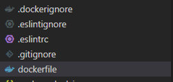

::: tip 介绍
使用docker部署仿写小红书的后端接口
:::

<!-- more -->

# docker部署node服务

由于后端服务器没有node环境，安装也比较困难，但是有docker，所有使用docker部署。

首先先在node服务下编写**dockerfile**和**.dockerignore**



```dockerfile
FROM node

WORKDIR /home/redBookServer
COPY . .
RUN npm config set registry=http://registry.npmmirror.com
RUN npm install pnpm -g
RUN pnpm i
RUN pnpm add pm2 -g
EXPOSE 7001
CMD [ "pnpm","pm2 start -n redBookServer npm -- run dev" ]
```

.dockerignore文件里直接忽略node_modules即可

执行build命令

```bash
docker build -t redbookserver .
```

然后在本地先创建一个容器，然后再把容器导出到一个文件里，不直接导出镜像，是因为导出镜像太大了，直接导出容器好一点。

```bash
docker export 容器id > redbookserver.tar
```

然后把导出的文件上传到服务器导入

```bash
docker import - redbookserver < redbookserver.tar
```

然后在服务器就可以看到该镜像了

```bash
docker images
```

注意由于该镜像是直接通过容器导出的，不是通过镜像文件创建的，所以不能通过常规方式运行比如下面这种

```bash
docker run -d -p 7001:7001 redbookserver
```

**需要先手动运行，然后在容器内部再开启node 服务**

```bash
docker run -itd -p 7001:7001 redbookserver /bin/bash
#查看运行中的容器
docker ps
#进入运行中的容器
docker exec -it 容器id /bin/bash
#找到node项目文件夹
cd /home/redBookServer
#通过PM2运行
pm2 start -n npm -- run dev
```


**查阅质料**

[docker: Error response from daemon: No command specified. 解决_-小末的博客-CSDN博客](https://blog.csdn.net/u013189824/article/details/109623741)

[Docker 容器使用 | 菜鸟教程 (runoob.com)](https://www.runoob.com/docker/docker-container-usage.html)

[Docker - 实现本地镜像的导出、导入（export、import、save、load） (hangge.com)](https://www.hangge.com/blog/cache/detail_2411.html)

[快速开始 | PM2中文网 (fenxianglu.cn)](https://pm2.fenxianglu.cn/docs/start/)