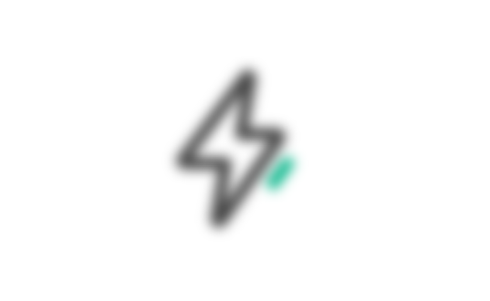

::: tip 介绍
pixi.js学习笔记
:::

<!-- more -->

# pixi.js学习

## 1.基础绘制

**主要步骤**

1. 创建应用
2. 添加到dom中
3. 创建图形
4. 将图形添加到应用中

**绘制矩形**


```vue
<template>
  <div id="container" v-add="app">
  </div>
</template>

<script setup lang="ts">
//导入pixi
import * as PIXI from 'pixi.js'
import type { Directive, DirectiveBinding } from 'vue';

//创建应用
const app=new PIXI.Application({
  width:window.innerWidth,
  height:window.innerHeight,
  backgroundColor:"white",
  resolution:window.devicePixelRatio ?? 1
})

//将应用画布添加到dom中
const vAdd:Directive={
  mounted:(el:HTMLElement,binding:DirectiveBinding<PIXI.Application>)=>{
    el.appendChild(binding.value.view as any)
    window.addEventListener("resize",(ev)=>{
      binding.value.resize()
    })
  }
}

//创建一个矩形
const rectangle=new PIXI.Graphics()
//1.填充颜色
rectangle.beginFill(0x6666cc)
//2.绘制矩形
rectangle.drawRect(20,20,64,64)
//3.绘制完毕
rectangle.endFill()

//将矩形添加到画布
app.stage.addChild(rectangle)
</script>

<style>
*{
  margin: 0;
  padding: 0;
}
:root{
  width: 100vw;
  height: 100vh;
  overflow: hidden;
}

</style>
```

### 1.绘制圆形


```typescript
//导入pixi
import * as PIXI from 'pixi.js'
import { onMounted, type Directive, type DirectiveBinding, reactive } from 'vue';

//创建应用
const app=new PIXI.Application({
  width:window.innerWidth,
  height:window.innerHeight,
  backgroundColor:"white",
  resolution:window.devicePixelRatio ?? 1,
  antialias:true
})

//将应用画布添加到dom中
const vAdd:Directive={
  mounted:(el:HTMLElement,binding:DirectiveBinding<PIXI.Application>)=>{
    el.appendChild(binding.value.view as any)
  }
}

onMounted(()=>{
  window.addEventListener('resize',()=>{
    app.resize()
  })
})

//创建一个矩形
const rectangle=new PIXI.Graphics()
rectangle.cursor="pointer"

//1.填充颜色
rectangle.beginFill(0x6666cc,1)
//2.添加边框样式
rectangle.lineStyle(3,0xff2442,1)
//3.绘制矩形
rectangle.drawRect(0,0,64,64)
//4.绘制完毕
rectangle.endFill()

//图形的缩放
//rectangle.scale.set(2,2)


//修改图形锚点
rectangle.pivot.set(32,32)
//旋转
rectangle.rotation=-Math.PI/4
//位移
rectangle.position.set(100,100)

//将矩形添加到舞台
app.stage.addChild(rectangle)

//绘制一个圆形
const circleGraphics=new PIXI.Graphics()
circleGraphics.lineStyle({
  width:1,
  color:'#ff2442'
})
circleGraphics.drawCircle(200,200,100)

app.stage.addChild(circleGraphics)

const handle=async ()=>{
  const res=await app.renderer.extract.base64(app.stage)
  const a=document.createElement('a')
  a.download="test.jpg"
  a.href=res
  a.click()
}
```


### 2.绘制圆角矩形


```typescript
//绘制一个圆角矩形
const rectRadius=new PIXI.Graphics()
rectRadius.beginFill("#00ff33")
rectRadius.drawRoundedRect(300,300,100,100,20)
rectRadius.endFill()
app.stage.addChild(rectRadius)
```


### 总结

**自己可以调用PIXI.Graphics相关的图形api绘制一些简单的图形**


## 2.纹理和精灵


### 主要步骤

1. **创建纹理**
2. **根据纹理创建精灵**
3. **开启交互选项**
4. **添加事件处理**
5. **添加到舞台**

```typescript
<template>
  <!-- <button :style="{
    position:'absolute',
    top:100,
    left:100,
    zIndex:999,

  }" @click="handle" >点我下载</button> -->
  <div id="container" v-add="app">
  </div>
  
</template>

<script setup lang="ts">
//导入pixi
import * as PIXI from 'pixi.js'
import { onMounted, type Directive, type DirectiveBinding, reactive } from 'vue';
import img from './assets/电池电量.png'
//创建应用
const app=new PIXI.Application({
  width:window.innerWidth,
  height:window.innerHeight,
  backgroundColor:"white",
  resolution:window.devicePixelRatio ?? 1,
  antialias:true
})

//将应用画布添加到dom中
const vAdd:Directive={
  mounted:(el:HTMLElement,binding:DirectiveBinding<PIXI.Application>)=>{
    el.appendChild(binding.value.view as any)
  }
}

//创建一个纹理
const texture=PIXI.Texture.from(img)

//创建一个精灵
const sprite=new PIXI.Sprite(texture)
//设置sprite锚点
sprite.anchor.set(0.5)
sprite.alpha=0.5
//设置位置
sprite.position.x=window.innerWidth/2
sprite.position.y=window.innerHeight/2
app.stage.addChild(sprite)

//ticker实现动画
app.ticker.add((delay)=>{
  //delay两帧之间的间隔
  sprite.rotation+=0.01*delay
})

//为sprite添加交互事件
sprite.interactive=true
sprite.cursor='pointer'
sprite.addEventListener('click',(e)=>{
  if(app.ticker.started){
    app.ticker.stop()
  }else{
    app.ticker.start()
  }
})

sprite.on('mouseenter',(e)=>{
  sprite.alpha=1
})
sprite.on('mouseleave',(e)=>{
  sprite.alpha=0.5
})
</script>

<style>
*{
  margin: 0;
  padding: 0;
}
:root{
  width: 100vw;
  height: 100vh;
  overflow: hidden;
}

</style>
```


## 3.资源管理

**两种方式加载资源**

1. 普通load方式
2. loadBundle方式


### 1.load方式

```vue
<template>
  <!-- <button :style="{
    position:'absolute',
    top:100,
    left:100,
    zIndex:999,

  }" @click="handle" >点我下载</button> -->
  <div id="container" v-add="app">
  </div>
  
</template>

<script setup lang="ts">
//导入pixi
import * as PIXI from 'pixi.js'
import { onMounted, type Directive, type DirectiveBinding, reactive } from 'vue';

//创建应用
const app=new PIXI.Application({
  width:window.innerWidth,
  height:window.innerHeight,
  backgroundColor:"white",
  resolution:window.devicePixelRatio ?? 1,
  antialias:true
})

//将应用画布添加到dom中
const vAdd:Directive={
  mounted:(el:HTMLElement,binding:DirectiveBinding<PIXI.Application>)=>{
    el.appendChild(binding.value.view as any)
  }
}

//添加资源管理
PIXI.Assets.add('battery','/电池电量.png')
PIXI.Assets.add('lighting','/lighting.svg')
//异步加载资源
const texturesPromise=PIXI.Assets.load(['battery','lighting'])

//加载完成后创建精灵
texturesPromise.then((textures)=>{
  //创建容器
  const container=new PIXI.Container()
  container.alpha=0.5

  const battery=new PIXI.Sprite(textures.battery)
  battery.position.set(300,300)
  battery.interactive=true
  battery.anchor.set(0.5,0.5)
  app.ticker.add((delay)=>{
    battery.rotation+=0.01*delay
  })
  //app.stage.addChild(battery)

  const lighting=new PIXI.Sprite(textures.lighting)
  lighting.position.set(600,300)
  lighting.anchor.set(0.5)
  app.ticker.add((delay)=>{
    lighting.rotation+=0.01*delay
  })
  lighting.interactive=true
  //app.stage.addChild(lighting)

  container.addChild(battery,lighting)
  app.stage.addChild(container)
})

</script>

<style>
*{
  margin: 0;
  padding: 0;
}
:root{
  width: 100vw;
  height: 100vh;
  overflow: hidden;
}

</style>
```


### 2.loadBundle方式

```typescript
PIXI.Assets.addBundle('scene',{
  battery:'/电池电量.png',
  lighting:'/lighting.svg'
})
//异步加载资源
const texturesPromise=PIXI.Assets.loadBundle('scene')
```


## 4.文字与遮罩


```vue
<template>
  <!-- <button :style="{
    position:'absolute',
    top:100,
    left:100,
    zIndex:999,

  }" @click="handle" >点我下载</button> -->
  <div id="container" v-add="app">
  </div>
  
</template>

<script setup lang="ts">
//导入pixi
import * as PIXI from 'pixi.js'
import { onMounted, type Directive, type DirectiveBinding, reactive } from 'vue';

//创建应用
const app=new PIXI.Application({
  width:window.innerWidth,
  height:window.innerHeight,
  backgroundColor:"white",
  resolution:window.devicePixelRatio ?? 1,
  antialias:true
})

//将应用画布添加到dom中
const vAdd:Directive={
  mounted:(el:HTMLElement,binding:DirectiveBinding<PIXI.Application>)=>{
    el.appendChild(binding.value.view as any)
  }
}

//开启层级选项
app.stage.sortableChildren=false

const text=new PIXI.Text('hello world',{
  fontSize:60,
  fontStyle:'normal',
  fill:0xffffff
})
text.anchor.set(0.5)
text.position.set(window.innerWidth/2,window.innerHeight/2)

//设置遮罩的话不用再添加到舞台
//app.stage.addChild(text)

//创建一个精灵
const texture=PIXI.Texture.from('/星空.jpg')
const sprite=new PIXI.Sprite(texture)
//设置精灵宽高
sprite.width=window.innerWidth
sprite.height=window.innerHeight
//使用文字作为精灵的遮罩
sprite.mask=text
//添加精灵到舞台
app.stage.addChild(sprite)

</script>

<style>
*{
  margin: 0;
  padding: 0;
}
:root{
  width: 100vw;
  height: 100vh;
  overflow: hidden;
}

</style>
```


## 5.滤镜

### 1.模糊滤镜



```typescript
const texture=PIXI.Texture.from('/lighting.svg')
const sprite=new PIXI.Sprite(texture)
sprite.anchor.set(0.5)
sprite.position.set(app.screen.width/2,app.screen.height/2)

//创建一个滤镜
const blurFilter=new PIXI.BlurFilter()
blurFilter.blur=10;
//将模糊滤镜添加到精灵上
sprite.filters=[blurFilter]
sprite.interactive=true
sprite.on('mouseenter',()=>{
  blurFilter.blur=0
})
sprite.on('mouseleave',()=>{
  blurFilter.blur=10
})
app.stage.addChild(sprite)
```

### 2.轮廓滤镜

**需要安装滤镜库**

```bash
$ pnpm add pixi-filters
```


```vue
<template>
  <!-- <button :style="{
    position:'absolute',
    top:100,
    left:100,
    zIndex:999,

  }" @click="handle" >点我下载</button> -->
  <div id="container" v-add="app">
  </div>
  
</template>

<script setup lang="ts">
//导入pixi
import * as PIXI from 'pixi.js'
import { onMounted, type Directive, type DirectiveBinding, reactive } from 'vue';
import {OutlineFilter} from 'pixi-filters'
//创建应用
const app=new PIXI.Application({
  width:window.innerWidth,
  height:window.innerHeight,
  backgroundColor:"white",
  resolution:window.devicePixelRatio ?? 1,
  antialias:true
})

//将应用画布添加到dom中
const vAdd:Directive={
  mounted:(el:HTMLElement,binding:DirectiveBinding<PIXI.Application>)=>{
    el.appendChild(binding.value.view as any)
  }
}

app.stage.sortableChildren=true

const texture=PIXI.Texture.from('/lighting.svg')
const sprite=new PIXI.Sprite(texture)
sprite.anchor.set(0.5)
sprite.position.set(app.screen.width/2,app.screen.height/2)

//创建轮廓滤镜
const outlineFilter=new OutlineFilter(5,0xffff33)
sprite.filters=[outlineFilter]
app.stage.addChild(sprite)
</script>

<style>
*{
  margin: 0;
  padding: 0;
}
:root{
  width: 100vw;
  height: 100vh;
  overflow: hidden;
}

</style>
```

### 3.发光轮廓


```typescript
//创建轮廓滤镜
const outlineFilter=new OutlineFilter(5,0xffff33)
//创建发光滤镜
const glowFilter=new GlowFilter({
  color:0x66c4d5,
  distance:25,
  outerStrength:1,
  innerStrength:0,
  quality:0.5
})
sprite.filters=[outlineFilter,glowFilter]
app.stage.addChild(sprite)
```


## 6.首页水波特效