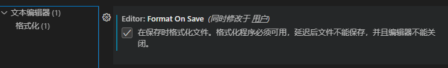

# next.js学习

## 1.安装next.js

```bash
$ pnpm create next-app
```

**这里创建的项目使用的是src的目录结构**

**1.配置eslint**

```json
{
    "extends":["next/core-web-vitals","eslint:recommended"]
}
```

**2.安装样式检查依赖**

```bash
$ pnpm add stylelint stylelint-config-standard-scss -D
```

**配置.stylelintrc.json文件**

```json
{
    "extends": "stylelint-config-standard-scss"
}
```

**3.配置.prettierrc**

```json
{
    "arrowParens": "always",
    "bracketSpacing": true,
    "endOfLine": "lf",
    "htmlWhitespaceSensitivity": "css",
    "insertPragma": false,
    "jsxSingleQuote": false,
    "printWidth": 80,
    "proseWrap": "preserve",
    "quoteProps": "as-needed",
    "requirePragma": false,
    "semi": true,
    "singleQuote": true,
    "tabWidth": 2,
    "trailingComma": "es5",
    "useTabs": false,
    "vueIndentScriptAndStyle": false,
    "parser":"babel"
}
```


**然后还要打开vscode的editor:format on save选项**




## 2.搭建mock server

```bash
$ pnpm add mockjs
```


## 3.集成trpc

**可以参照这个项目**

[nextjs13-trpc-setup/ at main · wpcodevo/nextjs13-trpc-setup · GitHub](https://github.com/wpcodevo/nextjs13-trpc-setup/tree/main)

### 1.创建路由

**app/api/trpc/trpc-router.ts**

```typescript
import { initTRPC } from '@trpc/server'
import { z } from 'zod'

const t = initTRPC.create()

const router = t.router
const procedure = t.procedure

export const appRouter = router({
    hello: procedure.input(z.object({
        text:z.string()
    })).query((opts) => ({
        greeting:`hello ${opts.input.text}`
    }))
})

export type AppRouter=typeof appRouter
```

### 2.进行适配

**app/api/trpc/[trpc]/route.ts**

```typescript
import { fetchRequestHandler } from "@trpc/server/adapters/fetch";
import { appRouter } from "../trpc-router";

const handle = (req: Request) => {
    console.log(`incoming request ${req.url}`)
    return fetchRequestHandler({
        endpoint: '/api/trpc',
        req,
        router: appRouter,
        createContext:()=>({})
    })
}

export {handle as GET,handle as POST}
```

### 3.创建客户端接口

**app/utils**

```typescript
import {createTRPCNext} from '@trpc/next'
import { AppRouter } from '../api/trpc/trpc-router';
import { httpBatchLink } from '@trpc/client';

export const trpc = createTRPCNext<AppRouter>({
    config(info) {
        return {
          links: [
            httpBatchLink({
              url: "http://localhost:3000/api/trpc",
            }),
          ],
        };
    },
    ssr:true
})
```

### 4.注入到context

**app/layout.tsx**

```tsx
"use client";
import './globals.css'
import { Inter } from 'next/font/google'
import { trpc } from './utils/trpc';

const inter = Inter({ subsets: ['latin'] })

export const metadata = {
  title: 'Create Next App',
  description: 'Generated by create next app',
}

function RootLayout({
  children,
}: {
  children: React.ReactNode
}) {
  return (
    <html lang="en">
      <body className={inter.className}>
        {children}
      </body>
    </html>
  )
}
//使用hoc包裹
export default trpc.withTRPC(RootLayout)
```


### 5.使用接口获取数据

```tsx
"use client";
import { trpc } from './utils/trpc'

export default function Home() {
  const hello = trpc.hello.useQuery({ text: '叶师傅' })
  
  return (
    <p>{ hello.data?.greeting }</p>
  )
}
```


**使用trpc更好的体现了函数式编程的优点**


## 4.基本布局Layout

1. 在当前目录下创建layout.tsx
2. 在当前目录下创建_components目录

**注意app结构下使用路由相关的得从navigation下导入**

```tsx
// app/layout.tsx
"use client";
import { trpc } from '@/utils/trpc'
import 'antd/dist/reset.css'
import './global.css'
import { Inter } from 'next/font/google'
import Navbar from './_components/Navbar';
import Footer from './_components/Footer';

const inter = Inter({ subsets: ['latin'] })

export const metadata = {
  title: 'Create Next App',
  description: 'Generated by create next app',
}

function RootLayout({
  children,
}: {
  children: React.ReactNode
}) {
  return (
    <html lang="en">
      <body className={inter.className}>
        <Navbar></Navbar>
        {children}
        <Footer></Footer>
      </body>
    </html>
  );
}

export default trpc.withTRPC(RootLayout)
```

**app/_components/Navbar/index.tsx**

```tsx

import Link from "next/link";
import { navs } from "./config";
import styles from "./index.module.scss";
//app 文件结构得使用navigation下的路由才行
import { usePathname } from "next/navigation";
export default function Navbar() {
  //获取路径信息
  const pathname = usePathname()
  return (
    <div className={styles.navbar}>
      <section className={styles.logArea}>BLOG-C</section>
      <section className={styles.linkArea}>
        {navs?.map((item) => (
          <Link
            className={item.value === pathname ? styles.active : styles.link}
            key={item.label}
            href={item.value}
          >
            {item.label}
          </Link>
        ))}
      </section>
      <section className={styles.linkArea}>
        <button>登录</button>
      </section>
    </div>
  );
};

```


## 5.登录

**登录注册模块**

1. 登录弹框
2. 手机验证码登录
3. 第三方登录