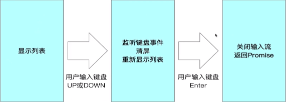

::: tip 介绍
node脚手架开发
:::

<!-- more -->

## 脚手架node

前端脚手架是一种用于快速搭建前端项目的工具。它可以帮助开发者快速生成项目的基本结构、配置文件、依赖项等，从而节省开发时间和提高开发效率。前端脚手架通常包括一些常用的功能和库，如自动化构建、代码压缩、代码检查等，可以帮助开发者更好地管理和维护项目。常见的前端脚手架包括Vue-cli、Create React App等。


### 1.cli开发与前端开发的区别

CLI开发和Web前端开发有以下几点区别：
 1. 目标不同：CLI开发的目标是创建和管理命令行工具，而Web前端开发的目标是创建和维护Web应用程序。
 2. 技术栈不同：CLI开发通常使用Node.js和一些Node.js模块，如yargs、commander等，而Web前端开发通常使用HTML、CSS、JavaScript等技术。
 3. 应用场景不同：CLI开发主要应用于命令行工具、脚手架、自动化构建等方面，而Web前端开发主要应用于Web应用程序、网站等方面。
 4. 需求不同：CLI开发通常需要更多的系统级和命令行工具方面的知识，而Web前端开发需要更多的Web开发技能和UI设计方面的知识。
 5. 工作方式不同：CLI开发通常是在终端中进行，而Web前端开发通常是在浏览器中进行。


### 2.什么是脚手架

脚手架本质就是一个操作系统的客户端，他通过命令行执行

```bash
pnpm create vue
```

CLI是指命令行界面（Command Line Interface），它是一种通过在命令行中输入命令来与计算机进行交互的方式。与之相对的是图形用户界面（GUI），GUI提供了可视化的操作界面，用户可以通过鼠标和键盘来与计算机进行交互。

CLI通常通过在终端或命令提示符中输入命令来执行特定的操作。它可以用于执行各种任务，如文件操作、系统管理、软件开发等。

CLI具有以下一些特点：

1. 命令行输入：用户通过键盘输入命令和参数来执行操作。命令通常由一个命令名称和一些选项或参数组成。

2. 命令行解析：CLI解析用户输入的命令和参数，并根据其定义的规则执行相应的操作。

3. 脚本化：CLI支持编写脚本，用户可以将一系列命令组合成脚本文件，以便重复执行或自动化操作。

4. 批处理：CLI可以批量处理多个命令，用户可以编写批处理脚本来一次性执行多个命令。

5. 可编程性：CLI通常提供了API或插件机制，允许开发人员编写自定义命令或扩展功能。

CLI在很多情况下比GUI更高效和灵活，特别是在自动化、远程管理和脚本编写方面。它也是开发人员进行软件开发和系统管理的重要工具。


### 3.cli快速开发

#### 1.开发流程

- **脚手架创建**

  pnpm init

- **脚手架开发**

  分包

  参数解析

- **脚手架调试**

  pnpm link

- **脚手架发布**

  pnpm publish

#### 2.为什么需要脚手架框架

脚手架框架是一种用于快速构建项目的工具，它提供了一套通用的项目结构、模板代码、工具集等，让开发者可以快速搭建项目的基础框架，从而更快地进行业务开发。
 使用脚手架框架的好处有以下几点：
 1. 提高开发效率：通过脚手架框架提供的模板代码和工具集，可以快速搭建项目的基础框架，省去了从零开始搭建项目的时间和精力。
 2. 统一项目结构：脚手架框架提供了一套通用的项目结构，可以避免每个开发者都按照自己的习惯来组织项目结构，从而使得项目更加规范和易于维护。
 3. 降低学习成本：脚手架框架通常提供了一套简单易懂的命令行接口，可以帮助开发者快速上手，降低学习成本。
 4. 提高项目质量：脚手架框架提供了一些工具集，例如自动化测试、代码检查等，可以帮助开发者提高项目的质量和稳定性。
 总之，脚手架框架可以帮助开发者快速搭建项目的基础框架，提高开发效率和项目质量，降低学习成本，是现代软件开发中不可或缺的工具之一。


**node中主要的三种框架**

1. yargs
2. command
3. oclif

最常用的是command,oclif基于类的方式带来了一种新的思路。


#### 3.初始化一个脚手架项目


```bash
$ pnpm init
```

新建文件夹bin在其下面添加index.js

在index.js文件第一行添加如下代码

```js
#!/usr/bin/env node
```

在package.json下添加

```json
{
    "bin": {
    	"yxy":"bin/index.js"
  	},
}
```

然后软链接到全局就能使用命令了

```bash
$ pnpm link -g
```

取消链接的话直接移除全局包就行

```bash
$ pnpm remove <包名>
```


#### 4.commander基本使用

```typescript
#!/usr/bin/env node

import { Command } from "commander";

const program=new Command()
program
    .name("yxy")
    .description("一个commander使用例子");

program
    .option("-d, --debug", "是否启动debug模式")
    .option("-n, --name <name>", "名称")
    .action((name) => {
        console.log(name)
    })

program
    .command("add <path>")
    .description("添加一段路径")
    .action((path) => {
        console.log(path)
    })

program
    .command("remove <path>")
    .description("移除一段路径")
    .option("-f, --force","是否强制移除",false)
    .action((path,comObj) => {
        console.log(`remove ${path} ,force : ${comObj.force}`)
    })

program.parse()

```


#### 5.ora原理

首先引入一些依赖库，包括cliSpinners、cliCursor、BufferListStream和readline。然后定义了一些变量，例如组件库、默认文本、输出流、当前帧数等等。接着创建了一个缓冲区流和一个读取行的接口，并且定义了一个render函数用于渲染动画。然后隐藏了光标，启动了定时器渲染动画，并且定义了一个清除函数和一个停止函数。最后通过setTimeout函数设置了5秒后停止动画。

```js
import cliSpinners from "cli-spinners";
import cliCursor from "cli-cursor"
import {BufferListStream} from "bl";
import readline from "node:readline";


const spinners = cliSpinners.moon //组件库
const text = "loading..." //默认的文本
const stream = process.stderr //输出流

let frameIndex = 0 //当前第几帧
const frames = spinners.frames; //每一帧的内容
const interval = spinners.interval //没一帧的间隔

const mutedStream = new BufferListStream();//创建缓冲区
mutedStream.pipe(process.stdout)
//开启监听
const rl = readline.createInterface({
    input: process.stdin,
    output: mutedStream
})

function render() {
    clear()
    const renderTxt = frames[frameIndex] + ' ' + text;
    //渲染到终端
    stream.write(renderTxt)
    frameIndex = ++frameIndex % frames.length;
}
//隐藏光标
cliCursor.hide(stream)
//启动定时器渲染
let i = setInterval(render, interval);

function clear() {
    stream.cursorTo(0)
    stream.clearLine(1)
}

function stop() {
    clearInterval(i)
    i = undefined;
    clear();
    frameIndex = 0
    cliCursor.show(stream)
    //结束监听
    rl.close()
}

setTimeout(() => {
   stop() 
},5000)
```


#### 6.inquirer使用

```js
import inquirer from 'inquirer'

inquirer.prompt({
    type: 'input',
    name: 'yourName',
    message:"please input you name"
}).then(res => {
    console.log(res)
})
```


#### 7.命令行交互原理

```js

function stepRead(callback: (answer: string) => void) {
    const input = process.stdin;
    const output = process.stdout;
    let line = '';

    //注册事件
    input.on('keypress', onKeypress);
    //启动原生模式，逐个读取输入字符
    input.setRawMode(true);
    input.resume()

    //触发keypress事件
    emitKeypressEvents(input);

    //keypress的回调函数
    function onKeypress(s: string) {
        output.write(s)
        line += s;
        switch (s) {
            case '\r':
                input.pause();
                callback(line);
                break;
            
        }
    }
}

function emitKeypressEvents(stream: NodeJS.ReadStream) {
    //使用生成器生成迭代器
    const g = emitKeys(stream);
    g.next()

    //注册data事件，当用户输入数据时会触发onData函数
    stream.on('data', onData)

    function onData(chunk: Buffer) {
        //使用迭代器的next传递参数
        g.next(chunk.toString())
    }
}

//巧妙使用生成器
function* emitKeys(stream: NodeJS.ReadStream):Generator<any,any,string> {
    while (true) {
        let ch = yield;
        //通过keypress触发回调并传递值
        stream.emit('keypress', ch);
    }
}

//readline
stepRead((s) => {
    console.log('hello '+s)
})
```


#### 8.inquirer核心原理



```js
// 导入 EventEmitter 类，用于处理事件
import EventEmitter from "node:events";
// 导入 MuteStream 类，用于控制输出流的静音
import MuteStream from 'mute-stream'
// 导入 Readline 模块，用于接收用户输入
import Readline from "node:readline";
// 导入 fromEvent 方法，用于处理事件流
import { fromEvent } from 'rxjs'
// 导入 ansi-escapes 模块，用于处理控制台输出
import ansiEscapes from 'ansi-escapes'
 // 定义选项对象
const options = {
    type: "list",
    name: "name",
    message: "select your name",
    choices: [
        {name:"张三",value:"张三"},
        {name:"李四",value:"李四"}, 
        {name:"王五",value:"王五"},
    ]
}
 // 定义 Prompt 函数，用于创建并渲染列表
function Prompt(options) {
    return new Promise((resolve, reject) => {
        try {
            const list = new List(options)
            list.render()
            list.on('exit',resolve)
        } catch (error) {
            reject(error)
        }
    })
}
 // 定义 List 类，继承自 EventEmitter
class List extends EventEmitter{
    constructor(options) {
        super()
        this.name = options.name;
        this.message = options.message;
        this.choices = options.choices;
        this.input = process.stdin;
        const ms = new MuteStream()
        ms.pipe(process.stdout)
        this.output = ms;
         // 创建 Readline 接口
        this.rl = Readline.createInterface({
            input: this.input,
            output: this.output, 
        })
         this.selected = 0; 
        this.height = 0;
        this.keypress=fromEvent(this.input,'keypress').forEach(this.onKeypress)
        this.hasSelected = false;
     }
     // 定义 onKeypress 方法，用于处理按键事件
    onKeypress=(keyMap)=> {
        const key = keyMap[1].name;
        if (key === 'up') {
            if (this.selected >0) {
              this.selected--;
            } else {
              this.selected = this.choices.length-1;
            }
            this.render();
        } else if (key === 'down') {
            if (this.selected < this.choices.length - 1) {
                this.selected++;
            } else {
                this.selected = 0;
            }
            this.render();
        } else if (key === 'return') {
            this.hasSelected = true;
            this.render();
            this.close();
            this.emit('exit', this.choices[this.selected]);
        }
     }
     // 定义 render 方法，用于渲染列表
    render() {
        this.output.unmute();
        this.clean()
        this.output.write(this.getContent())
        this.output.mute()
    }
     // 定义 clean 方法，用于清除控制台输出
    clean() {
        const empty = ansiEscapes.eraseLines(this.height);
        this.output.write(empty);
    }
     // 定义 getContent 方法，用于获取列表内容
    getContent=()=> {
        if (!this.hasSelected) {
            let title =
              "\x1B[32m?\x1B[39m \x1B[1m" +
              this.message +
              "\x1B[22m\x1B[0m\x1B[2m(Use arrow keys)\x1B[22m\n";
             this.choices.forEach((value, index) => {
                if (index === this.selected) {
                    //判断是否为最后一个元素
                    if (index === this.choices.length - 1) {
                        title +='\x1B[36m> '+ value.name+'\x1B[39m';
                    } else {
                        title += "\x1B[36m> " + value.name + "\x1B[39m\n";
                    }
                } else {
                    //判断是否为最后一个元素
                    if (index === this.choices.length - 1) {
                        title += '  '+ value.name;
                    } else {
                        title += '  '+value.name + "\n";
                    }
                }
            })
            this.height = this.choices.length + 1;
            return title; 
        } else {
            const name = this.choices[this.selected].name;
            let title =
              "\x1B[32m?\x1B[39m \x1B[1m" +
              this.message +
                "\x1B[22m\x1B[0m\x1B[36m " + name + "\x1B[39m\x1B[0m\n";
            return title
        }
    }
     // 定义 close 方法，用于关闭 Readline 接口
    close() {
        this.output.unmute();
        this.output.end();
        this.rl.pause();
        this.rl.close()
    }
}
 // 调用 Prompt 函数，并处理返回结果
Prompt(options).then((answers) => {
  console.log(answers);
});
```


**总结：**

**主要就是渲染清屏，然后处理键盘事件，最后终端输入。**


### 4.通用脚手架框架

#### 1.初始化项目

```bash
pnpm init
pnpm add @changesets/cli -Dw
```

**可以参考这篇文章**

[基于 pnpm + changesets 的 monorepo 最佳实践 - 掘金 (juejin.cn)](https://juejin.cn/post/7181409989670961207)

**在根目录添加**

**pnpm-workspace.yaml文件**

```yaml
packages:
  - "packages/*"
```

**初始化ts配置文件**

```typescript
tsc --init
```

**安装依赖**

```bash
pnpm add typescript tslib rollup -Dw
```

**安装rollup插件**

```bash
pnpm add @rollup/plugins-typescript -Dw
```

**在packages子包下面**

**创建tsconfig.json继承根目录下的ts配置文件**

```json
{
  "extends":["../../tsconfig.json"],
  "compilerOptions":{
    "declaration": true,
    "declarationDir": "types"
  }
}
```

**然后用rollup进行打包**

**build.js**

```js
import {rollup} from 'rollup'
import path from 'path';
import commonJs from '@rollup/plugin-commonjs'
import nodeResolve from '@rollup/plugin-node-resolve';
import typescript from '@rollup/plugin-typescript';


async function build() {
  //获取入口和输出文件位置
  const args = process.argv.slice(2);
  const dir = process.cwd();
  
	const bundle = await rollup({
    input: path.resolve(dir, args[0]),
    plugins: [
      typescript(),
      /* commonJs({
				extensions:[".js",".ts"]
			}), */
      //nodeResolve(),
    ],
  });

	await bundle.write({
		format: 'esm',
		file: path.relative(dir, args[1]),
		banner:"#!/usr/bin/env node"
	})
}

build()
```

**修改每个子包下的build命令**

```json
{
  "scripts": {
    "build":"node ../../build.js src/index.ts bin/index.js"
  },
}
```

**修改根路径下package.json的build命令**

```json
{
"scripts": {
    "build": "pnpm -r run build"
  },
}
```

**直接在根路径使用`pnpm build`就会依次构建所有子包**


#### 2.使用npmlog进行日志打印

```typescript
import log from "npmlog";

if (process.argv.includes("--debug") || process.argv.includes("-d")) {
  log.level = "verbose";
} else {
  log.level = "info";
}

log.heading = "yxy";
log.addLevel("success", 2000, {
  fg: "green",
  bold: true,
});

export { log };
```


**安装semver进行版本比较**

**cli/src/index.ts**

```typescript
import { program } from "commander"
import pkg from '../package.json'
import { Init } from "@yexiyue/init"
import { log,isDebug } from "@yexiyue/utils"
import semver from 'semver'
import chalk from 'chalk'

const LOWEST_VERSION="19.0.0"

//node 版本检查
function checkNodeVersion() {
	log.verbose("node version", process.version)
	if (!semver.gte(process.version, LOWEST_VERSION)) {
		throw new Error(
      chalk.red(`yxy cli 最低需要安装${LOWEST_VERSION}以上版本的node`)
    );
	}
}

process.on("uncaughtException", (error) => {
	if (isDebug()) {
		console.error(error)
	} else {
		log.error("error", error.message);
	}
})

//启动逻辑
function preAction() {
	checkNodeVersion()
}

export default function entry(argv: string[]) {
	
	program
		.name(Object.keys(pkg.bin)[0])
		.usage('<command> [options]')
		.version(pkg.version)
		.option('-d, --debug', "是否开启调试模式", false)
		.hook("preAction",preAction)
		

	Init(program)
	
	program.parse(argv)
}
```


#### 3.解决esm无法使用dirname,filename的问题

```typescript
import path from "path";
import { fileURLToPath } from "url";

export function getDirnameAndFilename(str:string) {
    const filename=fileURLToPath(import.meta.url);
    return {
        filename,
        dirname:path.dirname(filename)
    }
}
```


#### 4.对异常进行监听

```typescript
import { isDebug, log } from "@yexiyue/utils";

export function exception() {
  function printError(error: any,type:string) {
    if (isDebug()) {
      log.error(type,error);
    } else {
      log.error(type, error.message);
    }
  }
  //捕捉常见错误
  process.on("uncaughtException", (e)=>printError(e,'error'));
  //捕捉promise异常
  process.on("unhandledRejection", (e)=>printError(e,'promise'));
}

```


#### 5.监听属性和命令

```typescript
//监听debug属性
  program.on('option:debug', () => {
    if (program.opts().debug) {
      log.verbose('debug','debug模式启动')
    }
  })
  
  //监听未注册的命令
  program.on("command:*",  (ojb)=>{
    log.error("未知的命令：",ojb[0])
  })
```

#### 6.集成vitest

```bash
pnpm add vitest -Dw
```

然后直接在`cli/__test__/cli.test.ts`文件编写测试

```typescript
import { expect, test } from 'vitest'

test("run error command", () => {
    expect(1+1).toBe(2)
})
```

最后在根package.json中添加test命令

```json
{
	"test":"vitest"
}
```

vitest能自动支持monorepo，ts，esm


#### 7.使用execa执行命令

```bash
pnpm add execa
```

**结合vitest编写测试用例**

```typescript
import { expect, test,assert } from 'vitest'
import {execa} from 'execa'
import path from 'path'
import {version} from '../package.json'

const CLI = path.join(__dirname, '../bin/index.js');
const bin = () => (...args:any[]) => execa(CLI,args);

test("run error command", async () => {
    const {stderr} =await bin()('iii')
    expect(stderr).toContain("未知的命令： iii");
})

test("should not throw error when use --help", async() => {
    let error = null;
    try {
        await bin()('--help')
    } catch (err) {
        error=err
    }

    expect(error).toBe(null);
})

test("show correct version", async () => {
    const { stdout } = await bin()("-V")
    
    expect(stdout).toContain(version)
})

test("open debug mode", async () => {
    let e = null;
    try {
        await bin()("-d");
    } catch (error:any) {
        e=error
    }
    expect(e.message).toContain("debug模式启动");
}) 
```


### 5.初始化cli

#### 1.创建项目模板


**首先先在npm上新建一个Organization**


**然后在模板项目下新建package.json文件**

```json
{
  "name": "@yexiyue.com/template-vue",
  "version": "1.0.2",
  "description": "a template for vue3",
  "keywords": [
    "vue3",
    "template",
    "typescript",
    "cli"
  ],
  "author": "yexiyue",
  "license": "ISC",
  "publishConfig": {
    "access": "public"
  }
}

```

**然后`npm publish`发布到npm**

这样一个模板就创建成功


**可以使用git对所有项目模板进行管理**


