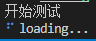

# rust版本脚手架开发

## 1.开发流程

- **脚手架创建**

  **cargo init**

- **脚手架开发**

  分包

  参数解析

- **脚手架调试**

  **cargo install --path .**

- **脚手架发布**

  cargo publish

## 2.为什么需要脚手架框架

脚手架框架是一种用于快速构建项目的工具，它提供了一套通用的项目结构、模板代码、工具集等，让开发者可以快速搭建项目的基础框架，从而更快地进行业务开发。
 使用脚手架框架的好处有以下几点：

  1. 提高开发效率：通过脚手架框架提供的模板代码和工具集，可以快速搭建项目的基础框架，省去了从零开始搭建项目的时间和精力。
  2. 统一项目结构：脚手架框架提供了一套通用的项目结构，可以避免每个开发者都按照自己的习惯来组织项目结构，从而使得项目更加规范和易于维护。
  3. 降低学习成本：脚手架框架通常提供了一套简单易懂的命令行接口，可以帮助开发者快速上手，降低学习成本。
  4. 提高项目质量：脚手架框架提供了一些工具集，例如自动化测试、代码检查等，可以帮助开发者提高项目的质量和稳定性。
     总之，脚手架框架可以帮助开发者快速搭建项目的基础框架，提高开发效率和项目质量，降低学习成本，是现代软件开发中不可或缺的工具之一。

### 1.rust cli开发框架

在Rust生态系统中，有几个主流的CLI（命令行界面）开发框架，它们分别是：

1. Clap：Clap是一个功能强大且易于使用的命令行参数解析库。它提供了丰富的功能，如子命令、选项、位置参数、环境变量解析等。Clap还支持生成帮助文档和自动补全功能。

2. StructOpt：StructOpt是一个基于Clap的库，它通过使用属性宏来简化命令行参数的定义和解析。它允许你将参数定义为结构体的字段，并自动生成解析器。StructOpt还提供了一些额外的特性，如默认值、多值参数、自定义解析器等。

3. Docopt：Docopt是一个基于文档的命令行参数解析器。它使用简洁的文本描述来定义命令行参数，并自动生成解析器。Docopt支持子命令、选项、位置参数等，并且生成的解析器具有非常直观的使用方式。

4. Gumdrop：Gumdrop是一个轻量级的命令行参数解析库，它提供了简单而灵活的API。它支持选项、位置参数、子命令等，并且可以轻松地与其他Rust库集成。


**本文主要使用clap开发**


### 2.clap基本使用

```rust
use clap::{Parser,Subcommand,Args,command,arg};
use colored::Colorize;
use dialoguer::MultiSelect;


#[derive(Parser)]
#[command(author, version, about)]
///工具介绍
struct Cli{
    #[command(subcommand)]
    command:Option<Commands>,

    ///启动调试模式
    #[arg(short,long,default_value="false")]
    debug:Option<bool>
}


#[derive(Subcommand)]
enum Commands{
    ///测试打印
    Print { 
        txt:Option<String>,
        #[arg(short,long)]
        name:Option<String>,
    },

    ///介绍子命令
    Choice
}


fn main() {
    let cli=Cli::parse();

    let list = vec![
        "苹果",
        "香蕉",
        "葡萄"
    ];

    match &cli.command{
        Some(value)=>{
            match value {
                Commands::Print { txt,name }=>{
                if let Some(name)=name{
                    println!("输入的参数是 {}",name.green());
                }
                println!("输入的参数是 {}",txt.clone().expect("默认1111").green());
                },
                Commands::Choice=>{
                    let choices=MultiSelect::new().items(&list).interact().unwrap();

                    println!("{:?}",choices);
                }
            }
        },
        _=>()
    }

    if let Some(dbg_bool)=cli.debug {
        println!("是否启动调试模式{}",dbg_bool);
    }
}

#[cfg(test)]
mod test{
    use clap::CommandFactory;

    use crate::Cli;

    #[test]
    fn verify_cli(){
        Cli::command().debug_assert();
    }
}

```


### 3.loading原理



注意：使用内存共享实现暂停不可行;

**join方法不要提前加，不然会阻塞后面代码的执行，所以要视情况而定**

```rust
use console::{Style, Term};
use std::error::Error;
use std::sync::mpsc::{self, Receiver, Sender};
use std::sync::{Arc, Mutex};
use std::thread::{self, JoinHandle};
use std::time::Duration;
use std::io::Write;

struct Spinner {
    text: &'static str,
    frames: Vec<&'static str>,
    frame_index: usize,
    interval: u64,
    terminal: Term,
    color: Style,
}

impl Spinner{
    fn new(text:&'static str)->Self{
        Self{
            text,
            frames: vec!["⠋", "⠙", "⠹", "⠸", "⠼", "⠴", "⠦", "⠧", "⠇", "⠏"],
            frame_index: 0,
            interval: 80,
            terminal: Term::stderr(),
            color: Style::new().blue(),
        }
    }

    fn clear(&self){
        self.terminal.clear_line().unwrap();
    }
}

struct Loading{
    spinner:Arc<Mutex<Spinner>>,
    stop_sender:Option<Sender<()>>
}

impl Loading {
    fn new(text:&'static str) -> Self {
        Self{
            spinner:Arc::new(Mutex::new(Spinner::new(text))),
            stop_sender:None
        }
    }

    fn stop(&mut self){
        if let Some(sender) = self.stop_sender.take() {
            sender.send(()).unwrap();
        }
    }

    fn start(&mut self)->JoinHandle<()>{
        let spinner=self.spinner.clone();
        let (tx,rx)=mpsc::channel();
        self.stop_sender=Some(tx);

        thread::spawn(move|| {
            let mut spinner=spinner.lock().unwrap();
            spinner.terminal.hide_cursor().unwrap();

            loop{
                //清理当前行
                spinner.clear();
                //获得当前帧数渲染的内容
                let render_text=format!("{} {}",spinner.color.apply_to(spinner.frames[spinner.frame_index]),spinner.text);
                spinner.terminal.write_all(&render_text.as_bytes()).unwrap();
                //更新帧数
                spinner.frame_index=(spinner.frame_index+1)%spinner.frames.len();
                //睡眠间隔时间
                thread::sleep(Duration::from_millis(spinner.interval));
                
                if rx.try_recv().is_ok() {
                    spinner.clear();
                    spinner.frame_index=0;
                    spinner.terminal.show_cursor().unwrap();
                    break;
                }

            }
        })
    }
}

fn main() {
    let mut loading=Loading::new("loading...");
    println!("开始测试");
    let handle=loading.start();
    thread::sleep(Duration::from_secs(3));
    loading.stop();
    handle.join().unwrap();
}
```

这段代码实现了一个命令行的旋转加载动画。首先定义了一个Spinner结构体，包含了动画的文本、帧数、帧数索引、间隔时间、终端和颜色等属性。然后定义了Loading结构体，包含了一个Spinner的Arc<Mutex>指针和一个停止发送器。Loading结构体实现了start和stop方法，用于启动和停止动画。start方法启动一个新线程，不断更新动画帧数，并在终端上显示。stop方法向停止发送器发送消息，通知线程停止动画。最后在main函数中创建Loading对象，启动动画线程，等待3秒后停止动画。
 具体步骤如下：

 1. 定义Spinner结构体，包含动画的文本、帧数、帧数索引、间隔时间、终端和颜色等属性
 3. 定义Spinner结构体的new方法，用于初始化Spinner对象的属性
 4. 定义Spinner结构体的clear方法，用于清理终端上的当前行
 5. 定义Loading结构体，包含一个Spinner的Arc<Mutex>指针和一个停止发送器
 6. 定义Loading结构体的new方法，用于初始化Loading对象的属性
 7. 定义Loading结构体的stop方法，用于向停止发送器发送消息，通知线程停止动画
 8. 定义Loading结构体的start方法，用于启动动画线程
 9. 在start方法中，获取Spinner对象的锁，并隐藏终端光标。然后进入循环，不断更新动画帧数，并在终端上显示。如果收到停止发送器的消息，则清理终端上的当前行，重置帧数索引，显示终端光标，退出循环。
 10. 在main函数中，创建Loading对象，启动动画线程，等待3秒后停止动画。最后等待动画线程结束。


### 4.dialoguer基本使用

```rust
use dialoguer::Input;

fn main(){
    let string:String=Input::new().with_prompt("please input you name").interact().unwrap();
    println!("{}",string);
    
}
```

```rust
use dialoguer::{Input,Select};
use dialoguer::theme::ColorfulTheme;
fn main(){
    let string:String=Input::with_theme(&ColorfulTheme::default())
    .show_default(true)
    .default("张三".to_string())
    .with_prompt("please input you name")
    .validate_with(|input: &String|->Result<(),&str>{
        if input== "yexiyue" {
            Ok(())
        }else{
            Err("please input right")
        }
    }).interact().unwrap();
    println!("{}",string);
    let value=Select::with_theme(&ColorfulTheme::default())
        .items(&vec!["香蕉","苹果","葡萄"])
        .default(0)
        .with_prompt("请选择你喜欢的水果")
        .interact()
        .unwrap();
    println!("{}",value);
}
```


### 5.列表核心实现


```rust
// 导入所需的库
use console::{Key, Term};
use std::io;
 // 定义一个名为List的结构体，其中包含message（提示信息）、choices（选项列表）等字段
struct List<'a> {
    message: &'a str,
    choices: &'a [&'a str],
    selected: usize,
    has_selected: bool,
    term: Term,
}
 // 为List结构体实现方法
impl<'a> List<'a> {
    // 创建一个新的List实例
    fn new( message: &'a str, choices: &'a [&'a str]) -> Self {
        Self {
            message,
            choices,
            selected: 0,
            has_selected: false,
            term: Term::stdout(),
        }
    }
     // 渲染List实例
    fn render(&self) {
        // 清屏
        self.term.clear_screen().unwrap();
        // 判断是否已经选择了选项
        if self.has_selected {
            // 显示已选择的选项
            self.term
                .write_line(&format!(
                    "\x1B[32m?\x1B[39m {} \x1B[36m{}\x1B[39m",
                    self.message, self.choices[self.selected]
                ))
                .unwrap();
        } else {
            // 显示提示信息和选项列表
            self.term
                .write_line(&format!(
                    "\x1B[32m?\x1B[39m \x1B[1m {} \x1B[22m\x1B[0m\x1B[2m(Use arrow keys)\x1B[22m",
                    self.message
                ))
                .unwrap();
             // 遍历选项列表，为每个选项添加前缀和后缀
            for (i, choice) in self.choices.iter().enumerate() {
                let prefix = if i == self.selected {
                    "\x1B[36m> "
                } else {
                    "  "
                };
                let suffix = "\x1B[39m";

                self.term
                    .write_line(&format!("{}{}{}", prefix, choice, suffix))
                    .unwrap();
            }
        }
    }
     // 处理按键事件
    fn on_keypress(&mut self) {
        // 读取按键
        match self.term.read_key().unwrap() {
            // 上箭头：向上移动选项
            Key::ArrowUp => {
                if self.selected > 0 {
                    self.selected -= 1;
                } else {
                    self.selected = self.choices.len() - 1;
                }
            }
            // 下箭头：向下移动选项
            Key::ArrowDown => {
                if self.selected < self.choices.len() - 1 {
                    self.selected += 1;
                } else {
                    self.selected = 0;
                }
            }
            // 回车键：确认选择
            Key::Enter => self.has_selected = true,
            // 其他按键：不做处理
            _ => {}
        }
    }
     // 运行List实例
    fn run(&mut self) -> io::Result<&'a str> {
        // 隐藏光标
        self.term.hide_cursor().unwrap();
        // 循环渲染和处理按键事件，直到选择了选项
        loop {
            self.render();
            if self.has_selected {
                break;
            }
            self.on_keypress();
         }
        // 显示光标
        self.term.show_cursor().unwrap();
        // 返回选中的选项
        Ok(self.choices[self.selected])
    }
}
 // 主函数
fn main() {
    // 创建一个List实例
    let mut list = List::new( "select your name", &["张三", "李四", "王五"]);
    // 运行List实例并获取选中的选项
    let answer = list.run().unwrap();
    // 输出选中的选项
    println!("answer is {}", answer);
}
```


## 3.基础项目搭建

**在空目录新建文件Cargo.toml**

```toml
[workspace]
members=[
    "cli",
    "command"
]
```

**然后使用cargo new 新建这两个项目**

**cli项目目录结构**


### 1.lib模块细分

由于rust的模块跟文件路径有关系，且有默认约束，所以当src下lib文件存在时直接使用mod定义分文件夹下的模块

```rust
//lib.rs
mod utils;
pub mod cli;
```

同时每个文件夹下必须有个mod.rs文件

```rust
//cli/mod.rs
trait Action {
    fn action(&mut self);
}

mod cli;
mod init_command;
pub use cli::cli_init;
```

**同理在该文件中定义当前文件夹下其他文件模块**


```rust
use clap::{command,arg,Parser, Subcommand};
use super::Action;
use crate::utils::prelude;
use super::init_command::InitArgs;

#[derive(Debug,Parser)]
#[command(author,about,version)]
pub struct CliInit{
    ///子命令
    #[command(subcommand)]
    commands:Commands,

    ///是否开启调试模式
    #[arg(short,long,default_value="false")]
    debug:bool,
}

//在这里注册子命令
#[derive(Debug,Subcommand)]
enum Commands{
    ///初始化项目
    Init(InitArgs)
}

impl Action for CliInit{
    fn action(&mut self) {
        prelude::init(*(&self.debug));
    }
}

pub fn cli_init(){
    let mut cli=CliInit::parse();
    cli.action();
}
```

### 2.在main.rs中初始化

```rust
use ycli::cli::cli_init;

fn main() {
    cli_init();
}
```


### 3.使用predicates库方便测试

[predicates (docs.rs)](https://docs.rs/predicates/3.0.3/predicates/index.html)

这段代码主要是用于测试一个命令行工具的帮助文档是否正确。首先使用了 `std::process::Command` 模块来执行 `ycli --help` 命令，并将输出信息赋值给 `output` 变量。然后使用 `String::from_utf8` 方法将输出信息转换为字符串，并打印出来。最后使用 `predicate::str::contains` 方法来判断输出信息中是否包含特定的文本内容，如果包含则测试通过，否则测试失败。
 具体步骤如下：

1. 导入需要用到的模块 `std::process::Command` 和 `predicates::prelude::*` 。
2. 定义一个测试函数 `test_help` 。
3. 使用`Command::new("ycli").arg("--help").output() `执行` ycli --help `命令，并将输出信息赋值给` output `变量。
4. 使用` String::from_utf8 `方法将` output.stdout `转换为字符串，并打印出来。
5. 使用` predicate::str::contains `方法判断输出信息中是否包含特定的文本内容。
6. 使用` assert_eq!`宏判断测试结果是否为真。

```rust
#[cfg(test)]
mod tests{
    use std::process::Command;
    use predicates::prelude::*;

    #[test]
    fn test_help(){
        let output=Command::new("ycli")
        .arg("--help").output().expect("输出信息");
        
        println!("{}",String::from_utf8((&output.stdout).clone()).unwrap());

        assert_eq!(true,
            predicate::str::contains("Usage: ycli [OPTIONS] <COMMAND>\n\nCommands:\n")
            .eval(&String::from_utf8((&output.stdout).clone())
            .unwrap())
        )
    }
}
```


## 4.创建模板

**可以使用npm服务进行包管理很方便**