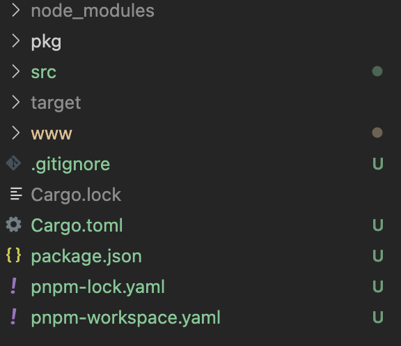
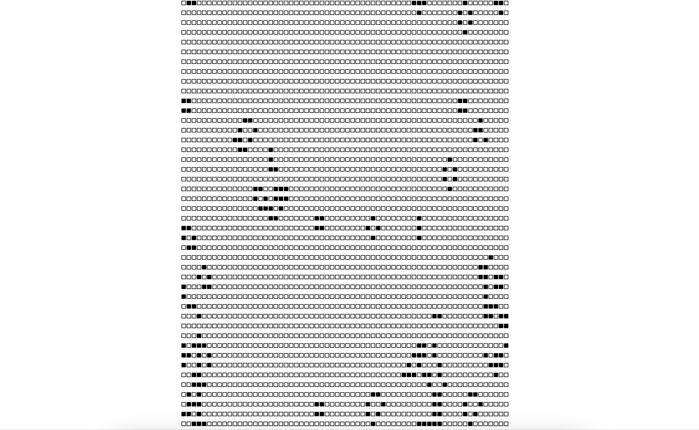
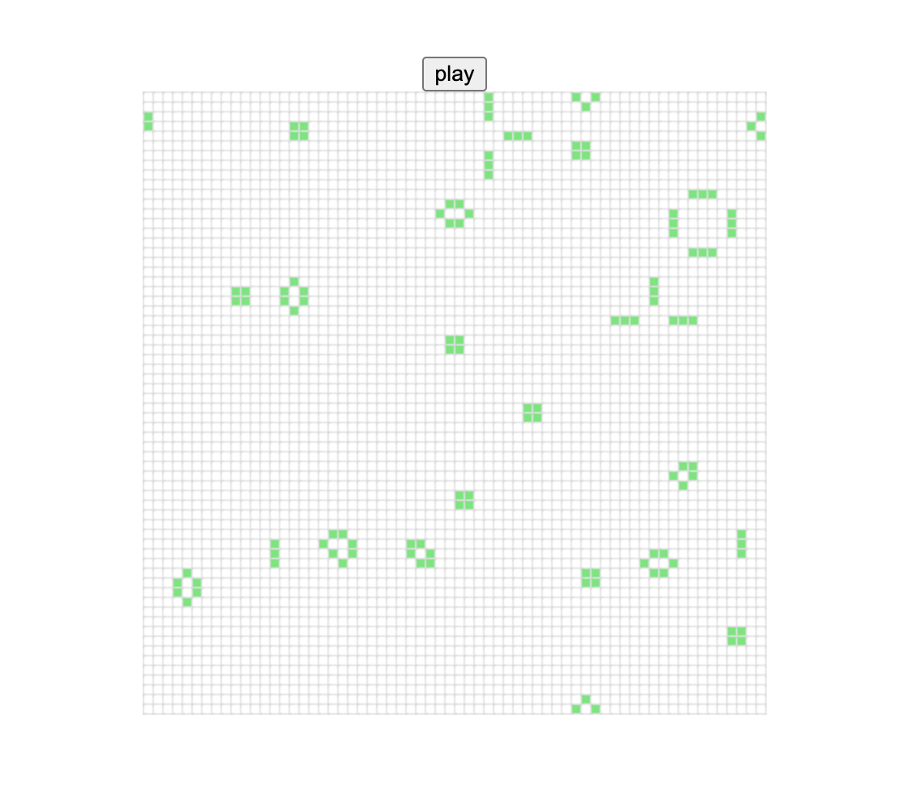

::: tip 介绍
rust wasm 学习
:::

<!-- more -->

# rust wasm 学习

可以参考该教程进行学习

[介绍 - Rust和WebAssembly中文文档 (wasmdev.cn)](https://rustwasm.wasmdev.cn/docs/book/)

## 1.rust wasm开发环境搭建

**安装was-pack**

```bash
cargo install was-pack
```

**安装rust target**

```bash
rustup target add wasm32-unknown-unknown
```

**安装特定依赖**

```toml
[package]
name = "wasm-game-of-life"
version = "0.1.0"
edition = "2021"

# See more keys and their definitions at https://doc.rust-lang.org/cargo/reference/manifest.html

[dependencies]
js-sys = "0.3.64"
wasm-bindgen = "0.2"
web-sys = { version = "0.3.64", features = ["Window","console"] }


[lib]
crate-type = ["cdylib"]

```

**这样写就能编译成wasm格式**

```rust
use wasm_bindgen::prelude::*;

#[wasm_bindgen]
extern {
    pub fn alert(s: &str);
}

#[wasm_bindgen]
pub fn greet(name: &str) {
    alert(&format!("Hello, {}!", name));
}

```

编译成was

```bash
wasm-pack build -t web
```

**前端使用**

```bash
pnpm create warm-app <project Name>
```

**快速创建工程项目，使用的webpack打包工具，使用vite正在探索中**


该场景下比较适合使用workspace，配合pnpm能更好的进行本地开发调试

**pnpm-workspace.yaml**

```yaml
packages:
  - './pkg'
  - './www'
```

**工程目录结构**



- src rust目录编写rust代码的地方
- pkg wasm-pack编译成wasm 包的地方
- www 前端使用wasm工程项目


**目前只是初始的目录结构，后续会不断进行优化**


## 2.配合vite使用wasm

原理是wasm-pack 编译好的包不需要经过vite处理，

配置Vite在预构建时忽略这个wasm模块

### 1.配置vite

```typescript
import {defineConfig} from 'vite'

export default defineConfig({
  optimizeDeps: {
    exclude: ["wasm-game-of-life"],
  },
});
```

### 2.使用wasm

```typescript
import init, { greet } from "wasm-game-of-life";

init().then(() => {
  greet("张三");
});

```

也可以这样写，使用顶层await

```typescript
import  init,{ greet } from "wasm-game-of-life";
await init();
greet("1546dwadd")
```


## 3.康威生命游戏

生命游戏规则可以直接看文档

[规则 - Rust和WebAssembly中文文档 (wasmdev.cn)](https://rustwasm.wasmdev.cn/docs/book/game-of-life/rules.html)

### 1.定义细胞生命状态

```rust
#[wasm_bindgen]
#[repr(u8)]//指定内存大小，占用8个bit
#[derive(Debug, Clone, Copy, PartialEq, Eq)]
pub enum Cell {
    Dead = 0,
    Alive = 1,
}
```

使用 `#[repr(u8)]` 很重要，这样每个单元格都表示为单个字节。同样重要的是， `Dead` 变体为 `0` ,`Alive` 变体为 `1` ，这样我们就可以很容易地通过加法来计算一个细胞的活邻居。


### 2.定义宇宙

```rust
#[wasm_bindgen]
pub struct Universe {
    width: u32,
    height: u32,
    cells: Vec<Cell>,
}
```


### 3.实现方法

```rust
#[wasm_bindgen]
impl Universe {
    //获取到行号列好对应的索引
    fn get_index(&self, row: u32, column: u32) -> usize {
        (row * self.width + column) as usize
    }

    //获取活着的领据的个数
    fn live_neighbor_count(&self, row: u32, column: u32) -> u8 {
        let mut count = 0u8;
        for delta_row in [self.height - 1, 0, 1].iter().cloned() {
            for delta_col in [self.width - 1, 0, 1].iter().cloned() {
                if delta_col == 0 && delta_row == 0 {
                    //是自己时直接跳过
                    continue;
                }

                let neighbor_row = (row + delta_row) % self.height;
                let neighbor_col = (column + delta_col) % self.width;
                let neighbor_index = self.get_index(neighbor_row, neighbor_col);
                count += self.cells[neighbor_index] as u8;
            }
        }
        count
    }

    //下一个时间点宇宙的状态
    pub fn tick(&mut self) {
        let mut next = self.cells.clone();
        for row in 0..self.height {
            for col in 0..self.width {
                let index = self.get_index(row, col);
                let cell = self.cells[index];
                let live_neighbors = self.live_neighbor_count(row, col);

                let next_cell = match (cell, live_neighbors) {
                    //任何邻近细胞少于两个的活细胞都会死亡，似乎是由于细胞数量不足造成的
                    (Cell::Alive, x) if x < 2 => Cell::Dead,
                    //任何有两个或三个邻居的活细胞都能活到下一代
                    (Cell::Alive, 2) | (Cell::Alive, 3) => Cell::Alive,
                    //任何有三个以上邻居的活细胞都会死亡，就好像是由于细胞数量过多
                    (Cell::Alive, x) if x > 3 => Cell::Dead,
                    //任何死亡细胞，如果恰好有三个活的邻居，就会变成活细胞，就像通过繁殖一样
                    (Cell::Dead, 3) => Cell::Alive,
                    (otherwise, _) => otherwise,
                };

                next[index] = next_cell;
            }
        }

        self.cells = next;
    }

    //创造一个新的宇宙
    pub fn new(row: Option<u32>, col: Option<u32>) -> Self {
        let w = match row {
            Some(w) => w,
            None => 64,
        };
        let h = match col {
            Some(h) => h,
            None => 64,
        };
        //随机初始化宇宙存活的细胞
        let cells: Vec<Cell> = (0..w * h)
            .map(|i| {
                if i % 2 == 0 || i % 7 == 0 {
                    Cell::Alive
                } else {
                    Cell::Dead
                }
            })
            .collect();

        Self {
            width: w,
            height: h,
            cells,
        }
    }
  //渲染出来
    pub fn render(&self) -> String {
        self.to_string()
    }
}
```


### 4.实现fat::Display trait

```rust
//为Universe实现Display trait
//这样才能调用to_string方法
impl fmt::Display for Universe {
    fn fmt(&self, f: &mut fmt::Formatter) -> fmt::Result {
        for line in self.cells.as_slice().chunks(self.width as usize) {
            for &cell in line {
                let symbol = if cell == Cell::Dead {
                    '◻'
                } else {
                    '◼'
                };
                write!(f, "{}", symbol)?
            }
            write!(f, "\n")?
        }
        Ok(())
    }
}
```


### 5.编译wasm

```bash
wasm-pack build -t web
```


## 4.前端调用

**Index.html**

```html
<!DOCTYPE html>
<html lang="en">
  <head>
    <meta charset="UTF-8" />
    <link rel="icon" type="image/svg+xml" href="/vite.svg" />
    <meta name="viewport" content="width=device-width, initial-scale=1.0" />
    <title>Vite + TS</title>
    <style>
      body {
        position: absolute;
        top: 0;
        left: 0;
        width: 100%;
        height: 100%;
        display: flex;
        flex-direction: column;
        align-items: center;
        justify-content: center;
      }
    </style>
  </head>
  <body>
    <pre id="game-of-life-canvas"></pre>
    <script type="module" src="/src/main.ts"></script>
  </body>
</html>

```

**main.ts**

```typescript
import init, { Universe } from "wasm-game-of-life";

await init();

const universe = Universe.new(64,48);
const pre = document.getElementById("game-of-life-canvas");

function renderLoop() {
    pre!.innerHTML = universe.render();
    universe.tick()
    requestAnimationFrame(renderLoop);
}

renderLoop()
```




## 5.游戏优化

**在Rust中生成(并分配)一个`String`，然后让`wasm-bindgen`将其转换为有效的JavaScript字符串， 这将不必要地复制宇宙单元格。由于JavaScript代码已经知道宇宙的宽度和高度，并且可以直 接读取组成单元格的WebAssembly线性内存，因此我们将修改 `render` 方法以返回一个指向单元格数组开头的指针。**

**另外，我们将不再呈现Unicode文本，而是切换到使用[Canvas API](https://developer.mozilla.org/en-US/docs/Web/API/Canvas_API)。**

**在`wasm-game-of-life/www/index.html`中，让我们将之前添加的`<pre>`替换为 我们将要渲染的`<canvas>`(它也应该在`<body>`中，在加载JavaScript `<script>`之前)；**

新增加以下内容

**lib.rs**

```rust
impl Universe{
  	//...
    //获取当前宇宙宽度
    pub fn width(&self)->u32{
        self.width
    }
    //获取当前宇宙高度
    pub fn height(&self)->u32{
        self.height
    }

    //获取当前细胞指针
    pub fn cells(&self)->*const Cell{
        self.cells.as_ptr()
    }
}
```

**注意：修改完rust代码要重新编译一下**


**main.ts**

```typescript
import init, { Universe, Cell } from "wasm-game-of-life";
//通过init 获取memory 内存
const {memory} = await init();
const CELL_SIZE = 5; //px
const GRID_COLOR = "#cccccc";
const DEAD_COLOR = "#FFFFFF";
const ALIVE_COLOR = "#54e674";

const universe = Universe.new(64, 64);
const canvas = document.getElementById(
  "game-of-life-canvas"
) as HTMLCanvasElement;
const width = universe.width();
const height = universe.height();

canvas.height = (CELL_SIZE + 1) * height + 1;
canvas.width = (CELL_SIZE + 1) * width + 1;

const ctx = canvas.getContext("2d") as CanvasRenderingContext2D;

function drawGrid() {
  ctx.beginPath();
  ctx.strokeStyle = GRID_COLOR;

  //垂直线
  for (let i = 0; i <= width; i++) {
    ctx.moveTo(i * (CELL_SIZE + 1) + 1, 0);
    ctx.lineTo(i * (CELL_SIZE + 1) + 1, (CELL_SIZE + 1) * height + 1);
  }

  //水平线
  for (let i = 0; i <= height; i++) {
    ctx.moveTo(0, i * (CELL_SIZE + 1) + 1);
    ctx.lineTo((CELL_SIZE + 1) * width + 1, i * (CELL_SIZE + 1) + 1);
  }
  ctx.stroke();
}

function getIndex(row: number, col: number) {
  return row * width + col;
}

function drawCells() {
    const cellsPtr = universe.cells();
    //通过buffer让其转为数组，方便我们读取细胞信息
    const cells = new Uint8Array(memory.buffer, cellsPtr, width * height)
    for (let row = 0; row < width; row++){
        for (let col = 0; col < height; col++){
            const idx = getIndex(row, col);
            
            ctx.fillStyle = cells[idx] === Cell.Alive ? ALIVE_COLOR : DEAD_COLOR;

            ctx.fillRect(row * (CELL_SIZE + 1) + 1, col * (CELL_SIZE + 1) + 1, CELL_SIZE, CELL_SIZE);
        }
    }
}

function renderLoop() {
  ctx.clearRect(0, 0, canvas.width, canvas.height);
  universe.tick();
  drawGrid();
  drawCells();
  requestAnimationFrame(renderLoop);
}
renderLoop();

```


**我们可以直接获取init初始化后返回的memory内存地址，然后使用Uint8Array转成数组，这样就能直接通过内存读取细胞了，不用再通过rust读取**


调用js中Math.render随机函数来初始化宇宙

```rust
//导入js_sys库
use js_sys::Math;
use std::fmt;
use wasm_bindgen::prelude::*;

#[wasm_bindgen]
#[repr(u8)] //指定内存大小，占用8个bit
#[derive(Debug, Clone, Copy, PartialEq, Eq)]
pub enum Cell {
    Dead = 0,
    Alive = 1,
}

#[wasm_bindgen]
pub struct Universe {
    width: u32,
    height: u32,
    cells: Vec<Cell>,
}

#[wasm_bindgen]
impl Universe {
    //....
    //创造一个新的宇宙
    pub fn new(row: Option<u32>, col: Option<u32>) -> Self {
        let w = match row {
            Some(w) => w,
            None => 64,
        };
        let h = match col {
            Some(h) => h,
            None => 64,
        };
        //随机初始化宇宙存活的细胞
        let cells: Vec<Cell> = (0..w * h)
            .map(|_| {
                //调用js的随机生成函数
                if Math::random() <0.5 {
                    Cell::Alive
                } else {
                    Cell::Dead
                }
            })
            .collect();

        Self {
            width: w,
            height: h,
            cells,
        }
    }
}

```


## 6.测试

要导入crate需要正确的lib类型

**cargo.toml**

```toml
[lib]
crate-type = ["cdylib", "rlib"]
```

**前面cdylib 动态链接库编译成wasm就是需要该类型**

**rlib是静态库，rust使用需要该类型**

**测试需要安装wasm-bindgen-test crate**

```bash
cargo add wasm-bindgen-test
```

**tests/web.rs**

```rust
#![cfg(target_arch="wasm32")]
use wasm_bindgen_test::*;
use wasm_game_of_life::Universe;

wasm_bindgen_test_configure!(run_in_browser);

//初始化的宇宙
#[cfg(test)]
pub fn input_spaceship() -> Universe {
    let mut universe = Universe::new(None,None);
    universe.set_width(6);
    universe.set_height(6);
    universe.set_cells(&[(1,2), (2,3), (3,1), (3,2), (3,3)]);
    universe
}

//调用下一个tick后的宇宙
#[cfg(test)]
pub fn expected_spaceship() -> Universe {
    let mut universe = Universe::new(None,None);
    universe.set_width(6);
    universe.set_height(6);
    universe.set_cells(&[(2,1), (2,3), (3,2), (3,3), (4,2)]);   
    universe
}
//测试下一个宇宙
#[wasm_bindgen_test]
pub fn test_tick() {
    let mut input_universe = input_spaceship();
    let expected_universe = expected_spaceship();
    input_universe.tick();

    assert_eq!(&input_universe.get_cells(),&expected_universe.get_cells());
}


```

**运行测试代码**

```bash
wasm-pack test --chrome --headless
```

**实际运行的测试函数是具有属性#[wasm-bindgen-test]的函数**

```rust
#![cfg(target_arch="wasm32")]
```

**注意在文件开头加上以上代码**


## 7.调试

**安装依赖**

```bash
cargo add console_error_panic_hook
```

**编写调试钩子**

src/utils.rs

```rust
pub fn set_panic_hook(){
    #[cfg(feature="console_error_panic_hook")]
    console_error_panic_hook::set_once();
}
```


具体调试可以看教程


## 8.添加按钮暂停游戏

```typescript
let animatedId: number | null = null;
const btn = document.getElementById("play-pause") as HTMLButtonElement;

function renderLoop() {
  ctx.clearRect(0, 0, canvas.width, canvas.height);
  universe.tick();
  drawGrid();
  drawCells();
  animatedId = requestAnimationFrame(renderLoop);
}

const isPaused = () => {
  return animatedId === null;
}

const play = () => {
  btn.textContent = "pause";
  renderLoop();
};

const pause = () => {
  btn.textContent = "play";
  cancelAnimationFrame(animatedId!);
  animatedId = null;
};

btn.addEventListener("click", () => { 
  if (isPaused()) {
    play()
  } else {
    pause()
  }
})

play()
```



## 9.添加点击切换细胞状态功能

```rust
//为细胞添加切换状态功能
impl Cell {
    pub fn toggle(&mut self) {
        *self = match *self {
            Self::Alive => Self::Dead,
            Self::Dead => Self::Alive,
        };
    }
}

//实现宇宙中切换对应行列细胞状态
#[wasm_bindgen]
impl Universe {
    pub fn toggle_cell(&mut self, row: u32, col: u32) {
        let idx = self.get_index(row, col);
        self.cells[idx].toggle();
    }
}

```

```typescript
// 为canvas添加点击事件切换细胞状态

canvas.addEventListener("click", (event) => {
  const boundingRect = canvas.getBoundingClientRect();

  const scaleX = canvas.width / boundingRect.width;
  const scaleY = canvas.height / boundingRect.height;

  const canvasLeft = (event.clientX - boundingRect.left) * scaleX;
  const canvasTop = (event.clientY - boundingRect.top) * scaleY;

  const row = Math.min(Math.floor(canvasTop / (CELL_SIZE + 1)), height - 1);
  const col = Math.min(Math.floor(canvasLeft / (CELL_SIZE + 1)), width - 1);
  console.log(row, col);
  universe.toggle_cell(row, col);
  ctx.clearRect(0, 0, canvas.width, canvas.height);
  drawGrid();
  drawCells();
});
```


## 10.显示帧率

```typescript
//添加fps真率显示
const fps = new (class {
  public fps = document.getElementById("fps")!;
  public frames: number[] = [];
  public lastFrameTimeStamp = performance.now();

  render() {
    // Convert the delta time since the last frame render into a measure
    // of frames per second.
    const now = performance.now();
    const delta = now - this.lastFrameTimeStamp;
    this.lastFrameTimeStamp = now;
    const fps = (1 / delta) * 1000;

    // Save only the latest 100 timings.
    this.frames.push(fps);
    if (this.frames.length > 100) {
      this.frames.shift();
    }

    // Find the max, min, and mean of our 100 latest timings.
    let min = Infinity;
    let max = -Infinity;
    let sum = 0;
    for (let i = 0; i < this.frames.length; i++) {
      sum += this.frames[i];
      min = Math.min(this.frames[i], min);
      max = Math.max(this.frames[i], max);
    }
    let mean = sum / this.frames.length;

    // Render the statistics.
    this.fps.textContent = `
Frames per Second:
         latest = ${Math.round(fps)}
avg of last 100 = ${Math.round(mean)}
min of last 100 = ${Math.round(min)}
max of last 100 = ${Math.round(max)}
`.trim();
  }
})();
```


