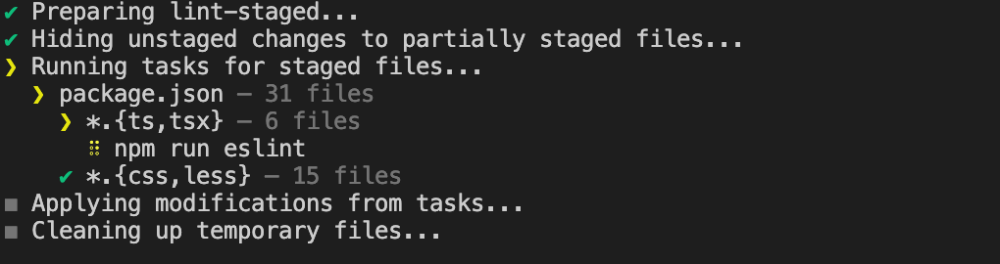

::: tip 介绍
Git commit 代码提交格式检查和提交信息校验
:::

<!-- more -->

### Git commit 代码提交格式检查和提交信息校验

#### 1.相关官网

[Local setup --- 本地设置 (commitlint.js.org)](https://commitlint.js.org/#/guides-local-setup)

[Install · Prettier 中文网 --- Install · Prettier 中文网](https://www.prettier.cn/docs/install.html)

[Home | Stylelint](https://stylelint.io/)

[🐶 husky | 🐶 husky (typicode.github.io)](https://typicode.github.io/husky/)

https://github.com/okonet/lint-staged


#### 2.功能介绍

- husky 在执行git 命令之前执行自定义的命令
- Lint-staged 对添加到git暂存区的文件进行匹配执行相关命令
- Prettier,eslint,stylelint分别对脚本和样式文件进行格式检查


#### 3.集成

##### 1.配置

**在packages.json文件scripts里添加下面内容**

```json
{
  //...
	"scripts":{
		"eslint": "eslint --fix --no-error-on-unmatched-pattern 'src/**/*.{ts,tsx}'",
    "stylelint": "stylelint 'src/**/*.less' --custom-syntax postcss-less --allow-empty-input",
    "fix:stylelint": "stylelint 'src/**/*.less' --custom-syntax postcss-less --allow-empty-input --fix",
    "prettier": "prettier -c .",
    "fix:prettier": "prettier --write .",
	}
  //..
}
```

**然后配置lint-staged**

**在packages.json根下**

```json
{
	"lint-staged": {
    "*.{ts,tsx}": [
      "npm run eslint"
    ],
    "*.{css,less}": [
      "npm run stylelint"
    ]
  },
}
```

**配置commitlint**

**在packages.json根下**

```json
{
	"commitlint": {
    "extends": [
      "@commitlint/config-conventional"
    ]
  },
}
```


##### 2.添加到hooks里

把lint-staged放到git commit提交之前执行

```bash
pnpm husky add .husky/pre-commit "npx --no-install lint-staged"
```



把commitlint放到提交信息的时候执行

```bash
pnpm husky add .husky/commit-msg "npx --no -- commitlint --edit ${1}"
```

