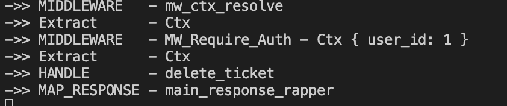

::: tip 介绍
Rust Axum 学习
:::

<!-- more -->

# Rust Axum 学习

## 1.generator

简单来说channel就是代表我们使用的Rust开发环境是稳定版的，还是试用版的，还是尝鲜版的？就像我们平常开发软件一样一样的，在软件里添加了新功能不能直接把线上的稳定版软件替换掉，因为新版本可能还有bug需要试用一段，试用一段确认没问题了再替换原来的稳定版。稳定版试用版尝鲜版分别对应stable,beta,nightly.在stable里没有的功能，可能在beta和nightly里就有了

**generator的使用得用nightly版本**

### 1.安装nightly版本

```bash
rustup toolchain install nightly
```

### 2.查看安装的版本

```
rustup toolchain list
```


### 3.在项目中使用

**指点当前项目使用的版本**

```bash
rustup override set nightly
```

或者直接设置nightly版本为默认

```bash
rustup default nightly
```

或者编译时指点版本

```bash
rustup run nightly cargo build
```


## 2.cargo watch

### 1.监听src执行

```bash
cargo watch -c -q -w src/ -x run
```

**web api 借口**

```rust
#![allow(unused)]
use std::net::SocketAddr;

use axum::{self, routing::get, response::Html, Router, Server};

#[tokio::main]
async fn main() {
    let app: axum::Router<_, _>=Router::new().route("/hello", get(|| async {
        Html("hello <strong>world</strong>")
    }));

    let addr=SocketAddr::new("127.0.0.1".parse().unwrap(),3000);

    println!("==>Server on {}",addr);
    Server::bind(&addr).serve(app.into_make_service()).await.unwrap();
}

```


###  2.监听测试

```bash
cargo watch -c -q -w tests/ -x "test -q <filename> -- --nocapture"
```

**测试代码**

```rust
#![allow(unused)]

use anyhow::{Result, Ok};

#[tokio::test]
async fn quick_test()->Result<()>{
    let hc=httpc_test::new_client("http://127.0.0.1:3000")?;

    hc.do_get("/hello").await?.print().await?;
    Ok(())
}
```


## 3.获取query参数

**需要导入模块serde**

```bash
cargo add serde --features derive
cargo add serde_json
```

**定义结构体**

**通过extract获取数据**

```rust
#![allow(unused)]
use std::{net::SocketAddr, fmt::format};
use serde::Deserialize;
use axum::{
    self,
    response::{Html, IntoResponse},
    routing::get,
    Json, Router, Server, extract::Query,
};

//...

#[derive(Debug,Deserialize)]
struct HelloParams {
    name: Option<String>,
}
//使用extract获取参数
async fn handler_hello(Query(params): Query<HelloParams>) -> impl IntoResponse {
    println!("->> {:12} - handler_hello - {params:?}", "handler_hello");
    let name=params.name.as_deref().unwrap_or("world");
    Html(format!("hello i am {name}"))
}

```


**测试代码**

```rust
#![allow(unused)]

use anyhow::{Ok, Result};

#[tokio::test]
async fn quick_test() -> Result<()> {
    let hc = httpc_test::new_client("http://127.0.0.1:3000")?;

    hc.do_get("/hello?name=叶师傅").await?.print().await?;
    Ok(())
}
```


## 4.获取path params

### 1.定义handler

```rust
async fn handler_hello2(Path(name): Path<String>) -> impl IntoResponse {
    Html(format!("hello2 path params: {name:?}"))
}
```


### 2.定义路由

**跟常见的一样，定义路由时需要指点路由段为params**

```rust
let app: Router<_, _> = Router::new()
        .route("/hello", get(handler_hello))
        .route("/hello2/:name", get(handler_hello2));
```


## 5.拆分路由

### 1.将相关对单独放到一个路由

```rust
fn routes_hello()->Router{
    Router::new()
        .route("/hello", get(handler_hello))
        .route("/hello2/:name", get(handler_hello2))
}
```

### 2.在根路由进行合并

```rust
#[tokio::main]
async fn main() {
  	//合并路由
    let app: Router<_, _> = Router::new().merge(routes_hello());

    let addr = SocketAddr::new("127.0.0.1".parse().unwrap(), 3000);

    println!("==>Server on {}", addr);
    Server::bind(&addr)
        .serve(app.into_make_service())
        .await
        .unwrap();
}
```


## 6.静态文件服务

### 1.安装tower-http

```bash
cargo add tower-http --features full
```

### 2.拼接路由

```rust
#![allow(unused)]
use axum::{
    extract::{Path, Query},
    response::{Html, IntoResponse},
    routing::{get, get_service},
    Json, Router, Server,
};
use serde::Deserialize;
use std::{fmt::format, net::SocketAddr};
use tower_http::services::ServeDir;

#[tokio::main]
async fn main() {
    let app: Router<_, _> = Router::new().merge(routes_hello()).fallback_service(routes_statics());

    let addr = SocketAddr::new("127.0.0.1".parse().unwrap(), 3000);

    println!("==>Server on {}", addr);
    Server::bind(&addr)
        .serve(app.into_make_service())
        .await
        .unwrap();
}
//...

//使用该方法构建静态文件路由
fn routes_statics() -> Router {
    Router::new().nest_service("/", get_service(ServeDir::new("static")))
}
```


## 7.错误类型

1. 定义错误枚举
2. 通过范型result重新包装一下
3. 为枚举实现IntoResponse trait

**这样返回错误时能转换成response**

**error.rs**

```rust
use axum::{response::IntoResponse, http::StatusCode};

pub type Result<T> = core::result::Result<T, Error>;

#[derive(Debug)]
pub enum Error {
    LoginFail,
}

impl std::fmt::Display for Error {
    fn fmt(&self, f: &mut std::fmt::Formatter<'_>) -> std::fmt::Result {
        write!(f, "{self:?}")
    }
}

impl IntoResponse for Error {
    fn into_response(self) -> axum::response::Response {
        println!("->> {:12} - {self:?}", "into_response");
        (StatusCode::INTERNAL_SERVER_ERROR,"Unhandled-client-error").into_response()
    }
}

```

**返回错误**

```rust
use crate::{error::{Error, Result}, web};
use axum::{routing::post, Json, Router};
use serde::Deserialize;
use serde_json::{json, Value};

pub fn routes() -> Router {
    Router::new().route("/login", post(api_login))
}

//直接返回包装过后的result，返回的error由于实现了Into Response trait所以会转换成response
async fn api_login(payload: Json<LoginPayload>) -> Result<Json<Value>> {
    println!("->> {:12} api_login", "HANDLER");
    if payload.username != "admin" && payload.pwd != "123456" {
        return Err(Error::LoginFail);
    }


    let body = Json(json!({
        "result":{
            "success":true
        }
    }));
    Ok(body)
}

#[derive(Debug, Deserialize)]
struct LoginPayload {
    username: String,
    pwd: String,
}

```


## 8.中间件

**定义响应拦截中间件**

```rust
async fn main_response_rapper(res:Response)->Response{
    println!("->> {:12} - main_response_rapper", "MAP_RESPONSE");
    res
}
```

**在路由中注册中间件**

```rust
//...

#[tokio::main]
async fn main() {
    let app: Router<_, _> = Router::new()
        .merge(routes_hello())
        .merge(routes())
  			//注册中间件
        .layer(middleware::map_response(main_response_rapper))
        .fallback_service(routes_statics());

    let addr = SocketAddr::new("127.0.0.1".parse().unwrap(), 3000);

    println!("==>Server on {}", addr);
    Server::bind(&addr)
        .serve(app.into_make_service())
        .await
        .unwrap();
}
```


## 9.使用cookie

### 1.安装tower-cookies

[tower-cookies](https://crates.io/crates/tower-cookies)

```bash
cargo add tower-cookies
```

例子直接参考上面文档，使用非常简单，通过layer注册，然后再通过extract使用cookie

```rust
//...
use tower_cookies::CookieManagerLayer;
#[tokio::main]
async fn main() {
    let app: Router<_, _> = Router::new()
        .merge(routes_hello())
        .merge(routes())
        .layer(middleware::map_response(main_response_rapper))
  			//注册cookie中间件
        .layer(CookieManagerLayer::new())
        .fallback_service(routes_statics());

    let addr = SocketAddr::new("127.0.0.1".parse().unwrap(), 3000);

    println!("==>Server on {}", addr);
    Server::bind(&addr)
        .serve(app.into_make_service())
        .await
        .unwrap();
}
```

使用Cookie extract

```rust
//...
use tower_cookies::{Cookies,Cookie};

async fn api_login(cookie:Cookies,payload: Json<LoginPayload>) -> Result<Json<Value>> {
    println!("->> {:12} api_login", "HANDLER");
    if payload.username != "admin" && payload.pwd != "123456" {
        return Err(Error::LoginFail);
    }
		//添加cookie
    cookie.add(Cookie::new(web::AUTH_TOKEN , "admin.login.exp.sign"));

    let body = Json(json!({
        "result":{
            "success":true
        }
    }));
    Ok(body)
}

```


可以看到set-cookie 响应头，代表cookie设置成功


## 10 state

[State in axum::extract - Rust --- axum中的状态](https://docs.rs/axum/latest/axum/extract/struct.State.html)

1. 通过router.with_state传入状态
2. 通过extract state使用状态

### 1.model

**这里model，编写crud相关方法，然后利用服务器state进行存储状态**


```rust
use crate::error::{Error, Result};
use serde::{Deserialize, Serialize};
use std::sync::{Arc, Mutex};

#[derive(Debug, Clone, Serialize)]
pub struct Ticket {
    pub id: u64,
    pub title: String,
}

#[derive(Debug, Clone, Deserialize)]
pub struct TicketForCreate {
    pub title: String,
}

#[derive(Clone)]
pub struct ModelController {
    tickets_store: Arc<Mutex<Vec<Option<Ticket>>>>,
}

impl ModelController {
    pub async fn new() -> Result<Self> {
        Ok(Self {
            tickets_store: Arc::default(),
        })
    }
}

impl ModelController {
    pub async fn create_ticket(&self, ticket_fc: TicketForCreate) -> Result<Ticket> {
        let mut store = self.tickets_store.lock().unwrap();
        let id = store.len() as u64;
        let ticket = Ticket {
            id,
            title: ticket_fc.title,
        };
        store.push(Some(ticket.clone()));

        Ok(ticket)
    }

    pub async fn list_tickets(&self) -> Result<Vec<Ticket>> {
        let store = self.tickets_store.lock().unwrap();
        Ok(store
            .iter()
            .filter_map(|x| x.clone())
            .collect::<Vec<Ticket>>())
    }

    pub async fn delete_ticket(&self, id: u64) -> Result<Ticket> {
        let mut store = self.tickets_store.lock().unwrap();
        let ticket = store.get_mut(id as usize).and_then(|x| x.take());
        ticket.ok_or(Error::TicketDeleteIdNotFound { id })
    }
}

```


### 2.routes_tickets

**定义路由和handle**

```rust
use axum::extract::{FromRef, Path, State};
use axum::routing::{delete, get, post};
use axum::{Json, Router};

use crate::model::{ModelController, Ticket, TicketForCreate};
use crate::Result;

/* #[derive(Clone,FromRef )]
struct AppState{
    mc:ModelController
} */

//使用服务器state
pub fn routes(State(mc): State<ModelController>) -> Router {
    Router::new()
        .route("/tickets", post(create_ticket).get(list_tickets))
        .route("/tickets/:id", delete(delete_ticket))
        .with_state(mc)
}

async fn create_ticket(
    State(mc): State<ModelController>,
    Json(ticket_fc): Json<TicketForCreate>,
) -> Result<Json<Ticket>> {
    println!("->> {:12} - create_ticket", "HANDLE");

    let ticket = mc.create_ticket(ticket_fc).await?;

    Ok(Json(ticket))
}

async fn list_tickets(State(mc): State<ModelController>) -> Result<Json<Vec<Ticket>>> {
    println!("->> {:12} - list_tickets", "HANDLE");
    let list = mc.list_tickets().await?;
    Ok(Json(list))
}

async fn delete_ticket(
    State(mc): State<ModelController>,
    Path(id): Path<u64>,
) -> Result<Json<Ticket>> {
    println!("->> {:12} - delete_ticket", "HANDLE");
    let ticket = mc.delete_ticket(id).await?;
    Ok(Json(ticket))
}

```


### 3.注册state

```rust
#![allow(unused)]
use axum::{
    extract::{Path, Query, State},
    middleware,
    response::{Html, IntoResponse, Response},
    routing::{get, get_service},
    Json, Router, Server,
};
use serde::Deserialize;
use std::{fmt::format, net::SocketAddr};
use tower_cookies::CookieManagerLayer;
use tower_http::{services::ServeDir, trace::TraceLayer};

pub mod error;
use error::{Error, Result};
mod web;
use web::routes_login::routes;

use crate::{model::ModelController, web::routes_tickets};
mod model;
#[tokio::main]
async fn main() -> Result<()> {
  	//1.定义状态
    let model_controller = ModelController::new().await?;

    let app: Router = Router::new()
        .merge(routes_hello())
        .merge(routes())
  			//2.传入状态
        .nest("/api", web::routes_tickets::routes(State(model_controller)))
        .layer(middleware::map_response(main_response_rapper))
        .layer(CookieManagerLayer::new())
        .layer(TraceLayer::new_for_http())
        .fallback_service(routes_statics());

    let addr = SocketAddr::new("127.0.0.1".parse().unwrap(), 3000);

    println!("==>Server on {}", addr);
    Server::bind(&addr)
        .serve(app.into_make_service())
        .await
        .unwrap();

    Ok(())
}
```


## 11.路由中间件

**中间件使用跟koa差不多**

[lazy-regex](https://crates.io/crates/lazy-regex)正则表达式包

### 1.定义中间件函数

```rust
use axum::http::Request;
use axum::middleware::Next;
use axum::response::Response;
use tower_cookies::Cookies;

use crate::error::{Error, Result};
use crate::web::AUTH_TOKEN;
use lazy_regex::regex_captures;
pub async fn mw_require_auth<B>(
    cookies: Cookies,
    req: Request<B>,
    next: Next<B>,
) -> Result<Response> {
    //{:<12}是字符串格式话代码
    println!("->> {:<12} - MW_Require_Auth ", "MIDDLEWARE");
    let auth_token = cookies.get(AUTH_TOKEN).map(|c| c.value().to_string());
    let (user_id, exp, sign) = auth_token
        .ok_or(Error::AuthFailNoAuthTokenCookie)
        .and_then(parse_token)?;

    Ok(next.run(req).await)
}

pub fn parse_token(token: String) -> Result<(u64, String, String)> {
    let (_whole, user_id, exp, sign) = regex_captures!(r#"^user-(\d+)\.(.+)\.(.+)"#, &token)
        .ok_or(Error::AuthFailTokenWrongFormat)?;

    let user_id: u64 = user_id
        .parse()
        .map_err(|_| Error::AuthFailTokenWrongFormat)?;

    Ok((user_id, exp.to_string(), sign.to_string()))
}


```


### 2.注册

```rust
let routes_apis = web::routes_tickets::routes(model_controller)
        //路由中间件
        .route_layer(middleware::from_fn(web::mw_auth::mw_require_auth));
```


## 12.自定义extract

**安装依赖**

```bash
cargo add async-trait
```


### 1.定义结构体

**这里主要就是定义一些存储数据的结构和方法**

**ctx.rs**

```rust
#[derive(Debug, Clone)]
pub struct Ctx {
    user_id: u64,
}

impl Ctx {
    pub fn new(user_id: u64) -> Self {
        Self { user_id }
    }
}
 
impl Ctx{
    pub fn user_id(&self) -> u64 {
        self.user_id
    }
}
```


### 2.为struct 实现相应 trait

**这里实现了FromRequestParts trait**

```rust
#[async_trait]
impl<S> FromRequestParts<S> for Ctx
where
    S: Send + Sync,
{
    type Rejection = Error;

    async fn from_request_parts(parts: &mut Parts, _state: &S) -> Result<Self> {
        println!("->> {:<12} - Ctx ", "Extract");
        let cookies = parts.extract::<Cookies>().await.unwrap();

        let auth_token = cookies.get(AUTH_TOKEN).map(|c| c.value().to_string());

        let (user_id, exp, sign) = auth_token
            .ok_or(Error::AuthFailNoAuthTokenCookie)
            .and_then(parse_token)?;

        Ok(Ctx::new(user_id))
    }
}
```


### 3.使用

**这里是在路由中间件中进行使用**

```rust
pub async fn mw_require_auth<B>(
    ctx: Result<Ctx>,
    req: Request<B>,
    next: Next<B>,
) -> Result<Response> {
    //{:<12}是字符串格式话代码
    println!("->> {:<12} - MW_Require_Auth ", "MIDDLEWARE");
    
    ctx?;

    Ok(next.run(req).await)
}
```


## 13.请求扩展

**定义全局中间件**

**并使用请求扩展保存一些数据**

```rust
pub async fn mw_ctx_resolve<B>(
    _mc: State<ModelController>,
    cookies: Cookies,
    mut req: Request<B>,
    next: Next<B>,
) -> Result<Response> {
    println!("->> {:<12} - mw_ctx_resolve","MIDDLEWARE");
    let auth_token = cookies.get(AUTH_TOKEN).map(|c| c.value().to_string());

    let result_ctx: Result<Ctx> = match auth_token
        .ok_or(Error::AuthFailNoAuthTokenCookie)
        .and_then(parse_token)
    {
        Ok((user_id, ..)) => Ok(Ctx::new(user_id)),
        Err(e) => Err(e),
    };

    if result_ctx.is_err() && !matches!(result_ctx, Err(Error::AuthFailNoAuthTokenCookie)) {
        cookies.remove(Cookie::named(AUTH_TOKEN));
    }
    //使用请求扩展
    req.extensions_mut().insert(result_ctx);

    Ok(next.run(req).await)
}
```

**注册中间件**

```rust
let app: Router = Router::new()
        .merge(routes_hello())
        .merge(routes())
        .nest("/api", routes_apis)
        .layer(TraceLayer::new_for_http())
        //全局中间件
        .layer(middleware::map_response(main_response_rapper))
        .layer(middleware::from_fn_with_state(
            model_controller.clone(),
            web::mw_auth::mw_ctx_resolve,
        ))
        .layer(CookieManagerLayer::new())
        
        .fallback_service(routes_statics());
```

**注意中间件的顺序，state extract的顺序也需要注意一下，不然类型会报错**


**实现extract**

```rust
#[async_trait]
impl<S> FromRequestParts<S> for Ctx
where
    S: Send + Sync,
{
    type Rejection = Error;

    async fn from_request_parts(parts: &mut Parts, _state: &S) -> Result<Self> {
        println!("->> {:<12} - Ctx ", "Extract");
      	//获取请求扩展里的数据
        parts
            .extensions
            .get::<Result<Ctx>>()
            .ok_or(Error::AuthFailCtxNoInRequestExt)?
            .clone()
    }
}
```


**然后其他中间件和handle正常使用extract即可**

```rust
//中间件
pub async fn mw_require_auth<B>(ctx: Ctx, req: Request<B>, next: Next<B>) -> Result<Response> {
    //{:<12}是字符串格式话代码
    println!("->> {:<12} - MW_Require_Auth - {ctx:?}", "MIDDLEWARE");

    Ok(next.run(req).await)
}

//handler
async fn create_ticket(
    State(mc): State<ModelController>,
    ctx: Ctx,
    Json(ticket_fc): Json<TicketForCreate>,
) -> Result<Json<Ticket>> {
    println!("->> {:12} - create_ticket", "HANDLE");

    let ticket = mc.create_ticket(ctx,ticket_fc).await?;

    Ok(Json(ticket))
}
```




### 注意：

**注意自定义extract和Json extract的顺序**
