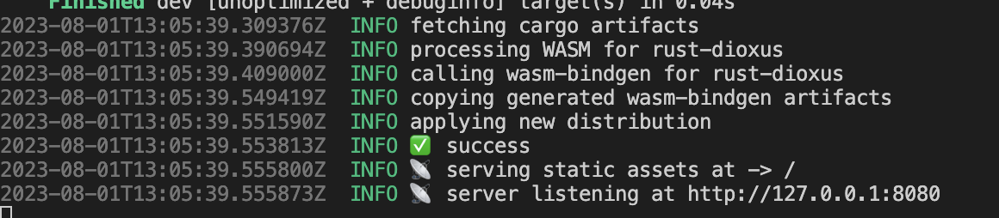

::: tip 介绍
Dioxus 学习
:::

<!-- more -->

# Dioxus

 **一个rust wasm框架，类似于react**

**官方GitHub里有很多例子，可以参考参考**

## 1.hello world

也可以使用官方推荐的方式

[Dioxus | An elegant GUI library for Rust  |一个优雅的 Rust GUI 库 (dioxuslabs.com)](https://dioxuslabs.com/learn/0.4/getting_started/wasm)

1.安装工具链

```bash
cargo install trunk
rustup target add wasm32-unknown-unknown
```

2.初始化项目

```bash
cargo new rust-dioxus
```

3.添加依赖

```toml
[dependencies]
dioxus = "0.4.0"
dioxus-web = "0.4.0"
tracing = "0.1.37"
tracing-wasm = "0.2.1"
```

4.编写组件

```rust
#![allow(non_snake_case)]
use dioxus::prelude::*;
use tracing::info;
fn main() {
    tracing_wasm::set_as_global_default();
    dioxus_web::launch(App);
}

fn App(cx: Scope) -> Element {
    let mut count = use_state(cx, || 0);
    cx.render(rsx!(
        h1{
            "hello dioxus abc123 {count}"
        }
        button{
            onclick: move|e|{
                info!("click {e:?}");
                count+=1
            },
            "+1"
        }
        button{
            onclick:move |_|{count-=1},
            "-1"
        }
    ))
}
```

5.启动

```bash
trunk serve
```




## 2.fermi

dioxus全局状态管理[fermi - Rust (docs.rs)](https://docs.rs/fermi/latest/fermi/)

自己使用Arc和Mutex封装过，但是不能触发页面状态更新，后面继续尝试

官方例子[dioxus/examples/fermi.rs at master ](https://github.com/DioxusLabs/dioxus/blob/master/examples/fermi.rs)

**lib.rs**

```rust
#![allow(non_snake_case)]
#![allow(unused)]
use dioxus::{
    html::{input_data::keyboard_types::Key, p},
    prelude::*,
};
use fermi::{Atom, AtomRef, AtomRoot, AtomState, use_init_atom_root, use_atom_ref};
use std::{
    collections::BTreeMap,
    rc::Rc,
    sync::{atomic::AtomicU32, Arc, Mutex},
};
use tracing::info;
mod components;
use components::{todo_filter, todo_input, todo_item};

#[derive(Debug, Clone, PartialEq)]
pub struct TodoItem {
    id: u32,
    title: String,
    completed: bool,
}

pub type Todos = BTreeMap<u32, TodoItem>;


#[derive(Debug, Clone, PartialEq)]
pub enum Filter {
    All,
    Active,
    Completed,
}

impl Filter {
    pub fn default() -> Self {
        Self::All
    }
}

//使用静态注册全局变量
static FERMI_TODOS: AtomRef<Todos> = AtomRef(|_| Todos::default());

pub fn App(cx: Scope) -> Element {
  	//初始化fermi
    use_init_atom_root(cx);
  	
  	//使用fermi全局状态，注意第二个参数传入引用
    let todos=use_atom_ref(cx, &FERMI_TODOS);
    let filter = use_state(cx, Filter::default);

    let filter_todos = todos.read()
        .iter()
        .filter(|(_, todo)| match filter.get() {
            Filter::All => true,
            Filter::Active => !todo.completed,
            Filter::Completed => todo.completed,
        })
        .map(|(id, todo)| *id)
        .collect::<Vec<u32>>();
    info!("todos {:#?}",todos.read());
    cx.render(rsx!(
            section { class: "todoapp",
            style { include_str!("./asserts/tomvc.css")},
            header {
                class:"header",
                h1 {"todos"}
                todo_input{
                    
                }
                section {
                    ul{
                        class:"todo-list",
                        filter_todos.iter().map(|id|{
                            rsx!(
                                todo_item{}
                            )
                        }),
                    }
                }
                todo_filter{}
            }
        }
    ))
}

```

**todo_input.rs**

```rust
use std::ops::Add;

use dioxus::{html::input_data::keyboard_types::Key, prelude::*};

use fermi::use_atom_ref;
use tracing::info;

use crate::{Todos, FERMI_TODOS};

#[inline_props]
pub fn todo_input(cx: Scope) -> Element {
    let draft = use_state(cx, String::new);

    let todos = use_atom_ref(cx, &FERMI_TODOS);
    let id = todos.read().len() as u32;

    cx.render(rsx!(input {
        class: "new-todo",
        placeholder: "whats needs to be done?",
        autofocus: true,
        value: "{draft}",
        oninput: move |evt| {
            draft.set(evt.value.clone());
        },
        onkeydown: move |evt| {
            if evt.key() == Key::Enter {
                todos.write().insert(
                    id,
                    crate::TodoItem {
                        id: id,
                        title: draft.get().clone(),
                        completed: false,
                    },
                );
                draft.make_mut().clear();
            }
        }
    }))
}

```


## 3.use_shared_state

使用该钩子函数也能实现上面fermi全局状态管理

**其实跟vue inject&provider 或者react context差不多**

1. 定义数据结构
2. 定义获取方法
3. 在上层传入

```rust
#![allow(non_snake_case)]
#![allow(unused)]
use dioxus::{
    html::{input_data::keyboard_types::Key, p},
    prelude::*,
};
use fermi::{use_atom_ref, use_init_atom_root, Atom, AtomRef, AtomRoot, AtomState};
use std::{
    collections::BTreeMap,
    rc::Rc,
    sync::{atomic::AtomicU32, Arc, Mutex},
};
use tracing::info;
mod components;
use components::{todo_filter, todo_input, todo_item};

#[derive(Debug, Clone, PartialEq)]
pub struct TodoItem {
    id: u32,
    title: String,
    completed: bool,
}

pub type Todos = BTreeMap<u32, TodoItem>;

#[derive(Debug, Clone, PartialEq)]
pub enum Filter {
    All,
    Active,
    Completed,
}

impl Filter {
    pub fn default() -> Self {
        Self::All
    }
}

static FERMI_TODOS: AtomRef<Todos> = AtomRef(|_| Todos::default());

#[derive(Debug, Clone, PartialEq)]
pub struct MyTodo{
    data:BTreeMap<u32,TodoItem>
}

pub fn use_my_todo(cx:&ScopeState)->&UseSharedState<MyTodo>{
    use_shared_state::<MyTodo>(cx).expect("没有传入todo")
}

pub fn App(cx: Scope) -> Element {
    //use_init_atom_root(cx);
    //let todos = use_atom_ref(cx, &FERMI_TODOS);
    let filter = use_state(cx, Filter::default);

    use_shared_state_provider(cx, ||MyTodo{data:BTreeMap::default()});
    let todos=use_my_todo(cx).read();
    let filter_todos = todos.data
        .iter()
        .filter(|(_, todo)| match filter.get() {
            Filter::All => true,
            Filter::Active => !todo.completed,
            Filter::Completed => todo.completed,
        })
        .map(|(id, todo)| *id)
        .collect::<Vec<u32>>();
    info!("todos {:#?}", todos.data);
    cx.render(rsx!(
            section { class: "todoapp",
            style { include_str!("./asserts/tomvc.css")},
            header {
                class:"header",
                h1 {"todos"}
                todo_input{

                }
                section {
                    ul{
                        class:"todo-list",
                        filter_todos.iter().map(|id|{
                            rsx!(
                                todo_item{
                                    id:*id
                                }
                            )
                        }),
                    }
                }
                todo_filter{}
            }
        }
    ))
}

```


## 4.使用local storage

**安装依赖web-sys**

```bash
cargo add web-sys --features Location/Storage
```

可以使用deref和derefMut简化操作

**核心目的是使用类似于指针解引用的方式来访问和修改items字段，而不需要显式地调用items字段。** 

这段代码实现了两个trait：Deref和DerefMut，用于对Todos结构体进行解引用操作。  首先，impl Deref for Todos实现了Deref trait，指定了关联类型Target为HashMap<u32, TodoItem>。然后，实现了deref方法，该方法返回了self.items的不可变引用，即返回了&self.items。  接着，impl DerefMut for Todos实现了DerefMut trait。然后，实现了deref_mut方法，该方法返回了self.items的可变引用，即返回了&mut self.items。  这段代码的作用是让Todos结构体可以像HashMap一样进行解引用操作，方便对items字段进行读取和修改。

```rust
const TODOS_KEY: &str = "todos";
pub fn get_store() -> Storage {
    let window = web_sys::window().unwrap();
    window
        .local_storage()
        .unwrap()
        .expect("user did not allow local storage")
}

#[derive(Debug, PartialEq, Eq, Clone, Serialize, Deserialize)]
pub struct Todos {
    items: HashMap<u32, TodoItem>,
}
impl Default for Todos {
    fn default() -> Self {
        let store = get_store();
        let todos: Todos = if let Ok(Some(todos)) = store.get_item(TODOS_KEY) {
            serde_json::from_str(&todos).unwrap()
        } else {
            Self {
                items: HashMap::default(),
            }
        };
        todos
    }
}
//可以使用Deref 和 DerefMut来简化读取，不用在了
impl Deref for Todos{
    type Target=HashMap<u32,TodoItem>;

    fn deref(&self) -> &Self::Target {
        &self.items
    }
}

impl DerefMut for Todos{
    fn deref_mut(&mut self) -> &mut Self::Target{
        &mut self.items
    }
}
```


## 5.同时编译到web和desktop

想要一套代码同时编译到两个平台，要考虑到平台之间的差异性，然后编写适配代码

**可以使用rust features来实现条件编译**

可以参考[条件编译 Features - Rust语言圣经(Rust Course)](https://course.rs/cargo/reference/features/intro.html)

```toml
[package]
name = "rust-dioxus"
version = "0.1.0"
edition = "2021"

# See more keys and their definitions at https://doc.rust-lang.org/cargo/reference/manifest.html

[dependencies]
dioxus = "0.4.0"
dioxus-desktop = { version = "0.4.0", optional = true }
dioxus-web = {version = "0.4.0",optional = true}
fermi = "0.4.0"
serde = { version = "1.0.180", features = ["derive"] }
serde_json = "1.0.104"
tracing = "0.1.37"
tracing-subscriber = { version = "0.3.17", optional = true }
tracing-wasm = {version="0.2.1",optional = true}
web-sys = {version = "0.3.64",features = ["Storage","Location"],optional = true}

[features]
default=["desktop"]
web=["dioxus-web", "tracing-wasm", "web-sys"]
desktop=["dioxus-desktop","tracing-subscriber"]

```


**Lib 文件中是通用逻辑，主要都是UI相关的，然后本地存储下，desktop使用文件系统，web使用local storage**

**lib.rs**

```rust
#![allow(non_snake_case)]

use dioxus::prelude::*;
use dioxus_elements::input_data::keyboard_types::Key;
use serde::{Deserialize, Serialize};
use std::{
    collections::HashMap,
    ops::{Deref, DerefMut},
};


pub mod platform;
use platform::{Store,get_store};

#[derive(PartialEq, Eq, Clone, Copy)]
pub enum FilterState {
    All,
    Active,
    Completed,
}


#[derive(Debug, PartialEq, Eq, Clone, Serialize, Deserialize)]
pub struct TodoItem {
    pub id: u32,
    pub checked: bool,
    pub contents: String,
}

#[derive(Debug, PartialEq, Eq, Clone, Serialize, Deserialize)]
pub struct Todos {
    items: HashMap<u32, TodoItem>,
    next_id:u32,
}
impl Default for Todos {
    fn default() -> Self {
        let store = get_store();
        store.get()
    }
}
//可以使用Deref 和 DerefMut来简化读取，不用在了
impl Deref for Todos {
    type Target = HashMap<u32, TodoItem>;

    fn deref(&self) -> &Self::Target {
        &self.items
    }
}

impl DerefMut for Todos {
    fn deref_mut(&mut self) -> &mut Self::Target {
        &mut self.items
    }
}

impl Todos {
    pub fn save(&self) {
        let store = get_store();
        store
            .set( &self)
    }
}

pub fn App(cx: Scope<()>) -> Element {
    let todos = use_state(cx, Todos::default);
    let filter = use_state(cx, FilterState::default);
    let draft = use_state(cx, || "".to_string());
    let todo_id=todos.get().next_id;
    // Filter the todos based on the filter state
    let mut filtered_todos = todos
        .iter()
        .filter(|(_, item)| match **filter {
            FilterState::All => true,
            FilterState::Active => !item.checked,
            FilterState::Completed => item.checked,
        })
        .map(|f| *f.0)
        .collect::<Vec<_>>();
    filtered_todos.sort_unstable();

    let active_todo_count = todos.values().filter(|item| !item.checked).count();
    let active_todo_text = match active_todo_count {
        1 => "item",
        _ => "items",
    };

    let show_clear_completed = todos.values().any(|todo| todo.checked);

    let selected = |state| {
        if *filter == state {
            "selected"
        } else {
            "false"
        }
    };

    cx.render(rsx! {
        section { class: "todoapp",
            style { include_str!("./asserts/tomvc.css") }
            header { class: "header",
                h1 {"todos"}
                input {
                    class: "new-todo",
                    placeholder: "What needs to be done?",
                    value: "{draft}",
                    autofocus: "true",
                    oninput: move |evt| {
                        draft.set(evt.value.clone());
                    },
                    onkeydown: move |evt| {
                        if evt.key() == Key::Enter && !draft.is_empty() {
                            todos.make_mut().insert(
                                todo_id,
                                TodoItem {
                                    id: todo_id,
                                    checked: false,
                                    contents: draft.to_string(),
                                },
                            );
                            todos.make_mut().next_id+=1;
                            todos.save();
                            draft.set("".to_string());
                        }
                    }
                }
            }
            section {
                class: "main",
                if !todos.is_empty() {
                    rsx! {
                        input {
                            id: "toggle-all",
                            class: "toggle-all",
                            r#type: "checkbox",
                            onchange: move |_| {
                                let check = active_todo_count != 0;
                                for (_, item) in todos.make_mut().iter_mut() {
                                    item.checked = check;
                                }
                                todos.save();
                            },
                            checked: if active_todo_count == 0 { "true" } else { "false" },
                        }
                        label { r#for: "toggle-all" }
                    }
                }
                ul { class: "todo-list",
                    filtered_todos.iter().map(|id| rsx!(TodoEntry {
                        key: "{id}",
                        id: *id,
                        todos: todos,
                    }))
                }
                (!todos.is_empty()).then(|| rsx!(
                    footer { class: "footer",
                        span { class: "todo-count",
                            strong {"{active_todo_count} "}
                            span {"{active_todo_text} left"}
                        }
                        ul { class: "filters",
                            for (state, state_text, url) in [
                                (FilterState::All, "All", "#/"),
                                (FilterState::Active, "Active", "#/active"),
                                (FilterState::Completed, "Completed", "#/completed"),
                            ] {
                                li {
                                    a {
                                        href: url,
                                        class: selected(state),
                                        onclick: move |_| filter.set(state),
                                        prevent_default: "onclick",
                                        state_text
                                    }
                                }
                            }
                        }
                        show_clear_completed.then(|| rsx!(
                            button {
                                class: "clear-completed",
                                onclick: move |_| {
                                    todos.make_mut().retain(|_, todo| !todo.checked);
                                    todos.save();
                                },
                                "Clear completed"
                            }
                        ))
                    }
                ))
            }
        }
        footer { class: "info",
            p { "Double-click to edit a todo" }
            p { "Created by ", a { href: "http://github.com/jkelleyrtp/", "jkelleyrtp" }}
            p { "Part of ", a { href: "http://todomvc.com", "TodoMVC" }}
        }
    })
}

#[derive(Props)]
pub struct TodoEntryProps<'a> {
    todos: &'a UseState<Todos>,
    id: u32,
}

pub fn TodoEntry<'a>(cx: Scope<'a, TodoEntryProps<'a>>) -> Element {
    let is_editing = use_state(cx, || false);

    let todos = cx.props.todos.get();
    let todo = &todos[&cx.props.id];
    let completed = if todo.checked { "completed" } else { "" };
    let editing = if **is_editing { "editing" } else { "" };

    cx.render(rsx!{
        li {
            class: "{completed} {editing}",
            div { class: "view",
                input {
                    class: "toggle",
                    r#type: "checkbox",
                    id: "cbg-{todo.id}",
                    checked: "{todo.checked}",
                    oninput: move |evt| {
                        cx.props.todos.make_mut().get_mut(&cx.props.id).unwrap().checked = evt.value.parse().unwrap();
                        todos.save();
                    }
                }
                label {
                    r#for: "cbg-{todo.id}",
                    ondblclick: move |_| is_editing.set(true),
                    prevent_default: "onclick",
                    "{todo.contents}"
                }
                button {
                    class: "destroy",
                    onclick: move |_| { cx.props.todos.make_mut().remove(&todo.id);todos.save(); },
                    prevent_default: "onclick",
                }
            }
            is_editing.then(|| rsx!{
                input {
                    class: "edit",
                    value: "{todo.contents}",
                    oninput: move |evt|{ 
                            cx.props.todos.make_mut().get_mut(&cx.props.id).unwrap().contents = evt.value.clone();
                            todos.save(); 
                        },
                    autofocus: "true",
                    onfocusout: move |_| is_editing.set(false),

                    onkeydown: move |evt| {
                        match evt.key() {
                            Key::Enter | Key::Escape | Key::Tab => is_editing.set(false),
                            _ => {}
                        }
                    },
                }
            })
        }
    })
}


```


### platform适配

**在mod.rs 中定义一些接口也就是trait，然后让不同的平台去实现具体的逻辑**

platform/mod.rs

```rust
use crate::{FilterState, Todos};

#[cfg(feature = "desktop")]
pub mod desktop;
#[cfg(feature = "web")]
pub mod web;

pub trait Store {
    fn get(&self) -> Todos;
    fn set(&self, item: &Todos);
}

#[cfg(feature = "web")]
pub use web::get_store;

#[cfg(feature = "desktop")]
pub use desktop::get_store;

#[cfg(feature = "web")]
impl Default for FilterState {
    fn default() -> Self {
        let url = web_sys::window().unwrap().location().hash().unwrap();
        match url.as_str() {
            "#/active" => FilterState::Active,
            "#/completed" => FilterState::Completed,
            _ => FilterState::All,
        }
    }
}

#[cfg(not(feature = "web"))]
impl Default for FilterState {
    fn default() -> Self {
        FilterState::All
    }
}


```

### web.rs

**使用大量default trait和deref,derefMut trait来简化操作**

```rust
#![cfg(feature="web")]

use std::ops::Deref;
use web_sys::Storage;
use super::Store;

const TODOS_KEY: &str = "todos";

pub struct LocalStorage(Storage);

impl Deref for LocalStorage{
    type Target=Storage;
    fn deref(&self)->&Self::Target{
        &self.0
    }
}


impl Default for LocalStorage {
    fn default() -> Self {
        let window = web_sys::window().unwrap();
        Self(
            window
                .local_storage()
                .unwrap()
                .expect("user did not allow local storage"),
        )
    }
}

impl Store for LocalStorage {
    fn get(&self)->crate::Todos {
        if let Ok(Some(value)) = self.0.get(TODOS_KEY) {
            serde_json::from_str(&value).unwrap()
        }else{
            Default::default()
        }
    }

    fn set(&self,item:&crate::Todos) {
        let content=serde_json::to_string(&item).unwrap();
        self.0.set_item(TODOS_KEY, &content).unwrap();
    }
}


pub fn get_store() -> impl Store {
    LocalStorage::default()
}


```


### desktop.rs

```rust 
#![cfg(feature = "desktop")]

use crate::Todos;
use std::collections::HashMap;
use std::io::prelude::*;
use std::{env, fs::File, path::PathBuf};
use tracing::info;

use super::Store;

const TODO_FILE: &str = "todo.json";

pub struct FileStore {
    path: PathBuf,
}

impl Default for FileStore {
    fn default() -> Self {
        let path = env::current_dir().unwrap().join(TODO_FILE);
        info!("desktop FileStore path: {:?}", path);
        Self { path }
    }
}

impl Store for FileStore {
    fn get(&self) -> crate::Todos {
        if let Ok(mut file) = File::open(&self.path) {
            let mut content = String::new();
            file.read_to_string(&mut content).unwrap();
            if content.is_empty() {
                return Todos {
                    items: HashMap::new(),
                    next_id: 0,
                };
            }
            serde_json::from_str(&content).unwrap()
        } else {
            File::create(&self.path).unwrap();
            return Todos {
                items: HashMap::new(),
                next_id: 0,
            };
        }
    }

    fn set(&self, item: &crate::Todos) {
        let content = serde_json::to_string(&item).unwrap();
        let mut file = File::create(&self.path).unwrap();
        file.write_all(content.as_bytes()).unwrap();
    }
}

pub fn get_store() -> impl Store {
    FileStore::default()
}

```


## 6.打包

### 1.下载官方cli

```bash
cargo install dioxus-cli
```


### 2.打包到web

```bash
dx build
```


### 3.打包到desktop

```bash
dx bundle
```


## 7.可以同时运行两个端

同时安装dioxin-cli 和trunk

让应用程序默认feature为desktop

```bash
dx serve --platform desktop
trunk serve --no-default-features --features web
```

这样可以同时编译运行两个端
