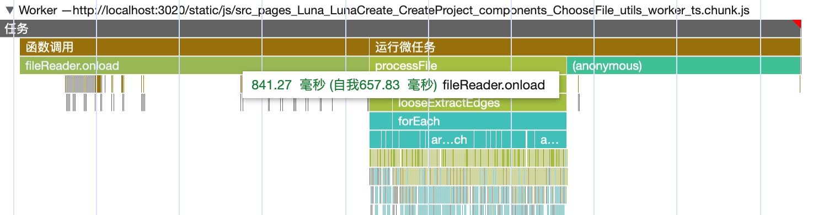
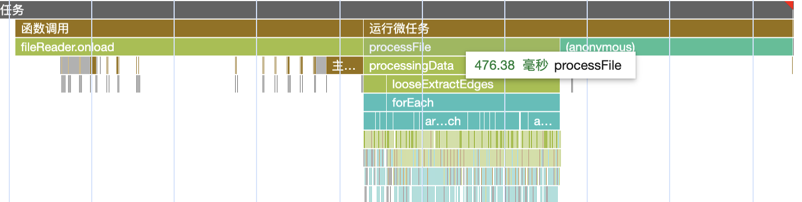
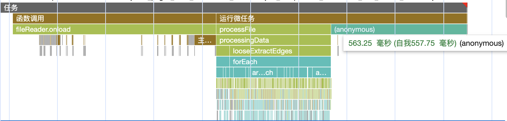
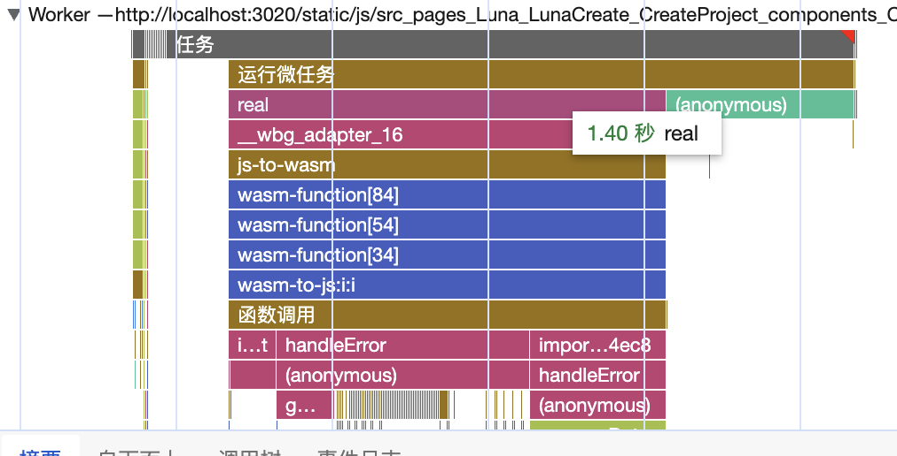
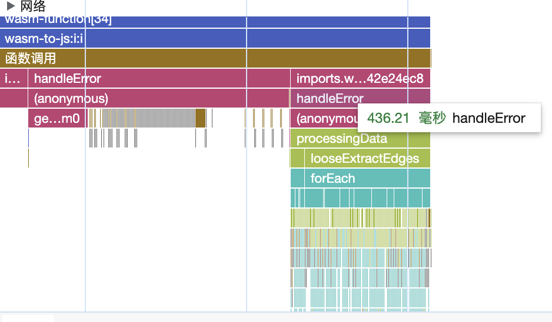

::: tip 介绍
worker读取数据进行处理以及wasm调研
:::

<!-- more -->

## worker读取数据进行处理以及wasm调研

### 1.业务场景

当用户使用本地可视化需要上传文件，由于用户上传的文件数据可能不符合规定，需要进行一遍数据处理给后面流程使用

主线程直接把file文件传输给worker，然后worker把该json文件读取成text然后在序列化最近对数据进行处理，直接返回对象数据给主线程。

#### 在处理80多MB的json文件是，worker各项任务的时间统计如下

**worker处理总时长**


**fileReader读取成text的时间**



**业务进行处理数据的时间**



**worker返回数据传输到主线程的时间**




**使用comlink库简化worker操作，代码如下**

```typescript
import * as Comlink from 'comlink';
import { processingData } from './utils/processingData';
import { readJson } from './utils/readFile';

const remote = {
  async processFile(file: File) {
    const data = await readJson(file);
    const res = processingData(data);
    return res;
  },
};
export type UtilsRemote = typeof remote;
Comlink.expose(remote);

export {};

```

**主线程封装创建worker和关闭逻辑**

```typescript
import { wrap } from 'comlink';
import { UtilsRemote } from '../utils.worker';

export function createUtilsRemote() {
  const worker = new Worker(new URL('../utils.worker.ts', import.meta.url), {
    type: 'module',
  });
  const remote = wrap<UtilsRemote>(worker);
  return {
    remote,
    terminate: () => worker.terminate(),
  };
}

```

**根据性能图表可以发现大部分时间用在了文件读取解析和返回数据上**


### 2.尝试使用wasm进行优化

**具体如何打包以及如何使用不再赘述，如果想学习rust wasm可以点击下面链接**

[rust wasm入门指南 - 掘金 (juejin.cn)](https://juejin.cn/post/7281691679869763639)

**下面这段代码将编译成wasm**

```rust
use js_sys::{Function, JSON};
use wasm_bindgen::prelude::*;
use web_sys::File;

#[wasm_bindgen]
pub async fn read_json_file(file: File, callback: Function) -> Result<JsValue, JsValue> {
    let text = wasm_bindgen_futures::JsFuture::from(file.text()).await?;
    let data = JSON::parse(&text.as_string().unwrap())?;
    let res=callback.call1(&JsValue::NULL,&data)?;
    Ok(res)
}

```

worker中进行调用

```typescript
import * as Comlink from 'comlink';
import { processingData } from './utils/processingData';
import { readJson } from './utils/readFile';
import init, { read_json_file } from 'graxy-file-wasm';

const remote = {
  async processFile(file: File) {
    await init();
    const data = await read_json_file(file, processingData);

    // const data = await readJson(file);
    // const res = processingData(data);
    return data;
  },
};
export type UtilsRemote = typeof remote;
Comlink.expose(remote);

export {};
```

**性能图表**

**总时长**


**解析文件和处理数据的时长**



**处理数据的时长**



**传输数据的时长**


**发现使用wasm跟直接js读取文件再处理性能差不多**


## 2.读取csv性能对比

#### **js代码**

```typescript
import csvtojson from 'csvtojson';
import { propertyWhiteList } from '../constants';

function readAsText(file: File): Promise<string> {
  return new Promise((resolve, reject) => {
    const fileReader = new FileReader();
    fileReader.readAsText(file);
    fileReader.onload = (e) => {
      resolve(e.target?.result as string);
    };
    fileReader.onerror = (e) => {
      reject('文件读取成字符串失败');
    };
  });
}

export async function readCSV(file: File, delimiter = ',') {
  let headerMeta = [];
  const csv = await readAsText(file);
  const data = await csvtojson({
    output: 'csv',
    delimiter,
  })
    .fromString(csv)
    .on('header', (header) => {
      headerMeta = header;
    });

  const header = headerMeta.map((header: string) => {
    if (header.startsWith('~')) {
      return header.replace('~', '');
    } else if (header.split(':').length === 2) {
      return header.split(':')[1];
    } else if (header.split('/').length === 2) {
      return header.split('/')[1];
    }
    return header;
  });

  const list: any[] = [];
  data.forEach((i) => {
    const item: any = {};
    i.forEach((value: any, index: number) => {
      if (propertyWhiteList.includes(header[index])) {
        item[header[index]] = value;
      } else {
        if (item.properties) {
          item.properties[header[index]] = value;
        } else {
          item.properties = {};
        }
      }
    });
    list.push(item);
  });
  return list;
}

```

**把一个文件大小为8MB的csv文件处理成需要的数据格式所需时间**


#### rust wasm代码

```rust
use std::borrow::BorrowMut;

use js_sys::{Function, Uint8Array, JSON};
use quickxml_to_serde::{xml_string_to_json, Config, NullValue};
use serde_json::{json, Number, Value};
use wasm_bindgen::prelude::*;
use web_sys::File;

static WHITE_LIST: [&str; 7] = ["target", "source", "id", "x", "y", "z", "curveOffset"];

#[wasm_bindgen]
pub async fn read_csv_file(file: File) -> Result<JsValue, JsValue> {
    let text = wasm_bindgen_futures::JsFuture::from(file.array_buffer()).await?;
    let data_str = Uint8Array::new(&text);
    let data_vec = data_str.to_vec();
    let mut csv_reader = csv::ReaderBuilder::new().from_reader(data_vec.as_slice());
    let headers = &csv_reader.headers().unwrap().clone();
    let mut json_array = Vec::new();

    for record in csv_reader.records() {
        let record = record.unwrap();
        let mut json_object = json!({});

        for (i, field) in record.iter().enumerate() {
            let header = headers.get(i).unwrap();
            let splits = header.split('/').collect::<Vec<&str>>();
            // 由于一个header只能设置一个字段，所以根据/ 进行分割，然后进行遍历4获取最后字段的引用进行设置值
            let mut obj = json_object.borrow_mut();
            if WHITE_LIST.contains(&splits[0]) {
                obj = obj[splits[0]].borrow_mut();
                *obj = match splits[0] {
                    "curveOffset" => Value::Number(field.parse::<Number>().unwrap()),
                    _ => Value::String(field.to_string()),
                };
                continue;
            } else {
                obj = obj["properties"].borrow_mut();
                for i in splits.iter() {
                    if *i == "properties" {
                        continue;
                    }
                    obj = obj[i].borrow_mut();
                }
                *obj = parse(field);
            }
        }
        json_array.push(json_object);
    }

    let json_array = json!(json_array);
    js_sys::JSON::parse(&json_array.to_string())
}

fn parse(value: &str) -> Value {
    if value.parse::<Number>().is_ok() {
        Value::Number(value.parse::<Number>().unwrap())
    } else if value.parse::<bool>().is_ok() {
        Value::Bool(value.parse::<bool>().unwrap())
    } else {
        Value::String(value.to_string())
    }
}

```

**wasm处理成同样的数据所需时间**


#### 总结

**通过对比已经rust代码发现，rust wasm 每次返回数据时都需要进行序列话，而且从wasm内存中解析数据也需要花费时间所以在读取文件这方面直接使用js更有优势，除非不需要返回批量数据，或者是计算型任务，使用wasm可以提升一点性能**


