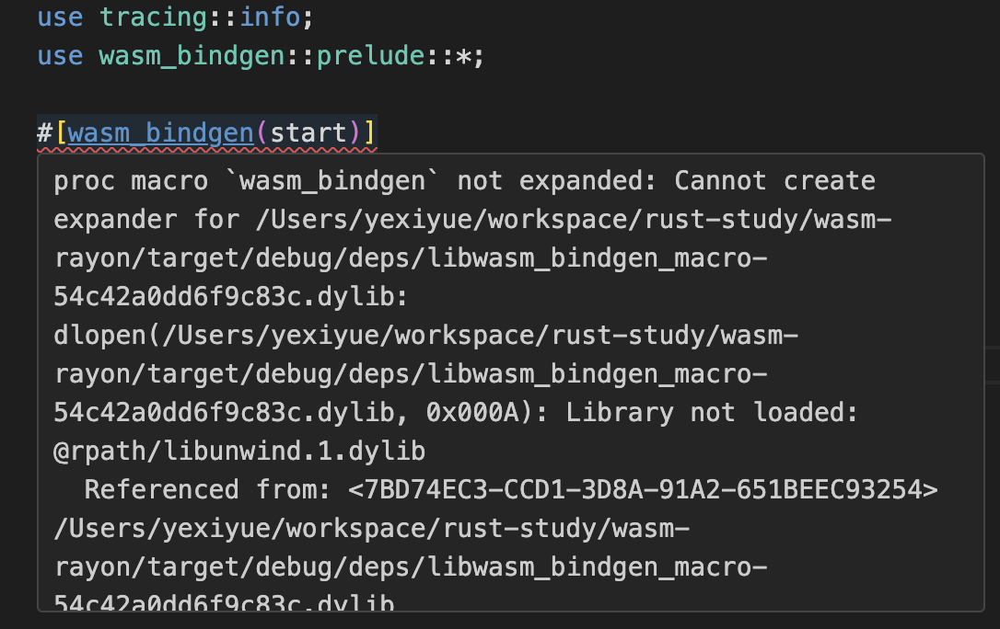
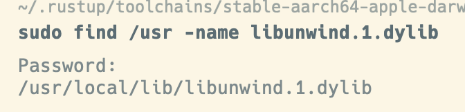

::: tip 介绍
Mac 上解决Library not loaded: @rpath/libunwind.1.dylib问题
:::

<!-- more -->
## Mac 上解决Library not loaded: @rpath/libunwind.1.dylib问题

### 背景

最近在使用rust编写宏项目时发现编辑器不能展开宏，并提示Library not loaded: @rpath/libunwind.1.dylib，如图所示



然后使用cargo 安装一些命令的时候，也会提示@rpath相关的问题。

### 什么是rpath

在 macOS（以及其他 Unix-like 系统）中，RPATH（Run-Time Search Path）是一个存储在可执行文件或动态库中的路径列表。当程序运行时，动态链接器（dynamic linker）会使用 RPATH 来查找和加载所需的动态库。

RPATH 的主要目的是允许开发者指定在运行时搜索和加载共享库的具体路径，而无需依赖于系统默认的库搜索路径。这样可以更灵活地管理库的部署和版本控制，特别是在多个应用程序或库之间共享库时。

在 macOS 中，RPATH 可以通过以下几种方式指定：

1. **编译时设置**：在编译可执行文件或动态库时，可以通过链接器选项（如 `-Wl,-rpath,<path>`）来指定 RPATH。

2. **安装时设置**：在安装过程中，可以使用工具（如 `install_name_tool`）来修改已编译的可执行文件或动态库的 RPATH。

3. **运行时环境变量**：在运行程序时，可以通过设置环境变量（如 `DYLD_LIBRARY_PATH`）来临时覆盖 RPATH。

需要注意的是，macOS 从 Mavericks （10.9）开始引入了 @rpath 概念，它提供了一种更灵活的方式来指定库的加载路径。@rpath 是一个占位符，可以在运行时被动态替换为实际的路径。

### 解决方案

具体原因是rpath路径出问题了，找不到动态链接库。

**可以通过命令查找这个文件**

```bash
sudo find /usr -name libunwind.1.dylib
```



然后就是添加这个lib路径。

以下是两种方案

#### 1.添加动态链接库到环境变量

```bash
vim ~/.zshrc
```

然后把下面代码粘贴进去

```bash
export DYLD_LIBRARY_PATH="/usr/local/lib:$DYLD_LIBRARY_PATH"
export DYLD_LIBRARY_PATH="/opt/homebrew/lib:$DYLD_LIBRARY_PATH"
```

然后运行下面bash 命令

```bash
source ~/.zshrc
```


#### 2.给可执行文件添加rpath

先找到rust-analyzer-proc-macro-srv这个可执行文件。

这个文件是用于cargo check的辅助宏相关功能的可执行文件，在使用vs code中的提示就是它报的错误

```bash
cd ～/.rustup/toolchains/nightly-aarch64-apple-darwin/libexec
```

然后给它添加rpath

```bash
install_name_tool -add_rpath /usr/local/lib  rust-analyzer-proc-macro-srv
```

