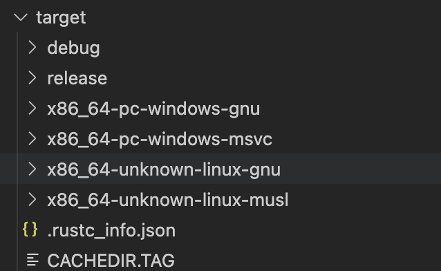

::: tip 介绍
在 Rust 开发中，能够从单一开发环境（如 macOS）为不同操作系统生成可执行文件是一项强大且实用的技能。本文将指导您如何在 macOS 系统上分别构建适用于 Linux 和 Windows 的 Rust 应用程序，并介绍两种主要的实现方法。
:::

<!-- more -->

# 在 macOS 上跨平台编译 Rust 应用程序至 Linux 和 Windows

在 Rust 开发中，能够从单一开发环境（如 macOS）为不同操作系统生成可执行文件是一项强大且实用的技能。本文将指导您如何在 macOS 系统上分别构建适用于 Linux 和 Windows 的 Rust 应用程序，并介绍两种主要的实现方法。

### 第一种方式：本地安装依赖并编译

#### 编译为 Linux 可执行文件

1. **安装 Musl Cross-Compiler**：
   利用 Homebrew 安装 Musl 交叉编译器套件以支持在 macOS 上为 Linux 构建。

   ```bash
   brew install FiloSottile/musl-cross/musl-cross
   ```

2. **配置 Rust 目标平台**：
   使用 `rustup` 添加 x86_64 架构 Linux（基于 Musl C 库）的目标平台。

   ```bash
   rustup target add x86_64-unknown-linux-musl
   ```

3. **项目链接器设置**：
   在项目的 `.cargo/config.toml` 文件中指定 Musl 链接器路径。

   ```toml
   [target.x86_64-unknown-linux-musl]
   linker = "x86_64-linux-musl-gcc"
   ```

4. **构建 Linux 版本项目**：
   执行以下命令进行编译，生成适用于 Linux 的 release 版本可执行文件。

   ```bash
   cargo build --release --target x86_64-unknown-linux-musl
   ```

#### 编译为 Windows 可执行文件

针对 Windows 平台，我们需要借助 `cargo-xwin` 工具及 LLVM 组件：

1. **安装 `cargo-xwin`**：
   使用 `cargo` 命令行工具安装 `cargo-xwin` 插件。

   ```bash
   cargo install cargo-xwin
   ```

2. **安装 LLVM**：
   通过 Homebrew 获取 LLVM，确保 Windows 目标编译所需组件已就绪。

   ```bash
   brew install llvm
   ```

3. **更新环境变量**：
   将 LLVM bin 目录添加到系统 PATH 中，使 `cargo-xwin` 能找到相关工具。

   ```bash
   export PATH="/opt/homebrew/Cellar/llvm/17.0.6/bin:$PATH"
   source ~/.zshrc
   ```

4. **添加 Windows 目标平台**：
   使用 `rustup` 添加支持 x86_64 架构 Windows（使用 MSVC 工具链）的目标平台。

   ```bash
   rustup target add x86_64-pc-windows-msvc
   ```

5. **构建 Windows 版本项目**：
   运行 `cargo-xwin` 来完成 Windows 版本的编译工作。

   ```bash
   cargo xwin build --release --target x86_64-pc-windows-msvc
   ```

### 第二种方式：利用 `cross` 工具简化跨平台编译流程

**使用 `cross` 实现 Docker 容器内编译**

[cross-rs/cross](https://github.com/cross-rs/cross) 是一个通过 Docker 容器技术优化跨平台编译过程的强大工具。其工作原理概括如下：

1. **准备容器环境**：
   根据目标平台（Linux 或 Windows），`cross` 自动下载或创建包含对应平台构建工具链、Rust 工具和必要库的 Docker 镜像。

2. **挂载源代码至容器**：
   当运行 `cross` 命令时，会自动将本地项目源码目录映射到 Docker 容器内部。

3. **容器内部编译**：
   `cross` 根据目标平台在容器内部调用相应的 Rust 工具链进行编译。

4. **同步结果至主机**：
   编译完成后，生成的二进制文件存储于容器内的特定路径，并通过 Docker 卷映射功能回传至宿主 macOS 系统。

**使用 `cross` 进行编译步骤**

首先，通过 Cargo 安装 `cross`：

```bash
cargo install cross
```

然后，在项目根目录下配置 `Cross.toml` 文件，考虑到国内网络问题，可以自定义镜像地址：

```toml
[target.x86_64-unknown-linux-gnu]
xargo = false
image = "togettoyou/ghcr.io.cross-rs.x86_64-unknown-linux-gnu:main"

[target.x86_64-pc-windows-gnu]
xargo = false
image = "togettoyou/ghcr.io.cross-rs.x86_64-pc-windows-gnu:main"
```

最后，运行 `cross` 命令编译 Windows 版本应用：

```bash
cross build -r --target x86_64-pc-windows-gnu
```

成功编译后，可在项目 `target` 目录下找到相应平台的可执行文件。




参考资料：

- [在 macOS 下将 Rust 交叉编译为目标为 Linux musl 的应用程序](https://blog.yasking.org/a/rust-macos-build-musl-linux.html)
- [Github: rust-cross/cargo-xwin](https://github.com/rust-cross/cargo-xwin)
- [简易教程：在 macOS 上搭建用于 Windows 和 Linux 的交叉编译器 (filippo.io)](https://words.filippo.io/easy-windows-and-linux-cross-compilers-for-macos/)
- [【Rust】利用 Cross 实现跨平台编译 | MichaelFu (fudenglong.site)](https://blog.fudenglong.site/2023/02/26/Rust/cross/)
