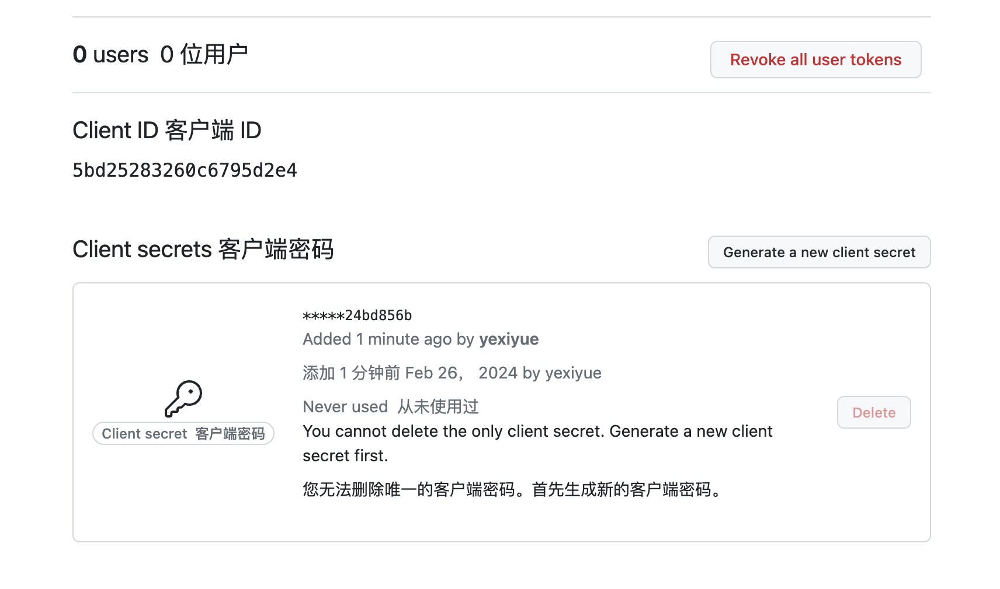
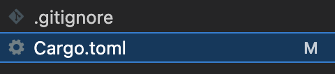

::: tip 介绍
Axum with OAuth
:::

<!-- more -->

## Axum with OAuth

在 Axum 框架中结合 OAuth2 和 JWT 实现 token 刷新的优雅方式可以遵循以下步骤：

1. **配置 OAuth2 授权流程**：

   - 在 Axum 应用中，集成 OAuth2 客户端库以处理与授权服务器的交互。用户通过登录时重定向至授权服务器进行认证并获取 Authorization Code。
   - 使用 Authorization Code 向授权服务器交换 Access Token 和 Refresh Token。

2. **存储 Token**：

   - 不直接将 Refresh Token 放在 JWT 中，而是将其安全地存储在后端（如数据库或缓存）关联到用户标识符上。
   - 将 Access Token 以 JWT 形式返回给前端，并设置合适的过期时间。

3. **创建中间件或路由处理器**：

   - 创建一个自定义中间件或者特定路由处理器用于处理 JWT token 的验证。当收到请求时，提取并验证 JWT Access Token 的有效性。

4. **自动刷新逻辑**：

   - 当检测到 JWT 即将过期时（比如在中间件中检查`exp` claim），发起一个后台异步任务或者立即调用一个服务来使用 Refresh Token 从 OAuth2 授权服务器获取新的 Access Token。
   - 更新后端存储中的 Refresh Token 和新 Access Token，并发送新的 Access Token 回客户端（例如作为响应的一部分或触发前端主动请求更新）。

5. **前端处理**：

   - 前端接收到新的 Access Token 后，应更新本地存储的 Access Token，并继续使用新的 Token 进行后续 API 调用。

6. **错误处理**：

   - 如果 Refresh Token 过期或失效，则需要用户重新登录。

7. **安全性增强**：
   - 对于 JWT，确保启用合适的安全措施，例如加密、签名以及防止 CSRF 攻击等。

示例伪代码：

```rust
// 仅做演示，实际代码需根据具体库和接口编写
async fn refresh_token_handler(
    refresh_token: String,
    oauth_client: &OAuthClient,
) -> Result<String, Error> {
    // 使用refresh_token获取新的access_token
    let new_tokens = oauth_client.refresh(refresh_token).await?;
    Ok(new_tokens.access_token)
}

async fn jwt_middleware(
    req: Request<Body>,
    session: Extension<UserSession>,
) -> Result<Response<Body>, Infallible> {
    let access_token = extract_jwt_from_request(&req)?;

    if is_token_about_to_expire(access_token) {
        // 异步刷新token
        let new_access_token = refresh_token_handler(session.refresh_token.clone()).await?;

        // 更新session中的access_token
        session.update_access_token(new_access_token);
    }

    // 继续执行其他中间件及路由处理器

    Ok(req.into_response(()))
}
```

请注意，上述代码为简化的逻辑描述，并非完整的实现细节，你需要根据 Axum 和你使用的 OAuth2 库的具体接口进行调整。同时，确保遵循 OAuth2 协议的最佳实践和安全规范。

### 1.GitHub 注册 OAuth app

**然后获取 Client ID 和 secrets**



### 2.创建一个工程目录

​ 

然后使用 shuttle 初始化一个项目

```bash
cargo shuttle init
```

后端框架选择 axum

文件目录 server(可以自行判断使用其他的文件夹名)

然后在修改根目录下的 cargo.toml，把 server 添加到工作空间

```toml
[workspace]
members = ["server"]
```

最终的目录结构

```
.
├── Cargo.toml
└── server
    ├── Cargo.toml
    └── src
        └── main.rs

3 directories, 3 files
```

### 3.安装所需依赖

```bash
cd server
# 数据库相关依赖
cargo add sea-orm -F sqlx-postgres,runtime-tokio-native-tls
cargo add shuttle-shared-db -F postgres,sqlx
cargo add sqlx
# oauth2
cargo add shuttle-secrets reqwest oauth2 jsonwebtoken
# axum相关依赖
cargo add axum_session tower anyhow
```

最终 server.toml 文件如下

```toml
[package]
name = "actions"
version = "0.1.0"
edition = "2021"

[dependencies]
anyhow = "1.0.80"
axum = "0.7.3"
axum_session = "0.12.4"
oauth2 = "4.4.2"
reqwest = "0.11.24"
sea-orm = { version = "0.12.14", features = [
    "sqlx-postgres",
    "runtime-tokio-native-tls",
] }
shuttle-axum = "0.39.0"
shuttle-runtime = "0.39.0"
shuttle-secrets = "0.39.0"
shuttle-shared-db = { version = "0.39.0", features = ["postgres", "sqlx"] }
sqlx = "0.7.3"
tokio = "1.28.2"
tower = "0.4.13"
tracing = "0.1.40"

```

### 4.编写迁移文件

```rust
use sea_orm_migration::prelude::*;

#[derive(DeriveMigrationName)]
pub struct Migration;

#[async_trait::async_trait]
impl MigrationTrait for Migration {
    async fn up(&self, manager: &SchemaManager) -> Result<(), DbErr> {
        manager
            .create_table(
                Table::create()
                    .table(User::Table)
                    .if_not_exists()
                    .col(
                        ColumnDef::new(User::Id)
                            .integer()
                            .not_null()
                            .auto_increment()
                            .primary_key(),
                    )
                    .col(ColumnDef::new(User::Username).string().not_null())
                    .col(ColumnDef::new(User::Email).string().not_null())
                    .col(ColumnDef::new(User::AvatarUrl).string().not_null())
                    .col(
                        ColumnDef::new(User::CreateAt)
                            .timestamp_with_time_zone()
                            .default(Expr::current_timestamp())
                            .not_null(),
                    )
                    .to_owned(),
            )
            .await?;

        manager
            .create_table(
                Table::create()
                    .table(Session::Table)
                    .if_not_exists()
                    .col(
                        ColumnDef::new(Session::Id)
                            .integer()
                            .not_null()
                            .auto_increment()
                            .primary_key(),
                    )
                    .col(
                        ColumnDef::new(Session::UserId)
                            .integer()
                            .unique_key()
                            .not_null(),
                    )
                    .col(ColumnDef::new(Session::AccessToken).string().not_null())
                    .col(ColumnDef::new(Session::RefreshToken).string().not_null())
                    .col(
                        ColumnDef::new(Session::ExpiresAt)
                            .timestamp_with_time_zone()
                            .not_null(),
                    )
                    .to_owned(),
            )
            .await
    }

    async fn down(&self, manager: &SchemaManager) -> Result<(), DbErr> {
        manager
            .drop_table(Table::drop().table(Session::Table).to_owned())
            .await?;
        manager
            .drop_table(Table::drop().table(User::Table).to_owned())
            .await
    }
}

#[derive(DeriveIden)]
enum User {
    Table,
    Id,
    Username,
    Email,
    AvatarUrl,
    CreateAt,
}

#[derive(DeriveIden)]
enum Session {
    Table,
    Id,
    UserId,
    AccessToken,
    RefreshToken,
    ExpiresAt,
}

```

### 5.编写 oauth 授权逻辑

**在 server 下新建文件 lib.rs、auth/mod.rs、auth/handler.rs、auth/oauth.rs**

在 oauth 下编写具体的逻辑

```rust
use anyhow::{Context, Result};
use oauth2::{
    basic::{BasicClient, BasicTokenType},
    reqwest::async_http_client,
    AuthUrl, AuthorizationCode, ClientId, ClientSecret, CsrfToken, EmptyExtraTokenFields,
    RedirectUrl, Scope, StandardTokenResponse, TokenUrl,
};
use reqwest::Url;
use std::sync::Arc;

#[derive(Debug, Clone)]
pub struct OAuth {
    client: Arc<BasicClient>,
}

impl OAuth {
    // 初始化
    pub fn new(client_id: &str, client_secret: &str, redirect_url: &str) -> Result<Self> {
        let redirect_url = RedirectUrl::new(redirect_url.to_string())?;
        let auth_url = AuthUrl::new("https://github.com/login/oauth/authorize".to_string())
            .context("Invalid authorization endpoint URL")?;
        let token_url = TokenUrl::new("https://github.com/login/oauth/access_token".to_string())
            .context("Invalid token endpoint URL")?;
        let client = BasicClient::new(
            ClientId::new(client_id.to_string()),
            Some(ClientSecret::new(client_secret.to_string())),
            auth_url,
            Some(token_url),
        )
        .set_redirect_uri(redirect_url);

        Ok(Self {
            client: Arc::new(client),
        })
    }

    // 生成授权链接
    pub fn generate_oauth_url(&self) -> (Url, CsrfToken) {
        self.client
            .authorize_url(CsrfToken::new_random)
            .add_scope(Scope::new("public_repo".to_string()))
            .add_scope(Scope::new("user:email".to_string()))
            .url()
    }

    // 使用授权码交换令牌
    pub async fn exchange_code(
        &self,
        code: String,
    ) -> Result<StandardTokenResponse<EmptyExtraTokenFields, BasicTokenType>> {
        Ok(self
            .client
            .exchange_code(AuthorizationCode::new(code.clone()))
            .request_async(async_http_client)
            .await?)
    }
}

```
