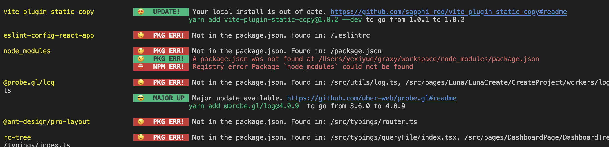
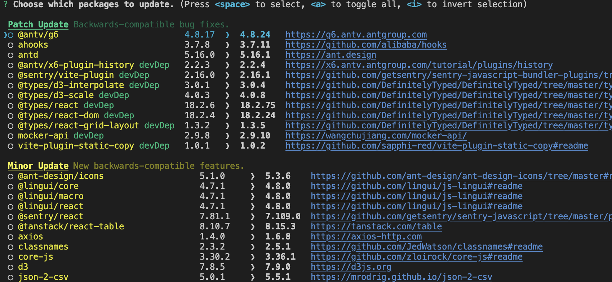

## Npm 依赖管理

### 简介

在前端开发中，npm（Node Package Manager）是JavaScript编程语言和Node.js运行环境中的一个关键工具，它帮助开发者管理项目的依赖关系。有效的依赖管理可以提高开发效率、确保项目稳定性和可维护性。以下是一些关于npm依赖管理的最佳实践和策略：

1. **使用`package.json`文件管理依赖**： `package.json`文件是npm用来描述项目和其依赖的核心文件。它列出了项目的所有依赖项及其版本，确保了项目的一致性和可重现性。开发者应该始终通过`npm install`命令来添加、更新或删除依赖项，并确保`package.json`文件得到相应的更新。
2. **锁文件的使用**： `package-lock.json`和`npm-shrinkwrap.json`是npm的锁文件，它们锁定了安装的依赖项的版本，包括子依赖项的版本。这样可以确保在不同的开发环境中安装相同版本的依赖项，避免因版本不一致导致的问题。
3. **合理使用版本号**： 当指定依赖项版本时，应使用语义化版本控制（SemVer）原则。主版本号更新代表有重大更新，次版本号更新表示添加了新功能但保持向后兼容，修订号更新则是小的错误修复。使用版本范围（如`^1.2.3`）可以让npm自动选择最合适的版本。
4. **定期更新依赖项**： 依赖项可能会有安全更新或新功能。定期检查并更新依赖项可以确保项目利用最新的功能和安全修复。可以使用`npm update`命令来更新依赖项。
5. **移除未使用的依赖**： 随着项目的发展，一些依赖项可能不再需要。使用工具如`depcheck`可以帮助找出未使用的依赖项并将其移除，从而减少项目的体积和构建时间。
6. **使用`npm audit`检查安全漏洞**： npm提供了`npm audit`命令，它可以扫描项目的依赖项，找出已知的安全漏洞，并提供修复建议。定期运行此命令并修复报告的问题可以提高项目的安全性。
7. **避免依赖地狱**： 依赖地狱是指项目依赖项之间的复杂关系导致的难以解决的冲突。通过使用npm的`resolutions`字段，可以指定某些依赖项的特定版本，从而避免冲突。


### 移除未使用的依赖

`depcheck`是一个流行的工具，它可以帮助你发现项目中未使用的依赖项。安装`depcheck`后，在项目根目录下运行`depcheck`或`npx depcheck`，它会列出所有未使用的依赖项。你可以根据输出结果来决定是否移除这些依赖。

**安装**

```bash
npm install -g depcheck
```

**使用**

```bash
depcheck
```

示例输出

```
Unused dependencies
* @babel/polyfill
* @observablehq/plot
* mitt
* obliterator
* react-linear-gradient-picker
* react-window
Unused devDependencies
* @commitlint/cli
* @commitlint/config-conventional
* @lingui/cli
* @lingui/format-po
* @testing-library/react
* @testing-library/user-event
* @types/jest
* craco-swc
* cz-conventional-changelog
* cz-customizable
* postcss-less
* raw-loader
* react-error-overlay
* rollup-plugin-visualizer
* stylelint-config-prettier
* stylelint-config-standard
Missing dependencies
* eslint-config-react-app: ./.eslintrc
* node_modules: ./package.json
* @probe.gl/log: ./src/utils/log.ts
* @ant-design/pro-layout: ./src/typings/router.ts
* rc-tree: ./src/typings/queryFile/index.tsx
* dayjs: ./src/pages/Workflow/WorkflowDetail/index.tsx
* @antv/algorithm: ./src/pages/Workflow/WorkflowDetail/Preview/index.tsx
* immer: ./src/pages/Workflow/WorkflowDetail/NodeDetail/DataFileInput.tsx
* qs: ./src/hooks/useRequest/index.ts
* perfect-scrollbar: ./src/components/Scrollbar/index.tsx
* dt-sql-parser: ./src/components/MonacoEditor/languageWorker.ts
* @antv/g6-core: ./src/components/Graph/shape/analysis-edge.ts
* @antv/util: ./src/components/Graph/behavior/click-relations-edge.ts
* @antv/g-base: ./src/components/Graph/behavior/drag-mapping-node.ts
* dotenv-expand: ./scripts/cleanTrans.js
* dotenv: ./scripts/cleanTrans.js
* @alicloud/openapi-client: ./scripts/translate.js
* @alicloud/tea-util: ./scripts/translate.js
* magic-string: ./config/insertScriptPlugin.ts
```

然后再结合人工审查，再去移除不需要的依赖


### 安装缺失依赖

**1.使用depcheck**

`depcheck`命令同时也可以展示缺失了哪些依赖，"Missing dependencies"下的内容就是缺失的依赖，以及具体在什么位置引用了依赖

**2.使用npm-check**

同样也可以使用`npm-check`

```bash
npm install -g npm-check
```

然后执行`npm-check`命令



**推荐使用`depcheck` ，因为它能显示具体在什么位置使用了依赖，有利于人工审查。**


### 升级依赖

**1.使用npm-check-updates**

```bash
npm install -g npm-check-updates
```

执行命令`ncu`查看哪些需要升级

执行`ncu -u`会自动更新package.json，然后重新安装一下依赖就完成了升级


**2.使用npm-check**

如果不想要批量自动更新，可以使用`npm-check -u`



按照提示选择想要升级的依赖就能一键自动升级了