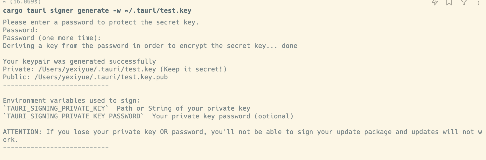
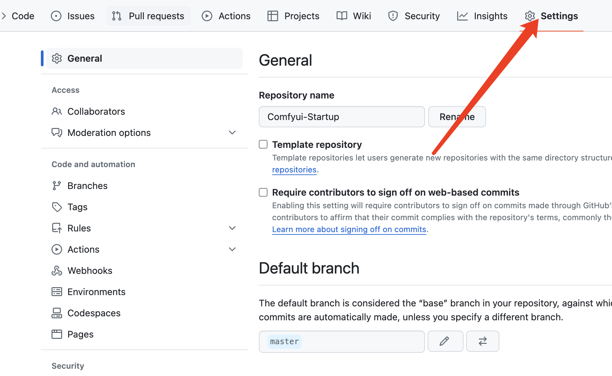
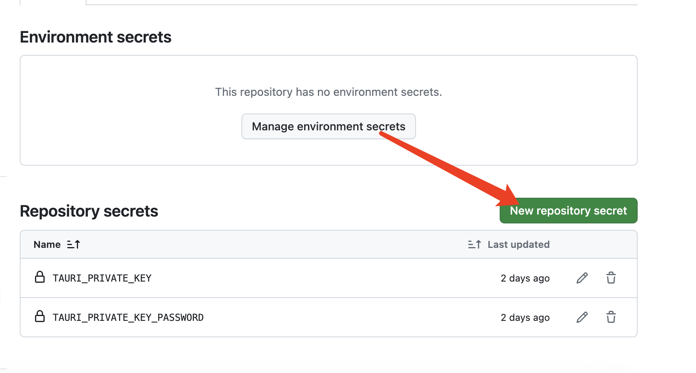
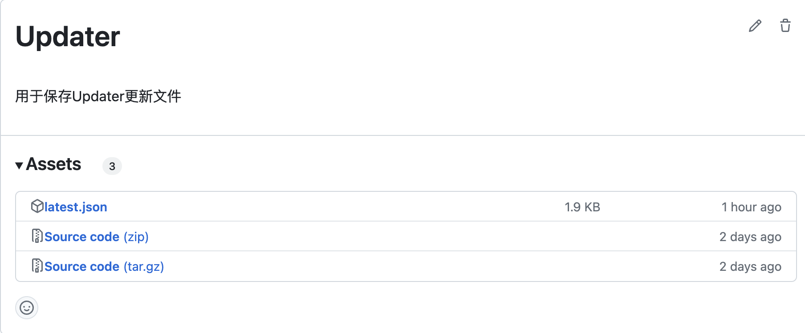

::: tip 介绍
Tauri 2.0 Updater 自动更新指南
:::

<!-- more -->

## Tauri 2.0 Updater 自动更新指南

Tauri2.0 将原来的 updater 单独封装成了插件[plugins-workspace/plugins/updater](https://github.com/tauri-apps/plugins-workspace/tree/v2/plugins/updater)

`tauri.conf.json`中的配置也从`updater`变成了`plugins.updater`，具体可以参考[Upgrade from Tauri 1.0 | Tauri](https://beta.tauri.app/guides/upgrade-migrate/from-tauri-1/#tauri-configuration)

而且原来的`dialog`和`active`两个配置字段也已经删除了，所以现在的`updater` 需要自己手动写检查更新相关逻辑。

这些逻辑都很简单，这里贴上官方的示例

### 1.安装插件

```bash
pnpm tauri add updater
pnpm tauri add process
```

**通过官方的脚手架安装会自动帮我们在 rust 中注册插件和安装 npm 依赖**

```typescript
import { check } from "@tauri-apps/plugin-updater";
import { relaunch } from "@tauri-apps/plugin-process";
const update = await check();
if (update?.available) {
  await update.downloadAndInstall();
  await relaunch();
}
```

详细请参考[plugins-workspace/plugins/updater](https://github.com/tauri-apps/plugins-workspace/tree/v2/plugins/updater)

### 2.配置插件

`tauri.conf.json`

```json
{
  "productName": "comfyui-startup",
  "version": "0.1.8",
  "identifier": "com.tauri.comfyui-startup",
  "build": {
    "beforeDevCommand": "pnpm dev",
    "devUrl": "http://localhost:1420",
    "beforeBuildCommand": "pnpm build",
    "frontendDist": "../dist"
  },
  // 核心配置
  "plugins": {
    "updater": {
      "endpoints": ["your json services"],
      "pubkey": "your pub key"
    }
  }
  //...
}
```

**这里有两个核心配置**

- `pubkey`：tauri cli 自动生成的，用于生成更新包校验签名
- `endpoints`：静态或动态 json 服务，该 json 带有相关更新信息

**这里贴上官方的 json 文件作为参考。**

```json
{
  "version": "v1.0.0",
  "notes": "Test version",
  "pub_date": "2020-06-22T19:25:57Z",
  "platforms": {
    "darwin-x86_64": {
      "signature": "Content of app.tar.gz.sig",
      "url": "https://github.com/username/reponame/releases/download/v1.0.0/app-x86_64.app.tar.gz"
    },
    "darwin-aarch64": {
      "signature": "Content of app.tar.gz.sig",
      "url": "https://github.com/username/reponame/releases/download/v1.0.0/app-aarch64.app.tar.gz"
    },
    "linux-x86_64": {
      "signature": "Content of app.AppImage.tar.gz.sig",
      "url": "https://github.com/username/reponame/releases/download/v1.0.0/app-amd64.AppImage.tar.gz"
    },
    "windows-x86_64": {
      "signature": "Content of app.msi.sig",
      "url": "https://github.com/username/reponame/releases/download/v1.0.0/app-x64.msi.zip"
    }
  }
}
```

详细内容请参考[Updater | Tauri Apps](https://tauri.app/zh-cn/v1/guides/distribution/updater#static-json-file)

### 3.生成 key

```bash
pnpm tauri signer generate -w ~/.tauri/myapp.key
```



官方文档[Updater | Tauri Apps](https://tauri.app/zh-cn/v1/guides/distribution/updater#signing-updates)

### 4.使用 GitHub Actions 自动化

使用 Tauri 官方提供的 GitHub Actions，可以自动发布带有 assets 的 release 和自动生成`updater.json`文件。而且也能利用 GitHub 构建其他平台的二进制程序。属于是省心又省力。

**接下来将详细介绍该如何操作**

有两种思路白嫖静态 json 服务，而且都能与 GitHub Actions 完美结合，做到不用动手也能免费的自动化更新。

1. **使用 Github Release**
2. **使用 Github Pages**

**首先需要将第三步生成的私钥和密码配置到 GitHub 中**






**分别将两个 secrets 添加进去，后面工作流中会使用到**

#### 1.Github Release

**使用该方式需要先手动创建一个 Release**

基本操作就不介绍了。

然后在项目下创建文件`.github/workflows/publish.yaml`

```yaml
name: Release
# 触发方式
on:
  push:
    tags:
      - "v*"
  workflow_dispatch:

jobs:
  release:
  	# 由于需要创建release所以需要设置写入权限
    permissions:
      contents: write
    strategy:
      fail-fast: false
      matrix:
      	# 我这里只需要两个平台，完整的可以参考官方的workflow
        platform: ['windows-latest', 'macos-latest']

    runs-on: ${{ matrix.platform }}
    steps:
      - name: Checkout repository
        uses: actions/checkout@v3
      - name: Rust setup
        uses: dtolnay/rust-toolchain@stable

      - name: Install pnpm
        run: npm install -g pnpm
      - name: Sync node version and setup cache
        uses: actions/setup-node@v3
        with:
          node-version: "lts/*"
          cache: "pnpm"
      - name: Install frontend dependencies
        run: pnpm install --no-frozen-lockfile
      	# 使用tauri actions
      - name: Build the app
        id: build
        uses: tauri-apps/tauri-action@v0
        env:
          GITHUB_TOKEN: ${{ secrets.GITHUB_TOKEN }}
          # 使用之前配置的私钥
          TAURI_SIGNING_PRIVATE_KEY: ${{ secrets.TAURI_PRIVATE_KEY }}
          # 使用之前配置的私钥密码
          TAURI_SIGNING_PRIVATE_KEY_PASSWORD: ${{ secrets.TAURI_PRIVATE_KEY_PASSWORD }}
        with:
          tagName: ${{ github.ref_name }}
          releaseName: "ComfyUI Startup v__VERSION__"
          releaseBody: "See the assets to download and install this version."
          releaseDraft: true
          prerelease: false

      - name: Upload assets
        env:
          GITHUB_TOKEN: ${{ secrets.GITHUB_TOKEN }}
        # 运行自己的脚本
        run: node scripts/updater.mjs

```

官方文档[tauri-apps/tauri-action](https://github.com/tauri-apps/tauri-action)

运行完官方的工作流后，它会自动生成 latest.json 文件，这时候我们只需要将其上传到 Updater release 就行。

注意到了`node scripts/updater.mjs`吗?

这是需要自己编写的脚本文件

```js
// 注意要安装@actions/github依赖
import { context, getOctokit } from "@actions/github";
import { readFile } from "node:fs/promises";

// 在容器中可以通过env环境变量来获取参数
const octokit = getOctokit(process.env.GITHUB_TOKEN);

const updateRelease = async () => {
  // 获取updater tag的release
  const { data: release } = await octokit.rest.repos.getReleaseByTag({
    owner: context.repo.owner,
    repo: context.repo.repo,
    tag: "updater",
  });
  // 删除旧的的文件
  const deletePromises = release.assets
    .filter((item) => item.name === "latest.json")
    .map(async (item) => {
      await octokit.rest.repos.deleteReleaseAsset({
        owner: context.repo.owner,
        repo: context.repo.repo,
        asset_id: item.id,
      });
    });

  await Promise.all(deletePromises);

  // 上传新的文件
  const file = await readFile("latest.json", { encoding: "utf-8" });

  await octokit.rest.repos.uploadReleaseAsset({
    owner: context.repo.owner,
    repo: context.repo.repo,
    release_id: release.id,
    name: "latest.json",
    data: file,
  });
};

updateRelease();
```

这样就能够在构建完成后将`latest.json`文件更新到 updater Release 中



然后右键复制 latest.json 的链接填到`tauri.conf.json`中就能实现自动更新了。

#### 2.使用 Github Pages

使用 Github Pages 可以不用手动创建一个新的 Release。

核心逻辑是把在官方 tauri actions 运行完后生成的`latest.json`文件拷贝到要上传 gh-pages 的目录。

**工作流文件**

```yaml
name: Release
# 触发方式
on:
  push:
    tags:
      - "v*"
  workflow_dispatch:

jobs:
  release:
  	# 由于需要创建release所以需要设置写入权限
    permissions:
      contents: write
    strategy:
      fail-fast: false
      matrix:
      	# 我这里只需要两个平台，完整的可以参考官方的workflow
        platform: ['windows-latest', 'macos-latest']

    runs-on: ${{ matrix.platform }}
    steps:
      - name: Checkout repository
        uses: actions/checkout@v3
      - name: Rust setup
        uses: dtolnay/rust-toolchain@stable

      - name: Install pnpm
        run: npm install -g pnpm
      - name: Sync node version and setup cache
        uses: actions/setup-node@v3
        with:
          node-version: "lts/*"
          cache: "pnpm"
      - name: Install frontend dependencies
        run: pnpm install --no-frozen-lockfile
      	# 使用tauri actions
      - name: Build the app
        id: build
        uses: tauri-apps/tauri-action@v0
        env:
          GITHUB_TOKEN: ${{ secrets.GITHUB_TOKEN }}
          # 使用之前配置的私钥
          TAURI_SIGNING_PRIVATE_KEY: ${{ secrets.TAURI_PRIVATE_KEY }}
          # 使用之前配置的私钥密码
          TAURI_SIGNING_PRIVATE_KEY_PASSWORD: ${{ secrets.TAURI_PRIVATE_KEY_PASSWORD }}
        with:
          tagName: ${{ github.ref_name }}
          releaseName: "ComfyUI Startup v__VERSION__"
          releaseBody: "See the assets to download and install this version."
          releaseDraft: true
          prerelease: false

      - name: Upload assets
        env:
          GITHUB_TOKEN: ${{ secrets.GITHUB_TOKEN }}
        # 运行自己的脚本
        run: node scripts/publish.mjs

      - name: Deploy
        uses: peaceiris/actions-gh-pages@v3
        with:
          github_token: ${{ secrets.GITHUB_TOKEN }}
          publish_dir: ./publish
          keep_files: true
```

**publish.mjs**

```js
import { readFile, copyFile, writeFile, mkdir } from "node:fs/promises";
import { join } from "node:path";

const targetDir = join(import.meta.dirname, "../", "publish");

const publish = async () => {
  await mkdir(targetDir, { recursive: true });

  const file = await readFile("latest.json", { encoding: "utf-8" });
  // 这里我是需要手动处理一下json 所以先读取在写入到指定目录，具体到逻辑可以完全按照您自己的想法来
  const data = JSON.parse(file);
  if (data.platforms["darwin-x86_64"]) {
    data.platforms["darwin-aarch64"] = data.platforms["darwin-x86_64"];
  }
  await writeFile(
    join(targetDir, "latest.json"),
    JSON.stringify(data, null, 2)
  );
};

publish();
```

### 最后

您可以在我的 GitHub 仓库[yexiyue/Comfyui-Startup](https://github.com/yexiyue/Comfyui-Startup)中找到完整内容。如果您觉得该项目对您有所帮助或感兴趣，恳请您给予宝贵的支持，包括点赞（Star）和收藏该项目，非常感谢您的关注与支持！
