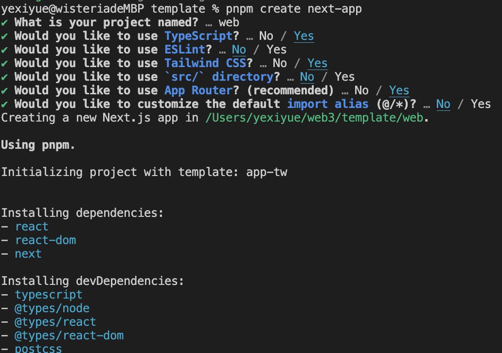

::: tip 介绍
构建 Web3 以太坊应用：Hardhat、Wagmi 与 Next.js 集成指南
:::

<!-- more -->

### 构建 Web3 以太坊应用：Hardhat、Wagmi 与 Next.js 集成指南

本文旨在引导您高效搭建基于 Web3 的以太坊智能合约开发环境及前端交互界面，采用当前主流技术栈——Hardhat、Wagmi 与 Next.js。

### 1. 初始化项目

**步骤 1:** 首先，创建一个新的工作目录并初始化 Node.js 项目。

```bash
mkdir my-web3-project
cd my-web3-project
pnpm init -y
```

### 2. 安装必备工具

**步骤 2:** 接着，安装 Hardhat 和 Wagmi 的命令行工具作为开发依赖。

```bash
pnpm add -D hardhat @wagmi/cli
```

### 3. 搭建智能合约基础

**步骤 3:** 初始化 Solidity 项目，并设置 Wagmi CLI 配置。

```bash
pnpm hardhat init
pnpm wagmi init
```


### 4. 创建前端应用

**步骤 4:** 根据个人偏好，选择 React 或 Next.js 作为前端框架并创建项目。

- 使用 React（Vite）:
  ```bash
  pnpm create vite
  ```
- 或者使用 Next.js:
  ```bash
  pnpm create next-app
  ```



### 5. 配置 Wagmi

**步骤 5:** 调整`wagmi.config.ts`以适应您的前端框架（此处以 Next.js 为例），并指定合约编译产物的输出路径。

```typescript
import { defineConfig } from "@wagmi/cli";
import { hardhat, react } from "@wagmi/cli/plugins";

export default defineConfig({
  out: "web/app/generated.ts", // 适应Next.js的输出路径
  contracts: [], // 合约列表将根据实际情况填充
  plugins: [
    hardhat({
      project: "./",
      deployments: {}, // 部署配置后续补充
      commands: {
        clean: "pnpm hardhat clean",
        build: "pnpm hardhat compile",
        rebuild: "pnpm hardhat compile",
      },
    }),
    react(), // 自动生成合约挂钩，简化前端代码
  ],
});
```

### 6. 集成 Wagmi 到前端

**步骤 6:** 在前端项目中安装 Wagmi 及其相关依赖，并配置连接设置。

```bash
pnpm add wagmi viem@2.x @tanstack/react-query
```

接着，创建`config.ts`来配置钱包连接选项。

```typescript
import { createConfig, http } from "wagmi";
import { hardhat } from "wagmi/chains";
import { metaMask, walletConnect } from "wagmi/connectors";

export const config = createConfig({
  chains: [hardhat], // 使用Hardhat本地链进行开发
  transports: {
    [hardhat.id]: http(), // 设置HTTP传输方式
  },
  connectors: [metaMask()], // 支持MetaMask钱包连接
});
```

### 后续步骤

至此，您已成功设置了 Web3 以太坊应用的开发基础。接下来，您可以开始编写智能合约、配置部署脚本，并在前端应用中利用 Wagmi 集成以太坊功能，如连接钱包、调用智能合约等。深入学习与实践，请参考官方文档：

- [Wagmi](https://wagmi.sh/): 提供 Ethereum 应用的响应式状态管理。
- [Hardhat](https://hardhat.org/): 专业级的以太坊开发环境，由 Nomic Foundation 维护。

继续探索，构建下一代去中心化应用吧！
